testing

# USASpending System Architecture

## Tools

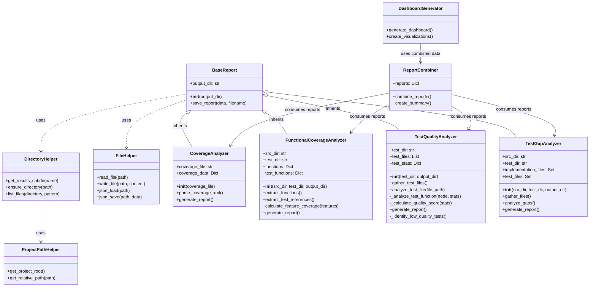

## System Overview

The USASpending system is organized into distinct layers that handle different aspects of data processing and validation.

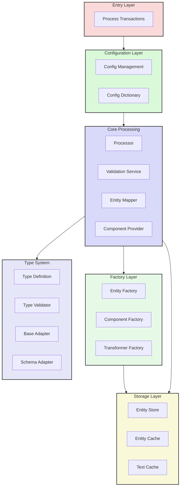

## Component Dependencies

| Component | Primary Dependencies | Secondary Dependencies | Implements |
|-----------|---------------------|----------------------|------------|
| process_transactions.py | ConfigManager, ValidationService | logging_config, startup_checks | - |
| config_loader.py | config_schema, config_schemas | config_schema_types, config_validation | - |
| config_provider.py | config_loader, config_validation | logging_config, exceptions | - |
| config.py | config_schema, file_utils | logging_config, exceptions | - |
| processor.py | EntityMapper, ValidationService | ConfigManager, EntityFactory, chunked_writer | IDataProcessor |
| entity_mapper.py | validation_base, schema_adapters, schema_mapping | text_file_cache, field_dependencies, exceptions | IEntityMapper |
| validation_service.py | validation_manager, validation_mediator | validation_rules, field_validators | IValidationService |
| validation_manager.py | validation_rules, field_validators | validation_base, exceptions | - |
| validation_mediator.py | validation_manager | field_dependencies, exceptions | IValidationMediator |
| entity_factory.py | entity_serializer, entity_cache | entity_store, exceptions | IEntityFactory |
| entity_store.py | file_utils, entity_cache | serialization_utils, exceptions | IEntityStore |
| entity_mediator.py | entity_factory, entity_mapper | entity_store, exceptions | - |
| chunked_writer.py | file_utils | serialization_utils | - |
| field_selector.py | schema_mapping | field_dependencies | - |
| boolean_adapters.py | schema_adapters | type_definitions | - |
| enum_adapters.py | schema_adapters | type_definitions | - |
| string_adapters.py | schema_adapters | type_definitions | - |
| schema_adapters.py | type_definitions | exceptions | - |
| text_file_cache.py | file_utils | serialization_utils | - |
| entity_cache.py | serialization_utils | file_utils | - |
| entity_serializer.py | serialization_utils | exceptions | - |
| field_validators.py | validation_base | type_definitions | - |
| validator.py | validation_base | field_validators | - |
| component_utils.py | factory | exceptions | - |
| dictionary.py | component_utils | keys, type_definitions | - |
| factory.py | component_utils | exceptions | IFactory |
| keys.py | type_definitions | - | - |

## Validation System

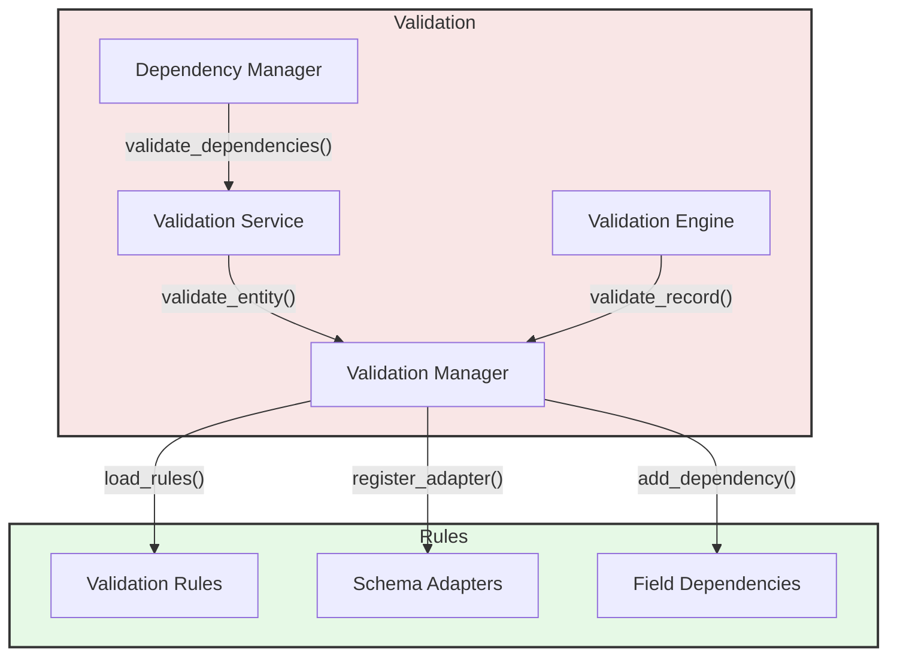

## Entity Processing Flow

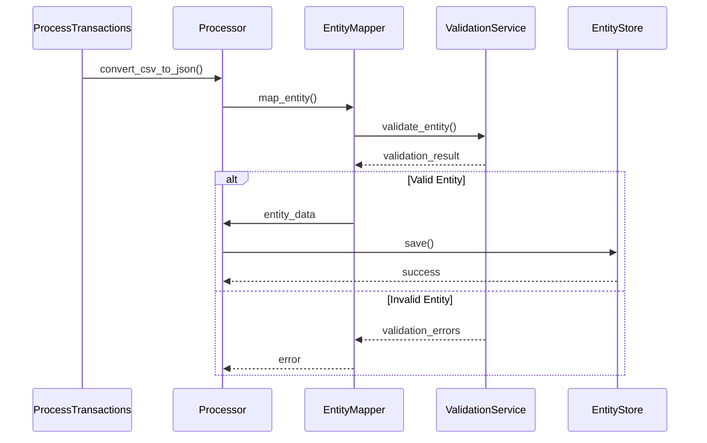

## Caching Architecture

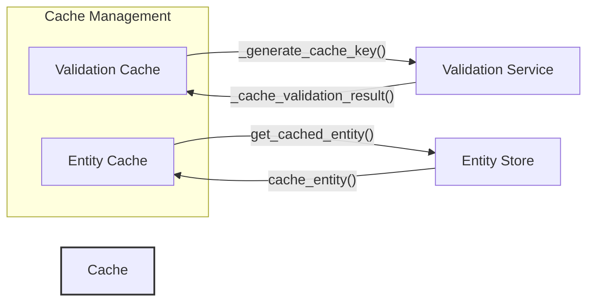

## Interface Implementation Details

| Interface | Implementers | Key Methods | Purpose |
|-----------|-------------|-------------|---------|
| IDataProcessor | Processor | process_record(), process_batch() | Coordinate data processing |
| IEntityMapper | EntityMapper | map_entity(), configure() | Transform data to entities |
| IValidationService | ValidationService | validate_entity(), validate_field() | Validate data integrity |
| IEntityStore | EntityStore, FileSystemEntityStore | save(), load(), extract_entity_data() | Persist entity data |
| IDependencyManager | DependencyManager | validate_dependencies(), get_validation_order() | Manage field dependencies |

## Factory Architecture

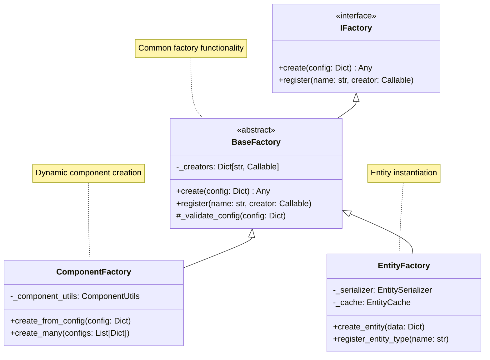

## Circular Dependency Prevention

The system employs several strategies to prevent and handle circular dependencies:

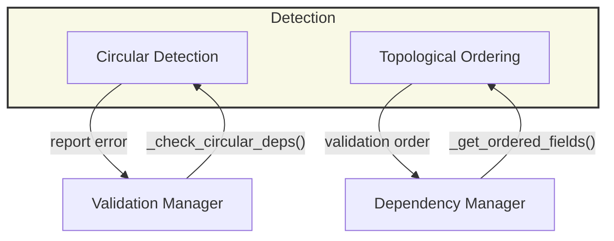

## Validation Inheritance Chain

The validation system follows a hierarchical inheritance pattern from most basic to most specialized:

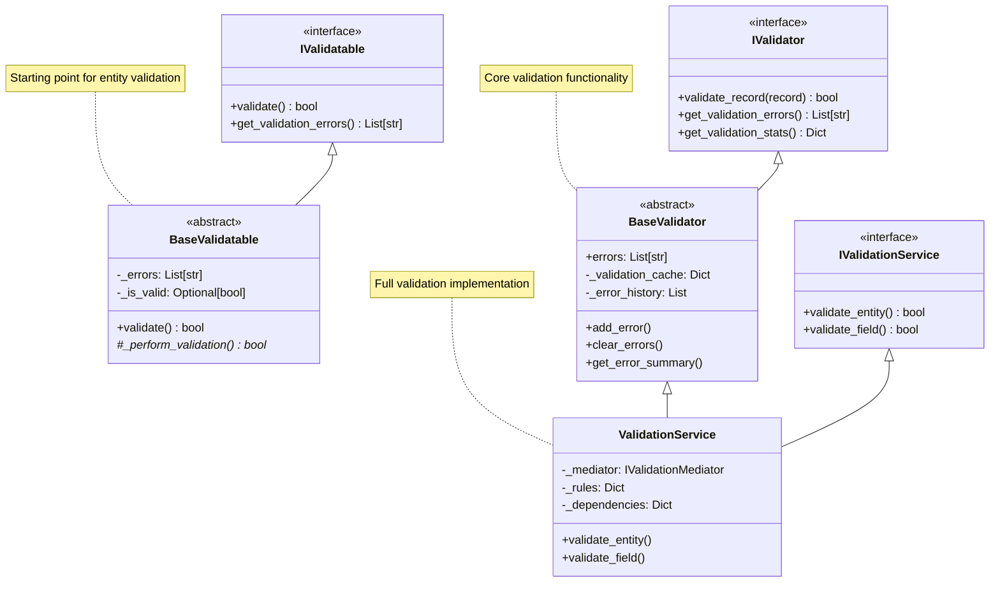

## Validation Data Flow

The validation process follows this sequence:

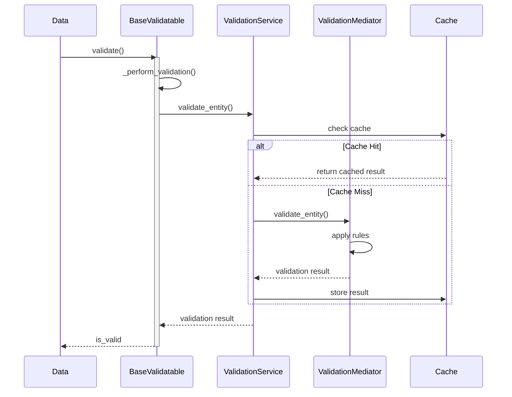

## Component Utilities Architecture

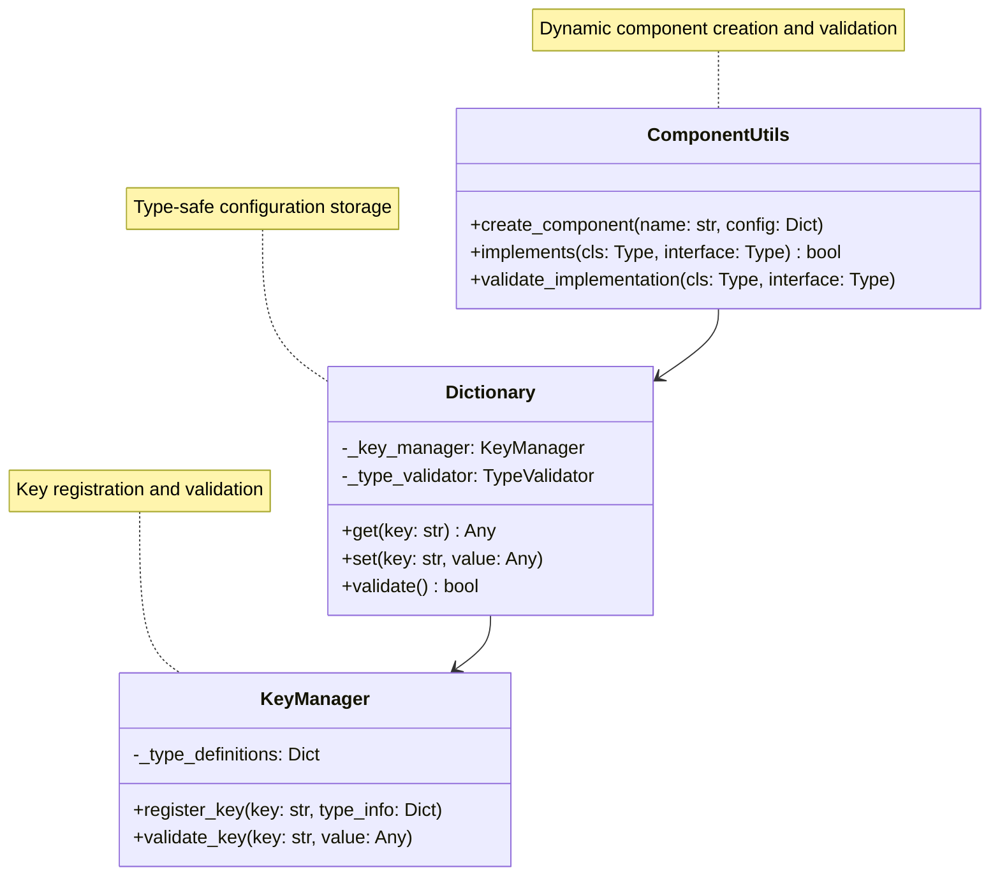

## Configuration System

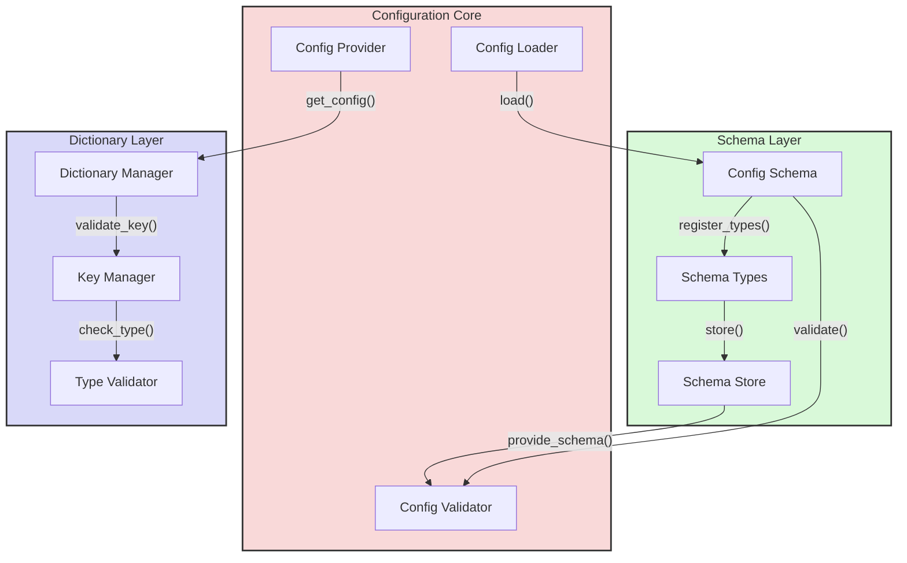

## Key Management System

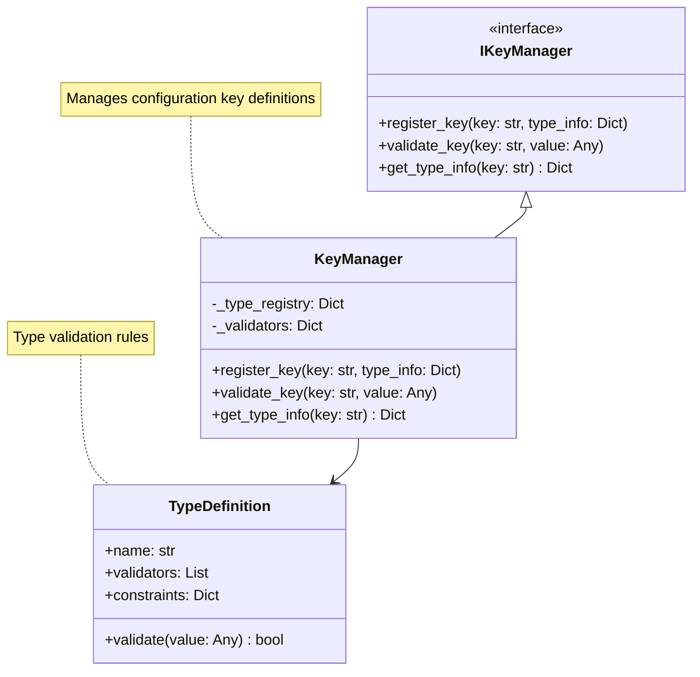

## Transformer System

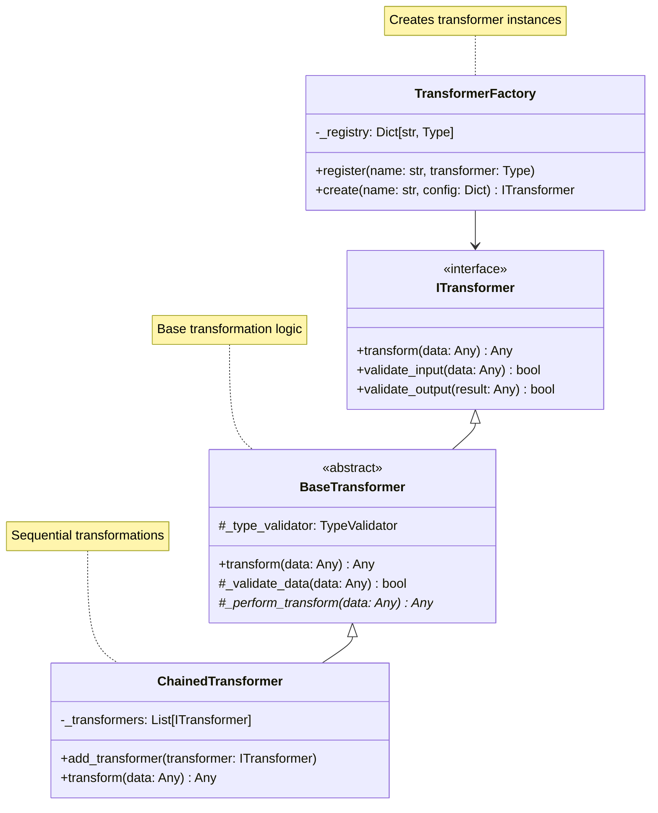

## Data Processing Pipeline

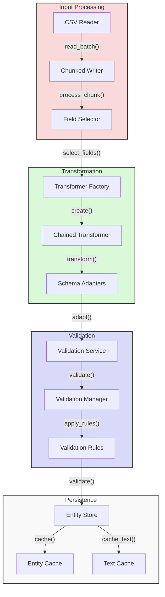

## Type System Architecture

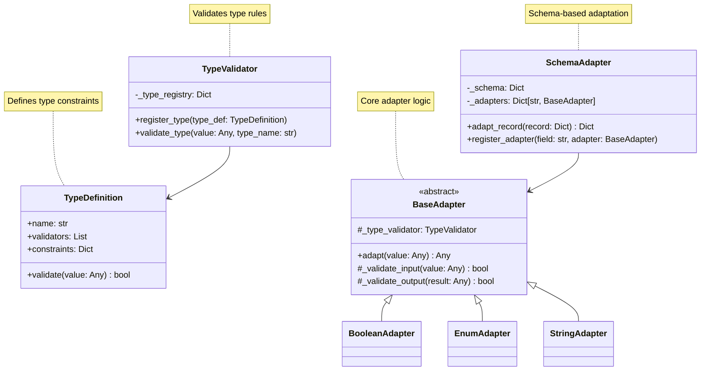

## File Update Order

When implementing new validation features, update files in this order:

1. **Base Interfaces** (src/usaspending/interfaces.py):
   - IValidatable (most basic)
   - IValidator
   - IFieldValidator
   - IValidationMediator
   - IValidationService

2. **Base Implementations** (src/usaspending/validation_base.py):
   - BaseValidatable
   - BaseValidator

3. **Validation Components** (src/usaspending/):
   - validation_service.py
   - validation_manager.py
   - field_dependencies.py

4. **Entity-Specific Validation** (src/usaspending/):
   - entity_mapper.py
   - entity_store.py
   - processor.py

## Validation Details by Component

| Component | Base Class | Interfaces | Key Responsibilities |
|-----------|------------|------------|---------------------|
| BaseValidatable | None | IValidatable | Basic validation state, error tracking |
| BaseValidator | None | IValidator | Core validation, caching, stats |
| ValidationService | BaseValidator | IValidationService | Rule application, dependency management |
| ValidationMediator | None | IValidationMediator | Validation coordination, result aggregation |
| EntityMapper | BaseValidatable | IEntityMapper | Entity-specific validation rules |

## Testing Update Order

When adding new validation features, update tests in this order:

1. test_validation_base.py (tests base validation functionality)
2. test_validation_service.py (tests validation service implementation)
3. test_validation_manager.py (tests validation coordination)
4. test_field_dependencies.py (tests dependency handling)
5. test_entity_mapper.py (tests entity-specific validation)

Each test file corresponds to a component in the validation chain and should be updated to maintain complete test coverage of the validation system.

## File Locations

| Component Type | Location | Purpose |
|---------------|----------|----------|
| Entry Points | src/ | Main execution entry points |
| Core Components | src/usaspending/ | Primary system functionality |
| Configuration | / | YAML configuration files |
| Tests | tests/ | Test suite and fixtures |
| Documentation | docs/ | System documentation and analysis |

## Detailed File Interactions

### Core Processing Flow
1. **Entry Point** (`process_transactions.py`)
   - Interacts with `config_loader.py` and `config_provider.py` for configuration management
   - Uses `startup_checks.py` for initial system validation
   - Initializes logging through `logging_config.py`

2. **Configuration Layer**
   - `config_loader.py` → `config_schema.py` → `config_schemas.py` → `config_schema_types.py`
   - `config_validation.py` validates configuration using schema definitions
   - `config_provider.py` manages configuration access throughout the system

3. **Processing Pipeline**
   - `processor.py` orchestrates the data processing flow:
     - Uses `chunked_writer.py` for efficient data handling
     - Coordinates with `entity_mediator.py` for entity management
     - Interacts with `field_selector.py` for data field selection

4. **Entity Management**
   - `entity_mapper.py` transforms data using:
     - `schema_mapping.py` for field mappings
     - `field_dependencies.py` for managing field relationships
     - Multiple adapters (`boolean_adapters.py`, `enum_adapters.py`, `string_adapters.py`)
   - `entity_factory.py` creates entities using:
     - `entity_serializer.py` for data serialization
     - `entity_cache.py` for caching
     - `entity_store.py` for persistence

5. **Validation Chain**
   - `validation_service.py` coordinates validation using:
     - `validation_manager.py` for managing validation rules
     - `validation_mediator.py` for validation flow control
     - `validation_rules.py` for rule definitions
     - `field_validators.py` for field-level validation
   - `validation_base.py` provides core validation functionality
   - `validator.py` implements specific validation logic

6. **Utility Support**
   - `text_file_cache.py` provides caching for file operations
   - `file_utils.py` handles file system operations
   - `serialization_utils.py` manages data serialization
   - `transformers.py` implements data transformations
   - `utils.py` provides general utility functions

### Data Flow Dependencies
- CSV Input → `processor.py` → `entity_mapper.py` → `validation_service.py` → `entity_store.py` → JSON Output
- Configuration: `config_loader.py` → `config_validation.py` → `config_provider.py` → All Components
- Validation: `validation_service.py` → `validation_manager.py` → `validation_mediator.py` → `validator.py`
- Entity Processing: `entity_mapper.py` → `entity_factory.py` → `entity_mediator.py` → `entity_store.py`

### Key Component Interfaces
- `interfaces.py` defines core contracts implemented by:
  - `processor.py` (IDataProcessor)
  - `entity_mapper.py` (IEntityMapper)
  - `validation_service.py` (IValidationService)
  - `entity_store.py` (IEntityStore)
  - `entity_factory.py` (IEntityFactory)

### Type System
- `type_definitions.py` provides core type definitions
- Adapters handle type conversion:
  - `boolean_adapters.py` for boolean values
  - `enum_adapters.py` for enumeration values
  - `string_adapters.py` for string manipulation
  - `schema_adapters.py` for schema-based conversions

### Error Handling
- `exceptions.py` defines system-wide exceptions
- `fallback_messages.py` provides error message templates
- Each component includes specific error handling for its domain
