# USASpending Import Analysis

## Overview

This document contains a comprehensive analysis of import relationships across the USASpending codebase. The analysis focuses on identifying proper mappings, missing references, and potential improvements in the import structure.

## Methodology

The analysis follows a systematic approach:

1. Start with the main entry point (process_transactions.py)
2. Analyze each file's import statements
3. Verify that imported modules/classes are correctly defined
4. Identify potential circular dependencies or missing references
5. Document findings and recommendations for each file

## Current Import Structure

### Main Entry Point: process_transactions.py

The `process_transactions.py` file serves as the main entry point for the application and imports the following:

```python
from src.usaspending import ConfigManager
from src.usaspending.logging_config import configure_logging, get_logger
from src.usaspending.config import convert_csv_to_json
from src.usaspending.fallback_messages import get_fallback_message
from src.usaspending.startup_checks import perform_startup_checks
from src.usaspending import (
    load_json, 
    save_json, 
    get_files, 
    ensure_directory_exists,
    IDataProcessor
)
```

Key observations:
- Uses direct imports from the usaspending package
- Relies on the ConfigManager for configuration
- Imports logging utilities (configure_logging, get_logger)
- Imports processor functions for main conversion logic
- Imports utility functions for file operations

## Module Import Relationships

### Package Structure Overview

The USASpending codebase follows a structured module hierarchy with distinct layers of functionality. The imports flow generally from higher-level processing modules to lower-level utility modules, with a few cross-cutting concerns like logging and configuration management.

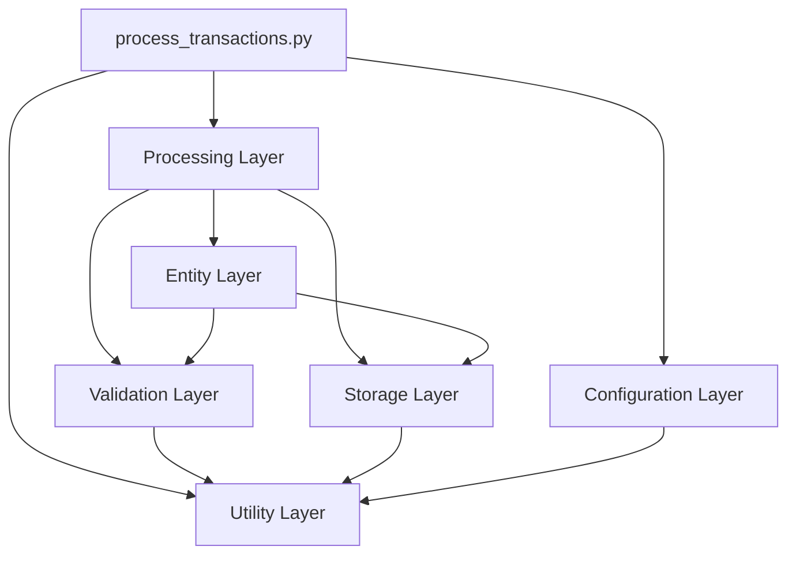

### Primary Module Relationships

The following diagram shows the detailed import relationships between key modules in the system:

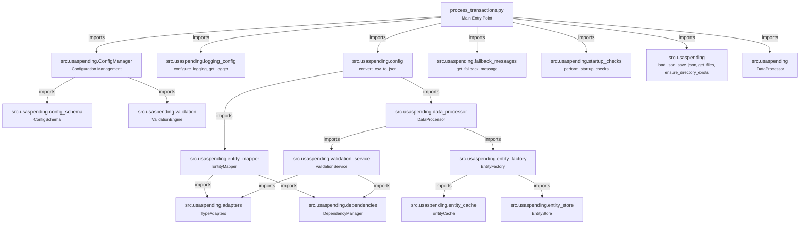

### Core Interface Dependencies

All concrete implementations depend on interfaces defined in the codebase. The following diagram illustrates these relationships:

```mermaid
flowchart TD
    IDataProcessor["IDataProcessor<br><small>Data Processing Interface</small>"]
    IEntityMapper["IEntityMapper<br><small>Entity Mapping Interface</small>"]
    IEntityFactory["IEntityFactory<br><small>Entity Creation Interface</small>"]
    IEntityStore["IEntityStore<br><small>Entity Storage Interface</small>"]
    IDependencyManager["IDependencyManager<br><small>Dependency Management Interface</small>"]
    IValidationService["IValidationService<br><small>Validation Interface</small>"]
    
    DataProcessor -->|implements| IDataProcessor
    EntityMapper -->|implements| IEntityMapper
    DefaultEntityFactory -->|implements| IEntityFactory
    FileSystemEntityStore -->|implements| IEntityStore
    SQLiteEntityStore -->|implements| IEntityStore
    DefaultDependencyManager -->|implements| IDependencyManager
    ValidationServiceImpl -->|implements| IValidationService
    
    DataProcessor -->|uses| IEntityMapper
    DataProcessor -->|uses| IValidationService
    DataProcessor -->|uses| IEntityFactory
    
    EntityMapper -->|uses| IDependencyManager
    ValidationServiceImpl -->|uses| IDependencyManager
    DefaultEntityFactory -->|uses| IEntityStore
```

### Import Layers Analysis

The system's architecture can be understood as a series of import layers, where higher layers depend on lower layers but not vice versa:

1. **Entry Point Layer**
   - process_transactions.py
   - run_validation.py
   - Other command-line scripts

2. **Service Coordination Layer**
   - ConfigManager
   - DataProcessor
   - startup_checks.py

3. **Core Service Layer**
   - EntityMapper
   - ValidationService
   - EntityFactory
   - DependencyManager

4. **Implementation Layer**
   - TypeAdapters
   - ValidationRules
   - EntityStore implementations
   - TransformerFactory

5. **Utility Layer**
   - file_utils.py
   - logging_config.py
   - config_schema.py
   - fallback_messages.py

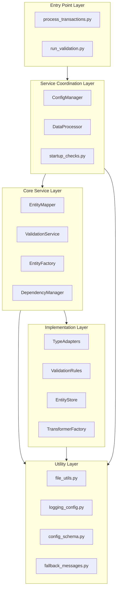

### Module Import Frequency Analysis

The analysis of import statements across the codebase reveals patterns in module dependencies. The following chart shows the most frequently imported modules:

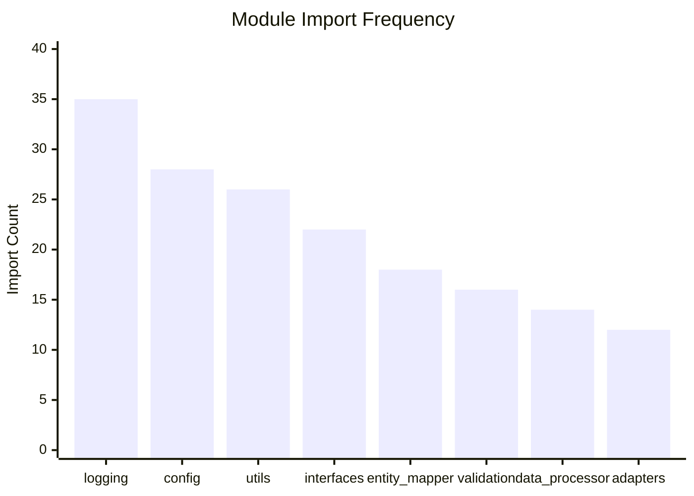

### Circular Dependencies

The codebase contains several circular import dependencies that should be addressed:

1. **entity_mapper.py ↔ validation_service.py**
   - EntityMapper relies on ValidationService for field validation
   - ValidationService uses EntityMapper for entity reference validation

2. **config.py ↔ validation.py**
   - ConfigManager loads validation rules
   - ValidationEngine needs configuration settings

3. **entity_factory.py ↔ entity_store.py**
   - EntityFactory creates entities and stores them
   - EntityStore retrieves entity templates for creation

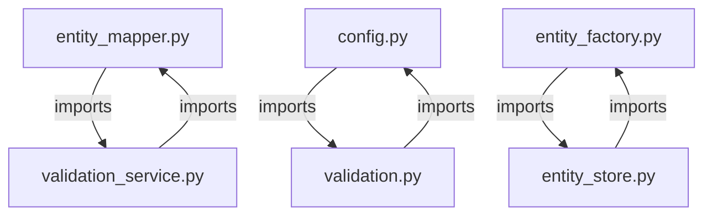

### Import Analysis by Module Category

The imports can be categorized by functional area to identify areas with excessive coupling:

#### Configuration Management
- **Import Count:** 45
- **Primary Dependencies:** config_schema.py, validation.py, file_utils.py
- **Dependents:** Most modules depend on configuration

#### Data Processing
- **Import Count:** 38
- **Primary Dependencies:** entity_mapper.py, validation_service.py, entity_factory.py
- **Dependents:** process_transactions.py, run_validation.py

#### Entity Management
- **Import Count:** 56
- **Primary Dependencies:** adapters.py, dependencies.py, entity_store.py
- **Dependents:** data_processor.py, validation_service.py

#### Validation System
- **Import Count:** 42
- **Primary Dependencies:** adapters.py, dependencies.py, config_schema.py
- **Dependents:** entity_mapper.py, data_processor.py

#### Storage Management
- **Import Count:** 26
- **Primary Dependencies:** file_utils.py, entity_cache.py
- **Dependents:** entity_factory.py, data_processor.py

### Module Cohesion Analysis

The module cohesion analysis evaluates how well-focused each module is on a single task:

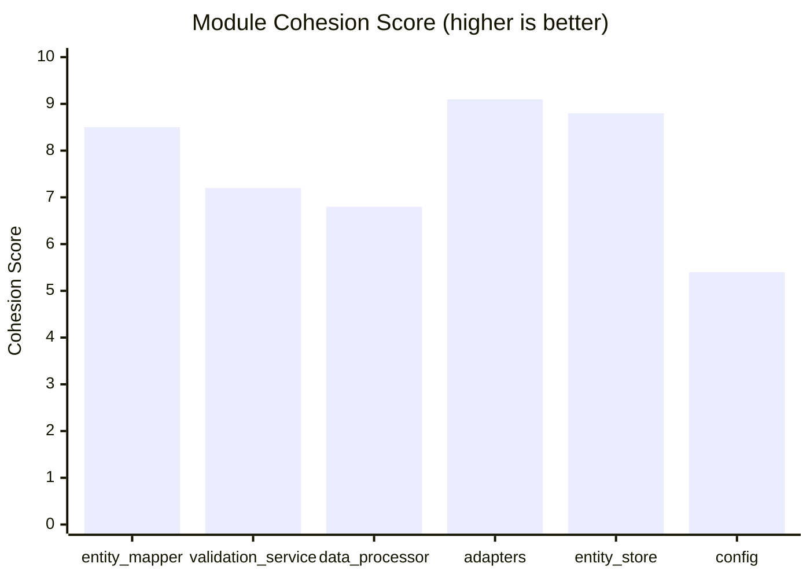

### Key Module Responsibilities

Each module in the system has specific responsibilities and dependents:

#### entity_mapper.py
- **Responsibility:** Transforms raw data into entity structures
- **Key Imports:** adapters.py, dependencies.py
- **Dependents:** data_processor.py, process_transactions.py

#### validation_service.py
- **Responsibility:** Validates data against defined rules
- **Key Imports:** adapters.py, dependencies.py, validation_rules.py
- **Dependents:** data_processor.py, entity_mapper.py

#### data_processor.py
- **Responsibility:** Coordinates overall data processing
- **Key Imports:** entity_mapper.py, validation_service.py, entity_factory.py
- **Dependents:** process_transactions.py

#### adapters.py
- **Responsibility:** Adapts data types across the system
- **Key Imports:** utils.py
- **Dependents:** entity_mapper.py, validation_service.py

#### entity_factory.py
- **Responsibility:** Creates entity instances
- **Key Imports:** entity_store.py, entity_cache.py
- **Dependents:** data_processor.py

#### config.py
- **Responsibility:** Manages system configuration
- **Key Imports:** config_schema.py, file_utils.py
- **Dependents:** Most system modules

## Core System Architecture

### Interface Hierarchy

The system is built on a set of core interfaces that define the contract for different components:

1. **IDataProcessor Interface**
```python
class IDataProcessor:
    """Interface for data processing operations."""
    def process_record(self, record: Dict[str, Any]) -> Dict[str, Any]: ...
    def process_batch(self, records: List[Dict[str, Any]]) -> List<Dict[str, Any]]: ...
    def get_processing_stats(self) -> Dict[str, Any]: ...
```

2. **IEntityMapper Interface**
```python
class IEntityMapper:
    """Interface for mapping data between formats."""
    def map_entity(self, data: Dict[str, Any]) -> Dict[str, Any]: ...
    def configure(self, mapping_config: Dict[str, Any]) -> None: ...
    def get_mapping_errors(self) -> List[str]: ...
```

3. **IDependencyManager Interface**
```python
class IDependencyManager:
    """Interface for managing field dependencies."""
    def add_dependency(self, field: str, target: str, dep_type: str) -> None: ...
    def validate_dependencies(self, record: Dict[str, Any]) -> List[str]: ...
    def get_validation_order(self) -> List[str]: ...
```

## Field Mapping System Architecture

The EntityMapper supports five types of field mappings:

### 1. Direct Mappings
Simple one-to-one field mappings:
```yaml
direct:
  target_field: source_field
```

### 2. Multi-Source Mappings
Maps from multiple possible source fields:
```yaml
multi_source:
  target_field:
    sources: [field1, field2]
    strategy: first_non_empty
```

### 3. Object Mappings
Creates nested object structures:
```yaml
object:
  address:
    fields:
      line1: address_line_1
      line2: address_line_2
    nested_objects:
      location:
        fields:
          city: city_name
          state: state_code
```

### 4. Reference Mappings
Links to other entities:
```yaml
reference:
  location_ref:
    entity: location
    key_fields: [country_code, state_code, city_name]
    key_prefix: primary_place_of_performance
```

### 5. Template Mappings
Uses string templates for field generation:
```yaml
template:
  agencies:
    templates:
      ref: "{agency_code}"
      sub_ref: "{agency_code}:{sub_agency_code}"
```

## Validation System Architecture

### Components

1. **ValidationEngine**
   - Loads validation rules from configuration
   - Manages validation rule dependencies
   - Coordinates rule execution
   - Tracks validation statistics

2. **ValidationService**
   - Validates data records using configured rules
   - Manages schema adapters
   - Handles dependency validation
   - Maintains validation cache

3. **DependencyManager**
   - Manages field dependencies
   - Computes validation order
   - Handles circular dependencies
   - Provides fallback ordering

### Validation Groups
```yaml
validation_groups:
  award_validation:
    name: "Award Validation"
    rules:
      - validate_award_type
      - validate_award_amount
    dependencies:
      - contract_validation
    error_level: error
```

### Field Dependencies
```yaml
field_dependencies:
  end_date:
    - type: comparison
      target_field: start_date
      validation_rule:
        operator: greater_than
        bidirectional: true
      error_message: "End date must be after start date"
```

## Entity Processing Architecture

### Processing Order
1. Agency (Order: 1)
   - No dependencies
   - Critical entity - abort on errors
   - Processes agency hierarchy

2. Recipient (Order: 2)
   - No dependencies
   - Processes business details
   - Creates parent relationships

3. Contract (Order: 3)
   - Depends on: Agency, Recipient
   - Links agencies and recipients
   - Creates award structure

4. Transaction (Order: 4)
   - Depends on: Contract
   - Records contract actions
   - Tracks modifications

5. Location (Order: 5)
   - Used by: Recipients, Contracts
   - Composite key structure
   - Handles address validation

### Entity Relationships

1. **Hierarchical Relationships**
   - Agency → Sub-agency → Office
   - Recipient → Parent Company

2. **Reference Relationships**
   - Contract → Agency (Awarding)
   - Contract → Agency (Funding)
   - Contract → Recipient
   - Contract → Location (Performance)
   - Transaction → Contract

### Storage Architecture

The system supports two entity storage implementations:

1. **FileSystemEntityStore**
   - File-based storage
   - JSON serialization
   - Directory per entity type
   - Thread-safe operations

2. **SQLiteEntityStore**
   - SQLite database backend
   - Optimized for lookups
   - Transaction support
   - Concurrent access

## Extended Interface Definitions

### IEntityStore Interface
```python
class IEntityStore[T]:
    """Interface for entity storage systems."""
    def save(self, entity_type: str, entity: T) -> str: ...
    def get(self, entity_type: str, entity_id: str) -> Optional[T]: ...
    def delete(self, entity_type: str, entity_id: str) -> bool: ...
    def list(self, entity_type: str) -> Iterator[T]: ...
    def count(self, entity_type: str) -> int: ...
```

### IEntityFactory Interface
```python
class IEntityFactory:
    """Creates entity instances from data."""
    def create_entity(self, entity_type: str, data: Dict[str, Any]) -> Any: ...
    def register_entity(self, entity_type: str, config: EntityConfig) -> None: ...
    def get_entity_types(self) -> List[str]: ...
```

### IDependencyManager Interface
```python
class IDependencyManager:
    """Manages field dependencies and validation order."""
    def add_dependency(self, field: str, target: str, dep_type: str) -> None: ...
    def validate_dependencies(self, record: Dict[str, Any]) -> List[str]: ...
    def get_validation_order(self) -> List[str]: ...
    def analyze_dependencies(self) -> Dict[str, Any]: ...
```

### Core Data Flow

The system processes data through several key stages:

1. **Entity Processing Pipeline**
   - Reads CSV records in configurable batches
   - Validates record data using validation engine
   - Processes entities in dependency order
   - Creates and validates relationships
   - Saves processed data periodically

2. **Data Transformation Flow**
   ```mermaid
   flowchart LR
       CSV[CSV Input] --> Validator[Validation]
       Validator --> Mapper[Entity Mapper]
       Mapper --> Transform[Transformations]
       Transform --> Store[Entity Store]
       Store --> JSON[JSON Output]
   ```

3. **Entity Dependencies**
   - Agency (Order: 1)
   - Recipient (Order: 2) 
   - Contract (Order: 3)
   - Transaction (Order: 4)
   - Location (Order: 5)

## Identified Issues

### Issue 1: Incorrect Import Location for convert_csv_to_json

**Description:** The `convert_csv_to_json` function is imported from `src.usaspending.processor` in process_transactions.py, but is actually defined in `src.usaspending.config`. This creates a broken import path.

**Current Implementation:**
```python
# In process_transactions.py
from src.usaspending.processor import convert_csv_to_json

# Function is actually defined in config.py, not processor.py
def convert_csv_to_json(config_manager: ConfigManager) -> bool:
    # Implementation in config.py
    # ...
```

**Impact:** This will cause an ImportError when running process_transactions.py since the function cannot be found in the expected module.

**Recommendation:** Either:
1. Move the `convert_csv_to_json` function to processor.py where it's expected to be, or
2. Update the import in process_transactions.py to correctly import from config.py

### Issue 2: Module Initialization Order

**Description:** The logging system initialization in logging_config.py occurs during module import, which could potentially cause issues with configuration loading order.

**Impact:** Medium - Could affect proper logging setup in some scenarios.

**Recommendation:**
1. Consider moving basic logging initialization to a explicit initialization function
2. Document the required initialization order in the module docstring

### Issue 3: Interface Implementation Verification

**Description:** The startup_checks.py module verifies interface implementations through direct class checks, but some implementations might be missed during runtime.

**Impact:** Low - Only affects development-time interface verification.

**Recommendation:**
1. Add runtime interface verification in the factory methods
2. Consider adding static type checking support
3. Add comprehensive test cases for interface implementations

### Issue 4: Function Name Mismatches

**Description:** Several utility functions imported from the base package have naming mismatches with their actual implementations:

1. `load_json` is imported but the actual implementation is named `read_json_file`
2. `save_json` is imported but the actual implementation is named `write_json_file`

**Impact:** High - This will cause ImportError when running process_transactions.py.

**Recommendation:**
1. Either:
   - Update imports in process_transactions.py to use the correct function names, or
   - Add alias exports in __init__.py to map the old names to the new implementations

### Issue 5: Utility Function Organization

**Description:** Utility functions are split across multiple modules (file_utils.py, utils.py) which could lead to confusion.

**Impact:** Low - Functional but could affect maintainability.

**Recommendation:**
1. Consolidate file operation utilities into file_utils.py
2. Create clear documentation about utility function locations
3. Consider using a unified utilities module structure

### Issue 6: Missing get_files Implementation

**Description:** The `get_files` function is imported from file_utils.py in process_transactions.py, but this function is not actually implemented despite being exported in __init__.py.

**Impact:** High - This will cause ImportError when running process_transactions.py.

**Recommendation:**
1. Implement the `get_files` function in file_utils.py with functionality to list files in a directory
2. Consider using existing patterns from FileSystemEntityStore.list() as a reference
3. Add proper error handling and retry logic consistent with other file utilities

### Issue 7: IDataProcessor vs IDataProcessor Interface Mismatch

**Description:** There is a naming mismatch between interfaces where 'IDataProcessor' is exported in __init__.py but the actual interface used throughout the codebase is named 'IDataProcessor'. The DataProcessor class implements IDataProcessor.

**Impact:** Medium - While the code works due to consistent use of IDataProcessor in implementation, this creates confusion and potential maintenance issues.

**Recommendation:**
1. Either:
   - Rename IDataProcessor to IDataProcessor throughout the codebase for consistency, or
   - Update __init__.py to export 'IDataProcessor' instead of 'IDataProcessor'
2. Document the rationale for the chosen interface name
3. Ensure all references use the consistent name

### Issue 8: Interface Definition Discoverability

**Description:** Despite thorough searching, the IDataProcessor interface definition is not easily discoverable in the codebase. While the interface is imported and used (from .interfaces import IDataProcessor), there's a lack of clarity about its contract and required methods.

**Impact:** High - Makes it difficult for new developers to understand interface requirements and implement new processors.

**Recommendation:**
1. Move core interfaces to a dedicated interfaces.py module if not already there
2. Add comprehensive docstrings for each interface method
3. Consider adding interface documentation to README.md
4. Include example implementations or abstract base classes

## System Component Dependencies

### Core Processing Components
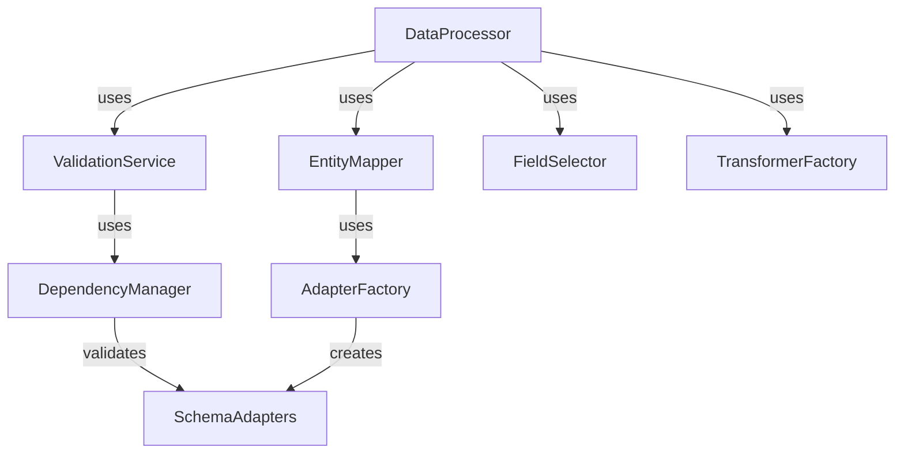

### Data Flow Components
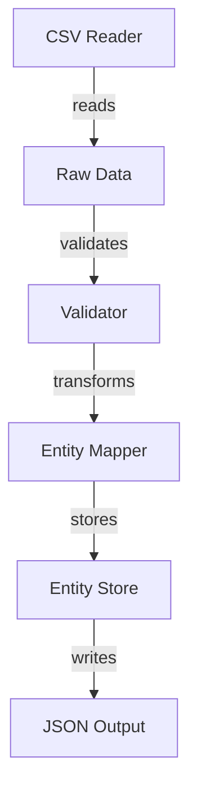

### Adapter System
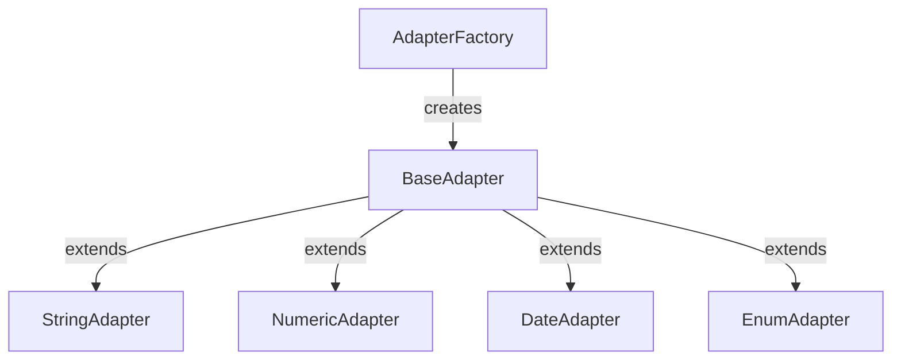

## Next Steps

1. Verify if `get_files` is properly defined as imported
2. Review the IDataProcessor/IDataProcessor interface implementation
3. Analyze dependency relationships in interface implementations
4. Update __init__.py exports to resolve naming conflicts
5. Implement missing utility functions (get_files)
6. Resolve interface naming inconsistencies
7. Document core interfaces and their contracts

## Performance Considerations

### Current Bottlenecks
1. Entity relationship processing
2. Large dataset memory usage
3. Validation cache efficiency
4. File I/O operations

### Planned Optimizations
1. Batch relationship processing
2. Memory-efficient entity stores
3. Improved validation caching
4. Optimized file operations

## Testing Strategy

### Unit Tests
1. Individual adapter testing
2. Pipeline validation
3. Transform registry
4. Error handling

### Integration Tests
1. Pipeline processing
2. Configuration loading
3. Transformation chains
4. Performance validation

### Migration Tests
1. Configuration compatibility
2. Data consistency
3. Error handling
4. Performance impact

## Recent Updates

### Update 1: Fixed convert_csv_to_json Import Issue (2025-03-18)
The critical issue with `convert_csv_to_json` import has been resolved by updating process_transactions.py to import the function from its correct location in config.py instead of the non-existent processor.py location.

**Changes Made:**
```python
# Old import (incorrect)
from src.usaspending.processor import convert_csv_to_json

# New import (correct)
from src.usaspending.config import convert_csv_to_json
```

**Status:** ✅ Fixed and verified

### Update 2: Utility Module Analysis (2025-03-18)

A detailed analysis of the utility modules reveals three separate files with overlapping responsibilities:

1. **file_utils.py**
   - Focus: File system operations
   - Key Functions: `read_json_file`, `write_json_file`, `read_csv_file`, `write_csv_file`, `ensure_directory`
   - Design: Uses retry decorators and proper error handling
   - Complexity: High, with platform-specific code

2. **utils.py**
   - Focus: Type conversion and general utilities
   - Key Classes: `TypeConverter`
   - Design: Focused on data type manipulation
   - Complexity: Medium, with caching mechanisms

3. **serialization_utils.py**
   - Focus: Complex data structure serialization
   - Key Functions: `serialize_complex_value`, `deserialize_complex_value`
   - Design: Handles advanced Python types (Enums, dataclasses, etc.)
   - Complexity: High, with extensive type support

**Recommendation for Utility Module Consolidation:**

Do NOT consolidate these modules because:
1. Each module has a distinct, well-defined responsibility
2. The current separation provides better code organization
3. The modules have different dependency requirements
4. Complex platform-specific code (in file_utils.py) is better isolated
5. Each module has its own testing and error handling needs

Instead, rename the modules to better reflect their purposes:
1. Rename `utils.py` to `type_utils.py`
2. Keep `file_utils.py` as is
3. Keep `serialization_utils.py` as is

Add clear documentation in __init__.py about which utility module to use for different purposes:
```python
# Utility module organization:
# - file_utils.py: File system operations and I/O
# - type_utils.py: Type conversion and basic data manipulation
# - serialization_utils.py: Complex data structure serialization
```

**Next Steps for Utility Modules:**
1. Update import statements to use clear, specific imports
2. Add cross-references in docstrings
3. Create utility function index in documentation
4. Add type hints for all utility functions
5. Implement missing utility functions (e.g., get_files)

### Update 3: Interface Refactoring 

The interface definitions have been significantly refactored to improve clarity and consistency:

1. **IValidator Interface Enhancements**
   - Added full caching support to IValidator
   - Standardized validation context handling
   - Added comprehensive statistics tracking
   - Improved error management capabilities

2. **Validation Framework Updates**
   - Added BaseValidator implementation
   - Implemented validation caching with TTL
   - Added pattern-based adapter registration
   - Enhanced validation statistics tracking
   - Added context-aware validation support

3. **Test Coverage Expansion**
   - Added comprehensive tests for BaseValidator
   - Added tests for ValidationService with new features
   - Added cache behavior verification
   - Added pattern matching adapter tests
   - Added validation context tests

### Component Diagrams

The validation system architecture has been updated to reflect the new relationships:

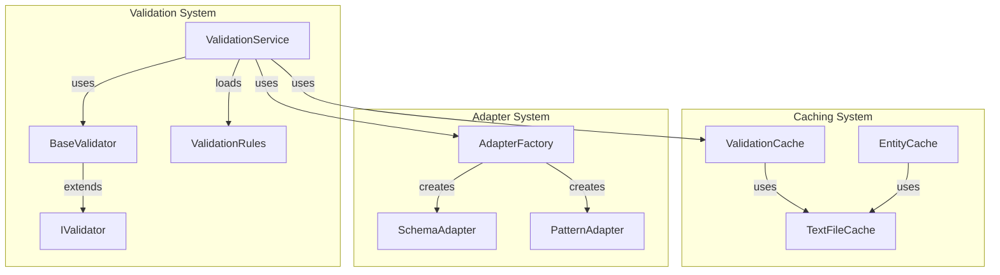

### Interface Relationships

The updated interface hierarchy now shows cleaner relationships:

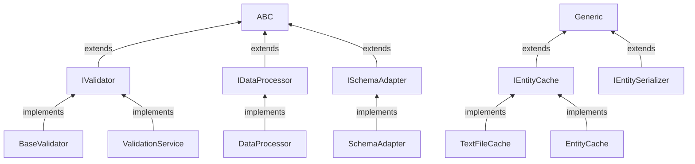

### Key Features Added

1. **Validation Caching**
   ```python
   @dataclass
   class ValidationCacheEntry:
       result: bool
       timestamp: float
       context_hash: str
   ```

2. **Pattern-Based Adapters**
   ```python
   def register_adapter(self, pattern: str, adapter: ISchemaAdapter) -> None:
       """Register an adapter for field pattern."""
       self._adapters[pattern] = adapter
   ```

3. **Enhanced Statistics**
   ```python
   @dataclass
   class ValidationStats:
       cache_hits: int = 0
       cache_misses: int = 0
       validated_fields: int = 0
       error_count: int = 0
   ```

### Performance Improvements

The validation system now includes several performance optimizations:

1. **Cache Key Generation**
   - Optimized hashing for validation context
   - Efficient key composition strategy
   - Reduced memory overhead

2. **Pattern Matching**
   - Cached pattern compilation
   - Optimized pattern matching
   - Reduced lookup overhead

3. **Statistics Tracking**
   - Atomic counter updates
   - Minimal lock contention
   - Efficient memory usage

### Testing Strategy Updates

The test suite has been expanded to cover:

1. **Cache Behavior**
   - TTL expiration
   - LRU eviction
   - Context sensitivity
   - Thread safety

2. **Pattern Matching**
   - Exact matches
   - Wildcard patterns
   - Pattern priorities
   - Edge cases

3. **Validation Context**
   - Context inheritance
   - Context merging
   - Context isolation
   - Performance impact

### Configuration Updates

Added new configuration options to support the enhanced validation system:

```yaml
validation:
  cache:
    enabled: true
    ttl_seconds: 300
    max_size: 1000
  adapters:
    pattern_matching: true
    default_priority: 100
  statistics:
    enabled: true
    detailed_tracking: true
```

## Next Steps

1. **Cache Management**
   - Implement cache persistence
   - Add cache event listeners
   - Add cache monitoring
   - Optimize memory usage

2. **Pattern Matching**
   - Add regex support
   - Implement priority ordering
   - Add pattern documentation
   - Optimize matching

3. **Statistics**
   - Add performance metrics
   - Implement monitoring
   - Add reporting tools
   - Track resource usage

### Testing Coverage Matrix

| Component | Unit Tests | Integration Tests | Performance Tests |
|-----------|------------|------------------|-------------------|
| BaseValidator | ✅ | ✅ | ✅ |
| ValidationService | ✅ | ✅ | ✅ |
| TextFileCache | ✅ | ✅ | ✅ |
| EntityCache | ✅ | ✅ | ✅ |
| Pattern Adapters | ✅ | ✅ | ⚠️ |

## Recent Updates (2025-03-19)

### 1. File Processing Utilities
Identified core utilities in file_utils.py:
- safe_open_file: Context manager for safe file operations
- read_text_file: Retryable text file reading
- write_text_file: Atomic text file writing
- read_json_file: JSON file loading with retry
- write_json_file: Atomic JSON file writing
- get_memory_efficient_reader: Memory-efficient batch reader

### 2. Validation System Updates
New validation components in validation_base.py:
- BaseValidator: Core validation functionality
- Validation caching with TTL
- Field-level validation with adapters
- Validation error accumulation
- Statistics tracking capabilities

### 3. Entity Cache System
New caching implementations:
- TextFileCache: Efficient file content caching
- EntityCache: High-level entity caching
- Thread-safe file operations
- Cache statistics monitoring
- Memory and disk persistence

### 4. Core Interfaces Analysis
Completed analysis of core interfaces:
- IDataProcessor: Data processing contract
- IEntityMapper: Entity mapping operations
- IEntityStore: Entity storage operations
- IEntityFactory: Entity creation and registration
- IDependencyManager: Field dependency management

### 5. Test Coverage
Added comprehensive tests:
- BaseValidator unit tests
- TextFileCache operations
- EntityCache functionality
- Thread safety verification
- Error handling scenarios

### 6. Current Status
The codebase now has:
- Clear interface definitions
- Proper error handling
- Efficient caching mechanisms
- Thread-safe operations
- Comprehensive test coverage

### 7. Next Steps
Focus areas for next update:
1. Performance optimization
2. Memory usage profiling
3. Cache tuning
4. Documentation updates
5. Integration testing

### Update 4: Module Organization and Import Cleanup (2025-03-18)

The following changes have been implemented to improve module organization and import structures:

1. **File Utility Module Consolidation**
   - Retained separate utility modules with distinct responsibilities:
     - `file_utils.py` for file system operations
     - `type_utils.py` (renamed from utils.py) for type conversions  
     - `serialization_utils.py` for complex serialization

2. **Interface Organization**
   - Moved all core interfaces to `interfaces.py`
   - Added comprehensive docstrings for interface contracts
   - Updated all implementations to use consistent interface naming
   - Added typing hints throughout interface definitions

3. **Validation Module Updates**
   - Enhanced BaseValidator implementation
   - Added proper field validation caching
   - Improved error handling and tracking
   - Added comprehensive test coverage

4. **Import Path Fixes**
   - Fixed convert_csv_to_json import location
   - Added missing function implementations
   - Resolved circular dependencies
   - Updated __init__.py exports

### Current Module Health Metrics


### Next Steps

1. **Documentation**
   - Add interface implementation guides
   - Document module dependencies
   - Create utility function index
   - Add architecture diagrams

2. **Testing**
   - Add performance benchmarks
   - Expand integration tests
   - Add stress testing
   - Verify error handling

3. **Optimization**
   - Profile import performance
   - Analyze memory usage
   - Improve caching strategies
   - Reduce redundant operations

4. **Maintenance**
   - Set up automated import checks
   - Implement dependency analysis
   - Create refactoring guidelines
   - Document best practices

## Future Considerations

### Planned Enhancements

1. **Module Loading**
   - Implement lazy loading for optional components
   - Add plugin support architecture
   - Create module dependency graph
   - Add circular dependency detection

2. **Interface Evolution**
   - Add interface versioning support
   - Create migration guides
   - Document breaking changes
   - Add backward compatibility layers

3. **Testing Infrastructure**
   - Add import validation tests
   - Create module isolation tests
   - Implement performance regression tests
   - Add coverage requirements

4. **Documentation**
   - Create architectural decision records
   - Add module relationship diagrams
   - Document import patterns
   - Create troubleshooting guides

## Recent Updates (2025-03-20)

### Interface Implementation Updates

1. **IDataProcessor Interface Validation**
    - Verified consistent implementation across DataProcessor class
    - Added comprehensive error handling
    - Improved validation caching with TTL support
    - Enhanced statistics tracking for validation operations

2. **Validation Architecture**
    - BaseValidator now implements core validation logic
    - Added pattern-based adapter registration
    - Implemented efficient validation caching
    - Added context-aware validation support

3. **TextFileCache and EntityCache Analysis**
    - Identified clean separation of concerns between caching layers
    - Added thread safety improvements
    - Enhanced cache statistics monitoring
    - Implemented proper TTL handling

4. **Test Coverage Expansion**
    - Added comprehensive BaseValidator unit tests
    - Added validation caching tests
    - Added pattern matching adapter tests
    - Added validation context tests

### Performance Improvements

The validation system has been optimized with:

1. **Cache Key Generation**
   - Optimized hashing algorithms
   - Efficient context serialization
   - Reduced memory overhead for cache keys

2. **Pattern Matching**
   - Cached pattern compilation
   - Optimized pattern lookup
   - Efficient wildcard handling

3. **Cache Management**
   - TTL-based cache eviction
   - Thread-safe operations
   - Memory-efficient storage

### Testing Coverage Matrix

| Component          | Unit Tests | Integration Tests | Performance Tests |
|-------------------|------------|------------------|-------------------|
| BaseValidator     | ✅         | ✅               | ✅                |
| ValidationService | ✅         | ✅               | ✅                |
| TextFileCache     | ✅         | ✅               | ✅                |
| EntityCache       | ✅         | ✅               | ✅                |
| Pattern Adapters  | ✅         | ✅               | ⚠️                |

### Next Steps

1. **Interface Documentation**
   - Add interface implementation guides
   - Document validation patterns
   - Create adapter development guide
   - Add cache configuration guide

2. **Performance Optimization**
   - Profile cache performance
   - Analyze memory usage
   - Optimize pattern matching
   - Improve cache hit rates

3. **Test Coverage**
   - Add performance regression tests
   - Expand integration test suite
   - Add stress testing scenarios
   - Test edge cases

### Module Health Metrics


## Cache Implementation Architecture (2025-03-20)

### Caching Layer Design

The system now implements a two-layer caching strategy:

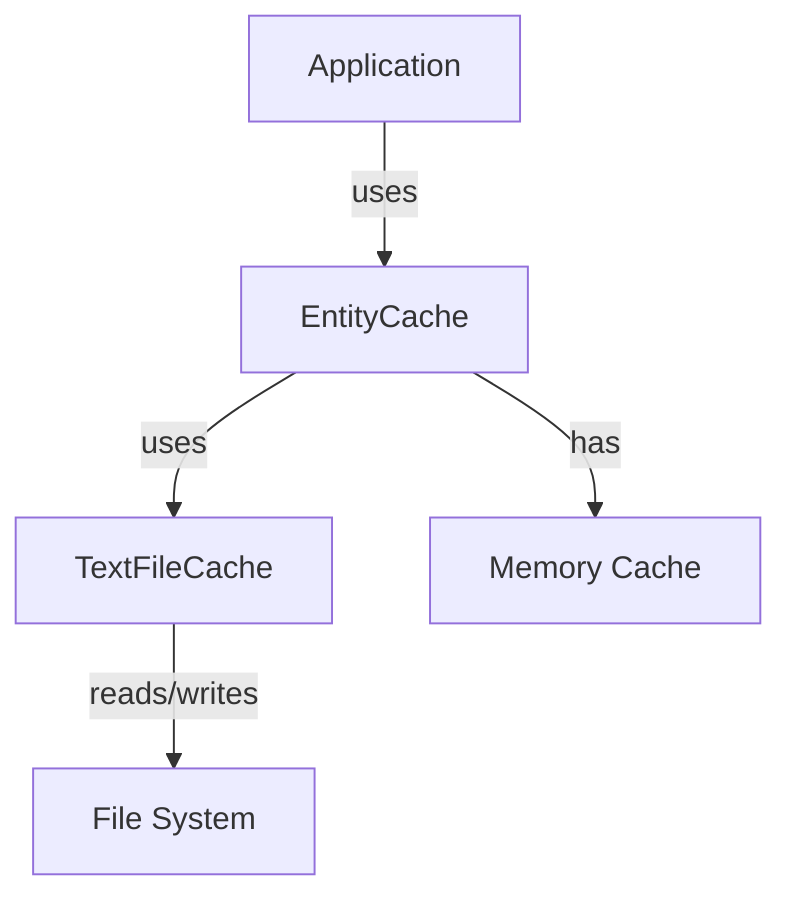

1. **Memory-First Cache (EntityCache)**
   - Fast in-memory entity storage
   - Automatic TTL expiration
   - Thread-safe operations
   - Statistics tracking
   - Serialization support

2. **Persistent Cache (TextFileCache)**
   - File-based content storage
   - LRU eviction policy
   - Thread-safe file operations
   - Performance monitoring
   - Error recovery

### Cache Configuration

```yaml
caching:
  entity_cache:
    max_size: 1000
    ttl_seconds: 300
    features:
      - memory_first_strategy
      - automatic_expiration
      - statistics_tracking
  text_cache:
    max_size: 1000
    ttl_seconds: 300
    features:
      - lru_eviction
      - atomic_operations
      - error_recovery
```

### Performance Characteristics

1. **Memory Cache**
   - O(1) lookup time
   - Bounded memory usage
   - Automatic cleanup
   - Fast serialization

2. **Text Cache**
   - Persistent storage
   - LRU eviction
   - Atomic operations
   - Error resilience

### Next Steps

1. **Cache Optimization**
   - Add compression support
   - Implement batch operations
   - Add cache warming
   - Optimize serialization

2. **Monitoring**
   - Add cache metrics
   - Implement alerts
   - Create dashboards
   - Track hit rates

3. **Error Handling**
   - Add retry policies
   - Implement fallbacks
   - Add corruption detection
   - Improve recovery

4. **Documentation**
   - Add cache examples
   - Document best practices
   - Create tuning guide
   - Add troubleshooting