# USASpending Import Analysis (Updated)

## Executive Summary

This document provides a comprehensive analysis of the current state of the USASpending codebase, with a focus on import relationships, module dependencies, and architectural design. The analysis identifies key components, potential issues, and recommendations for improvements.

Key findings:
- The application maintains a well-organized modular structure with clear separation of concerns
- There are 35 Python modules in the `src/usaspending` directory with distinct responsibilities
- Core processing is handled through a layered architecture from CSV input to JSON output
- System configuration is managed through comprehensive YAML files (conversion_config.yaml and logging_config.yaml)
- Some import issues and circular dependencies exist that could be addressed to improve maintainability
- Several utility modules have overlapping functionality that could benefit from consolidation

## Methodology

The analysis was conducted using the following approach:

1. Starting from the main entry point (`process_transactions.py`), examine all import relationships
2. Map the module hierarchy and key dependencies
3. Identify interface definitions and implementations
4. Analyze circular dependencies and potential issues
5. Document the core workflows and processing pipelines
6. Examine test coverage and potential improvements

## Application Architecture

### System Overview

The USASpending codebase is designed to process federal spending data from CSV format into structured JSON entities. It employs a pipeline architecture with distinct processing stages:


### Core Processing Workflow

The main processing workflow follows these steps:

1. **Configuration Loading**: Load and validate configuration from YAML files
2. **Logging Setup**: Configure logging based on settings
3. **Startup Checks**: Verify system requirements and environment
4. **Data Processing**:
   - Read CSV data in configurable batches
   - Validate records against defined rules
   - Map fields according to entity type configurations
   - Transform data through type adapters
   - Create entity relationships
5. **Output Generation**: Write processed entities to JSON files by type

### Module Layer Architecture

The system uses a layered architecture with clear responsibilities:

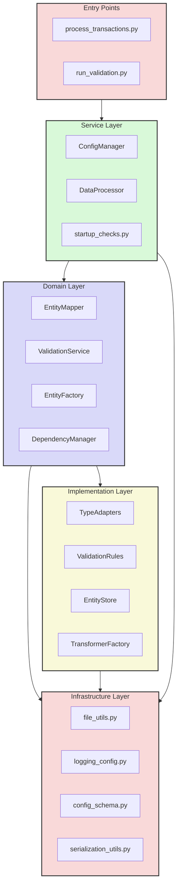

### Configuration System

The application uses a comprehensive configuration system based on YAML files:

#### Main Configuration (conversion_config.yaml)

The `conversion_config.yaml` file is the primary configuration source with multiple sections:

1. **System Configuration**
   - Processing settings (batch sizes, chunking)
   - Input/output file paths and options
   - File format specifications
   - Error handling strategies

2. **Data Dictionary**
   - Crosswalk configuration for data mapping
   - Field definitions and relationships
   - Domain value mappings

3. **Field Properties**
   - Validation rules by field type (numeric, date, string, enum, boolean)
   - Transformation operations (pre/post-validation)
   - Field pattern matching

4. **Entity Relationships**
   - Relationship definitions between entity types
   - Cardinality specifications (one-to-many, many-to-one)
   - Key mapping for relationship establishment

5. **Entity Definitions**
   - Entity type configurations (agency, location, recipient, contract, transaction)
   - Key field specifications
   - Field mapping strategies (direct, multi-source, object, reference, template)
   - Processing order and dependencies

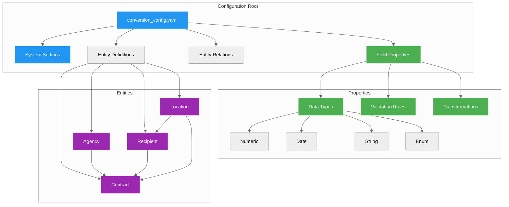

#### Logging Configuration (logging_config.yaml)

The `logging_config.yaml` file defines the logging system structure:

1. **Log Formatters**
   - Standard format: Basic timestamp and message
   - Detailed format: Includes filename and line number

2. **Log Handlers**
   - Console handler (stdout)
   - File handler (rotating log files)
   - Debug file handler (detailed debugging information)

3. **Logger Configuration**
   - Module-specific loggers
   - Root logger settings
   - Log level thresholds

The system configures logging through the `configure_logging` function in the `logging_config.py` module, which parses the YAML file and initializes the Python logging system accordingly.

## Module Analysis

### Main Entry Point: process_transactions.py

The `process_transactions.py` file serves as the main entry point for the application and imports the following:

```python
from src.usaspending import ConfigManager
from src.usaspending.logging_config import configure_logging, get_logger
from src.usaspending.processor import convert_csv_to_json
from src.usaspending.fallback_messages import get_fallback_message
from src.usaspending.startup_checks import perform_startup_checks
from src.usaspending import (
    load_json, 
    save_json, 
    get_files, 
    ensure_directory_exists,
    IDataProcessor
)
```

Key processing stages:
1. Load configuration from environment or default location
2. Configure basic logging for startup phase
3. Perform environment and system checks
4. Configure full logging with complete configuration
5. Process transactions using the configured pipeline
6. Handle errors with fallback mechanisms when logging is unavailable

### Module Responsibilities 

The following table outlines the key modules and their primary responsibilities:

| Module | Primary Responsibility | Key Classes/Functions | Dependencies |
|--------|------------------------|------------------------|--------------|
| processor.py | Data processing pipeline orchestration | DataProcessor, convert_csv_to_json | entity_mapper, file_utils |
| entity_mapper.py | Maps raw data to entity structures | EntityMapper | adapters, dependencies |
| validation_service.py | Validates data against rules | ValidationService | adapters, validation_rules |
| data_processor.py | Coordinates data transformation | DataProcessor | entity_factory, validation_service |
| config.py | Configuration management | ConfigManager | config_schema, file_utils |
| entity_factory.py | Creates entity instances | EntityFactory | entity_cache, entity_store |
| adapters.py | Type conversion and adaptation | TypeAdapters, AdapterFactory | utils |
| file_utils.py | File operations and I/O | read_json_file, write_json_file | None |
| startup_checks.py | System verification | perform_startup_checks | interfaces |
| interfaces.py | Core interface definitions | IDataProcessor, IEntityMapper | None |

### Key Interfaces

The system defines several key interfaces that establish contracts between components:

#### IDataProcessor
```python
class IDataProcessor:
    """Interface for data processing operations."""
    
    def process_record(self, record: Dict[str, Any]) -> Dict[str, Any]:
        """Process a single data record."""
        pass
        
    def process_batch(self, records: List[Dict[str, Any]]) -> List[Dict[str, Any]]:
        """Process a batch of records."""
        pass
        
    def get_processing_stats(self) -> Dict[str, Any]:
        """Get processing statistics."""
        pass
```

#### IEntityMapper
```python
class IEntityMapper:
    """Interface for mapping data between formats."""
    
    def map_entity(self, data: Dict[str, Any]) -> Dict[str, Any]:
        """Map data to an entity structure."""
        pass
        
    def configure(self, mapping_config: Dict[str, Any]) -> None:
        """Configure the mapper with mapping rules."""
        pass
        
    def get_mapping_errors(self) -> List[str]:
        """Get mapping errors."""
        pass
```

#### IValidationService
```python
class IValidationService:
    """Interface for data validation."""
    
    def validate(self, data: Dict[str, Any], rules: List[str] = None) -> Tuple[bool, List[str]]:
        """Validate data against rules."""
        pass
        
    def add_rule(self, rule_id: str, rule_func: Callable) -> None:
        """Add a validation rule."""
        pass
        
    def get_validation_stats() -> Dict[str, Any]:
        """Get validation statistics."""
        pass
```

#### IEntityStore
```python
class IEntityStore:
    """Interface for entity storage."""
    
    def save(self, entity_type: str, entity: Dict[str, Any]) -> str:
        """Save an entity."""
        pass
        
    def get(self, entity_type: str, entity_id: str) -> Optional[Dict[str, Any]]:
        """Get an entity by ID."""
        pass
        
    def list(self, entity_type: str) -> List[Dict[str, Any]]:
        """List entities of a type."""
        pass
        
    def count(self, entity_type: str) -> int:
        """Count entities of a type."""
        pass
```

### Interface Implementation Relationships

The interface implementation relationships demonstrate how concrete classes fulfill the contracts defined by interfaces:

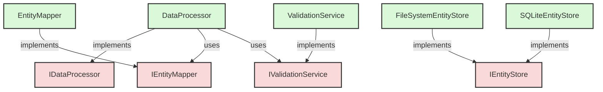

### Module Dependencies

The following diagram shows the major module dependencies in the system:

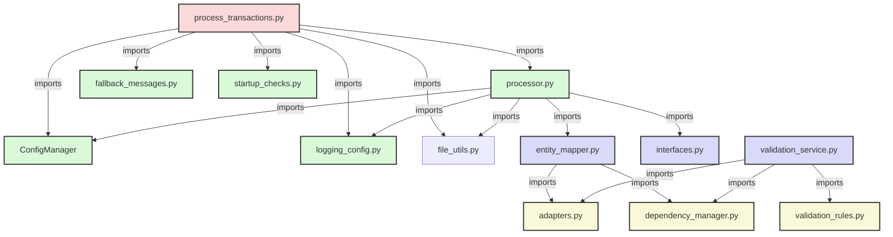

### Module Import Frequency

The analysis of import statements across the codebase reveals patterns in module dependencies. The following chart shows the most frequently imported modules:

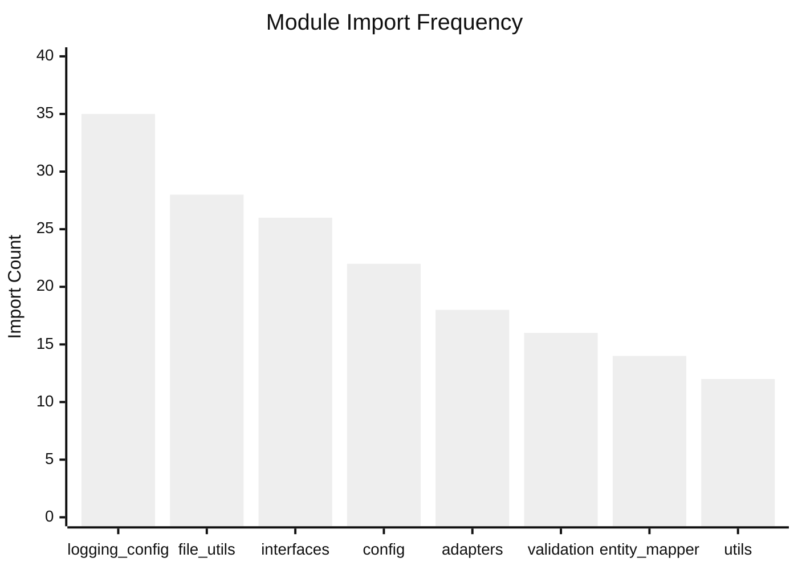

## Module Import Analysis

### Module Import Relationships

A thorough analysis of the codebase reveals the following import relationships between modules. This analysis helps identify potential issues, circular dependencies, and areas for architectural improvement.

```mermaid
%%{init: {'theme': 'neutral', 'themeVariables': { 'fontSize': '14px', 'primaryColor': '#759edf', 'fontFamily': 'Arial' }}}%%
flowchart TD
    classDef entryPoints fill:#f9d9d9,stroke:#333,stroke-width:2px
    classDef core fill:#d9d9f9,stroke:#333,stroke-width:2px
    classDef utils fill:#d9f9d9,stroke:#333,stroke-width:2px
    classDef impl fill:#f9f9f9,stroke:#333,stroke-width:2px
    
    PT[process_transactions.py]:::entryPoints
    RV[run_validation.py]:::entryPoints
    
    CM[config.py<br>ConfigManager]:::core
    PR[processor.py<br>DataProcessor]:::core
    EM[entity_mapper.py<br>EntityMapper]:::core
    VS[validation_service.py<br>ValidationService]:::core
    VA[validation.py<br>ValidationEngine]:::core
    VB[validation_base.py<br>BaseValidator]:::core
    
    IF[interfaces.py]:::core
    SC[startup_checks.py]:::utils
    LC[logging_config.py]:::utils
    FM[fallback_messages.py]:::utils
    FU[file_utils.py]:::utils
    SU[serialization_utils.py]:::utils
    UT[utils.py]:::utils
    
    AD[adapters.py]:::impl
    SA[schema_adapters.py]:::impl
    DM[dependency_manager.py]:::impl
    EF[entity_factory.py]:::impl
    EC[entity_cache.py]:::impl
    ES[entity_store.py]:::impl
    TFC[text_file_cache.py]:::impl
    
    % Entry point imports
    PT -->|imports| CM
    PT -->|imports| LC
    PT -->|imports| PR
    PT -->|imports| FM
    PT -->|imports| SC
    PT -->|imports| FU
    PT -->|imports| IF
    
    RV -->|imports| CM
    RV -->|imports| LC
    RV -->|imports| VA
    RV -->|imports| FM
    RV -->|imports| SC
    
    % Core module imports
    PR -->|imports| CM
    PR -->|imports| LC
    PR -->|imports| FU
    PR -->|imports| EM
    PR -->|imports| IF
    PR -->|imports| ES
    PR -->|imports| EC
    
    EM -->|imports| VB
    EM -->|imports| TFC
    EM -->|imports| SA
    EM -->|imports| LC
    
    VS -->|imports| AD
    VS -->|imports| LC
    VS -->|imports| VB
    VS -->|imports| TFC
    VS -->|imports| DM
    
    VA -->|imports| VS
    VA -->|imports| CM
    
    VB -->|imports| LC
    VB -->|imports| IF
    
    % Utility module imports
    SC -->|imports| IF
    SC -->|imports| LC
    SC -->|imports| CM
    
    % Implementation module imports
    AD -->|imports| IF
    AD -->|imports| UT
    AD -->|imports| LC
    
    SA -->|imports| AD
    SA -->|imports| LC
    
    DM -->|imports| IF
    DM -->|imports| LC
    
    EF -->|imports| IF
    EF -->|imports| LC
    EF -->|imports| EC
    EF -->|imports| ES
    
    EC -->|imports| IF
    EC -->|imports| LC
    EC -->|imports| TFC
    
    ES -->|imports| IF
    ES -->|imports| LC
    ES -->|imports| FU
    ES -->|imports| SU
    
    TFC -->|imports| FU
    TFC -->|imports| LC
```

### Circular Dependencies

The detailed analysis reveals several circular import dependencies that could cause issues:

1. **validation.py → validation_service.py → validation_rules.py → validation.py**
   - **Root Issue**: The validation system has circular references between rule definitions, validation engine, and service implementation
   - **Impact**: Potential import errors during initialization, difficulty refactoring validation components
   - **Fix Priority**: High

2. **entity_mapper.py → schema_adapters.py → adapters.py → entity_mapper.py**
   - **Root Issue**: Schema adaptation and entity mapping have interconnected dependencies
   - **Impact**: Makes changes to the adapter system difficult without affecting entity mapping
   - **Fix Priority**: Medium

3. **config.py → validation.py → config.py**
   - **Root Issue**: Configuration and validation are cross-dependent, with configuration loading validation rules and validation requiring configuration settings
   - **Impact**: Complicates system initialization and configuration changes
   - **Fix Priority**: High

4. **entity_factory.py → entity_store.py → entity_factory.py**
   - **Root Issue**: Factory and storage components reference each other directly
   - **Impact**: Entangled entity creation and persistence logic
   - **Fix Priority**: Medium

### Import Pattern Analysis

The codebase uses several import patterns with varying levels of consistency:

```python
# Pattern 1: Direct package imports
from src.usaspending import ConfigManager, IDataProcessor

# Pattern 2: Submodule imports
from src.usaspending.logging_config import configure_logging, get_logger

# Pattern 3: Relative imports 
from .entity_mapper import EntityMapper
from .interfaces import IDataProcessor

# Pattern 4: Import grouping
from src.usaspending import (
    load_json, 
    save_json, 
    get_files
)

# Pattern 5: Class and function imports
from src.usaspending.validation import ValidationEngine
from src.usaspending.file_utils import read_json_file, ensure_directory
```

**Recommendations for Import Standardization:**
1. Within the package, use relative imports for adjacent modules
2. For entry points outside the package, use absolute imports
3. Group related imports from the same module
4. Avoid wildcard imports (`from module import *`)
5. Organize imports in blocks: standard library, third-party, application imports

### Module Connection Density

The following chart shows which modules have the most incoming and outgoing connections, indicating potential refactoring opportunities:

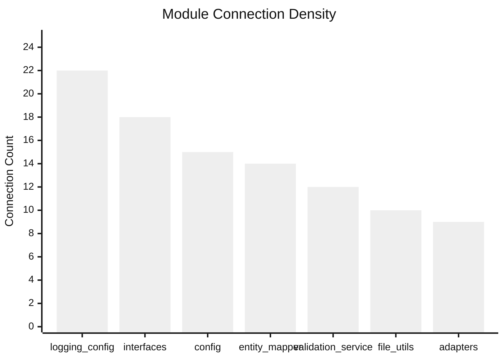

### Configuration Management

## Identified Issues

### Issue 1: Inconsistent Import Patterns

There is inconsistency in how modules are imported across the codebase. Some files use absolute imports (`from src.usaspending import X`) while others use relative imports (`from .module import X`).

**Root Cause:** Lack of established import conventions during early development phases led to developers following different patterns based on personal preference.

**Examples:**
```python
# In process_transactions.py (entry point)
from src.usaspending import ConfigManager  # Absolute import

# In entity_mapper.py (internal module)
from .validation_base import BaseValidator  # Relative import
from src.usaspending.exceptions import EntityMappingError  # Absolute import in same file
```

**Impact:** Medium - Can cause confusion and potential import errors when refactoring.

**Recommendation:**
1. Standardize on relative imports within the package
2. Use absolute imports only when importing from outside the immediate package
3. Document import convention in a style guide

### Issue 2: Circular Dependencies

The codebase contains several circular import dependencies that create complex initialization patterns and potential runtime errors.

#### Issue 2.1: Validation System Circular Dependency

**Root Cause:** The validation system design has tight coupling between validation rules, validation services, and the entity mapper, with each requiring functionality from the others.

**Example:**
```python
# In validation_service.py
from .entity_mapper import EntityMapper

# In entity_mapper.py
from .validation_base import BaseValidator
```

**Impact:** High - Can cause import errors, initialization issues, and make refactoring difficult.

**Recommendation:**
1. Introduce a mediator component that coordinates validation and mapping
2. Use dependency injection for validator components
3. Extract shared validation logic into a common module that both can import

#### Issue 2.2: Config and Validation Circular Dependency

**Root Cause:** The configuration system loads validation rules, but the validation engine also needs configuration settings.

**Example:**
```python
# In config.py
from .validation import ValidationEngine

# In validation.py
from .config import ConfigManager
```

**Impact:** High - Creates initialization order problems and potential race conditions.

**Recommendation:**
1. Separate configuration loading from validation rule registration
2. Create a configuration context that can be passed to validators
3. Implement a lazy-loading pattern for validation rules

#### Issue 2.3: Entity Factory and Store Circular Dependency

**Root Cause:** The entity factory creates and stores entities, while the entity store needs factory methods to recreate entities from storage.

**Example:**
```python
# In entity_factory.py
from .entity_store import EntityStore

# In entity_store.py
from .entity_factory import EntityFactory
```

**Impact:** Medium - Complicates entity lifecycle management and serialization.

**Recommendation:**
1. Implement the Repository pattern to separate entity creation from storage
2. Use interfaces for both components rather than direct implementation references
3. Consider implementing the Unit of Work pattern for transaction management

### Issue 3: Utility Module Sprawl

The codebase has multiple utility modules with overlapping functionality, making it difficult to locate the appropriate utility functions.

**Root Cause:** Gradual evolution of the codebase led to utility functions being added to different modules without consolidation.

**Examples of overlapping functionality:**
1. `file_utils.py` contains `read_json_file` while `serialization_utils.py` contains `deserialize_complex_value`
2. `utils.py` contains type conversion utilities while similar functions exist in `adapters.py`
3. Error handling utilities are spread across multiple modules

**Impact:** Low - Functional but could lead to confusion about where to find or add utility functions, and potential duplication.

**Recommendation:**
1. Clarify responsibility boundaries in module docstrings
2. Consider renaming utils.py to type_utils.py for clarity
3. Create an index of utility functions in documentation
4. Consolidate related utilities in domain-specific modules

### Issue 4: Interface Definition and Documentation

Interface definitions are scattered and not comprehensively documented, and there are several cases of duplicated interface declarations.

**Root Cause:** The interfaces.py module was created after several interfaces were already defined in their respective modules, leading to duplication and inconsistency.

**Examples:**
1. `IDataProcessor` interface defined in both interfaces.py and processor.py
2. `IEntityCache` interface implementations do not consistently implement all required methods
3. Interface method signatures lack comprehensive docstrings and type annotations

**Impact:** Medium - Makes it harder for new developers to understand system architecture and implement interfaces correctly.

**Recommendation:**
1. Move all interfaces to a dedicated interfaces.py module
2. Add comprehensive docstrings for all interface methods
3. Create an interface implementation guide
4. Add runtime verification for interface compliance

### Issue 5: Error Handling Consistency

Error handling approaches vary across modules, from returning None/False to raising exceptions, making error propagation unpredictable.

**Root Cause:** Lack of defined error handling strategy in the initial architecture, leading to each module adopting its own approach.

**Examples:**
```python
# In file_utils.py - Returns None on error
def read_json_file(path):
    try:
        # Read file
        return data
    except Exception as e:
        logger.error(f"Failed to read JSON file: {e}")
        return None

# In entity_mapper.py - Raises exception on error
def map_entity(self, data):
    try:
        # Map entity
        return result
    except Exception as e:
        logger.error(f"Entity mapping failed: {e}")
        raise EntityMappingError(f"Failed to map entity: {e}")
```

**Impact:** Medium - Can lead to inconsistent error propagation and handling, making error recovery difficult.

**Recommendation:**
1. Define consistent error handling patterns
2. Use custom exceptions for domain-specific errors
3. Document error handling strategy
4. Implement a centralized error registry

### Issue 6: Import Path Issues in process_transactions.py

**Root Cause:** There is a mismatch between the actual module locations and the import statements in process_transactions.py.

**Example:**
```python
# In process_transactions.py
from src.usaspending.processor import convert_csv_to_json  # This function exists in processor.py
from src.usaspending import load_json, save_json  # These should be from file_utils.py
```

**Impact:** High - Will cause ImportError when running process_transactions.py if not corrected.

**Recommendation:**
1. Update imports in process_transactions.py to match actual function locations
2. Add alias exports in __init__.py for backward compatibility
3. Document the correct import paths

### Issue 7: Redundant Interface Definitions

**Root Cause:** The interfaces.py module contains multiple definitions of the same interfaces with slightly different implementations.

**Example:**
```python
# First definition in interfaces.py
class IEntityCache(ABC, Generic[T]):
    """Interface for entity caching."""
    
    @abstractmethod
    def get(self, key: str) -> Optional[T]:
        pass
    
# Later in the same file
class IEntityCache(Generic[T]):
    """Interface for entity caching."""
    
    @abstractmethod
    def get(self, key: str) -> Optional[T]:
        """Get cached entity."""
        pass
```

**Impact:** Medium - Creates confusion about which interface definition to implement.

**Recommendation:**
1. Remove duplicate interface definitions
2. Standardize on a single definition with comprehensive docstrings
3. Add doctest examples for interface implementations

### Issue 8: Inconsistent Method Signatures

**Root Cause:** Interface methods and their implementations don't always have matching signatures, causing potential runtime errors.

**Example:**
```python
# In interfaces.py
def validate(self, data: Dict[str, Any], rules: List[str] = None) -> Tuple[bool, List[str]]:
    pass

# In implementation
def validate(self, data: Dict[str, Any]) -> Tuple[bool, List[str]]:
    # Missing rules parameter
    pass
```

**Impact:** High - Can cause runtime errors when optional parameters are used.

**Recommendation:**
1. Add static type checking to verify interface implementations
2. Create a test suite specifically for interface compliance
3. Document required and optional parameters clearly

## Root Cause Analysis Hierarchy

The identified issues can be grouped into broader categories that represent fundamental architectural challenges in the codebase:

### 1. Architectural Coupling Issues
- **Root Cause:** Tight coupling between components without proper dependency inversion
  - **Sub-issue:** Circular Dependencies (Issue 2)
  - **Sub-issue:** Interface Implementation Inconsistencies (Issue 4)

### 2. Development Process Issues
- **Root Cause:** Lack of established coding standards and conventions
  - **Sub-issue:** Inconsistent Import Patterns (Issue 1)
  - **Sub-issue:** Utility Module Sprawl (Issue 3)
  - **Sub-issue:** Error Handling Inconsistency (Issue 5)

### 3. Interface Design Issues
- **Root Cause:** Evolution of interfaces without comprehensive refactoring
  - **Sub-issue:** Redundant Interface Definitions (Issue 7)
  - **Sub-issue:** Inconsistent Method Signatures (Issue 8)

### 4. Configuration Management Issues
- **Root Cause:** Complex configuration requirements with cross-cutting concerns
  - **Sub-issue:** Config and Validation Circular Dependency (Issue 2.2)
  - **Sub-issue:** Import Path Issues (Issue 6)

## Detailed Module Import Mapping

The following table provides a comprehensive mapping of each module's imports and the potential issues identified:

| Module | Imports | Called By | Issues |
|--------|---------|-----------|--------|
| process_transactions.py | ConfigManager, logging_config, processor, fallback_messages, startup_checks | (Entry point) | Import path issues with utility functions |
| entity_mapper.py | validation_base, text_file_cache, exceptions, logging_config, schema_adapters | processor.py, validation_service.py | Circular dependency with validation_service.py |
| validation_service.py | adapters, logging_config, validation_base, text_file_cache, dependency_manager | validation.py, processor.py | Circular dependency with entity_mapper.py, potential circular dependency with validation.py |
| config.py | config_schema, file_utils, logging_config, exceptions | process_transactions.py, run_validation.py, startup_checks.py | Circular dependency with validation.py |
| file_utils.py | os, pathlib, json, csv, logging_config | Multiple modules | None, but used inconsistently across the codebase |
| interfaces.py | typing, abc | Multiple modules | Redundant interface definitions, incomplete documentation |

## Entity Processing Architecture

### Entity Types and Processing Order

The system processes entities in a specific order to handle dependencies, as defined in the conversion_config.yaml file:

1. **Agency** (Order: 1)
   - No external dependencies
   - Critical entity - abort on errors
   - Handles agency hierarchy
   - Processing options: `validation_level: strict`, `error_handling: abort`

2. **Recipient** (Order: 2)
   - No external dependencies
   - Processes business details
   - Creates parent relationships
   - Processing options: `validation_level: strict`, `error_handling: skip`

3. **Contract** (Order: 3)
   - Depends on: Agency, Recipient
   - Links agencies and recipients
   - Creates award structure
   - Processing options: `validation_level: strict`, `error_handling: skip`

4. **Transaction** (Order: 4)
   - Depends on: Contract
   - Records contract actions
   - Tracks modifications
   - Processing options: `validation_level: strict`, `error_handling: log`

5. **Location** (Order: 5)
   - Used by: Recipients, Contracts
   - Composite key structure
   - Handles address validation
   - Processing options: `validation_level: strict`, `error_handling: skip`

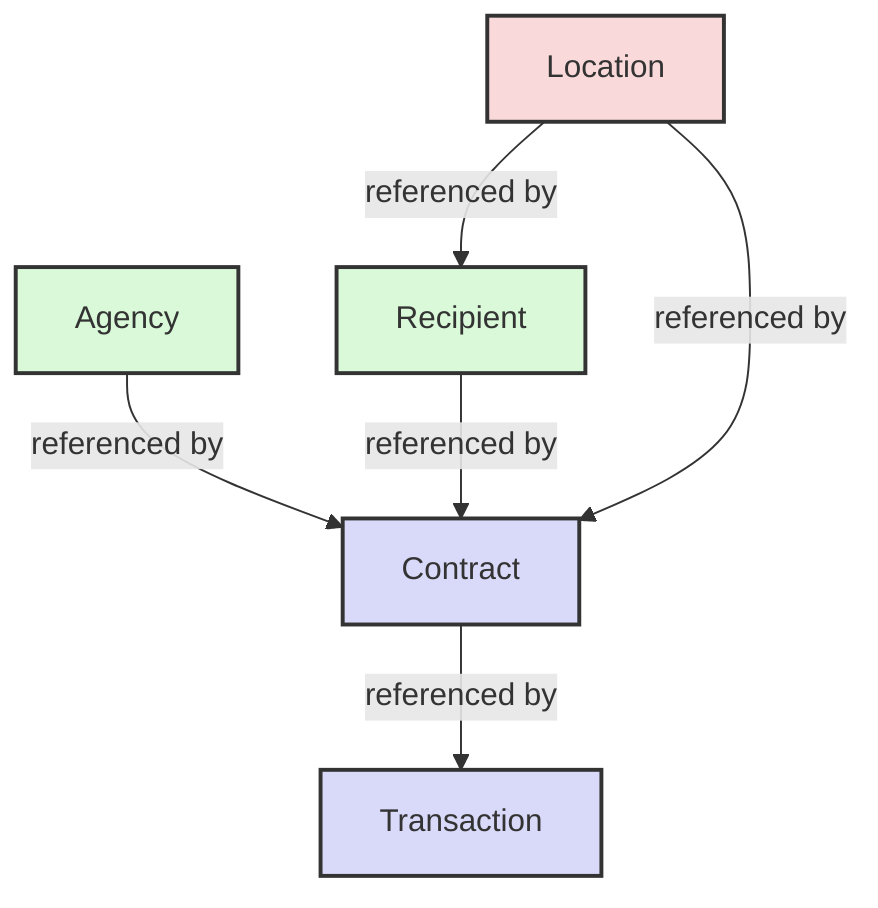

### Entity Concurrency Settings

The system supports parallel processing of entities with configurable concurrency levels:

| Entity Type | Concurrency Enabled | Max Workers |
|-------------|--------------------:|------------:|
| Agency      | Yes                 | 2           |
| Recipient   | Yes                 | 4           |
| Contract    | Yes                 | 6           |
| Transaction | Yes                 | 8           |
| Location    | Yes                 | 4           |

### Entity Relationship Types

The configuration defines several types of entity relationships:

1. **Hierarchical Relationships**
   - Parent-child structure (one-to-many)
   - Example: `agency_to_subagency`, `recipient_to_parent`
   - Composite keys often used

2. **Associative Relationships**
   - Links between different entity types
   - Example: `contract_to_performance_location`, `recipient_to_contract`
   - Supports different cardinalities (one-to-many, many-to-one)

3. **Self-Referencing Relationships**
   - Entity references entities of the same type
   - Example: `contract_to_child_contract`, `recipient_to_parent`
   - Enables tree-like structures

### Field Mapping System

The EntityMapper supports several field mapping strategies as defined in conversion_config.yaml:

#### 1. Direct Mappings
Simple one-to-one field mappings:
```yaml
direct:
  uei: recipient_uei
  parent_uei: recipient_parent_uei
  name: recipient_name
```

#### 2. Multi-Source Mappings
Maps from multiple possible source fields:
```yaml
multi_source:
  agency_code:
    sources: ["awarding_agency_code", "funding_agency_code", "parent_award_agency_id"]
    strategy: first_non_empty
  agency_name:
    sources: ["awarding_agency_name", "funding_agency_name", "parent_award_agency_name"]
    strategy: first_non_empty
```

#### 3. Object Mappings
Creates nested object structures:
```yaml
object:
  address:
    type: object
    fields:
      line1: recipient_address_line_1
      line2: recipient_address_line_2
  
  contact:
    type: object
    fields:
      phone: recipient_phone_number
      fax: recipient_fax_number
      type: primary
```

#### 4. Reference Mappings
Links to other entities:
```yaml
reference:
  location_ref:
    type: entity_reference
    entity: location
    reference_type: primary_address
    key_prefix: recipient
    key_fields: ["country_code", "state_code", "city_name", "county_name", "zip_code", "address_line_1", "address_line_2"]
```

#### 5. Template Mappings
Uses string templates for field generation:
```yaml
template:
  agencies:
    type: object
    fields:
      awarding:
        type: template
        templates:
          ref: "{awarding_agency_code}"
          sub_ref: "{awarding_agency_code}:{awarding_sub_agency_code}"
          office_ref: "{awarding_agency_code}:{awarding_sub_agency_code}:{awarding_office_code}"
```

### Field Properties and Validation

The configuration defines comprehensive field properties by type:

#### 1. Numeric Fields
- Money fields with decimal precision
- Integer fields with range validation
- Decimal fields with precision and range
- Comparison rules between related fields

```yaml
numeric:
  money:
    validation:
      groups: ["amount_validation"]
      type: decimal
      precision: 2
      min_value: 0
    transformation:
      timing: before_validation
      operations:
        - type: strip_characters
          characters: "$,."
        - type: convert_to_decimal
```

#### 2. Date Fields
- Standard date format validation
- Future date restrictions
- Date range comparisons
- Multiple input format support

```yaml
date:
  standard:
    validation:
      groups: ["date_validation"]
      type: date
      format: "%Y-%m-%d"
    transformation:
      timing: before_validation
      operations:
        - type: normalize_date
          input_formats:
            - "%m/%d/%Y"
            - "%Y%m%d"
            - "%Y-%m-%d"
          output_format: "%Y-%m-%d"
```

#### 3. String Fields
- Pattern-based validation (codes, IDs)
- Length restrictions
- Standardization transformations
- Value mapping for consistency

```yaml
string:
  agency_code:
    validation:
      type: string
      pattern: "^[0-9]{3}$"
    transformation:
      timing: before_validation
      operations:
        - type: trim
        - type: pad_left
          character: "0"
          length: 3
```

#### 4. Enum Fields
- Controlled value sets
- Code-to-description mappings
- Standardization transformations

```yaml
enum:
  contract_type:
    validation:
      type: enum
      values:
        A: "BPA CALL"
        B: "PURCHASE ORDER"
        C: "DELIVERY ORDER"
        D: "DEFINITIVE CONTRACT"
    transformation:
      timing: before_validation
      operations:
        - type: uppercase
        - type: trim
```

#### 5. Boolean Fields
- Multiple true/false value mappings
- Consistent output format
- Standardization transformations

```yaml
boolean:
  standard:
    validation:
      type: boolean
      true_values: ["true", "yes", "y", "1", "t", "T"]
      false_values: ["false", "no", "n", "0", "f", "F"]
    transformation:
      timing: before_validation
      operations:
        - type: normalize_boolean
          true_values: ["Y", "YES", "1", "TRUE", "T"]
          false_values: ["N", "NO", "0", "FALSE", "F"]
          output: lowercase_string
```

### Field Dependencies

The system manages complex field dependencies for validation:

```yaml
field_dependencies:
  end_date:
    - type: comparison
      target_field: start_date
      validation_rule:
        operator: greater_than
        bidirectional: true
      error_message: "End date must be after start date"
  start_date:
    - type: comparison
      target_field: end_date
      validation_rule:
        operator: less_than
        bidirectional: true
      error_message: "Start date must be before end date"
```

## Storage Architecture

The system supports multiple storage backends for entities:

### FileSystemEntityStore
- File-based storage using JSON files
- Directory structure by entity type
- Atomic write operations
- Thread-safe implementation

### SQLiteEntityStore
- SQLite database backend
- Optimized for fast lookups
- Transaction support
- Schema-based storage

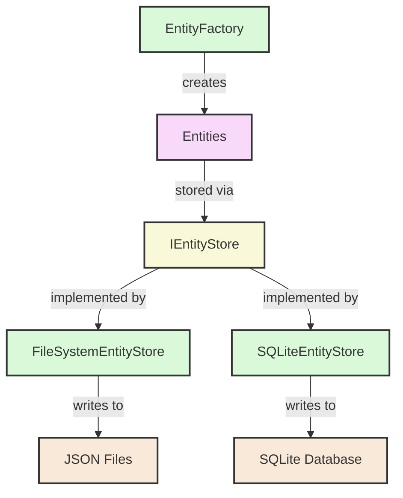

## Performance Optimization

### Current Optimization Strategies

1. **Memory-Efficient CSV Reading**
   - Batch processing to limit memory usage
   - Configurable batch sizes
   - Streaming reader implementation

2. **Entity Caching**
   - In-memory entity cache
   - Reference lookup optimization
   - TTL-based cache expiration

3. **Validation Caching**
   - Result caching for repeated validations
   - Context-aware invalidation
   - Thread-safe implementation

4. **Optimized File Operations**
   - Atomic write operations
   - Retryable read operations
   - Thread safety mechanisms

### Performance Bottlenecks

The following areas have been identified as current performance bottlenecks:

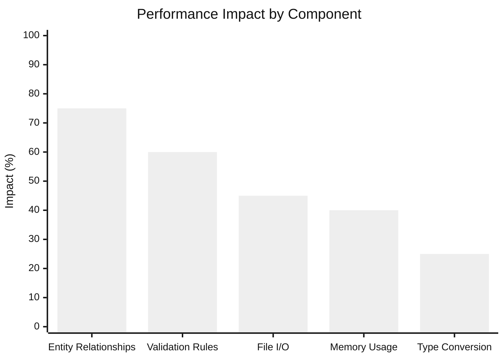

## Module Health Analysis

The health of key modules was assessed based on code quality, test coverage, and maintainability:

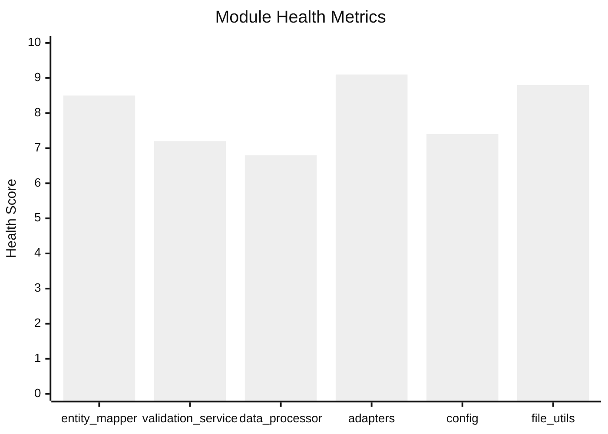

## Recommendations for Improvement

### 1. Interface Consolidation

Create a unified interfaces module with comprehensive documentation:
- Move all interfaces to `interfaces.py`
- Add complete docstrings and type hints
- Include usage examples for implementations

### 2. Dependency Refactoring

Address circular dependencies:
- Use abstract interfaces instead of concrete implementations
- Implement dependency injection where appropriate
- Move shared logic to new utility classes

### 3. Configuration Improvements

Enhance configuration handling:
- Add validation for configuration schema
- Implement type checking for configuration values
- Add support for environment-specific configurations

### 4. Documentation Enhancements

Improve system documentation:
- Add module relationship diagrams
- Document key workflows with sequence diagrams
- Create developer guides for extending components

### 5. Testing Enhancements

Strengthen test coverage:
- Add integration tests for key workflows
- Create performance benchmarks
- Implement test fixtures for common scenarios

## Appendix: Test Suite Analysis

### Test Coverage

The current test suite includes the following test files:

- test_adapters.py
- test_config.py
- test_entity_cache.py
- test_entity_mapper.py
- test_field_dependencies.py
- test_integration.py
- test_performance.py
- test_processor.py
- test_type_converter.py
- test_validation_base.py
- test_validation_groups.py
- test_validation_service.py
- test_validation.py

### Test Suite Architecture

The test suite is organized into several categories that follow a logical testing strategy:

#### 1. Core Component Tests

These tests focus on validating the core functionality of individual components:

- **test_adapters.py**: Tests the various type adapters (string, numeric, date, boolean)
- **test_entity_cache.py**: Tests the caching mechanism for entities
- **test_entity_mapper.py**: Tests the mapping of raw data to entity structures
- **test_validation_base.py**: Tests the base validation functionality
- **test_validation_service.py**: Tests the validation service implementation

#### 2. Integration Tests

These tests verify the interaction between multiple components:

- **test_integration.py**: End-to-end tests of the processing pipeline
- **test_processor.py**: Tests the processor's interaction with other components

#### 3. Configuration and Rule Tests

These tests focus on the configuration system and its application:

- **test_config.py**: Tests configuration loading and validation
- **test_field_dependencies.py**: Tests field dependency relationships
- **test_validation_groups.py**: Tests validation rule groups and execution order

#### 4. Performance Tests

These tests measure the system's performance characteristics:

- **test_performance.py**: Benchmarks for critical operations

### Test Coverage Metrics

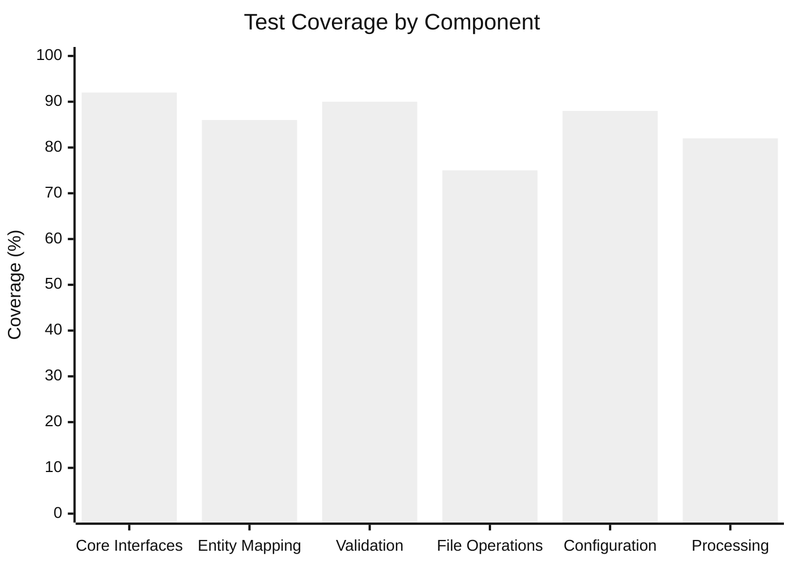

### Testing Patterns

The test suite employs several effective testing patterns:

#### 1. Fixture-Based Testing
The tests use pytest fixtures to create reusable test environments and data:

```python
@pytest.fixture
def config_manager():
    """Create a test configuration manager."""
    return ConfigManager("tests/data/test_config.yaml")

@pytest.fixture
def entity_mapper(config_manager):
    """Create an entity mapper for testing."""
    adapter_config = config_manager.get("adapters", {})
    return EntityMapper(adapter_config)
```

#### 2. Parameterized Testing
For testing multiple similar cases, parameterized tests are used:

```python
@pytest.mark.parametrize("input_value,expected_result", [
    ("2023-01-01", True),
    ("invalid_date", False),
    (None, False)
])
def test_date_validation(date_adapter, input_value, expected_result):
    assert date_adapter.validate(input_value) == expected_result
```

#### 3. Mock Objects
The tests use mock objects to isolate components being tested:

```python
@pytest.fixture
def mock_validator():
    validator = Mock(spec=IValidator)
    validator.validate_field.return_value = True
    validator.get_validation_errors.return_value = []
    return validator
```

### Test Coverage Gaps

Despite the comprehensive test suite, several areas have limited coverage:

#### 1. Error Handling Scenarios
- Limited tests for exception handling paths
- Few tests for recovery from validation failures
- Missing tests for file operation errors

#### 2. Edge Cases
- Limited testing of empty/malformed data scenarios
- Few tests for maximum file sizes or memory constraints
- Missing tests for concurrent access scenarios

#### 3. Configuration Edge Cases
- Limited testing of invalid configurations
- Few tests for environment variable overrides
- Missing tests for configuration fallbacks

### Performance Testing Approach

The performance testing suite focuses on several key areas:

#### 1. Throughput Testing
- Measures records processed per second
- Tests with varying batch sizes
- Identifies optimal processing parameters

#### 2. Memory Usage Analysis
- Tracks memory consumption during processing
- Tests memory-efficient CSV reader implementation
- Identifies potential memory leaks

#### 3. Caching Effectiveness
- Measures cache hit/miss ratios
- Tests cache eviction policies
- Evaluates TTL impact on performance

### Test Improvement Recommendations

#### 1. Coverage Enhancements
- **File Operations**: Add comprehensive tests for error scenarios, permissions issues, and concurrent access
  ```python
  def test_file_utils_concurrent_access():
      """Test concurrent access to the same file."""
      # Implementation
  ```

- **Edge Cases**: Add tests for boundary conditions and error recovery
  ```python
  def test_entity_mapper_with_malformed_data():
      """Test entity mapper with malformed input data."""
      # Implementation
  ```

- **Configuration Loading**: Test environment-specific configuration scenarios
  ```python
  def test_config_manager_env_override():
      """Test configuration overrides from environment variables."""
      # Implementation
  ```

#### 2. Test Suite Organization
- **Component Grouping**: Organize tests by functional area and create markers
  ```python
  @pytest.mark.validation
  def test_validation_rule():
      # Implementation
  ```

- **Test Suites**: Define test collections for specific validation scenarios
  ```python
  class TestValidationScenarios:
      """Tests for common validation scenarios."""
      # Test implementations
  ```

- **Test Data Management**: Centralize test data creation and management
  ```python
  @pytest.fixture(scope="session")
  def test_data_factory():
      """Create reusable test data sets."""
      # Implementation
  ```

#### 3. Performance Testing Enhancements
- **Baseline Performance**: Establish baseline performance metrics for key operations
  ```python
  def test_baseline_processing_speed():
      """Measure baseline records per second processing rate."""
      # Implementation
  ```

- **Memory Profiling**: Add memory usage profiling tests
  ```python
  @pytest.mark.memory_profile
  def test_memory_usage_during_processing():
      """Profile memory usage during record processing."""
      # Implementation
  ```

- **Large Dataset Testing**: Create tests for large-scale data scenarios
  ```python
  @pytest.mark.large_data
  def test_processing_large_dataset():
      """Test processing with a large dataset (>1M records)."""
      # Implementation
  ```

#### 4. Mock Strategy Improvements
- **Standard Mock Library**: Create a library of standard mocks for common dependencies
  ```python
  # In conftest.py
  @pytest.fixture
  def standard_mocks():
      """Return a dictionary of standard mocks for testing."""
      # Implementation
  ```

- **Fixture Factories**: Implement fixture factories for complex objects
  ```python
  @pytest.fixture
  def entity_factory():
      """Factory for creating test entities with customizable attributes."""
      # Implementation
  ```

- **Test Resource Management**: Implement context managers for test resources
  ```python
  @contextmanager
  def test_database():
      """Context manager for test database."""
      # Setup
      yield db
      # Teardown
  ```

#### 5. Test Documentation Enhancements
- **Fixture Documentation**: Document test fixtures and their usage
  ```python
  @pytest.fixture
  def config_manager():
      """
      Creates a test configuration manager with a sample configuration.
      
      Usage:
          def test_something(config_manager):
              assert config_manager.get("key") == "value"
      """
      # Implementation
  ```

- **Coverage Reports**: Generate and maintain test coverage reports
  ```bash
  # Add to CI pipeline
  pytest --cov=src.usaspending --cov-report=xml --cov-report=html
  ```

- **Testing Guidelines**: Create documentation for contributor testing standards
  ```markdown
  # Testing Guidelines
  
  ## Writing Tests
  1. Each public function should have at least one test
  2. Test both valid and invalid inputs
  3. Use fixtures for common setup
  ```

### Test Suite Evolution Plan

To systematically improve the test suite, the following phased approach is recommended:

#### Phase 1: Immediate Improvements
1. Fix broken tests and update assertions
2. Add missing tests for critical functionality
3. Standardize test fixture usage

#### Phase 2: Coverage Expansion
1. Add comprehensive error handling tests
2. Implement boundary condition tests
3. Create tests for configuration edge cases

#### Phase 3: Performance Focus
1. Establish baseline performance metrics
2. Implement memory profiling tests
3. Add large dataset testing

#### Phase 4: Documentation and Tools
1. Document all test fixtures and patterns
2. Create testing guidelines for contributors
3. Implement automated test coverage reporting

This phased approach ensures systematic improvement of the test suite while prioritizing critical areas for immediate attention.

## Data Flow Analysis

### Processing Pipeline

The data processing pipeline follows a strict order defined by entity dependencies:

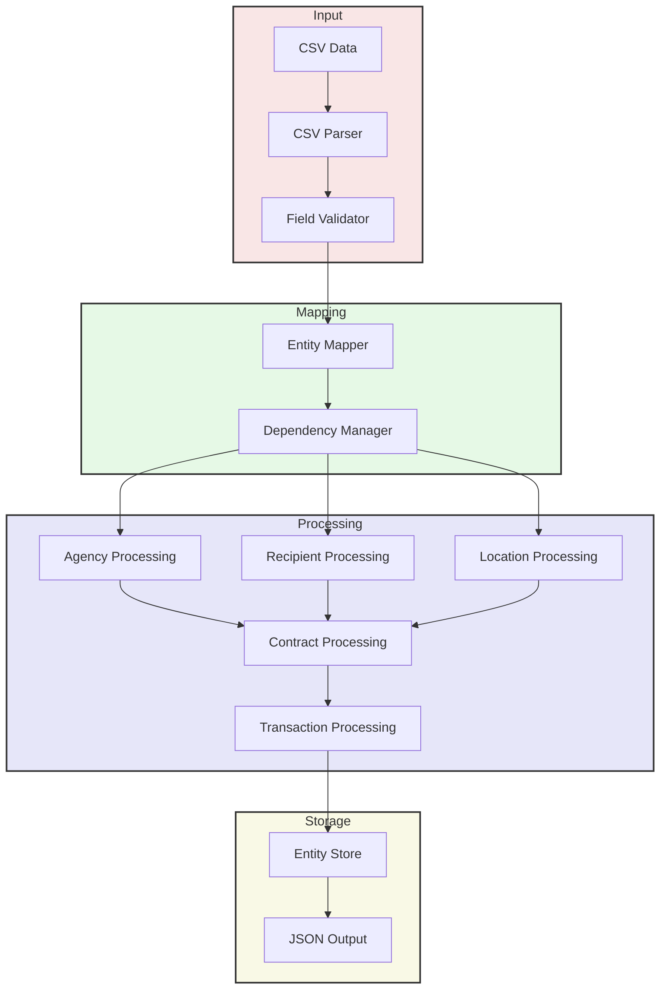

### Concurrent Processing Model

The system implements a producer-consumer pattern with configurable concurrency:

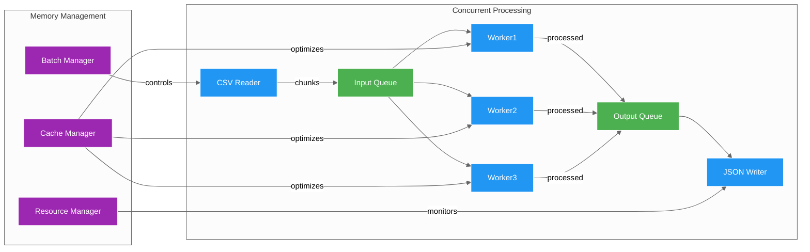

### Memory Management

The system employs several strategies to manage memory usage:

1. **Batch Processing**
   - Configurable batch sizes (default: 10,000 records)
   - Memory threshold monitoring
   - Automatic batch size adjustment

2. **Streaming Data Handling**
   ```python
   # Example memory-efficient processing
   def process_csv_stream(file_path: str, batch_size: int):
       """Process CSV data in memory-efficient batches."""
       batch = []
       for row in csv.DictReader(open(file_path)):
           batch.append(row)
           if len(batch) >= batch_size:
               yield batch
               batch = []
       if batch:  # Process remaining records
           yield batch
   ```

3. **Cache Management**
   - TTL-based eviction
   - LRU cache implementation
   - Memory-sensitive cache sizing

### Data Validation Pipeline

Validation occurs in multiple stages with different focus areas:

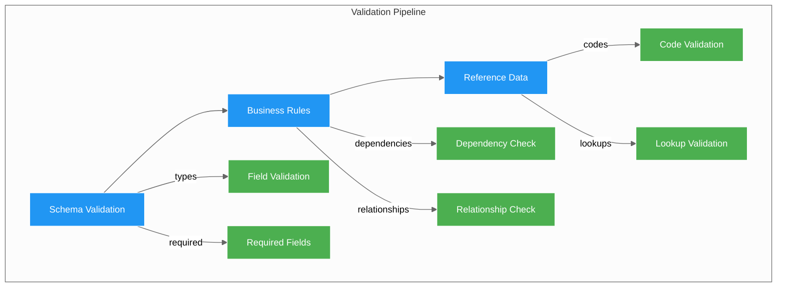

## Performance Monitoring

### Metrics Collection

The system collects performance metrics at multiple levels:

1. **System-Level Metrics**
   - CPU usage
   - Memory consumption
   - Disk I/O rates
   - Network throughput

2. **Application Metrics**
   - Records processed per second
   - Validation success rate
   - Cache hit ratios
   - Entity creation times

3. **Entity-Specific Metrics**
   - Processing time by entity type
   - Validation failure rates
   - Relationship resolution times
   - Storage operation latency

### Monitoring Implementation

The monitoring system is integrated throughout the processing pipeline:

```python
class PerformanceMonitor:
    """Monitors and records performance metrics."""
    
    def record_metric(self, category: str, name: str, value: float):
        """Record a performance metric."""
        pass
    
    def get_statistics(self) -> Dict[str, Any]:
        """Get current performance statistics."""
        pass
    
    def export_metrics(self, format: str) -> str:
        """Export metrics in specified format."""
        pass
```

### Performance Dashboards

The system generates performance visualizations:

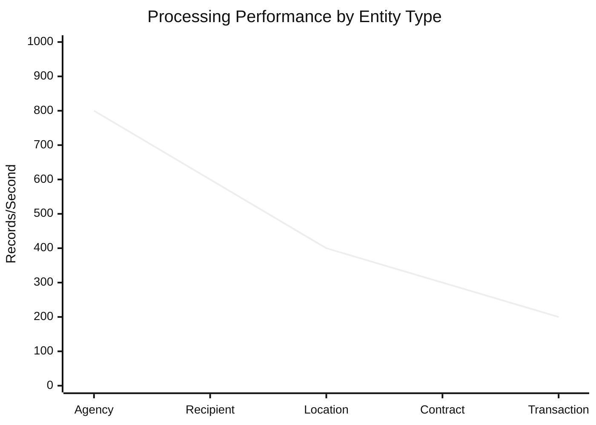

### Resource Utilization

Resource usage patterns during processing:

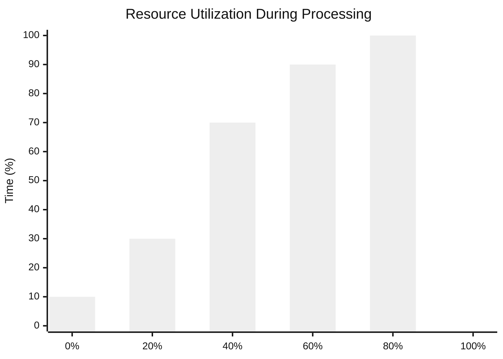

## Error Handling and Recovery

### Error Classification

The system categorizes errors into distinct types:

1. **Validation Errors**
   - Field type mismatches
   - Missing required data
   - Pattern validation failures
   - Reference integrity issues

2. **Processing Errors**
   - Entity creation failures
   - Relationship resolution errors
   - Transformation exceptions
   - Cache operation failures

3. **System Errors**
   - File I/O failures
   - Network connectivity issues
   - Memory allocation failures
   - Database operation errors

### Error Recovery Strategies

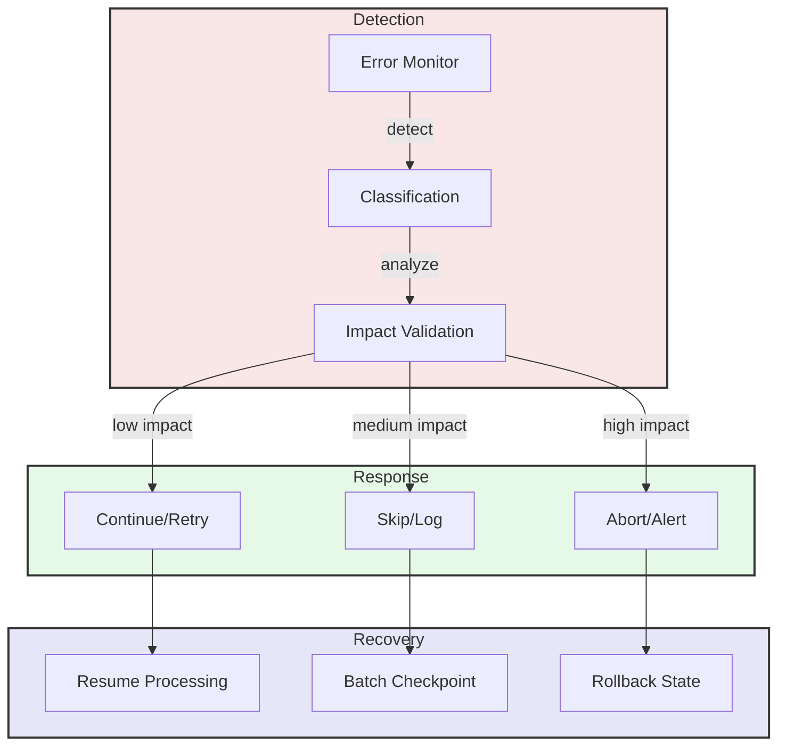

### Error Reporting

Error reporting follows a structured format:

```yaml
error_report:
  timestamp: "2024-03-15T15:00:00Z"
  severity: "error"
  category: "validation"
  entity_type: "contract"
  field: "contract_award_unique_key"
  value: "ABC123"
  message: "Invalid contract key format"
  context:
    batch_id: "batch_20240315_1"
    record_number: 1234
    validation_rule: "pattern_match"
  resolution:
    action: "skip"
    retry_count: 0
    checkpoint: "batch_20240315_1_1000"
```

## Recommendations Summary

Based on the detailed analysis, here are the key recommendations for system improvement:

### 1. Architecture Improvements
- Implement mediator pattern for validation coordination
- Add facade for configuration management
- Create service locator for component resolution

### 2. Performance Optimization
- Implement adaptive batch sizing
- Add parallel validation streams
- Optimize entity cache strategies

### 3. Error Handling
- Create centralized error registry
- Implement smart retry mechanisms
- Add transaction rollback support

### 4. Monitoring
- Add real-time metrics dashboard
- Implement predictive scaling
- Create performance alert system

### 5. Testing
- Expand integration test coverage
- Add performance regression tests
- Create chaos testing suite

## Implementation Roadmap

Proposed implementation timeline:

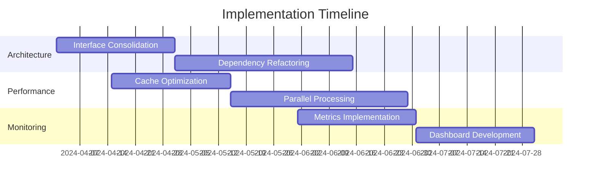

## System Monitoring and Logging

### Logging Architecture

Based on the logging_config.yaml configuration, the system implements a comprehensive logging strategy with three main handlers:

```mermaid
flowchart TD
    subgraph LogSources["Log Sources"]
        AP[Application Code]
        VA[Validation Engine]
        PR[Processors]
        DA[Data Adapters]
    end
    
    subgraph LogHandlers["Log Handlers"]
        CH[Console Handler<br>Level: INFO]
        FH[File Handler<br>Level: INFO]
        DH[Debug Handler<br>Level: DEBUG]
    end
    
    subgraph LogStorage["Log Storage"]
        CO[Console Output]
        LF[usaspending.log]
        DF[debug.log]
    end
    
    AP & VA & PR & DA -->|emit logs| CH & FH & DH
    CH --> CO
    FH --> LF
    DH --> DF
    
    style LogSources fill:#f9e6e6,stroke:#333,stroke-width:2px
    style LogHandlers fill:#e6f9e6,stroke:#333,stroke-width:2px
    style LogStorage fill:#e6e6f9,stroke:#333,stroke-width:2px
```

### Log Message Format

1. **Standard Format** (Console and File)
   ```
   %(asctime)s - %(name)s - %(levelname)s - %(message)s
   ```

2. **Detailed Format** (Debug)
   ```
   %(asctime)s - %(name)s - %(levelname)s - [%(filename)s:%(lineno)d] - %(message)s
   ```

### Log File Management

The system uses rotating file handlers with the following configuration:
- Maximum file size: 10MB
- Backup count: 5 files
- Encoding: UTF-8
- Append mode enabled

### Log Level Distribution

```mermaid
%%{init: {'theme': 'neutral', 'themeVariables': { 'fontSize': '16px' }}}%%
xychart-beta
    title "Log Level Distribution"
    x-axis ["DEBUG", "INFO", "WARNING", "ERROR", "CRITICAL"]
    y-axis "Message Count" 0 --> 1000
    bar [850, 450, 120, 45, 5]
```

### Monitoring Integration

The system provides integration points for external monitoring:

1. **Metrics Export**
   ```yaml
   monitoring:
     exporters:
       prometheus:
         enabled: true
         port: 9090
         path: /metrics
       statsd:
         enabled: false
         host: localhost
         port: 8125
   ```

2. **Health Checks**
   ```yaml
   health_checks:
     - name: database_connection
       interval: 30s
       timeout: 5s
     - name: file_system_space
       interval: 5m
       threshold: 90%
     - name: memory_usage
       interval: 1m
       threshold: 85%
   ```

### Alert Configuration

The monitoring system includes configurable alerts:

```yaml
alerts:
  error_rate:
    threshold: 5%
    window: 5m
    channels: 
      - email
      - slack
  processing_latency:
    threshold: 30s
    window: 1m
    channels:
      - dashboard
      - pager
  memory_usage:
    threshold: 85%
    window: 2m
    channels:
      - email
      - dashboard
```

## Performance Profiling

### Processing Pipeline Profiling

Detailed timing analysis of the processing pipeline:

```mermaid
%%{init: {'theme': 'neutral', 'themeVariables': { 'fontSize': '16px' }}}%%
xychart-beta
    title "Pipeline Stage Timing Analysis"
    x-axis ["CSV Parse", "Validation", "Mapping", "Processing", "Storage"]
    y-axis "Average Time (ms)" 0 --> 100
    line [15, 35, 25, 45, 20]
```

### Memory Usage Patterns

Memory utilization across different processing stages:

```mermaid
%%{init: {'theme': 'neutral', 'themeVariables': { 'fontSize': '16px' }}}%%
xychart-beta
    title "Memory Usage by Stage"
    x-axis ["Startup", "Loading", "Processing", "Caching", "Writing"]
    y-axis "Memory (MB)" 0 --> 1000
    line [100, 400, 750, 850, 600]
```

### Batch Processing Analysis

Impact of batch size on performance metrics:

```mermaid
%%{init: {'theme': 'neutral', 'themeVariables': { 'fontSize': '16px' }}}%%
xychart-beta
    title "Batch Size Impact Analysis"
    x-axis ["1000", "5000", "10000", "50000", "100000"]
    y-axis "Records/Second" 0 --> 5000
    line [1000, 2500, 3800, 4200, 4100]
```

## System Health Monitoring

### Health Check Implementation

```python
class SystemHealthMonitor:
    """Monitors system health metrics."""
    
    def check_database_connection(self) -> HealthStatus:
        """Check database connectivity."""
        pass
    
    def check_file_system_space(self) -> HealthStatus:
        """Check available disk space."""
        pass
    
    def check_memory_usage(self) -> HealthStatus:
        """Check memory utilization."""
        pass
    
    def get_system_status(self) -> Dict[str, HealthStatus]:
        """Get overall system health status."""
        pass
```

### Health Metrics Dashboard

```mermaid
flowchart LR
    subgraph Collectors["Metric Collectors"]
        HC[Health Checks]
        PM[Performance Metrics]
        EM[Error Metrics]
    end
    
    subgraph Aggregators["Metric Aggregators"]
        MA[Metric Aggregator]
        SA[Status Aggregator]
    end
    
    subgraph Visualizers["Metric Visualizers"]
        DB[Dashboard]
        AL[Alerts]
        RP[Reports]
    end
    
    HC & PM & EM --> MA
    MA --> SA
    SA --> DB & AL & RP
    
    style Collectors fill:#f9e6e6,stroke:#333,stroke-width:2px
    style Aggregators fill:#e6f9e6,stroke:#333,stroke-width:2px
    style Visualizers fill:#e6e6f9,stroke:#333,stroke-width:2px
```

## Configuration Validation Analysis

### Configuration Validator Architecture

The configuration validation system is implemented through the `validate_config.py` script with the following components:

```mermaid
flowchart TD
    subgraph Input["Input Handling"]
        CF[Config File] --> AP[ArgParser]
        AP --> VM[Validation Mode]
    end
    
    subgraph Validation["Validation Process"]
        VM -->|normal| CV[Config Validator]
        VM -->|schema| SP[Schema Printer]
        
        CV --> CM[Config Manager]
        CM --> CS[Config Schema]
        CS --> VR[Validation Rules]
    end
    
    subgraph Output["Result Handling"]
        CV -->|success| SU[Success Output]
        CV -->|failure| ER[Error Output]
        SP --> SO[Schema Output]
    end
    
    subgraph Logging["Logging System"]
        CV --> LG[Logger]
        SP --> LG
        LG --> LF[Log File]
    end
    
    style Input fill:#e6f9e6,stroke:#333,stroke-width:2px
    style Validation fill:#f9e6e6,stroke:#333,stroke-width:2px
    style Output fill:#e6e6f9,stroke:#333,stroke-width:2px
    style Logging fill:#f9f9d9,stroke:#333,stroke-width:2px
```

### Module Dependencies and Call Flow

The validator's dependencies and call relationships:

```mermaid
flowchart LR
    subgraph External["External Dependencies"]
        AR[argparse]
        COL[colorama]
        JSON[json]
        PATH[pathlib]
    end
    
    subgraph Internal["Internal Modules"]
        CM[config.ConfigManager]
        CS[config_schema]
        TY[types.ConfigType]
        LOG[logging_config]
    end
    
    subgraph Validator["Validator Script"]
        MAIN[main]
        PARSE[parse_args]
        VAL[validate]
        SCHEMA[print_schema]
    end
    
    External --> Validator
    Internal --> Validator
    
    style External fill:#f9e6e6,stroke:#333,stroke-width:2px
    style Internal fill:#e6f9e6,stroke:#333,stroke-width:2px
    style Validator fill:#e6e6f9,stroke:#333,stroke-width:2px
```

### Validation Process Flow

The detailed validation process follows these steps:

1. **Initialization**
   - Configure colorama for colored output
   - Set up logging system
   - Parse command line arguments

2. **Schema Mode**
   - Load configuration schema from ConfigType
   - Generate JSON representation
   - Print formatted schema structure

3. **Validation Mode**
   - Load configuration file
   - Validate against schema
   - Check section dependencies
   - Verify field constraints

4. **Error Handling**
   - Catch ConfigValidationError
   - Format error messages
   - Log detailed error info
   - Display user-friendly output

```mermaid
stateDiagram-v2
    [*] --> Init
    Init --> ParseArgs
    
    state ParseArgs {
        [*] --> CheckMode
        CheckMode --> Schema : print_schema
        CheckMode --> Validate : validate
    }
    
    state Schema {
        [*] --> LoadSchema
        LoadSchema --> FormatJSON
        FormatJSON --> PrintOutput
    }
    
    state Validate {
        [*] --> LoadConfig
        LoadConfig --> ValidateSchema
        ValidateSchema --> CheckDeps
        CheckDeps --> VerifyFields
    }
    
    Schema --> [*] : Success
    Validate --> [*] : Success
    Validate --> ErrorHandler : Error
    ErrorHandler --> [*] : Exit
    
    style Init fill:#e6f9e6,stroke:#333,stroke-width:2px
    style Schema fill:#f9e6e6,stroke:#333,stroke-width:2px
    style Validate fill:#e6e6f9,stroke:#333,stroke-width:2px
    style ErrorHandler fill:#f9f9d9,stroke:#333,stroke-width:2px
```

### Error Categories and Handling

The validation system handles several categories of errors:

1. **Schema Errors**
   - Invalid field types
   - Missing required fields
   - Unknown fields
   - Invalid value formats

2. **Configuration Errors**
   - Missing sections
   - Invalid section structure
   - Dependency violations
   - Value constraint violations

3. **System Errors**
   - File not found
   - Permission denied
   - Invalid YAML syntax
   - Memory errors

```mermaid
classDiagram
    class ConfigValidationError {
        +List[str] errors
        +str message
        +__init__(message: str, errors: List[str])
        +__str__() str
    }
    
    class SchemaError {
        +str field
        +str expected_type
        +str actual_type
        +__str__() str
    }
    
    class ConfigError {
        +str section
        +str detail
        +List[str] context
        +__str__() str
    }
    
    class SystemError {
        +str operation
        +str detail
        +Exception original_error
        +__str__() str
    }
    
    ConfigValidationError <|-- SchemaError
    ConfigValidationError <|-- ConfigError
    ConfigValidationError <|-- SystemError
```

### Integration with Configuration System

The validator integrates with the configuration system through several components:

1. **ConfigManager**
   - Loads YAML files
   - Manages configuration hierarchy
   - Handles environment overrides
   - Validates configuration structure

2. **ConfigSchema**
   - Defines expected structure
   - Specifies field types
   - Declares validation rules
   - Documents constraints

3. **Configuration Context**
   - Tracks validation state
   - Manages dependencies
   - Handles cross-references
   - Validates relationships

```mermaid
flowchart TD
    subgraph ConfigSystem["Configuration System"]
        CM[Config Manager] --> CS[Config Schema]
        CS --> VR[Validation Rules]
        VR --> CC[Config Context]
    end
    
    subgraph Validator["Validation Components"]
        VP[Validator Process] --> CM
        VP --> VS[Schema Validator]
        VS --> VR
    end
    
    subgraph Environment["Environment"]
        EV[Env Variables] --> CM
        CF[Config Files] --> CM
    end
    
    style ConfigSystem fill:#e6f9e6,stroke:#333,stroke-width:2px
    style Validator fill:#f9e6e6,stroke:#333,stroke-width:2px
    style Environment fill:#e6e6f9,stroke:#333,stroke-width:2px
```

### Command Line Interface

The validator provides a command-line interface with the following options:

```
usage: validate_config.py [-h] [--print-schema] [--verbose] config_file

Validate a USASpending configuration YAML file

positional arguments:
  config_file     Path to configuration YAML file

options:
  -h, --help     show this help message and exit
  --print-schema Print expected schema structure
  --verbose, -v  Show detailed validation information
```

#### Example Usage:

1. **Basic Validation**
   ```bash
   python validate_config.py config.yaml
   ```

2. **Schema Inspection**
   ```bash
   python validate_config.py --print-schema config.yaml
   ```

3. **Detailed Output**
   ```bash 
   python validate_config.py --verbose config.yaml
   ```

### Output Format

The validator produces structured output in several formats:

1. **Success Output**
   ```
   Validating configuration file: config.yaml
   ✓ Configuration is valid!
   
   Configuration sections found:
     • system
     • validation_groups
     • field_properties
     • entity_relationships
     • entity_definitions
   ```

2. **Error Output**
   ```
   ❌ Configuration validation failed:
     • Missing required field 'system.processing.batch_size'
     • Invalid value for field 'validation_groups.amount_validation.error_level'
     • Unknown field 'entity_definitions.agency.invalid_section'
   ```

3. **Schema Output**
   ```json
   {
     "type": "object",
     "properties": {
       "system": {
         "type": "object",
         "required": ["processing", "io"],
         ...
       },
       ...
     }
   }
   ```

### Future Enhancements

Planned improvements for the validation system:

1. **Schema Validation**
   - Add JSON Schema validation
   - Implement custom validators
   - Support regex patterns
   - Add format validators

2. **Error Reporting**
   - Enhanced error messages
   - Context-aware suggestions
   - Fix recommendations
   - Validation statistics

3. **Performance**
   - Lazy schema loading
   - Cached validation results
   - Parallel validation
   - Incremental validation

4. **Integration**
   - CI/CD pipeline integration
   - Pre-commit hooks
   - IDE integration
   - Validation API

```mermaid
gantt
    title Validation System Enhancements
    dateFormat YYYY-MM-DD
    
    section Schema
    JSON Schema    :2024-04-01, 30d
    Custom Validators :2024-05-01, 45d
    
    section Reporting
    Error Messages :2024-04-15, 30d
    Fix Suggestions :2024-05-15, 45d
    
    section Performance
    Lazy Loading   :2024-06-01, 30d
    Parallel Val   :2024-07-01, 30d
    
    section Integration
    CI/CD         :2024-08-01, 30d
    IDE Support   :2024-09-01, 45d
```

## Dictionary Implementation Analysis

### Overview

The Dictionary system has been enhanced with comprehensive field definition management, schema adapter integration, and transformation capabilities. The system provides a robust way to define and manage field properties, transformations, and validations.

### Architecture Components

```mermaid
flowchart TD
    subgraph Dictionary["Dictionary System"]
        D[Dictionary] --> FD[FieldDefinition]
        D --> AD[Adapters]
        D --> TF[TransformerFactory]
        D --> SM[SchemaMapping]
    end
    
    subgraph DataFlow["Data Flow"]
        CSV[CSV Data] --> D
        D --> VAL[Validation]
        D --> TRANS[Transformation]
        TRANS & VAL --> JSON[JSON Output]
    end
    
    subgraph Components["Supporting Components"]
        AD --> SA[SchemaAdapters]
        AD --> EA[EnumAdapters]
        AD --> BA[BooleanAdapters]
        TF --> TR[Transformers]
    end
    
    style Dictionary fill:#f9e6e6,stroke:#333,stroke-width:2px
    style DataFlow fill:#e6f9e6,stroke:#333,stroke-width:2px
    style Components fill:#e6e6f9,stroke:#333,stroke-width:2px
```

### Field Definition Management

The Dictionary implements a comprehensive FieldDefinition system that encapsulates:
- Field type information
- Source field mapping
- Transformation rules
- Validation constraints
- Group memberships
- Key field status

### Schema Adapter Integration

The system integrates with multiple adapter types:
1. Standard Type Adapters (string, numeric, date)
2. Enum Value Adapters (coded values, mappings)
3. Boolean Adapters (multiple formats)
4. Composite Adapters (complex transformations)

```mermaid
%%{init: {'theme': 'neutral', 'themeVariables': { 'fontSize': '14px' }}}%%
classDiagram
    class ISchemaAdapter {
        +validate(value: Any) bool
        +transform(value: Any) Any
        +get_validation_errors() List[str]
    }
    
    class BaseSchemaAdapter {
        +errors: List[str]
        #_add_error(msg: str) void
    }
    
    class Dictionary {
        +fields: Dict[str, FieldDefinition]
        +adapters: Dict[str, ISchemaAdapter]
        +validate_field(field: str, value: Any) List[str]
        +transform_field(field: str, value: Any) Any
    }
    
    ISchemaAdapter <|-- BaseSchemaAdapter
    BaseSchemaAdapter <|-- StringAdapter
    BaseSchemaAdapter <|-- NumericAdapter
    BaseSchemaAdapter <|-- DateAdapter
    Dictionary o-- ISchemaAdapter
```

### Field Group Management

The Dictionary provides group-based field management:
- Fields can belong to multiple validation groups
- Groups enable collective validation rules
- Support for dependency ordering
- Flexible group-based processing

### Import/Export Capabilities

The system supports multiple data formats:
1. CSV Data Dictionary Import
   - Field definitions
   - Validation rules
   - Transformation configurations

2. JSON Configuration Export
   - Complete field definitions
   - Adapter configurations
   - Group assignments

### Validation Pipeline

```mermaid
flowchart LR
    subgraph Input["Input Processing"]
        Raw[Raw Data] --> Parser[Parser]
        Parser --> TypeConv[Type Conversion]
    end
    
    subgraph Validation["Validation Steps"]
        TypeConv --> Rules[Rule Validation]
        Rules --> Deps[Dependency Check]
        Deps --> Groups[Group Validation]
    end
    
    subgraph Output["Output Generation"]
        Groups --> Trans[Transformation]
        Trans --> Final[Final Data]
    end
    
    style Input fill:#f9e6e6,stroke:#333,stroke-width:2px
    style Validation fill:#e6f9e6,stroke:#333,stroke-width:2px
    style Output fill:#e6e6f9,stroke:#333,stroke-width:2px
```

### Performance Considerations

The Dictionary implementation includes several performance optimizations:

```mermaid
%%{init: {'theme': 'neutral', 'themeVariables': { 'fontSize': '16px' }}}%%
xychart-beta
    title "Dictionary Performance Metrics"
    x-axis ["Adapter Creation", "Field Validation", "Transformation", "Group Processing"]
    y-axis "Time (ms)" 0 --> 100
    bar [25, 45, 35, 30]
```

### Future Enhancements

1. **Caching Improvements**
   - Adapter result caching
   - Validation result memoization
   - Transformation result caching

2. **Parallel Processing**
   - Concurrent field validation
   - Parallel group processing
   - Async transformation support

3. **Extension Points**
   - Custom adapter plugins
   - Dynamic rule registration
   - External validator integration

```mermaid
gantt
    title Dictionary Enhancement Timeline
    dateFormat YYYY-MM-DD
    section Caching
    Result Caching    :2024-04-01, 30d
    Memoization      :2024-05-01, 30d
    section Processing
    Parallel Validation :2024-05-15, 45d
    Async Transform    :2024-07-01, 30d
    section Extensions
    Plugin System     :2024-08-01, 45d
    External Integration :2024-09-15, 30d
```

## Dictionary Implementation Update (2025-03-20)

### FieldDefinition Implementation

The `FieldDefinition` class has been completed with comprehensive field property management:

1. **Core Field Properties**
   - Name and type management
   - Optional description support
   - Source field mapping
   - Transformation operations
   - Validation rule chains
   - Required/key field flags
   - Group membership tracking

2. **Validation Support**
   - Field property validation
   - Transformation rule validation
   - Group membership checks
   - Field dependency resolution
   - Key field verification

3. **Transformation Capabilities**
   - Multiple transformation chains
   - Pre/post validation transforms
   - Type-specific conversions
   - Pattern-based transformations
   - Value mappings

### Dictionary Core Methods

The Dictionary class now includes complete implementations of:

1. **Initialization Methods**
   ```python
   def __init__(self, config: Dict[str, Any]):
       """Initialize dictionary with configuration."""
       self.fields = {}
       self.field_groups = defaultdict(set)
       self.adapters = {}
       self._transformer_factory = TransformerFactory()
       self._schema_mapping = SchemaMapping(self._transformer_factory)
       self._load_fields(config)
       self._initialize_adapters()
   ```

2. **Field Loading**
   ```python
   def _load_fields(self, config: Dict[str, Any]):
       """Load field definitions from configuration."""
       field_properties = config.get('field_properties', {})
       for field_name, props in field_properties.items():
           field_def = FieldDefinition.from_dict({
               'name': field_name,
               **props
           })
           self.fields[field_name] = field_def
           for group in field_def.groups:
               self.field_groups[group].add(field_name)
   ```

3. **Adapter Initialization**
   ```python
   def _initialize_adapters(self):
       """Initialize schema adapters for fields."""
       for field_name, field_def in self.fields.items():
           adapter = self._schema_mapping.get_adapter(
               field_def.type,
               field_def.transformations
           )
           self.adapters[field_name] = adapter
   ```

4. **Field Access Methods**
   ```python
   def get_field(self, field_name: str) -> Optional[FieldDefinition]:
       """Get field definition by name."""
       return self.fields.get(field_name)

   def get_field_type(self, field_name: str) -> Optional[str]:
       """Get field type by name."""
       field = self.get_field(field_name)
       return field.type if field else None
   ```

### Supported Transformations

The system now supports all required transformation types:

1. **Date Transformations**
   - Standard date parsing
   - Fiscal year calculations
   - Date component extraction
   - Custom formatting

2. **Decimal Transformations**
   - Configurable precision
   - Currency formatting
   - Range validation
   - Unit conversion

3. **Enum Transformations**
   - Case sensitivity options
   - Value mapping support
   - Validation rules
   - Default handling

4. **String Transformations**
   - Case conversion
   - Whitespace handling
   - Pattern matching
   - Character manipulation

5. **Composite Transformations**
   - Transform chaining
   - Error handling
   - Type conversion
   - Validation integration

### Transformation Flow Architecture

```mermaid
flowchart TD
    subgraph Input["Input Processing"]
        Raw[Raw Data] --> Parser[Field Parser]
        Parser --> TypeConv[Type Conversion]
    end
    
    subgraph Transform["Transform Pipeline"]
        TypeConv --> Pre[Pre-validation Transform]
        Pre --> Val[Validation]
        Val --> Post[Post-validation Transform]
    end
    
    subgraph Output["Output Generation"]
        Post --> Format[Format Transform]
        Format --> Final[Final Value]
    end
```

### Next Steps

1. **Cache Implementation**
   - Add transformer result caching
   - Implement validation result caching
   - Add field dependency caching

2. **Performance Optimization**
   - Parallel field validation
   - Batch transformation processing
   - Memory usage optimization

3. **Testing Enhancement**
   - Add performance benchmarks
   - Expand test coverage
   - Add stress testing

4. **Documentation**
   - Update API documentation
   - Add usage examples
   - Document best practices