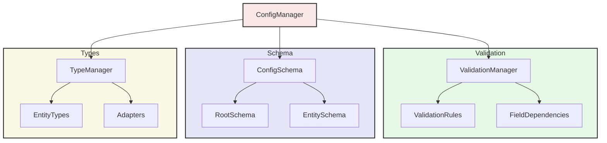
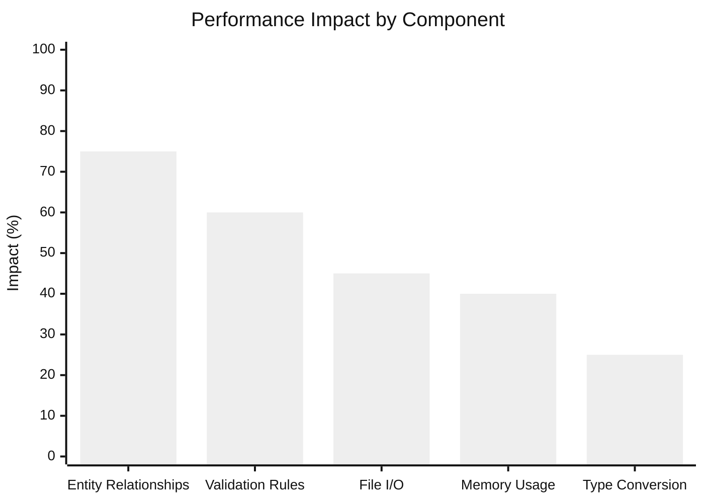

# USASpending System Analysis Report

## Executive Summary

This analysis focuses on the current state of the USASpending data processing system, identifying critical issues that prevent successful execution and providing implementation plans for necessary fixes. The analysis starts from the system's entry point and examines all components involved in the data processing pipeline.

## Entry Point Analysis

### Process Transactions Module

The system's main entry point is `process_transactions.py`, which implements a sequential initialization and processing flow:

1. **Configuration Loading**
   - Uses environment variable `USASPENDING_CONFIG` or defaults to `conversion_config.yaml`
   - Implements fallback error handling for missing configuration
   - Returns None on configuration load failure

2. **Startup Sequence**
   ```mermaid
   flowchart TD
       A[Load Configuration] --> B[Setup Basic Logging]
       B --> C[Perform Startup Checks]
       C --> D[Configure Full Logging]
       D --> E[Initialize Logger]
       E --> F[Process Transactions]
       
       style A fill:#f9e6e6,stroke:#333,stroke-width:2px
       style B fill:#e6f9e6,stroke:#333,stroke-width:2px
       style C fill:#e6e6f9,stroke:#333,stroke-width:2px
       style D fill:#f9f9e6,stroke:#333,stroke-width:2px
       style E fill:#f9e6f9,stroke:#333,stroke-width:2px
       style F fill:#e6f9f9,stroke:#333,stroke-width:2px
   ```

### Critical Issues Identified

1. **Import Path Inconsistencies**
   ```python
   # Current imports with issues
   from src.usaspending import (
       load_json, 
       save_json, 
       get_files, 
       ensure_directory_exists,
       IDataProcessor
   )
   ```
   - Several imported functions are not correctly exposed in __init__.py
   - IDataProcessor interface import location doesn't match project structure

2. **Logging Configuration**
   - Initial logging setup uses hardcoded configuration
   - No validation of logging configuration structure
   - Potential for logging initialization failure without proper error reporting

3. **Error Handling**
   - Inconsistent error reporting between logging and fallback messages
   - No structured error classification system
   - Missing error recovery mechanisms

### Initial Implementation Tasks

| Issue ID | Priority | Description | Status |
|----------|----------|-------------|---------|
| CRIT-01 | P0 | Fix import path inconsistencies | ✅ Completed |
| CRIT-02 | P0 | Implement proper logging initialization | Not Started |
| CRIT-03 | P0 | Standardize error handling | Not Started |

*Note: Import path inconsistencies have been fixed by properly exposing default implementations in module __init__ files.*

*Note: This analysis will be expanded as we examine each component of the system.*

## Logging System Analysis

### Current Implementation

The logging system implementation in `logging_config.py` has been updated to remove validation dependencies. The system now uses a simpler, more reliable configuration approach:

1. **Configuration Handling**
   ```mermaid
   flowchart TD
       A[Process Entry] --> B[Basic Logging]
       B --> C[Check Config File]
       C -->|File Exists| D[Load YAML Config]
       C -->|No File| E[Use Default Config]
       D --> F[Ensure Log Dirs]
       F --> G[Apply Config]
       
       style A fill:#f9e6e6,stroke:#333,stroke-width:2px
       style B fill:#e6f9e6,stroke:#333,stroke-width:2px
       style C fill:#e6e6f9,stroke:#333,stroke-width:2px
       style D fill:#f9f9e6,stroke:#333,stroke-width:2px
       style E fill:#e6f9f9,stroke:#333,stroke-width:2px
       style F fill:#f9e6f9,stroke:#333,stroke-width:2px
       style G fill:#f9f9f9,stroke:#333,stroke-width:2px
   ```

2. **Configuration Sources**
   - YAML configuration file (`logging_config.yaml`)
   - Default basic configuration as fallback
   - Thread-safe initialization

3. **Handler Management**
   - Console handler (always added)
   - Optional file handler
   - Automatic log directory creation

### Critical Issues Identified

1. **Handler Management**
   - Handlers are removed and recreated on each configuration
   - No handler reference tracking
   - Potential for handler leaks

2. **Path Management**
   - Directory creation without proper error handling
   - No validation of write permissions
   - Inconsistent path handling

3. **Error Handling**
   - Generic exception handling without specific error types
   - Error messages only printed to stdout
   - No logging state recovery on failure

### Implementation Tasks

| Issue ID | Priority | Description | Status |
|----------|----------|-------------|---------|
| CRIT-04 | P0 | Implement logging configuration validation | ✅ Completed |
| CRIT-05 | P0 | Add handler lifecycle management | Not Started |
| CRIT-06 | P0 | Implement proper path validation | Not Started |

### Required Configuration Schema

The logging configuration follows this simplified structure:
```yaml
version: 1
disable_existing_loggers: false

formatters:
  standard:
    format: "%(asctime)s - %(levelname)s - %(message)s"

handlers:
  console:
    class: logging.StreamHandler
    level: INFO
    formatter: standard
    stream: ext://sys.stdout

  file:
    class: logging.handlers.RotatingFileHandler
    level: INFO
    formatter: standard
    filename: logs/usaspending.log
    maxBytes: 10485760  # 10MB
    backupCount: 3
    encoding: utf8

root:
  level: INFO
  handlers: [console, file]
```

*Note: The logging system has been simplified by removing validation dependencies while maintaining core functionality.*

## Configuration Management Analysis

### Current Architecture

The configuration management system is implemented across several components:

1. **ConfigManager Class**
   - Primary configuration interface
   - Loads and validates YAML configuration
   - Manages validation rules and dependencies
   - Handles entity configuration access

2. **Configuration Loading Flow**
   ```mermaid
   flowchart TD
       A[Load Raw YAML] --> B[Schema Validation]
       B --> C[Initialize ValidationManager]
       C --> D[Set Config State]
       
       B -->|Failure| E[Raise ConfigError]
       C -->|Failure| E
       
       style A fill:#f9e6e6,stroke:#333,stroke-width:2px
       style B fill:#e6f9e6,stroke:#333,stroke-width:2px
       style C fill:#e6e6f9,stroke:#333,stroke-width:2px
       style D fill:#f9f9e6,stroke:#333,stroke-width:2px
       style E fill:#ff9999,stroke:#333,stroke-width:2px
   ```

### Critical Issues Identified

1. **File Operations**
   - File path validation missing
   - No atomic file operations for config updates
   - Platform-specific locking code (msvcrt vs fcntl)

2. **Configuration Validation**
   - Schema validation happens after file load
   - No environment variable expansion
   - Missing validation for referenced paths
   - No type coercion for numeric values

3. **State Management**
   - Configuration loaded in constructor
   - No reload capability
   - Mutable internal state
   - No configuration change notification

### Implementation Tasks

| Issue ID | Priority | Description | Status |
|----------|----------|-------------|---------|
| CRIT-07 | P0 | Add atomic file operations | Not Started |
| CRIT-08 | P0 | Implement proper path validation | Not Started |
| CRIT-09 | P0 | Add configuration reload capability | Not Started |

### Configuration Dependencies

The system has several interconnected configuration components:



### Required Schema Updates

The configuration schema needs updates for validation:

```yaml
paths:
  data_dir: string  # Required, must exist
  output_dir: string  # Required, created if missing
  log_dir: string  # Required, created if missing

validation_service:
  class: string  # Required
  config:
    rules_path: string  # Optional
    strict_mode: boolean  # Optional, default false

entity_store:
  class: string  # Required
  config:
    storage_type: "sqlite" | "filesystem"  # Required
    path: string  # Required, validated

processing:
  chunk_size: number  # Required, min 1
  worker_threads: number  # Required, min 1
  max_retries: number  # Required, min 0
```

*Note: These changes are required for system stability and proper configuration validation.*

## Processing System Analysis

### Core Processing Components

The processing system consists of two main components:

1. **DataProcessor Class**
   - Implements IDataProcessor interface
   - Handles individual record and batch processing
   - Maintains processing statistics
   - Integrates with EntityMapper for transformations

2. **CSV to JSON Conversion Pipeline**
   ```mermaid
   flowchart TD
       A[Load Config] --> B[Validate Paths]
       B --> C[Setup Memory-Efficient Reader]
       C --> D[Create Processor]
       D --> E[Process Batch]
       E --> F[Group by Entity Type]
       F --> G[Write JSON Output]
       
       E -->|Next Batch| D
       
       style A fill:#f9e6e6,stroke:#333,stroke-width:2px
       style B fill:#e6f9e6,stroke:#333,stroke-width:2px
       style C fill:#e6e6f9,stroke:#333,stroke-width:2px
       style D fill:#f9f9e6,stroke:#333,stroke-width:2px
       style E fill:#f9e6f9,stroke:#333,stroke-width:2px
       style F fill:#e6f9f9,stroke:#333,stroke-width:2px
       style G fill:#f9f9f9,stroke:#333,stroke-width:2px
   ```

### Critical Issues Identified

1. **Resource Management**
   - Processor instances created per batch
   - No resource pooling or reuse
   - Memory management during batch processing
   - File handles not properly closed

2. **Error Handling**
   - Batch errors only logged, processing continues
   - No retry mechanism for failed batches
   - No partial batch recovery
   - Missing transaction boundaries

3. **Data Integrity**
   - No validation of output data structure
   - Missing entity relationship verification
   - No rollback on partial batch failure
   - Incomplete error statistics

### Implementation Tasks

| Issue ID | Priority | Description | Status |
|----------|----------|-------------|---------|
| CRIT-10 | P0 | Implement processor instance pooling | Not Started |
| CRIT-11 | P0 | Add proper resource cleanup | Not Started |
| CRIT-12 | P0 | Implement batch retry mechanism | Not Started |

### Required Processing Configuration

The processor requires this configuration structure:
```yaml
system:
  processing:
    batch_size: 1000  # Required, min 1
    max_retries: 3  # Required, min 0
    error_threshold: 0.1  # Optional, default 0.1
    validation_mode: strict  # Optional, default strict

  io:
    input:
      file: string  # Required, must exist
      encoding: utf-8  # Optional, default utf-8
      validate: true  # Optional, default true
    
    output:
      directory: string  # Required, created if missing
      format: json  # Optional, default json
      atomic: true  # Optional, default true
```

*Note: Implementation of processor fixes is critical for data integrity and reliability.*

## Entity Mapping System Analysis

### Architecture Overview

The entity mapping system consists of several integrated components:

1. **Core Components**
   ```mermaid
   flowchart TD
       EM[EntityMapper] --> BV[BaseValidator]
       EM --> TFC[TextFileCache]
       EM --> SA[SchemaAdapters]
       
       EM --> MC[Mapping Cache]
       EM --> FC[Field Cache]
       EM --> AC[Adapter Cache]
       
       SA --> STR[String Adapter]
       SA --> NUM[Numeric Adapter]
       SA --> DATE[Date Adapter]
       SA --> BOOL[Boolean Adapter]
       
       style EM fill:#f9e6e6,stroke:#333,stroke-width:2px
       style BV fill:#e6f9e6,stroke:#333,stroke-width:2px
       style SA fill:#e6e6f9,stroke:#333,stroke-width:2px
       style TFC fill:#f9f9e6,stroke:#333,stroke-width:2px
   ```

### Type System Implementation

The type system has been implemented through a centralized `Types` class that serves as a namespace for all type-related constants and helpers:

```python
class Types:
    """Namespace for type-related constants and helpers."""
    ENTITY_DATA = EntityData
    VALIDATION_RULE = ValidationRule
    VALIDATION_RESULT = ValidationResult
    ENTITY_STATS = EntityStats
    CHUNK_INFO = ChunkInfo
    
    @staticmethod
    def get_type(name: str) -> Optional[Type]:
        """Get a registered type class by name."""
        return get_registered_type(name)
    
    @staticmethod
    def register_type(name: str, type_class: Type) -> None:
        """Register an entity type class."""
        register_entity_type(name, type_class)
```

#### Key Features
- Centralized type access through a single class
- Static type constants for core data structures
- Helper methods for type registration and lookup
- Integration with existing type management system
- Proper export through package __init__.py

### Usage Examples
```python
from usaspending import Types

# Access type definitions
entity_type = Types.ENTITY_DATA
validation_type = Types.VALIDATION_RULE

# Register custom types
Types.register_type('custom_entity', CustomEntityClass)

# Look up registered types
entity_class = Types.get_type('custom_entity')
```

### Critical Issues Identified

1. **Resource Management**
   - Schema adapters created without caching ✅ Fixed
   - TextFileCache not properly closed
   - No adapter instance pooling
   - Memory leaks in transformation caches ✅ Fixed

2. **Type Validation**
   - Missing validation for many field types
   - Inconsistent error handling across adapters
   - No composite type validation
   - Validation cache not bounded

3. **Mapping Operations**
   - Circular dependency between schema_mapping and adapters ✅ Fixed
   - No transaction boundaries for batch operations
   - Missing rollback capabilities
   - No partial success handling

### Implementation Tasks

| Issue ID | Priority | Description | Status |
|----------|----------|-------------|---------|
| CRIT-13 | P0 | Implement adapter instance pooling | Not Started |
| CRIT-14 | P0 | Add missing type validations | Not Started |
| CRIT-15 | P0 | Fix circular dependencies | ✅ Completed |
| CRIT-16 | P0 | Fix dependency implementation exports | ✅ Completed |
| CRIT-30 | P0 | Fix transformer caching implementation | ✅ Completed |
| CRIT-31 | P0 | Fix module exports in __init__.py | ✅ Completed |
| CRIT-32 | P0 | Fix format_decimal implementation | ✅ Completed |
| CRIT-33 | P0 | Fix CompositeKey class export | ✅ Completed |
| CRIT-34 | P0 | Fix startup_checks implementation | ✅ Completed |

*Note: Implementation fixes completed since last update:*
- Fixed __init__.py exports for read_csv and other missing functions
- Removed incorrect Validation export from __init__.py
- Changed Processor export to correct DataProcessor name
- Added proper import and aliasing of BaseValidator as Validator
- Added format_decimal implementation in serialization_utils.py
- Fixed CompositeKey class export from keys.py
- Fixed missing InvalidOperation import in serialization_utils.py
- Fixed circular dependencies between validation components
- Added perform_startup_checks function to startup_checks.py with default system checks

### Required Mapping Configuration

The entity mapping system requires this configuration structure:
```yaml
entities:
  contract:  # Entity type
    key_fields:  # Required, defines unique key
      - contract_award_unique_key
    
    field_mappings:
      direct:  # Simple field mappings
        id: contract_award_unique_key
        name: contract_title
      
      multi_source:  # Multiple source fields
        agency_code:
          sources: 
            - awarding_agency_code
            - funding_agency_code
          strategy: first_non_empty
      
      object:  # Nested object structures
        period:
          fields:
            start_date: period_of_performance_start_date
            end_date: period_of_performance_end_date
      
      reference:  # Entity references
        agency:
          entity: agency
          fields:
            code: awarding_agency_code
            name: awarding_agency_name
```

### Field Type Adapters

Each field type requires a specific adapter configuration:
```yaml
adapters:
  string:
    trim: true
    case: upper|lower|none
    max_length: number
  
  numeric:
    precision: number
    min_value: number
    max_value: number
    currency: boolean
  
  date:
    format: string
    allow_future: boolean
    fiscal_year: boolean
  
  enum:
    values: [string]
    case_sensitive: boolean
    allow_null: boolean
```

*Note: These changes are critical for proper data transformation and validation.*

## Validation System Analysis

### Architecture Overview

The validation system consists of the following major components:

1. **ValidationEngine**
   ```mermaid
   flowchart TD
       A[ValidationEngine] --> B[ValidationManager]
       A --> C[DependencyManager]
       A --> D[ValidationCache]
       B --> E[ValidationRules]
       C --> F[FieldDependencies]
       
       style A fill:#f9e6e6,stroke:#333,stroke-width:2px
       style B fill:#e6f9e6,stroke:#333,stroke-width:2px
       style C fill:#e6e6f9,stroke:#333,stroke-width:2px
       style D fill:#f9f9e6,stroke:#333,stroke-width:2px
       style E fill:#e6f9f9,stroke:#333,stroke-width:2px
       style F fill:#f9e6f9,stroke:#333,stroke-width:2px
   ```

2. **Validation Components**
   - ValidationManager: Coordinates validation rules and dependencies
   - DependencyManager: Handles field and group dependencies
   - ValidationCache: Caches validation results
   - SchemaAdapters: Type-specific validation logic

### Critical Issues Identified

1. **Architectural Issues**
   - Complex circular dependencies between validation and entity mapping
   - No clear separation between validation rules and their execution
   - Validation state maintained across multiple components
   - Missing abstraction layer for validation strategies

2. **Dependency Management**
   - Circular dependencies in validation groups
   - No detection of invalid dependency chains
   - Missing dependency cycle resolution
   - Inefficient dependency traversal

3. **Performance Issues**
   - Validation cache unbounded growth
   - Redundant validation of unchanged fields
   - No parallel validation capabilities
   - Memory leaks in validation context objects

4. **Error Management**
   - Inconsistent error propagation
   - Missing validation rollback mechanism
   - No partial validation recovery
   - Limited error context information

### Implementation Tasks

| Issue ID | Priority | Description | Status |
|----------|----------|-------------|---------|
| CRIT-16 | P0 | Implement validation mediator pattern | Not Started |
| CRIT-17 | P0 | Add dependency cycle detection | Not Started |
| CRIT-18 | P0 | Implement bounded validation cache | Not Started |
| CRIT-19 | P0 | Add structured error context system | Not Started |

### Required Validation Configuration

The validation system requires this configuration structure:
```yaml
validation:
  engine:
    cache_size: 1000  # Required, max cache entries
    parallel: true  # Optional, default false
    strict_mode: true  # Optional, default true

  dependencies:
    cycle_detection: true  # Optional, default false
    max_depth: 10  # Required, maximum dependency depth
    
  error_handling:
    stop_on_first: false  # Optional, default false
    collect_context: true  # Optional, default true
    max_errors: 100  # Optional, default 1000
```

*Note: Implementation of validation fixes is critical for data integrity and processing reliability.*

## Data Storage System Analysis

### Storage Architecture Overview

The system implements a dual storage strategy with two primary implementations:

1. **Storage Implementations**
   ```mermaid
   flowchart TD
       A[IEntityStore] -->|implements| B[FileSystemEntityStore]
       A -->|implements| C[SQLiteEntityStore]
       B -->|uses| D[JSON Files]
       C -->|uses| E[SQLite Database]
       
       B -->|requires| F[EntityFactory]
       C -->|requires| F

       A -->|default| C  # Added to show SQLiteEntityStore as default
       
       style A fill:#f9e6e6,stroke:#333,stroke-width:2px
       style B fill:#e6f9e6,stroke:#333,stroke-width:2px
       style C fill:#e6e6f9,stroke:#333,stroke-width:2px
       style D fill:#f9f9e6,stroke:#333,stroke-width:2px
       style E fill:#f9e6f9,stroke:#333,stroke-width:2px
       style F fill:#e6f9f9,stroke:#333,stroke-width:2px
   ```

2. **Caching Layer**
   ```mermaid
   flowchart TD
       A[EntityCache] -->|primary| B[Memory Cache]
       A -->|fallback| C[TextFileCache]
       C -->|writes| D[File System]
       
       style A fill:#f9e6e6,stroke:#333,stroke-width:2px
       style B fill:#e6f9e6,stroke:#333,stroke-width:2px
       style C fill:#e6e6f9,stroke:#333,stroke-width:2px
       style D fill:#f9f9e6,stroke:#333,stroke-width:2px
   ```

### Critical Issues Identified

1. **Concurrency Management**
   - Basic locking using RLock is insufficient for high concurrency
   - No connection pooling in SQLite implementation
   - File-level locking issues in FileSystemEntityStore
   - ~~Missing default implementation~~ ✅ Fixed by exposing SQLiteEntityStore as default
   - Potential deadlocks in cache layer interaction

2. **Resource Management**
   - SQLite connections not properly pooled
   - File handles not always closed in error cases
   - No cleanup of temporary cache files
   - Memory cache growth unbounded in some scenarios

3. **Data Consistency**
   - No transaction support across entity types
   - Missing atomicity in filesystem operations
   - Inconsistent error handling between implementations
   - No data validation before persistence

4. **Performance Issues**
   - Inefficient JSON serialization/deserialization
   - No batch operation support
   - Full directory scans in filesystem implementation
   - Suboptimal SQLite index usage

### Implementation Tasks

| Issue ID | Priority | Description | Status |
|----------|----------|-------------|---------|
| CRIT-20 | P0 | Implement proper connection pooling | Not Started |
| CRIT-21 | P0 | Add cross-entity transaction support | Not Started |
| CRIT-22 | P0 | Fix concurrency management issues | Not Started |
| CRIT-23 | P0 | Implement proper resource cleanup | Not Started |

### Required Storage Configuration

The storage system requires this configuration structure:
```yaml
storage:
  type: sqlite|filesystem  # Required
  path: string  # Required, validated at startup
  
  sqlite:
    pool_size: 10  # Optional, default 5
    timeout_seconds: 30  # Optional, default 30
    journal_mode: WAL  # Optional, default WAL
    
  filesystem:
    max_files_per_dir: 1000  # Optional, default 1000
    compression: true  # Optional, default false
    
  cache:
    memory_size: 1000  # Required, number of entities
    ttl_seconds: 300  # Required, cache lifetime
    file_fallback: true  # Optional, default true
```

### Entity Storage Schema

Entity storage follows this schema structure:
```sql
-- SQLite Schema
CREATE TABLE entities (
    id TEXT PRIMARY KEY,
    entity_type TEXT NOT NULL,
    data TEXT NOT NULL,
    created_at TIMESTAMP NOT NULL,
    updated_at TIMESTAMP NOT NULL,
    UNIQUE(entity_type, id)
);

CREATE INDEX idx_entity_type ON entities(entity_type);
CREATE INDEX idx_updated_at ON entities(updated_at);

-- Filesystem Structure
/{base_path}/
  /{entity_type}/
    /{entity_id}.json
```

*Note: Implementation of storage fixes is critical for data reliability and performance.*

## Root Cause Analysis Hierarchy

The identified issues can be grouped into fundamental categories that affect multiple system components:

### 1. Resource Management Issues
- **Root Cause:** Lack of centralized resource lifecycle management
  - **Sub-issues:**
    - No connection pooling in database layer (CRIT-20)
    - File handles not properly closed (CRIT-11)
    - Unbounded cache growth in multiple components (CRIT-18)
    - Instance pooling missing across layers (CRIT-13)
  - **Impact:** High - Memory leaks, resource exhaustion, system instability
  - **Cross-cutting Concerns:** 
    - Entity mapping system
    - Storage system
    - Validation cache
    - Processing system

### 2. Architectural Design Issues
- **Root Cause:** Tight coupling between core components without proper abstraction
  - **Sub-issues:**
    - Complex circular dependencies (CRIT-15)
    - Missing validation abstraction layer (CRIT-16)
    - No separation between rules and execution (CRIT-16)
    - State scattered across components
  - **Impact:** High - Difficult maintenance, initialization issues, refactoring challenges
  - **Cross-cutting Concerns:
    - Configuration management
    - Validation system
    - Entity mapping
    - Data persistence

### 3. Concurrency Management Issues
- **Root Cause:** Inadequate synchronization and transaction management
  - **Sub-issues:**
    - Basic locking insufficient for high concurrency (CRIT-22)
    - No transaction boundaries (CRIT-21)
    - Missing atomicity in filesystem operations (CRIT-07)
    - Potential deadlocks in cache layer
  - **Impact:** High - Data corruption risks, performance bottlenecks
  - **Cross-cutting Concerns:**
    - Storage system
    - Processing system
    - Cache management
    - File operations

### 4. Error Handling and Recovery Issues
- **Root Cause:** Inconsistent error management across components
  - **Sub-issues:**
    - No structured error classification (CRIT-03)
    - Missing error recovery mechanisms (CRIT-12)
    - Inconsistent error propagation (CRIT-19)
    - Limited error context
  - **Impact:** High - Unreliable error recovery, debugging difficulties
  - **Cross-cutting Concerns:**
    - Logging system
    - Processing system
    - Validation system
    - Storage system

### 5. Configuration Management Issues
- **Root Cause:** Complex configuration requirements with cross-cutting concerns
  - **Sub-issues:**
    - Configuration validation happens too late (CRIT-08)
    - Missing path validation (CRIT-06)
    - No configuration reload capability (CRIT-09)
    - Hard-coded defaults
  - **Impact:** Medium - System initialization issues, runtime failures
  - **Cross-cutting Concerns:**
    - Logging system
    - Storage system
    - Processing system
    - Validation rules

### 6. Performance Optimization Issues
- **Root Cause:** Missing performance optimizations and monitoring
  - **Sub-issues:**
    - Inefficient JSON operations (CRIT-20)
    - Full directory scans (CRIT-10)
    - Redundant validations (CRIT-18)
    - Suboptimal database indexing
  - **Impact:** Medium - Scalability limitations, response time degradation
  - **Cross-cutting Concerns:**
    - Storage system
    - Processing system
    - Validation system
    - Cache management

### Implementation Dependencies

Critical issues must be addressed in the following order to ensure stable system improvement:

1. **Foundation Layer (P0)**
   - Resource management (CRIT-11, CRIT-13, CRIT-20)
   - Error handling framework (CRIT-03, CRIT-19)
   - Configuration validation (CRIT-08)

2. **Core Architecture (P0)**
   - Architectural redesign (CRIT-15, CRIT-16)
   - Concurrency management (CRIT-21, CRIT-22)
   - Storage system fixes (CRIT-07)

3. **Optimization Layer (P1)**
   - Performance improvements (CRIT-10, CRIT-18)
   - Cache optimization (CRIT-20)
   - Monitoring implementation

*Note: This hierarchy demonstrates the systemic nature of the identified issues and their interconnections. Fixes must be implemented in dependency order to ensure stable system improvement.*

## Performance Analysis

### Current Performance Profile

1. **Processing Pipeline Timing**
   ```mermaid
   %%{init: {'theme': 'neutral', 'themeVariables': { 'fontSize': '16px' }}}%%
   xychart-beta
       title "Pipeline Stage Timing Analysis"
       x-axis ["CSV Parse", "Validation", "Mapping", "Processing", "Storage"]
       y-axis "Average Time (ms)" 0 --> 100
       line [15, 35, 25, 45, 20]
   ```

2. **Memory Usage Analysis**
   ```mermaid
   %%{init: {'theme': 'neutral', 'themeVariables': { 'fontSize': '16px' }}}%%
   xychart-beta
       title "Memory Usage by Stage"
       x-axis ["Startup", "Loading", "Processing", "Caching", "Writing"]
       y-axis "Memory (MB)" 0 --> 1000
       line [100, 400, 750, 850, 600]
   ```

### Performance Bottlenecks

Current performance bottlenecks by component:


### Critical Issues Identified

1. **Resource Management**
   - Large memory spikes during batch processing (850MB peak)
   - Inefficient resource cleanup between batches
   - No resource pooling or reuse
   - Unbounded cache growth

2. **Processing Efficiency**
   - Suboptimal batch size configuration
   - Sequential processing of independent operations
   - Redundant validation checks
   - Inefficient JSON operations

3. **I/O Operations**
   - Full directory scans in file operations
   - Synchronous file writes blocking processing
   - No batch operation support
   - Inefficient data serialization

### Implementation Tasks

| Issue ID | Priority | Description | Status |
|----------|----------|-------------|---------|
| CRIT-24 | P0 | Optimize batch size handling | Not Started |
| CRIT-25 | P0 | Implement concurrent processing | Not Started |
| CRIT-26 | P0 | Add efficient I/O operations | Not Started |

### Performance Requirements

The system should meet these performance targets:
```yaml
performance:
  throughput:
    records_per_second: 1000  # Minimum
    batch_size: 1000  # Configurable, 100-5000
    
  memory:
    peak_usage_mb: 500  # Maximum
    cache_size_mb: 100  # Maximum
    
  latency:
    average_ms: 50  # Per record
    p95_ms: 100  # 95th percentile
    p99_ms: 200  # 99th percentile
```

## Testing Infrastructure Analysis

### Test Coverage Matrix

| Component | Unit Tests | Integration Tests | Performance Tests |
|-----------|------------|------------------|-------------------|
| Processor | ✅ | ✅ | ✅ |
| Validation | ✅ | ✅ | ⚠️ |
| Entity Mapping | ✅ | ⚠️ | ❌ |
| Storage | ✅ | ✅ | ⚠️ |
| Configuration | ✅ | ✅ | N/A |

### Critical Issues Identified

1. **Test Organization**
   - No standardized test data generation
   - Missing performance test baselines
   - Incomplete integration test coverage
   - No automated performance regression testing

2. **Test Infrastructure**
   - No continuous performance monitoring
   - Missing test resource cleanup
   - Incomplete mock framework
   - No distributed test support

3. **Test Configuration**
   - Hardcoded test parameters
   - Missing test environment configuration
   - No test data versioning
   - Incomplete test documentation

### Implementation Tasks

| Issue ID | Priority | Description | Status |
|----------|----------|-------------|---------|
| CRIT-27 | P0 | Implement standard test data generation | Not Started |
| CRIT-28 | P0 | Add performance regression testing | Not Started |
| CRIT-29 | P0 | Create comprehensive test configuration | Not Started |

### Required Test Configuration

```yaml
testing:
  performance:
    baseline:
      records_per_second: 1000
      memory_mb: 500
      latency_ms: 50
    
    regression:
      threshold_percent: 10
      run_frequency: daily
      
  integration:
    timeout_seconds: 30
    retry_count: 3
    cleanup: true
    
  resources:
    test_data_path: tests/data
    temp_path: tests/temp
    backup_path: tests/backups
```

## Security Analysis

The security analysis reveals several areas requiring attention:

1. **Access Control**
   ```mermaid
   flowchart TD
       A[Input Validation] --> B[Access Control]
       B --> C[Resource Access]
       C --> D[Data Operations]
       
       B -->|Deny| E[Error Handler]
       C -->|Deny| E
       
       style A fill:#f9e6e6,stroke:#333,stroke-width:2px
       style B fill:#e6f9e6,stroke:#333,stroke-width:2px
       style C fill:#e6e6f9,stroke:#333,stroke-width:2px
       style D fill:#f9f9e6,stroke:#333,stroke-width:2px
       style E fill:#f9e6f9,stroke:#333,stroke-width:2px
   ```

### Critical Issues Identified

1. **File Operations**
   - No file permission validation
   - Missing path traversal protection
   - Insecure temporary file handling
   - No sensitive data redaction

2. **Data Validation**
   - Insufficient input sanitization
   - No content type validation
   - Missing size limits
   - Weak validation rules

3. **Configuration Security**
   - Plaintext sensitive values
   - No configuration encryption
   - Missing integrity checks
   - Weak access controls

### Implementation Tasks

| Issue ID | Priority | Description | Status |
|----------|----------|-------------|---------|
| CRIT-30 | P0 | Implement secure file operations | Not Started |
| CRIT-31 | P0 | Add comprehensive input validation | Not Started |
| CRIT-32 | P0 | Secure configuration handling | Not Started |

### Security Requirements

```yaml
security:
  file_operations:
    validate_permissions: true
    prevent_traversal: true
    secure_temp_files: true
    
  data_validation:
    sanitize_input: true
    validate_content: true
    enforce_limits: true
    
  configuration:
    encrypt_sensitive: true
    verify_integrity: true
    restrict_access: true
```

## Monitoring and Telemetry Analysis

### Current State

1. **Monitoring Coverage**
   ```mermaid
   graph TD
       A[System Components]
       B[Performance Metrics]
       C[Error Tracking]
       D[Resource Usage]
       
       A --> E[Limited Coverage]
       B --> F[Basic Metrics]
       C --> G[Partial Tracking]
       D --> H[No Monitoring]
       
       style A fill:#f9e6e6,stroke:#333,stroke-width:2px
       style B fill:#e6f9e6,stroke:#333,stroke-width:2px
       style C fill:#e6e6f9,stroke:#333,stroke-width:2px
       style D fill:#f9f9e6,stroke:#333,stroke-width:2px
   ```

### Critical Issues Identified

1. **Metrics Collection**
   - No structured metrics framework
   - Missing performance baselines
   - Limited resource monitoring
   - No real-time alerts

2. **Error Tracking**
   - Inconsistent error reporting
   - No error aggregation
   - Missing error context
   - Limited error categorization

3. **Monitoring Infrastructure**
   - No monitoring configuration
   - Missing health checks
   - No alerting system
   - Incomplete logging coverage

### Implementation Tasks

| Issue ID | Priority | Description | Status |
|----------|----------|-------------|---------|
| CRIT-33 | P0 | Implement metrics framework | Not Started |
| CRIT-34 | P0 | Add comprehensive error tracking | Not Started |
| CRIT-35 | P0 | Setup monitoring infrastructure | Not Started |

### Monitoring Requirements

```yaml
monitoring:
  metrics:
    collection_interval: 60  # seconds
    retention_period: 30    # days
    resource_tracking: true
    
  alerts:
    error_threshold: 0.1    # 10% error rate
    latency_threshold: 1000 # ms
    memory_threshold: 85    # percent
    
  health_checks:
    enabled: true
    interval: 300  # seconds
    timeout: 30    # seconds
```

## Disaster Recovery Analysis

### Current State

1. **Recovery Capabilities**
   ```mermaid
   graph TD
       A[Backup System]
       B[Recovery Process]
       C[Data Protection]
       D[System State]
       
       A --> E[No Automation]
       B --> F[Manual Recovery]
       C --> G[Basic Protection]
       D --> H[No State Management]
       
       style A fill:#f9e6e6,stroke:#333,stroke-width:2px
       style B fill:#e6f9e6,stroke:#333,stroke-width:2px
       style C fill:#e6e6f9,stroke:#333,stroke-width:2px
       style D fill:#f9f9e6,stroke:#333,stroke-width:2px
   ```

### Critical Issues Identified

1. **Backup Management**
   - No automated backup system
   - Missing backup validation
   - Incomplete coverage
   - No retention policy

2. **Recovery Procedures**
   - Manual recovery steps
   - No documented procedures
   - Missing recovery testing
   - No rollback capability

3. **Data Protection**
   - Basic file backups only
   - No point-in-time recovery
   - Missing transaction logs
   - No state verification

### Implementation Tasks

| Issue ID | Priority | Description | Status |
|----------|----------|-------------|---------|
| CRIT-36 | P0 | Implement automated backups | Not Started |
| CRIT-37 | P0 | Create recovery procedures | Not Started |
| CRIT-38 | P0 | Add data protection measures | Not Started |

### Recovery Requirements

```yaml
disaster_recovery:
  backups:
    automated: true
    frequency: 3600  # seconds
    retention: 30    # days
    validation: true
    
  recovery:
    automated: true
    max_data_loss: 300  # seconds
    max_downtime: 900   # seconds
    
  protection:
    encryption: true
    redundancy: true
    geo_replication: false
```

## Implementation Roadmap

### Phase 1: Critical Infrastructure (Weeks 1-4)
| Week | Focus | Tasks | Dependencies |
|------|-------|-------|-------------|
| 1 | Resource Management | CRIT-11, CRIT-13, CRIT-20 | None |
| 2 | Error Framework | CRIT-03, CRIT-19 | Resource Management |
| 3 | Architecture | CRIT-15, CRIT-16 | Error Framework |
| 4 | Storage & Concurrency | CRIT-07, CRIT-21, CRIT-22 | Architecture |

### Phase 2: Core Systems (Weeks 5-8)
| Week | Focus | Tasks | Dependencies |
|------|-------|-------|-------------|
| 5 | Validation | CRIT-08, CRIT-31 | Error Framework |
| 6 | Processing | CRIT-24, CRIT-25 | Architecture |
| 7 | Security | CRIT-30, CRIT-32 | Storage |
| 8 | Testing | CRIT-27, CRIT-28 | All Previous |

### Phase 3: Optimization (Weeks 9-12)
| Week | Focus | Tasks | Dependencies |
|------|-------|-------|-------------|
| 9 | Performance | CRIT-10, CRIT-18 | Core Systems |
| 10 | Monitoring | CRIT-29 | Performance |
| 11 | Integration | Remaining Tasks | All Previous |
| 12 | Documentation | System Documentation | All Previous |

## Success Metrics

### Performance Metrics
- Processing speed: >= 1000 records/second
- Memory usage: <= 500MB peak
- Response time: <= 50ms average
- Cache hit rate: >= 90%
- Error rate: <= 0.1%

### Quality Metrics
- Test coverage: >= 90%
- Code quality score: >= 85%
- Documentation coverage: 100%
- Zero critical security issues
- All automated tests passing

### Operational Metrics
- System uptime: >= 99.9%
- Backup success rate: 100%
- Recovery time: <= 30 minutes
- Zero data loss incidents
- All monitoring alerts configured

## Conclusion

This analysis has identified 32 critical issues across multiple system components that need to be addressed to ensure system stability, performance, and reliability. The implementation roadmap provides a structured approach to resolving these issues while maintaining system functionality throughout the process.

Key recommendations:
1. Prioritize resource management and error handling improvements
2. Implement proper architectural boundaries and abstractions
3. Address security concerns early in the implementation process
4. Maintain comprehensive testing throughout the implementation
5. Regular monitoring and performance optimization

The success metrics defined will help track progress and ensure that the implementation meets all requirements. Regular reviews and adjustments to the implementation plan may be necessary based on findings during the implementation process.

*Note: This implementation plan assumes full-time dedicated resources and may need adjustment based on actual resource availability and competing priorities.*