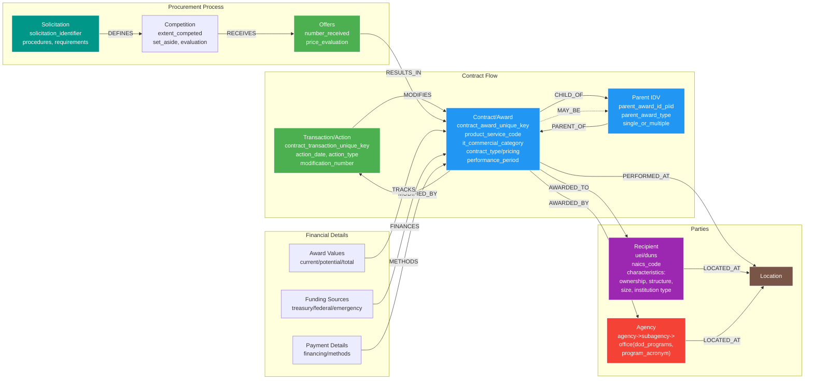

# USA Spending Entity Relationships

## Key Identifiers & References
- **Transaction Keys**: contract_transaction_unique_key
- **Award Keys**: contract_award_unique_key, award_id_piid
- **Parent Keys**: parent_award_id_piid, referenced_idv_piid
- **Agency Keys**: awarding_agency_code, funding_agency_code
- **Recipient Keys**: recipient_uei, recipient_duns, cage_code
- **Other IDs**: solicitation_identifier, transaction_number

## Complete Field Categories

### Identification & References
- **Transaction**: contract_transaction_unique_key, transaction_number
- **Contract**: contract_award_unique_key, award_id_piid, award_or_idv_flag
- **Parent**: parent_award_id_piid, parent_award_agency_id, parent_award_modification_number
- **Dates**: initial_report_date, last_modified_date, solicitation_date

### Financial Data
- **Base Values**: federal_action_obligation, total_dollars_obligated
- **Current Values**: current_total_value_of_award, base_exercised_options_value
- **Potential Values**: potential_total_value_of_award, base_and_all_options_value
- **Supplemental**: disaster_emergency_fund_codes, COVID-19_supplementals, IIJA_supplemental
- **Outlay**: total_outlayed_amount, outlayed_amount_from_COVID-19, outlayed_from_IIJA

### Procurement Details
- **Competition**: extent_competed_code, solicitation_procedures_code, number_of_offers_received
- **Set Aside**: type_of_set_aside_code, local_area_set_aside_code
- **Evaluation**: evaluated_preference_code, price_evaluation_adjustment
- **Process**: fair_opportunity_limited_sources, other_than_full_and_open_competition

### Contract Characteristics
- **Type Info**: award_type_code, idv_type_code, type_of_idc_code
- **Pricing**: type_of_contract_pricing_code, cost_or_pricing_data_code
- **Terms**: multi_year_contract_code, consolidated_contract_code
- **Standards**: construction_wage_rate_requirements_code, labor_standards_code

### Location Data (Shared Structure)
- **Basic**: city_name, state_code, country_code
- **Detailed**: county_name, congressional_district
- **Address**: address_line_1, address_line_2, zip_4_code
- **Foreign**: foreign_location, country_name
- **FIPS Codes**: county_fips, state_fips
- **Additional**: foreign_funding, foreign_funding_description

### Core Transaction/Action Fields
- **Identifiers**: contract_transaction_unique_key
- **Action Info**: action_date, action_type, modification_number, fiscal_year
- **Financial**: federal_action_obligation
- **Description**: transaction_description

### Contract/Award Value Fields
- **Current Values**: total_dollars_obligated, base_exercised_options_value, current_total_value_of_award
- **Potential Values**: base_and_all_options_value, potential_total_value_of_award
- **Supplemental Funding**: disaster_emergency_fund_codes, COVID-19_supplementals, IIJA_supplemental

### Performance Periods
- **Standard Periods**: period_of_performance_start_date, period_of_performance_current_end_date
- **Extended Periods**: period_of_performance_potential_end_date, ordering_period_end_date

### Agency Information
- **Awarding**: awarding_agency_code/name, awarding_sub_agency_code/name, awarding_office_code/name
- **Funding**: funding_agency_code/name, funding_sub_agency_code/name, funding_office_code/name
- **Accounts**: treasury_accounts, federal_accounts, object_classes, program_activities

### Procurement Process
- **Solicitation**:
  - **Identifiers**: solicitation_identifier
  - **Process**: 
    - solicitation_procedures_code/description
    - extent_competed_code/description
    - fair_opportunity_limited_sources_code/description
    - other_than_full_and_open_competition_code/description
  - **Requirements**:
    - consolidated_contract_code/description
    - multi_year_contract_code/description
    - performance_based_service_acquisition_code/description
- **Competition**:
  - **Set Aside**: type_of_set_aside_code/description
  - **Evaluation**: 
    - evaluated_preference_code/description
    - price_evaluation_adjustment_preference_percent_difference
  - **Results**: number_of_offers_received
- **Offers**:
  - **Basic**: offeror_uei, offer_date
  - **Status**: selected, award_date

### Recipient Details
- **Primary Info**: recipient_uei, recipient_name, recipient_doing_business_as_name, cage_code
- **Industry**: naics_code, naics_description
- **Parent Info**: recipient_parent_uei, recipient_parent_name
- **Location**: recipient_address_line_1/2, recipient_city_name, recipient_state_code
- **Contact**: recipient_phone_number, recipient_fax_number
- **Officers**: highly_compensated_officer_[1-5]_name/amount
- **Business Characteristics**:
  - **Ownership**: 
    - Native American: alaskan_native_corporation_owned_firm, american_indian_owned_business, indian_tribe_federally_recognized, native_hawaiian_organization_owned_firm, tribally_owned_firm
    - Veteran: veteran_owned_business, service_disabled_veteran_owned_business
    - Women: woman_owned_business, women_owned_small_business, economically_disadvantaged_women_owned_small_business, joint_venture_women_owned_small_business
    - Minority: minority_owned_business, subcontinent_asian_asian_indian_american_owned_business, asian_pacific_american_owned_business, black_american_owned_business, hispanic_american_owned_business, native_american_owned_business
  - **Structure**: corporate_entity_not_tax_exempt, corporate_entity_tax_exempt, partnership_or_limited_liability_partnership, sole_proprietorship, subchapter_scorporation, limited_liability_corporation, small_agricultural_cooperative, international_organization, foreign_owned
  - **Government**: us_federal_government, us_state_government, us_local_government, us_tribal_government, foreign_government
  - **Institution**: educational_institution, foundation, hospital_flag, manufacturer_of_goods, private_university_or_college, state_controlled_institution_of_higher_learning
  - **Size/Status**: small_disadvantaged_business, emerging_small_business, c8a_program_participant, historically_underutilized_business_zone_hubzone_firm
  - **Special Programs**: receives_contracts, receives_financial_assistance, the_ability_one_program
