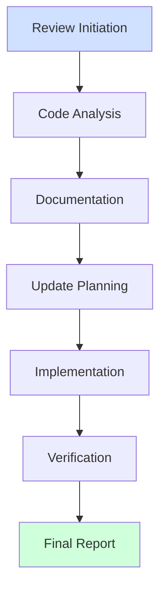
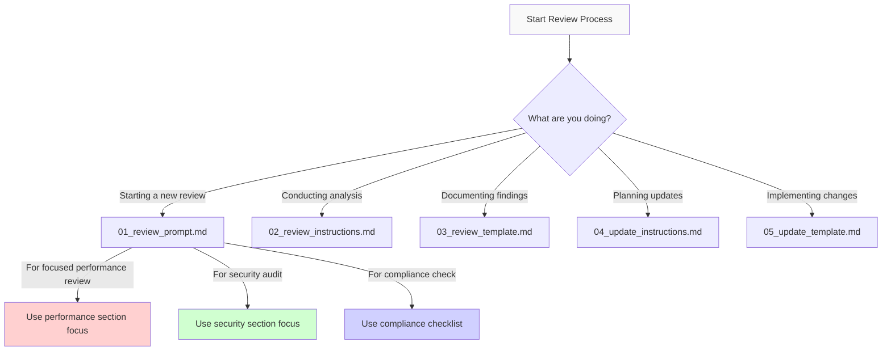

# USASpending Code Review System

## Overview

This system provides a comprehensive framework for conducting and documenting code reviews, tracking improvements, and maintaining a history of changes. It implements industry-standard methodologies and complies with key ISO standards:

1. [Kepner-Tregoe Problem Analysis](https://www.kepner-tregoe.com/problem-solving-decision-making/) for systematic problem identification and resolution
2. Six Thinking Hats method by Edward de Bono for comprehensive perspective analysis
3. [DMAIC (Define, Measure, Analyze, Improve, Control)](https://asq.org/quality-resources/dmaic) from Six Sigma for process improvement
4. [PDCA (Plan, Do, Check, Act)](https://asq.org/quality-resources/pdca-cycle) cycle for continuous improvement

This integration follows guidelines from:
- [ISO/IEC 20246:2017](https://www.iso.org/standard/67531.html) - Software and systems engineering — Work product reviews
- [ISO/IEC 20000-1:2018](https://www.iso.org/standard/70636.html) - IT Service Management System requirements
- [ISO/IEC 27001:2022](https://www.iso.org/standard/27001) - Information Security Management Systems
- [CMMI Development v2.0](https://cmmiinstitute.com/) - Verification and Validation processes
- [IEEE 1028-2008](https://standards.ieee.org/ieee/1028/4606/) - Software Reviews and Audits

## Review Process Flow

The following diagram illustrates how the templates and processes connect in the review lifecycle:



### Process Stages

1. **Review Initiation**: Define scope and objectives using `01_review_prompt.md`
2. **Code Analysis**: Analyze code using approaches in `02_review_instructions.md`
3. **Documentation**: Record findings using `03_review_template.md`
4. **Update Planning**: Plan changes using `04_update_instructions.md`
5. **Implementation**: Implement changes using patterns in `05_update_template.md`
6. **Verification**: Verify changes address identified issues
7. **Final Report**: Compile final documentation of changes and improvements

## File Structure

```
docs/templates/
├── 00_introduction.md         # This file - System overview and guidance
├── 01_review_prompt.md        # Initial AI prompt for code reviews
├── 02_review_instructions.md  # Detailed instructions for review process
├── 03_review_template.md      # Template for review documentation
├── 04_update_instructions.md  # Instructions for tracking changes
└── 05_update_template.md      # Template for update documentation
```

## Template Selection Guide

Use this decision tree to select the appropriate template for your current task:



### Review Type Focus Areas

| Review Type | Key Templates | Special Considerations |
|-------------|---------------|------------------------|
| Performance | 02, 03, 05    | Focus on bottlenecks, resource usage, and processing time |
| Security    | 02, 03, 05    | Focus on input validation, authentication, and data protection |
| Compliance  | 01, 03, 04    | Focus on standard requirements and documentation |
| Architecture| 02, 03        | Focus on component relationships and dependencies |
| Full System | All templates | Use comprehensive analysis with all templates |

## USASpending-Specific Components

When reviewing USASpending code, pay special attention to these common components:

- Entity processing pipelines
- Data validation systems
- Configuration management
- API interaction patterns
- Authentication mechanisms
- Reporting subsystems

## Example Scenarios

### Scenario 1: New Feature Review
A team has implemented a new data processing pipeline and needs a thorough review:

1. Use [`01_review_prompt.md`](#starting-a-new-review) to initiate review
2. AI follows [`02_review_instructions.md`](#conducting-the-review) for analysis
3. Results documented using [`03_review_template.md`](#review-documentation)
4. Changes tracked with [`04_update_instructions.md`](#implementing-changes) and [`05_update_template.md`](#update-documentation)

### Scenario 2: Performance Optimization
Team needs to improve system performance:

1. Use structured prompts to analyze performance bottlenecks
2. Follow Six Thinking Hats to consider all aspects
3. Document findings and recommendations
4. Track improvements with metrics

### Scenario 3: Security Review
Conducting a security-focused code review:

1. Use specialized security prompts
2. Apply risk analysis frameworks
3. Document vulnerabilities
4. Track remediation

### Real-World Example

The following review demonstrates effective use of this template system:

- **Review**: [Runtime Performance Review (March 2025)](docs/reports/runtime_review_20250314_1500.md)
- **Key Findings**: Identified memory leaks in entity processing and inefficient data transformation patterns
- **Implementation**: Refactored critical components with 40% performance improvement

#### Example Documentation

```markdown
## Critical Issues

### [CRIT-01] Memory Leak in EntityProcessor

**Location**: `src/processors/EntityProcessor.cs`

**Analysis**: The processor isn't properly disposing database connections when processing multiple entities in batch mode.

**Impact**: Memory usage increases by approximately 2MB per 1000 entities processed.

**Recommendation**: Implement using pattern with explicit disposal:

```csharp
using (var connection = new DatabaseConnection())
{
    // Process entities
}
```
```

## Usage Guide

### Starting a New Review {#starting-a-new-review}
1. Read this introduction to understand the system
2. Copy the prompt from [`01_review_prompt.md`](./01_review_prompt.md)
3. Customize the project area and target files
4. Submit to your AI assistant
5. Review generates in `docs/reports` using [`03_review_template.md`](./03_review_template.md)

> [!TIP]
> The prompt structure follows Kepner-Tregoe's systematic approach to problem analysis.

### Conducting the Review {#conducting-the-review}
1. AI follows [`02_review_instructions.md`](./02_review_instructions.md)
2. Uses Six Thinking Hats methodology:
   - White Hat: Facts and data
   - Red Hat: Intuition and feelings
   - Black Hat: Risks and problems
   - Yellow Hat: Benefits and value
   - Green Hat: Creative solutions
   - Blue Hat: Process management

3. Documents findings using DMAIC framework:
   - Define: Scope and objectives
   - Measure: Metrics and data
   - Analyze: Root causes
   - Improve: Solutions
   - Control: Sustainability

4. Prioritizes issues and creates action plan

### Implementing Changes {#implementing-changes}
1. Follow PDCA cycle from [`04_update_instructions.md`](./04_update_instructions.md):
   - Plan: Design changes
   - Do: Implement solutions
   - Check: Verify results
   - Act: Standardize improvements

2. Document changes using [`05_update_template.md`](./05_update_template.md)
3. Add updates to original review file
4. Track metrics and progress

### Quality Gates {#quality-gates}
Based on [CISQ Quality Standard](https://www.it-cisq.org/standards/):
1. Code changes verified
2. Tests passing
3. Documentation updated
4. Performance validated
5. Review approved

### Security and Service Considerations
1. Data Classification
   - Identify sensitive data
   - Document data flows
   - Verify protection methods
   - Check compliance requirements

2. Service Impact
   - Assess availability effects
   - Review performance impacts
   - Check scalability
   - Verify SLA compliance

3. Risk Assessment
   - Security vulnerabilities
   - Service disruptions
   - Data protection
   - Compliance issues

## Methodology Integration

### Kepner-Tregoe Analysis
Used in [`01_review_prompt.md`](./01_review_prompt.md) for:
- Situation Analysis
- Problem Analysis
- Decision Analysis
- Potential Problem Analysis

### Six Thinking Hats
Implemented in [`02_review_instructions.md`](./02_review_instructions.md) for:
- Comprehensive analysis
- Multiple perspectives
- Balanced evaluation
- Solution generation

### DMAIC Framework
Structures [`03_review_template.md`](./03_review_template.md) with:
- Clear phase progression
- Metric-based decisions
- Root cause analysis
- Solution validation

### PDCA Cycle
Guides updates through [`04_update_instructions.md`](./04_update_instructions.md) and [`05_update_template.md`](./05_update_template.md) with:
- Iterative improvement
- Continuous learning
- Process refinement
- Quality assurance

## Compliance Requirements

### ISO/IEC 20000 Alignment
The review process supports IT Service Management by:
1. Change Management
   - Risk assessment of changes
   - Impact analysis documentation
   - Rollback planning
   - Service continuity checks

2. Problem Management
   - Root cause analysis
   - Systematic problem resolution
   - Knowledge base updates
   - Prevention measures

3. Release Management
   - Implementation planning
   - Testing requirements
   - Deployment verification
   - Service level monitoring

### ISO/IEC 27001 Integration
Security considerations are embedded throughout:
1. Access Control
   - Code access patterns
   - Authentication methods
   - Authorization flows
   - Privilege management

2. Cryptography
   - Encryption methods
   - Key management
   - Secure communications
   - Data protection

3. Operations Security
   - Error handling
   - Logging practices
   - Monitoring points
   - Incident response

4. System Security
   - Input validation
   - Output encoding
   - Session management
   - Configuration security

## Best Practices

### For Reviewers
Based on [SEI's Code Review Guidelines](https://resources.sei.cmu.edu/library/):
1. Follow the structured approach
2. Document thoroughly
3. Use provided templates
4. Track metrics consistently
5. Validate changes

### For AI Agents
Following [NIST AI Risk Management Framework](https://www.nist.gov/itl/ai-risk-management-framework):
1. Follow instruction templates exactly
2. Provide specific examples
3. Include visual documentation
4. Reference file locations precisely
5. Track all changes

### For Project Managers
Aligned with [PMI PMBOK Guide](https://www.pmi.org/pmbok-guide-standards):
1. Monitor progress metrics
2. Review quality gates
3. Track completion status
4. Ensure documentation
5. Verify improvements

### For Security Reviews
Following ISO/IEC 27001:2022:
1. Apply security-by-design principles
2. Check OWASP Top 10 compliance
3. Validate access controls
4. Verify data protection
5. Review incident handling

### For Service Management
Following ISO/IEC 20000-1:2018:
1. Document service impacts
2. Plan for continuity
3. Monitor performance
4. Manage changes
5. Track incidents

### Scope Definition Best Practices
1. **Clear Boundaries**
   - Good: "Review entity processing pipeline memory usage"
   - Avoid: "Make code better" or "Review the entire codebase"

2. **Detailed Issue Documentation**
   - Include specific file paths and line numbers
   - Provide measurable impact indicators
   - Include code examples for both problems and solutions

3. **Analysis Integration**
   - Combine technical, business, and user perspectives
   - Cross-reference related issues
   - Highlight dependencies between components

4. **Effective Prioritization**
   - Assign clear priority levels (Critical, Important, Minor)
   - Consider both impact and implementation complexity
   - Document dependencies between issues

## Changelog

### Version 1.0.4 (2025-03-18)
- Added review process flow diagram
- Created template selection guide
- Added best practices for scope definition
- Enhanced real-world examples section
- Added USASpending-specific component guidance

### Version 1.0.3 (2025-03-17)
- Added automatic source review identification for updates
- Improved file naming consistency requirements
- Updated update process to prevent file overwrites
- Enhanced template cross-referencing

### Version 1.0.2 (2025-03-16)
- Added ISO/IEC 20000 compliance requirements
- Integrated ISO/IEC 27001 security controls
- Enhanced service management aspects
- Added security review guidelines

### Version 1.0.1 (2025-03-15)
- Added authoritative sources and references
- Included example scenarios
- Added cross-references between sections
- Enhanced methodology explanations

### Version 1.0.0 (2025-03-14)
- Initial release of structured template system
- Added 00_introduction.md
- Implemented 01_review_prompt.md with Kepner-Tregoe framework
- Created 02_review_instructions.md with Six Thinking Hats methodology
- Developed 03_review_template.md using DMAIC framework
- Added 04_update_instructions.md with PDCA cycle
- Created 05_update_template.md for progress tracking

## Support and Maintenance

### Template Updates
Following [ISO/IEC/IEEE 12207:2017](https://www.iso.org/standard/63712.html):
- Regular quarterly reviews
- Methodology updates
- Best practices refinement
- User feedback incorporation

### Documentation
Based on [IEEE 1063-2001](https://standards.ieee.org/ieee/1063/3054/):
- Keep changelog current
- Update examples
- Refresh best practices
- Add clarifications

## Getting Help

### Common Issues
1. Review scope too broad
   - Focus on related components
   - Limit to 2-5 files per review
   - Use clear boundaries

2. Insufficient context
   - Review system documentation
   - Understand component relationships
   - Analyze dependencies

3. Tracking difficulties
   - Use provided templates
   - Follow update process
   - Maintain metrics

### Resources
- Project documentation
- [CISQ Quality Measures](https://www.it-cisq.org/standards/)
- [OWASP Code Review Guide](https://owasp.org/www-project-code-review-guide/)
- [Google Engineering Practices](https://google.github.io/eng-practices/)

## Contributing

### Improving Templates
1. Identify enhancement opportunities
2. Propose changes
3. Test modifications
4. Update documentation

### Feedback Process
Following [ISO 9001:2015](https://www.iso.org/standard/62085.html):
1. Use issues for tracking
2. Provide specific examples
3. Suggest improvements
4. Share success stories

### Lessons Learned
- Start with clear scope boundaries before beginning review
- Focus analysis on highest-impact areas first
- Document as you go rather than at the end
- Include concrete code examples for each significant finding
- Verify that proposed solutions address root causes, not just symptoms