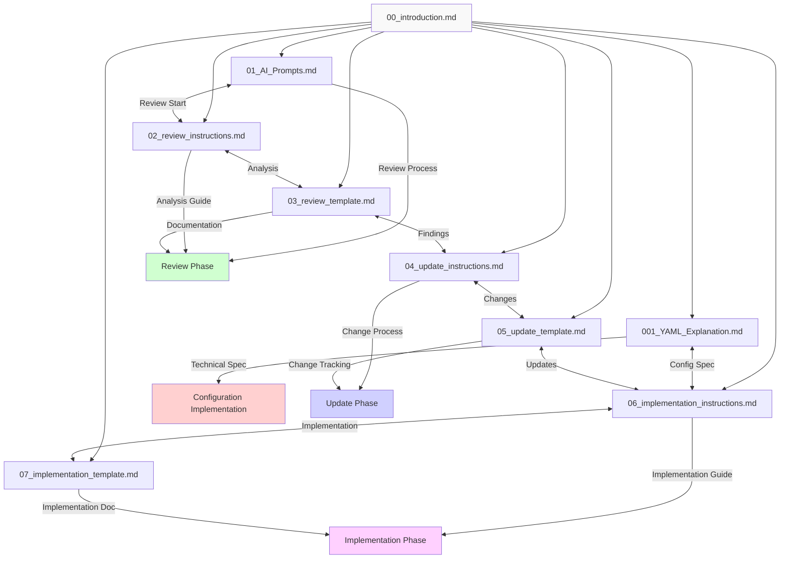
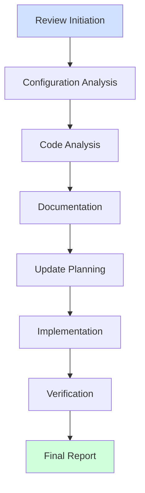
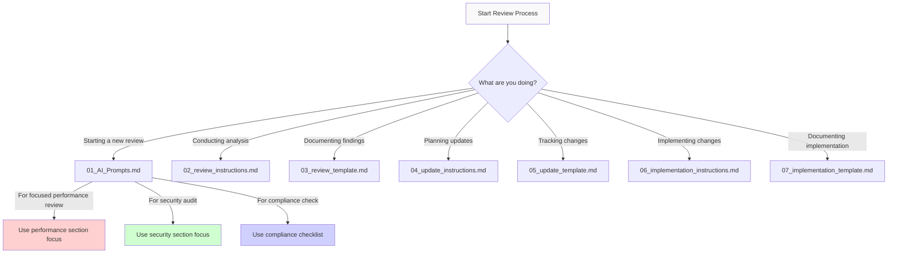

# Code Review System

## Overview

This system provides a comprehensive framework for conducting and documenting code reviews, tracking improvements, and maintaining a history of changes. It implements industry-standard methodologies and complies with key ISO standards.

## Template Organization



### Template Purposes

1. **System Foundation**
   - `00_introduction.md`: Overall system guidance and navigation
   - `001_YAML_Explanation.md`: Technical specification for YAML configuration

2. **Review Process**
   - `01_AI_Prompts.md`: Structured prompts for reviews with cross-references and comprehensive system review template
   - `02_review_instructions.md`: Detailed analysis methodology and root cause analysis framework
   - `03_review_template.md`: Comprehensive review documentation with issue tracking

3. **Change Management**
   - `04_update_instructions.md`: Guide for implementing changes with validation requirements
   - `05_update_template.md`: Change documentation and implementation tracking

4. **Implementation**
   - `06_implementation_instructions.md`: Implementation methodology with patterns and examples
   - `07_implementation_template.md`: Implementation verification and resolution tracking

## Configuration-First Principles

### Configuration as Source of Truth
The system follows configuration-driven development principles where YAML configuration files serve as the source of truth for:

1. System Settings
   - Global processing parameters
   - I/O configurations
   - Error handling strategies
   - Logging behaviors

2. Business Rules
   - Data validation rules
   - Transformation logic
   - Processing workflows
   - Integration patterns

### Configuration Hierarchy
1. System Configuration
   - Base system behavior
   - Infrastructure settings
   - Global parameters

2. Business Rules
   - Data validations
   - Transformations
   - Workflow definitions

3. Code Implementation
   - Configuration interpreters
   - Infrastructure code
   - Processing engines

### When to Update Configuration vs Code

| Change Type | Update Configuration | Update Code |
|------------|---------------------|-------------|
| Business Rules | ✅ | ❌ |
| Validation Logic | ✅ | ❌ |
| Data Transforms | ✅ | ❌ |
| Infrastructure | ❌ | ✅ |
| Performance | ❌ | ✅ |
| Security | ❌ | ✅ |

## Conducting the Review

### Review Preparation

1. **Scope Definition**
   - Identify components for review
   - Select appropriate templates
   - Gather baseline metrics
   - Review configuration coverage

2. **Context Collection**
   - Review configuration files
   - Examine component relationships
   - Check integration points
   - Map data flows

3. **Analysis Planning**
   - Choose analysis methods
   - Define success criteria
   - Plan validation approach
   - Set up monitoring

### Review Process Flow



### Analysis Methodology

1. **Configuration Review**
   - Schema completeness
   - Rule coverage
   - Relationship definitions
   - Validation patterns

2. **Code Review**
   - Implementation patterns
   - Resource management
   - Error handling
   - Performance characteristics

3. **Integration Review**
   - Component interactions
   - Resource sharing
   - Error propagation
   - Data flow patterns

### Documentation Requirements

1. **Review Documentation**
   - Use `03_review_template.md`
   - Include configuration analysis
   - Document root causes
   - Provide evidence

2. **Update Planning**
   - Follow `04_update_instructions.md`
   - Plan configuration changes
   - Define code updates
   - Set success criteria

3. **Implementation**
   - Use `06_implementation_instructions.md`
   - Document with `07_implementation_template.md`
   - Validate changes
   - Verify improvements

## File Structure

```
docs/templates/
├── 00_introduction.md         # This file - System overview and guidance
├── 001_YAML_Explanation.md    # Technical specification for YAML configuration
├── 01_AI_Prompts.md          # Initial AI prompt for code reviews
├── 02_review_instructions.md  # Detailed instructions for review process
├── 03_review_template.md      # Template for review documentation
├── 04_update_instructions.md  # Instructions for tracking changes
├── 05_update_template.md      # Template for update documentation
├── 06_implementation_instructions.md  # Implementation process guide
└── 07_implementation_template.md      # Implementation documentation template
```

## Template Selection Guide

Use this decision tree to select the appropriate template for your current task:



### Review Type Decision Matrix

| Focus Area | Primary Template | Supporting Templates | Key Sections to Use |
|------------|-----------------|---------------------|-------------------|
| Full System | 03_review_template.md | All templates | Comprehensive System Review section |
| Functional | 03_review_template.md | 02_review_instructions.md | Functional Analysis, Correctness Verification |
| Configuration | 03_review_template.md | 001_YAML_Explanation.md, 02_review_instructions.md | Configuration Analysis, Schema Validation |
| Performance | 03_review_template.md | 02_review_instructions.md | Performance Metrics, Resource Utilization |
| Security | 03_review_template.md | 02_review_instructions.md | Security Analysis, Risk Assessment |
| Architecture | 03_review_template.md | 02_review_instructions.md | System Context, Component Interactions |
| Implementation | 07_implementation_template.md | 06_implementation_instructions.md | Configuration Changes, Code Changes |

### Review Type Focus Areas

| Review Type | Key Templates | Special Considerations |
|-------------|---------------|------------------------|
| Functional | 02, 03, 05 | Focus on correctness, error handling, data flow, and import dependencies |
| Performance | 02, 03, 05 | Focus on bottlenecks, resource usage, and processing time |
| Security | 02, 03, 05 | Focus on input validation, authentication, and data protection |
| Compliance | 01, 03, 04 | Focus on standard requirements and documentation |
| Architecture | 02, 03 | Focus on component relationships and dependencies |
| Full System | All templates | Use comprehensive analysis with all templates |

### Component Review Focus Areas

When reviewing specific components, focus on these key aspects:

1. **Performance Metrics**
   - Processing throughput
   - Memory utilization patterns 
   - Cache efficiency metrics
   - Error rates and types
   - Component coupling metrics

2. **Resource Management**
   - Memory growth patterns
   - Connection pooling efficiency
   - Resource cleanup verification
   - Cache eviction strategies
   - Thread pool utilization

3. **Component Health**
   - Error rates and patterns
   - Recovery success metrics
   - Resource utilization trends
   - Cache hit rates
   - Response time distributions

4. **Integration Points**
   - Cross-component dependencies
   - Interface contracts
   - Error propagation paths
   - Resource sharing patterns
   - Data flow efficiency

### Review Type Focus Areas

| Review Type | Key Templates | Special Considerations |
|-------------|---------------|------------------------|
| Performance | 02, 03, 05    | Focus on bottlenecks, resource usage, and processing time |
| Security    | 02, 03, 05    | Focus on input validation, authentication, and data protection |
| Compliance  | 01, 03, 04    | Focus on standard requirements and documentation |
| Architecture| 02, 03        | Focus on component relationships and dependencies |
| Full System | All templates | Use comprehensive analysis with all templates |

## USASpending-Specific Components

When reviewing USASpending code, pay special attention to these common components:

- Entity processing pipelines
- Data validation systems
- Configuration management
- API interaction patterns
- Authentication mechanisms
- Reporting subsystems

## Example Scenarios

### Scenario 1: New Feature Review
A team has implemented a new data processing pipeline and needs a thorough review:

1. Use `01_AI_Prompts.md` to initiate review
2. Follow `02_review_instructions.md` for analysis
3. Document findings in `03_review_template.md`
4. Plan changes with `04_update_instructions.md`
5. Track updates in `05_update_template.md`
6. Follow `06_implementation_instructions.md` for implementation
7. Document implementation in `07_implementation_template.md`

### Scenario 2: Performance Optimization
Team needs to improve system performance:

1. Use structured prompts to analyze performance bottlenecks
2. Follow Six Thinking Hats to consider all aspects
3. Document findings and recommendations
4. Track improvements with metrics

### Scenario 3: Security Review
Conducting a security-focused code review:

1. Use specialized security prompts
2. Apply risk analysis frameworks
3. Document vulnerabilities
4. Track remediation

### Real-World Example

The following review demonstrates effective use of this template system:

- **Review**: [Runtime Performance Review (March 2025)](docs/reports/runtime_review_20250314_1500.md)
- **Key Findings**: Identified memory leaks in entity processing and inefficient data transformation patterns
- **Implementation**: Refactored critical components with 40% performance improvement

#### Example Documentation

```markdown
## Critical Issues

### [CRIT-01] Memory Leak in EntityProcessor

**Location**: `src/processors/EntityProcessor.cs`

**Analysis**: The processor isn't properly disposing database connections when processing multiple entities in batch mode.

**Impact**: Memory usage increases by approximately 2MB per 1000 entities processed.

**Recommendation**: Implement using pattern with explicit disposal:

```csharp
using (var connection = new DatabaseConnection())
{
    // Process entities
}
```
```

## Usage Guide

### Starting a New Review {#starting-a-new-review}
1. Read this introduction to understand the system
2. Copy the prompt from `01_AI_Prompts.md`
3. Customize the project area and target files
4. Submit to your AI assistant
5. Follow `02_review_instructions.md` for analysis methodology
6. Document review in `03_review_template.md`
7. Plan updates using `04_update_instructions.md` and `05_update_template.md`
8. Implement changes following `06_implementation_instructions.md`
9. Document implementation using `07_implementation_template.md`

### Conducting the Review {#conducting-the-review}
### Security and Service Considerations
1. Data Classification
   - Identify sensitive data
   - Document data flows
   - Verify protection methods
   - Check compliance requirements

2. Service Impact
   - Assess availability effects
   - Review performance impacts
   - Check scalability
   - Verify SLA compliance

3. Risk Assessment
   - Security vulnerabilities
   - Service disruptions
   - Data protection
   - Compliance issues

## Methodology Integration

### Kepner-Tregoe Analysis
Used in `01_AI_Prompts.md` for:
- Situation Analysis
- Problem Analysis
- Decision Analysis
- Potential Problem Analysis

### Six Thinking Hats
Implemented in `02_review_instructions.md` for:
- Comprehensive analysis
- Multiple perspectives
- Balanced evaluation
- Solution generation

### DMAIC Framework
Structures `03_review_template.md` with:
- Clear phase progression
- Metric-based decisions
- Root cause analysis
- Solution validation

### PDCA Cycle
Guides implementation through `06_implementation_instructions.md` and `07_implementation_template.md` with:
- Configuration-first approach
- Systematic validation
- Metrics-driven verification
- Continuous improvement

### SOLID Principles
Applied in `06_implementation_instructions.md` for:
- Configuration separation
- Interface design
- Class responsibilities
- Component coupling

## Changelog

### Version 1.0.0 (2025-03-06)
- Initial release of structured template system

## Support and Maintenance

### Template Updates
Following [ISO/IEC/IEEE 12207:2017](https://www.iso.org/standard/63712.html):
- Regular quarterly reviews
- Methodology updates
- Best practices refinement
- User feedback incorporation

### Documentation
Based on [IEEE 1063-2001](https://standards.ieee.org/ieee/1063/3054/):
- Keep changelog current
- Update examples
- Refresh best practices
- Add clarifications

## Getting Help

### Common Issues
1. Review scope too broad
   - Focus on related components
   - Limit to 2-5 files per review
   - Use clear boundaries

2. Insufficient context
   - Review system documentation
   - Understand component relationships
   - Analyze dependencies

3. Tracking difficulties
   - Use provided templates
   - Follow update process
   - Maintain metrics

### Resources
- Project documentation
- [CISQ Quality Measures](https://www.it-cisq.org/standards/)
- [OWASP Code Review Guide](https://owasp.org/www-project-code-review-guide/)
- [Google Engineering Practices](https://google.github.io/eng-practices/)

## Contributing

### Improving Templates
1. Identify enhancement opportunities
2. Propose changes
3. Test modifications
4. Update documentation

### Feedback Process
Following [ISO 9001:2015](https://www.iso.org/standard/62085.html):
1. Use issues for tracking
2. Provide specific examples
3. Suggest improvements
4. Share success stories

### Lessons Learned
- Start with clear scope boundaries before beginning review
- Focus analysis on highest-impact areas first
- Document as you go rather than at the end
- Include concrete code examples for each significant finding
- Verify that proposed solutions address root causes, not just symptoms