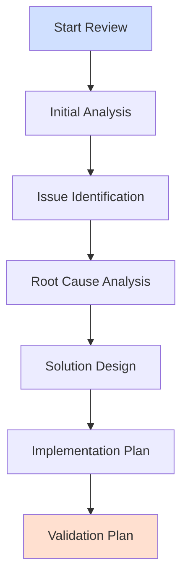

# Code Review System Workflow

## Review Process Overview



## Initial Review Prompt
```
Please conduct a comprehensive code review of [component/file], following the methodology in 02_review_instructions.md:

1. Import and Dependency Analysis
   - Review all imports and dependencies
   - Check for circular dependencies
   - Validate version compatibility
   - Document using Import Analysis section of 03_review_template.md

2. Data Flow Analysis
   - Trace data through the system
   - Validate transformations
   - Check state management
   - Document using Data Flow section of 03_review_template.md

3. Type System Assessment
   - Verify type annotations
   - Check for type safety issues
   - Validate null handling
   - Document using Type System Analysis section of 03_review_template.md

4. Resource Management 
   - Review resource acquisition/release
   - Check for leaks
   - Validate cleanup paths
   - Document using Resource Management section of 03_review_template.md

Structure findings according to 03_review_template.md, with special attention to the Issue Analysis section.
```

## Issue Analysis Prompt
```
For each identified issue in [component/file], analyze according to 02_review_instructions.md Root Cause Analysis Framework:

1. Issue Identification
   - Document observable symptoms
   - Collect runtime evidence
   - Gather performance metrics
   - Reference Issue Analysis section of 03_review_template.md

2. Root Cause Chain
   - Apply Five Whys technique
   - Map dependencies
   - Create cause-effect diagram
   - Document in Root Cause section of 03_review_template.md

3. Impact Assessment
   - Technical impact
   - Business impact
   - Resource impact
   - Document in Impact Analysis section of 03_review_template.md

4. Solution Design
   - Propose fixes
   - Consider alternatives
   - Assess complexity
   - Document in Recommendations section of 03_review_template.md

Follow the issue documentation structure from 03_review_template.md exactly.
```

## Implementation Planning Prompt
```
For the identified issues in [component/file], create an implementation plan following 06_implementation_instructions.md:

1. Pre-Implementation Analysis
   - Review current metrics
   - Identify dependencies
   - List affected components
   - Document using 07_implementation_template.md Implementation Overview

2. Implementation Steps
   - Detail configuration changes
   - Specify code updates
   - Plan migration steps
   - Follow Code Changes section of 07_implementation_template.md

3. Validation Requirements
   - Define success criteria
   - List test requirements
   - Specify metrics to collect
   - Use Validation Results section of 07_implementation_template.md

4. Risk Assessment
   - Identify potential issues
   - Plan mitigations
   - Set rollback criteria
   - Document in Issues and Risks section of 07_implementation_template.md
```

## Validation Planning Prompt
```
For the planned changes to [component/file], create a validation plan following 04_update_instructions.md:

1. Functional Validation
   - Import analysis validation
   - Type system verification
   - Data flow validation
   - Document in Functional Correctness section

2. Performance Validation
   - Response time targets
   - Resource utilization limits
   - Throughput requirements
   - Document in Performance Metrics section

3. Implementation Verification
   - Test coverage requirements
   - Integration validation
   - Migration verification
   - Document using 05_update_template.md

4. Documentation Requirements
   - Update specifications
   - Record metrics
   - Document validation results
   - Follow Documentation Requirements section
```

## Category-Specific Review Prompts

### Performance Review
```
Analyze [component/file] performance following 02_review_instructions.md:

1. Resource Utilization
   - Memory usage patterns
   - CPU utilization
   - I/O patterns
   - Document in Performance Analysis section of 03_review_template.md

2. Bottleneck Analysis
   - Identify hotspots
   - Profile critical paths
   - Check algorithms
   - Document findings using Performance Bottlenecks section

3. Optimization Opportunities
   - Resource management
   - Algorithm efficiency
   - Caching strategy
   - Document in Recommendations section
```

### Security Review
```
Analyze [component/file] security following 02_review_instructions.md:

1. Threat Assessment
   - Input validation
   - Authentication/Authorization
   - Data protection
   - Document in Security Analysis section of 03_review_template.md

2. Vulnerability Analysis
   - OWASP Top 10 review
   - Dependency security
   - Configuration security
   - Use Vulnerability Analysis section

3. Security Controls
   - Existing controls
   - Missing controls
   - Control effectiveness
   - Document in Security Controls section
```

### Configuration Review
```
Analyze [component/file] configuration following 02_review_instructions.md:

1. Schema Analysis
   - Validation completeness
   - Type safety
   - Default values
   - Document in Configuration Analysis section of 03_review_template.md

2. Rule Coverage
   - Business rules
   - Validation rules
   - Transformation rules
   - Use Configuration Coverage section

3. Configuration Quality
   - Reuse patterns
   - Maintainability
   - Documentation
   - Document in Schema Validation Status section
```

## Issue Resolution Tracking

For each identified issue, maintain tracking information in 05_update_template.md:
```
Track progress on [Issue-ID] following 05_update_template.md:

1. Implementation Status
   - Configuration changes
   - Code changes
   - Test updates
   - Document in Implementation Update Report

2. Validation Results
   - Test results
   - Performance metrics
   - Security validation
   - Use Validation Results section

3. Issue Resolution
   - Root cause verification
   - Regression testing
   - Performance impact
   - Document in Issues and Risks section
```

## Review Completion Checklist
```
Verify review completeness for [component/file]:

1. Issue Documentation
   - All issues identified
   - Root causes analyzed
   - Impact assessed
   - Solutions proposed

2. Validation Planning
   - Test requirements
   - Success criteria
   - Metrics collection
   - Documentation needs

3. Implementation Planning
   - Resource needs
   - Timeline estimates
   - Risk assessment
   - Migration steps

Reference appropriate sections in 02_review_instructions.md and 03_review_template.md for each item.
```

## Comprehensive System Review Prompt
```
Please conduct a complete system-wide review of the entire codebase, following the comprehensive analysis framework defined in 02_review_instructions.md and documenting according to 03_review_template.md:

1. Project Structure Analysis
   - Document all folders and their purposes
   - Analyze file organization patterns
   - Review naming conventions
   - Map component relationships
   - Reference Project Structure section of 03_review_template.md

2. Configuration System Analysis
   - Examine all YAML configurations
   - Review schema definitions
   - Validate rule coverage
   - Check configuration relationships
   - Document using Configuration Analysis section of 03_review_template.md

3. Core Component Analysis
   For each component in src/:
   - Document purpose and responsibilities
   - Analyze interfaces and dependencies
   - Review error handling patterns
   - Check resource management
   - Map component interactions
   - Follow Component Analysis section of 03_review_template.md

4. Data Processing Pipeline Analysis
   - Map data flow through system
   - Document transformation rules
   - Analyze validation patterns
   - Review error handling
   - Measure performance characteristics
   - Use Data Flow Analysis section of 03_review_template.md

5. Test Coverage Analysis
   For each test folder:
   - Document test strategy
   - Analyze coverage metrics
   - Review test patterns
   - Identify gaps
   - Check integration tests
   - Follow Testing Results section of 03_review_template.md

6. Documentation Review
   For all documentation:
   - Verify completeness
   - Check accuracy
   - Review clarity
   - Identify gaps
   - Document using Documentation section of 03_review_template.md

7. Performance Analysis
   - Collect baseline metrics
   - Identify bottlenecks
   - Review resource usage
   - Check scaling patterns
   - Document using Performance Analysis section of 03_review_template.md

8. Security Review
   - Analyze authentication/authorization
   - Review data protection
   - Check input validation
   - Verify secure configurations
   - Document using Security Analysis section of 03_review_template.md

9. Build and Deployment Analysis
   - Review build process
   - Check deployment patterns
   - Analyze dependencies
   - Verify configurations
   - Document using Build/Deploy section of 03_review_template.md

10. Quality Metrics
    - Code quality metrics
    - Test coverage
    - Documentation completeness
    - Performance benchmarks
    - Security scan results
    - Use Metrics section of 03_review_template.md

11. Issue Analysis
    For each component:
    - Document all issues found
    - Analyze root causes
    - Assess impact
    - Propose solutions
    - Follow Issue Analysis section of 03_review_template.md

12. Risk Assessment
    - Technical risks
    - Security risks
    - Performance risks
    - Maintenance risks
    - Document using Risk Assessment section of 03_review_template.md

13. Improvement Recommendations
    For each area:
    - Prioritized improvements
    - Implementation approach
    - Resource requirements
    - Success criteria
    - Use Recommendations section of 03_review_template.md

14. Compliance Analysis
    - Standard compliance
    - Best practices alignment
    - Code standards
    - Documentation standards
    - Follow Compliance section of 03_review_template.md

Create a comprehensive report that provides:
1. Complete system understanding without needing to read any code
2. Clear documentation of every component's purpose and status
3. Full analysis of all identified issues and risks
4. Concrete, actionable improvement recommendations
5. Detailed metrics and evidence for all findings

Structure the report following 03_review_template.md exactly, ensuring all sections are thoroughly completed with specific details, metrics, and evidence.

Output should serve as a complete system audit document that could be used by:
- New team members to understand the entire system
- Auditors to verify system quality and compliance
- Management to understand system status and needs
- Developers to identify areas for improvement
- Operations to understand system characteristics
```

## Template Cross-Reference Guide

### Review Documentation Flow

1. Start with prompts in this file (`01_AI_Prompts.md`)
2. Follow methodology in `02_review_instructions.md`
3. Document findings in `03_review_template.md`
4. Plan changes using `04_update_instructions.md`
5. Track updates in `05_update_template.md`
6. Follow implementation guide in `06_implementation_instructions.md`
7. Document implementation in `07_implementation_template.md`

### Key Template Sections

| Template | Key Sections | When to Use |
|----------|-------------|-------------|
| 02_review_instructions.md | Root Cause Analysis, Validation Framework | During analysis phase |
| 03_review_template.md | Issue Analysis, Impact Assessment | Documenting findings |
| 04_update_instructions.md | Validation Process, Success Criteria | Planning changes |
| 05_update_template.md | Implementation Updates, Validation Results | Tracking progress |
| 06_implementation_instructions.md | Implementation Framework, Patterns | During implementation |
| 07_implementation_template.md | Issue Resolution, Validation Results | Final documentation |

### Documentation Requirements

Each identified issue must be tracked through these templates:

1. **Analysis Phase**
   - Root cause in `03_review_template.md`
   - Impact assessment in `03_review_template.md`
   - Recommendations in `03_review_template.md`

2. **Planning Phase**
   - Implementation plan in `04_update_instructions.md`
   - Success criteria in `04_update_instructions.md`
   - Validation requirements in `04_update_instructions.md`

3. **Implementation Phase**
   - Changes documented in `06_implementation_instructions.md`
   - Validation results in `07_implementation_template.md`
   - Issue resolution in `05_update_template.md`