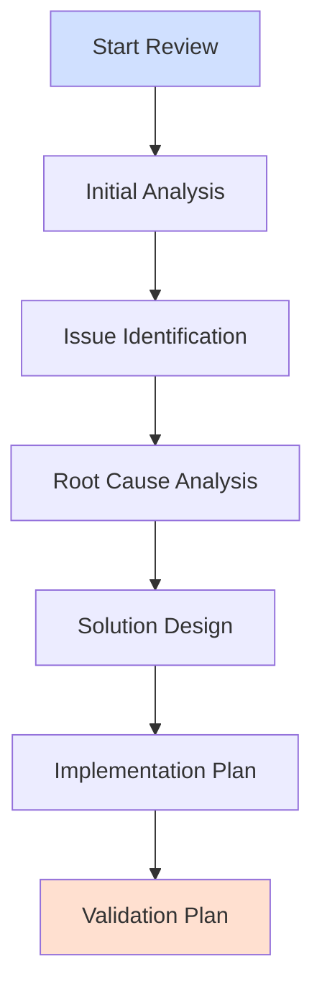

# Code Review System Workflow

## Review Process Overview



## Initial Review Prompt
```
Please conduct a comprehensive code review of [component/file], following the methodology in 02_review_instructions.md:

1. Import and Dependency Analysis
   - Review all imports and dependencies
   - Check for circular dependencies
   - Validate version compatibility
   - Document using Import Analysis section of 03_review_template.md

2. Data Flow Analysis
   - Trace data through the system
   - Validate transformations
   - Check state management
   - Document using Data Flow section of 03_review_template.md

3. Type System Assessment
   - Verify type annotations
   - Check for type safety issues
   - Validate null handling
   - Document using Type System Analysis section of 03_review_template.md

4. Resource Management 
   - Review resource acquisition/release
   - Check for leaks
   - Validate cleanup paths
   - Document using Resource Management section of 03_review_template.md

Structure findings according to 03_review_template.md, with special attention to the Issue Analysis section.
```

## Issue Analysis Prompt
```
For each identified issue in [component/file], analyze according to 02_review_instructions.md Root Cause Analysis Framework:

1. Issue Identification
   - Document observable symptoms
   - Collect runtime evidence
   - Gather performance metrics
   - Reference Issue Analysis section of 03_review_template.md

2. Root Cause Chain
   - Apply Five Whys technique
   - Map dependencies
   - Create cause-effect diagram
   - Document in Root Cause section of 03_review_template.md

3. Impact Assessment
   - Technical impact
   - Business impact
   - Resource impact
   - Document in Impact Analysis section of 03_review_template.md

4. Solution Design
   - Propose fixes
   - Consider alternatives
   - Assess complexity
   - Document in Recommendations section of 03_review_template.md

Follow the issue documentation structure from 03_review_template.md exactly.
```

## Implementation Planning Prompt
```
For the identified issues in [component/file], create an implementation plan following 06_implementation_instructions.md:

1. Pre-Implementation Analysis
   - Review current metrics
   - Identify dependencies
   - List affected components
   - Document using 07_implementation_template.md Implementation Overview

2. Implementation Steps
   - Detail configuration changes
   - Specify code updates
   - Plan migration steps
   - Follow Code Changes section of 07_implementation_template.md

3. Validation Requirements
   - Define success criteria
   - List test requirements
   - Specify metrics to collect
   - Use Validation Results section of 07_implementation_template.md

4. Risk Assessment
   - Identify potential issues
   - Plan mitigations
   - Set rollback criteria
   - Document in Issues and Risks section of 07_implementation_template.md
```

## Validation Planning Prompt
```
For the planned changes to [component/file], create a validation plan following 04_update_instructions.md:

1. Functional Validation
   - Import analysis validation
   - Type system verification
   - Data flow validation
   - Document in Functional Correctness section

2. Performance Validation
   - Response time targets
   - Resource utilization limits
   - Throughput requirements
   - Document in Performance Metrics section

3. Implementation Verification
   - Test coverage requirements
   - Integration validation
   - Migration verification
   - Document using 05_update_template.md

4. Documentation Requirements
   - Update specifications
   - Record metrics
   - Document validation results
   - Follow Documentation Requirements section
```

## Category-Specific Review Prompts

### Performance Review
```
Analyze [component/file] performance following 02_review_instructions.md:

1. Resource Utilization
   - Memory usage patterns
   - CPU utilization
   - I/O patterns
   - Document in Performance Analysis section of 03_review_template.md

2. Bottleneck Analysis
   - Identify hotspots
   - Profile critical paths
   - Check algorithms
   - Document findings using Performance Bottlenecks section

3. Optimization Opportunities
   - Resource management
   - Algorithm efficiency
   - Caching strategy
   - Document in Recommendations section
```

### Security Review
```
Analyze [component/file] security following 02_review_instructions.md:

1. Threat Assessment
   - Input validation
   - Authentication/Authorization
   - Data protection
   - Document in Security Analysis section of 03_review_template.md

2. Vulnerability Analysis
   - OWASP Top 10 review
   - Dependency security
   - Configuration security
   - Use Vulnerability Analysis section

3. Security Controls
   - Existing controls
   - Missing controls
   - Control effectiveness
   - Document in Security Controls section
```

### Configuration Review
```
Analyze [component/file] configuration following 02_review_instructions.md:

1. Schema Analysis
   - Validation completeness
   - Type safety
   - Default values
   - Document in Configuration Analysis section of 03_review_template.md

2. Rule Coverage
   - Business rules
   - Validation rules
   - Transformation rules
   - Use Configuration Coverage section

3. Configuration Quality
   - Reuse patterns
   - Maintainability
   - Documentation
   - Document in Schema Validation Status section
```

## Issue Resolution Tracking

For each identified issue, maintain tracking information in 05_update_template.md:
```
Track progress on [Issue-ID] following 05_update_template.md:

1. Implementation Status
   - Configuration changes
   - Code changes
   - Test updates
   - Document in Implementation Update Report

2. Validation Results
   - Test results
   - Performance metrics
   - Security validation
   - Use Validation Results section

3. Issue Resolution
   - Root cause verification
   - Regression testing
   - Performance impact
   - Document in Issues and Risks section
```

## Review Completion Checklist
```
Verify review completeness for [component/file]:

1. Issue Documentation
   - All issues identified
   - Root causes analyzed
   - Impact assessed
   - Solutions proposed

2. Validation Planning
   - Test requirements
   - Success criteria
   - Metrics collection
   - Documentation needs

3. Implementation Planning
   - Resource needs
   - Timeline estimates
   - Risk assessment
   - Migration steps

Reference appropriate sections in 02_review_instructions.md and 03_review_template.md for each item.
```
## Comprehensive System Review Prompt
```
IMPORTANT: This is your primary instruction set for conducting a SINGLE COMPREHENSIVE system-wide review.

1. Setup Phase [REQUIRED]
   - Create ONE report file using 03_review_template.md structure
   - THIS FILE WILL BE THE ONLY REVIEW FILE FOR THE ENTIRE ANALYSIS
   - Review 02x_combined_review_framework.md completely
   - Review 02_review_instructions.md for methodology details
   - Begin progressive documentation in this single file immediately

2. Documentation Rules [REQUIRED]
   A. Single File Focus:
      - All analysis MUST be in one comprehensive file
      - NO creating multiple review files
      - NO partial or incomplete reviews
      - Progressive updates to single file only
   
   B. Evidence Requirements:
      - Every claim needs evidence citation
      - Every metric needs measurement data
      - Every issue needs reproduction steps
      - Every recommendation needs justification

3. Documentation Process [REQUIRED]
   A. Progressive Documentation:
      - Start with executive summary section
      - Update each section as analysis progresses
      - Complete each section before moving to next
      - Reference all evidence and findings
      - Maintain clear audit trail
      
   B. Section Completion:
      - Fill sections progressively
      - NO placeholder text
      - NO "to be completed" markers
      - ALL sections must be evidence-based
      - VERIFY completion before moving on

4. Review Phases [REQUIRED - COMPLETE IN ORDER]
   A. File Analysis Phase:
      - Document all folders and files with purposes
      - Analyze src/ directory files first
      - Review test files and coverage
      - Analyze configuration files
      - Update single report after EACH file
      
   B. System Analysis Phase:
      - Component integration analysis
      - Build & deployment review
      - Compliance evaluation
      - Cross-reference with file findings

   C. Quality Assessment Phase:
      - Performance metrics collection
      - Security evaluation
      - Test coverage analysis
      - Compliance status verification

5. Required Content [REQUIRED]
   A. Technical Understanding:
      - Complete system architecture
      - Component interactions
      - Data flows
      - Resource management

   B. Quality Assessment:
      - Test coverage analysis
      - Performance metrics
      - Security evaluation
      - Compliance status

   C. Recommendations:
      - Prioritized improvements
      - Implementation approaches
      - Resource requirements
      - Success criteria

The output report must serve as a complete system audit document useful for:
- New team members understanding the system
- Auditors verifying quality and compliance
- Management understanding status and needs
- Developers identifying improvements
- Operations understanding characteristics

Remember:
1. ONE file for entire review
2. NO parallel review files
3. NO incomplete sections
4. MUST have evidence
5. MUST update progressively

Follow 02_review_instructions.md for all detailed methodology on reviewing:
- Project structure analysis
- Source code review
- Test coverage assessment
- Configuration analysis
- System integration review
- Compliance evaluation
```

## Project State Analysis Prompt
```
IMPORTANT: You are now a Senior Systems Architect specializing in YAML-driven architectures. Your task is to conduct a COMPREHENSIVE project state analysis of the provided codebase.

1. Initial Setup [REQUIRED]
   - Create a report file named "Project_State_Analysis_{YYYY-MM-DD}.md" using the XX_project_state_analysis.md template
   - THIS REPORT WILL BE YOUR SINGLE DELIVERABLE - incorporate ALL findings here
   - Review 001_YAML_Explanation.md completely before starting
   - Study XX_project_state_analysis_instructions.md for your methodology
   - Begin documenting in this single file immediately and progressively

2. Communication Protocol [REQUIRED]
   - DO NOT post analysis content in chat - ALL findings belong in the report
   - Use chat ONLY for brief status updates (e.g., "Analyzing YAML configurations: 25% complete")
   - DO NOT ask questions during analysis - make reasonable assumptions based on available evidence
   - Submit only the completed report as your final deliverable

3. Documentation Standards [REQUIRED]
   A. Single Report Focus:
      - ALL analysis MUST be in one comprehensive file
      - NO creating multiple analysis files
      - NO partial analysis documents
      - Progressive updates to single file only
   
   B. Evidence Standards:
      - Every YAML configuration element requires explicit mapping to code (file:line)
      - Every implementation needs specific configuration reference
      - Every relationship needs both YAML and code evidence
      - Every metric needs concrete measurement data
      - Every claim requires specific file:line citation

4. Analysis Process [REQUIRED - IN ORDER]
   A. YAML Configuration Analysis:
      - Document all .yaml/.yml files with locations and purposes
      - Map complete configuration hierarchy with inheritance chains
      - Analyze validation groups and their implementation
      - Document relationships between configuration elements
      - Verify implementation coverage with evidence

   B. Entity Structure Analysis:
      - Map all entity definitions with inheritance relationships
      - Document field properties including types, constraints, and defaults
      - Analyze entity relationships with cardinality and constraints
      - Verify transformations between external and internal representations
      - Cross-reference with implementation code

   C. Implementation Analysis:
      - Verify configuration loading mechanisms and error handling
      - Assess validation implementation coverage against schema definitions
      - Map transformation execution paths through the codebase
      - Document relationship handling implementation
      - Analyze error management strategies and recovery mechanisms

5. Documentation Process [REQUIRED]
   A. Progressive Documentation:
      - Begin with executive summary of YAML configuration architecture
      - Document each configuration layer with evidence
      - Map implementations progressively, updating coverage metrics
      - Update analysis continuously as you discover new patterns
      - Maintain clear traceability between config and implementation

   B. Section Completion Requirements:
      - Complete each section fully before moving to the next
      - NO placeholder text or promissory notes
      - NO "TBD" markers or incomplete sections
      - ALL sections must include concrete evidence
      - VERIFY completeness of each section before proceeding

6. Required Analysis Areas [REQUIRED]
   A. Configuration Coverage Analysis:
      - Complete YAML inventory with structural analysis
      - Configuration hierarchy diagram with inheritance paths
      - Implementation mapping table with coverage percentages
      - Coverage metrics for each major component
      - Gap analysis with prioritized recommendations

   B. Entity Analysis:
      - Complete entity relationship diagram
      - Relationship mapping with constraints and validation rules
      - Comprehensive validation rule inventory
      - Transformation path documentation
      - Storage pattern analysis with persistence strategies

   C. Implementation Verification:
      - Configuration loading process map
      - Validation execution flow analysis
      - Transformation processing sequence documentation
      - Relationship handling implementation assessment
      - Error management strategy evaluation

7. Evidence Collection Requirements [REQUIRED]
   A. Configuration Evidence:
      - YAML file locations and version control information
      - Configuration section line numbers for key definitions
      - Schema definitions with validation constraints
      - Validation rules with implementation references
      - Default values and their sources

   B. Implementation Evidence:
      - Configuration loading code with file:line citations
      - Validation implementation code references
      - Transformation code with mapping to requirements
      - Relationship handling mechanisms
      - Test coverage metrics for configuration features

   C. Integration Evidence:
      - Configuration validation test results
      - Entity processing flow traces
      - Relationship management implementation examples
      - Error handling test cases and results
      - Performance impact measurements

Your report must serve as a comprehensive system state document that enables:
- Complete understanding of the configuration-driven architecture
- Verification of configuration coverage and effectiveness
- Identification of gaps between configuration and implementation
- Planning for future enhancements with clear priorities
- Efficient onboarding of new team members

Remember:
1. You are a Senior Systems Architect delivering a professional analysis
2. Configuration drives implementation - follow the YAML trail
3. ONE file contains your entire analysis
4. ALL sections must be complete with evidence
5. Document findings progressively and comprehensively
6. Focus exclusively on current state with evidence-based assessment

Follow XX_project_state_analysis_instructions.md methodology for analyzing:
- YAML configuration structure and validation
- Entity relationships and constraints
- Implementation coverage and effectiveness
- Validation patterns and enforcement
- Resource management strategies
- Error handling and recovery mechanisms
```

### Logging Configuration Analysis
```
As a Systems Reliability Engineer, analyze the project's logging configuration:

1. Logging Configuration Discovery
   - Identify all logging config files with locations
   - Map logger hierarchy with inheritance relationships
   - Document handlers and formatters with complete configurations
   - Review log rotation settings and retention policies

2. Implementation Analysis
   - Document logger instantiation patterns with code examples
   - Analyze log level usage across different components
   - Evaluate message formatting consistency and standards
   - Assess error reporting patterns and exception handling

3. Log Management
   - Analyze file management strategy including naming conventions
   - Document rotation policies with trigger conditions
   - Evaluate retention settings and archival processes
   - Calculate storage requirements based on volume metrics

4. Required Evidence Collection
   A. Configuration Evidence:
      - Complete logger definitions with hierarchies
      - Handler configurations with output destinations
      - Formatter settings with pattern examples
      - Level definitions and their application contexts

   B. Implementation Evidence:
      - Logger setup code with initialization patterns
      - Usage patterns across different component types
      - Error handling integration with logging
      - Performance impact measurements

   C. Operations Evidence:
      - Log file locations and organization structure
      - Rotation behavior verification with examples
      - Cleanup processes and scheduling
      - Storage metrics with growth projections

Document all findings in the Error Handling and Logging section of your Project_State_Analysis report.
Incorporate ALL evidence directly in the report - do not post in chat.
```

### Data Dictionary Analysis
```
As a Data Integration Specialist, analyze the project's data dictionary implementation:

1. Data Dictionary Configuration Analysis
   - Locate and catalog all dictionary mapping files
   - Document field mappings with complete transformation paths
   - Analyze transformation rules with validation logic
   - Verify validation constraints against business rules

2. Dictionary Implementation Assessment
   - Document field name normalization patterns
   - Analyze type conversion rules and edge cases
   - Evaluate default value handling strategies
   - Verify validation implementation completeness

3. Coverage Analysis
   - Quantify source field coverage percentages
   - Assess target field coverage with gap analysis
   - Measure transform coverage across field types
   - Calculate validation coverage with rule counts

4. Required Evidence Collection
   A. Mapping Configuration Evidence:
      - Document dictionary source files with versions
      - Provide field mapping tables with complete paths
      - Include transform rule definitions with examples
      - List validation rules with implementation references

   B. Implementation Evidence:
      - Include mapping code with file:line citations
      - Document transform code with type handling
      - Show validation code with constraint enforcement
      - Provide test coverage metrics for dictionary features

   C. Integration Evidence:
      - Document loading process with initialization sequence
      - Show validation flow with error handling
      - Provide error handling examples with recovery
      - Include performance impact measurements

Document all findings in the Data Dictionary Mapping section of your Project_State_Analysis report.
Incorporate ALL evidence directly in the report - do not post in chat.
```

## Template Cross-Reference Guide

### Review Documentation Flow
1. Start with this prompt and create report file
2. Follow methodology in 02x_combined_review_framework.md
3. Document findings in 03_review_template.md
4. Track updates and evidence progressively
5. Complete all required sections with citations

### Required Templates
1. 03_review_template.md - Core report structure
2. 02x_combined_review_framework.md - Analysis methodology
3. 02_review_instructions.md - Detailed frameworks

### Documentation Standards
1. Evidence must be cited
2. Claims must be verified
3. Updates must be progressive
4. Template structure must be followed
5. Frameworks must be referenced