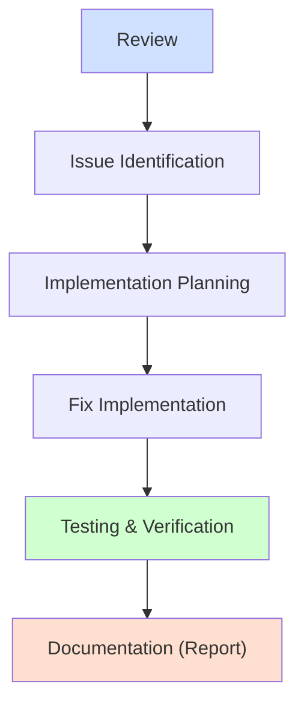

# Code Review System Workflow

## Complete Review-Fix-Document Workflow



1. **Review**: Identify issues using the review prompt
2. **Issue Identification**: Prioritize and categorize issues
3. **Implementation Planning**: Create detailed fix plans with test cases
4. **Fix Implementation**: Implement fixes in isolated branches/environments
5. **Testing & Verification**: Thoroughly test fixes before proceeding
6. **Documentation**: Only document verified and tested fixes

> [!IMPORTANT]
> Always implement and verify fixes BEFORE documenting them in the update report. Documentation should reflect actual tested changes, not just planned changes.

# Code Review Analysis Prompt

Use this prompt to initiate an AI-assisted code review:

```text
Perform a systematic code review analysis of the USASpending codebase starting with process_transactions.py throughout the entire codebase.
Review ./02_review_instructions.md for detailed instructions.

TARGET FILES:
*.**

ANALYSIS FRAMEWORK:
1. Situation Analysis
   - Current state assessment of overall architecture
   - System context and external dependencies
   - Cross-component interactions
   - Known issues or performance concerns

2. Problem Analysis
   - Code structure and architectural patterns
   - Data flow across system boundaries
   - Error handling and recovery strategies
   - Performance characteristics and bottlenecks
   - Security practices and potential vulnerabilities
   - Compliance with standards and best practices

3. Decision Analysis
   - Critical issues requiring immediate action
   - Important issues affecting reliability or security
   - Technical debt assessment
   - Enhancement opportunities
   - Implementation trade-offs

4. Potential Problem Analysis
   - Risk assessment across components
   - Failure scenarios and resilience
   - Scalability constraints
   - Security vulnerability vectors
   - Preventive measures
   - Contingency planning

OUTPUT REQUIREMENTS:
- Generate review using template 03_review_template.md
- Include system architecture and data flow diagrams
- Provide specific code examples for issues
- Reference file locations precisely
- **Do not overwrite existing files**
- Save as: runtime_review_YYYYMMDD_HHMM.md

SAVE LOCATION:
docs/reports/
```

> [!NOTE]
> This prompt integrates Kepner-Tregoe problem analysis with root cause identification methodology. You can narrow the scope as needed by specifying particular components or areas.

---

# Implementation Framework Prompt

Use this prompt to create a framework for implementing fixes based on the latest review:

```text
Create an implementation framework based on the most recent code review in the USASpending codebase.

Prerequisites:
1. Review report in docs/reports/ folder
2. Examine code in identified issue locations

SOURCE:
[Use the most recent runtime_review file in docs/reports/ by default]

FRAMEWORK REQUIREMENTS:
1. Extract all critical and important issues from the review
2. Create detailed implementation plans for each issue:
   - Issue summary and impact
   - Root cause analysis
   - Implementation approach
   - Test plan with validation criteria
   - Rollback procedures
3. Define a testing strategy for each fix
4. Establish verification criteria for each issue

OUTPUT REQUIREMENTS:
- Generate implementation framework document
- Include test procedures and verification steps
- Provide implementation sequence based on dependencies
- **Do not overwrite existing files**
- Save as: impl_framework_YYYYMMDD_HHMM.md

SAVE LOCATION:
docs/implementation/
```

> [!NOTE]
> Use this to create a structured implementation plan BEFORE making code changes.

---

# Code Fix/Update Prompt

Use this prompt AFTER implementing and testing fixes:

```text
Document the implemented and verified fixes for the most recent code review in the USASpending codebase.

Prerequisites:
1. All fixes must be IMPLEMENTED and TESTED before documentation
2. Implementation framework should be complete
3. Verification tests should be passing

SOURCE:
[Use the most recent runtime_review file in docs/reports/ by default]

FIX/UPDATE REQUIREMENTS:
1. Document only completed and verified fixes
2. Include before/after code samples of actual implemented changes
3. Document test results and verification evidence
4. Document compliance verification for each fix
5. Include performance impact measurements

OUTPUT REQUIREMENTS:
- Generate update report using template 05_update_template.md
- Document all verified implemented changes
- Provide before/after code comparisons
- Include test results and verification evidence
- Reference file locations precisely
- **Do not overwrite existing files**
- Save as: fix_update_YYYYMMDD_HHMM.md

SAVE LOCATION:
docs/reports/
```

> [!NOTE]
> This prompt is used ONLY AFTER fixes have been implemented and verified.