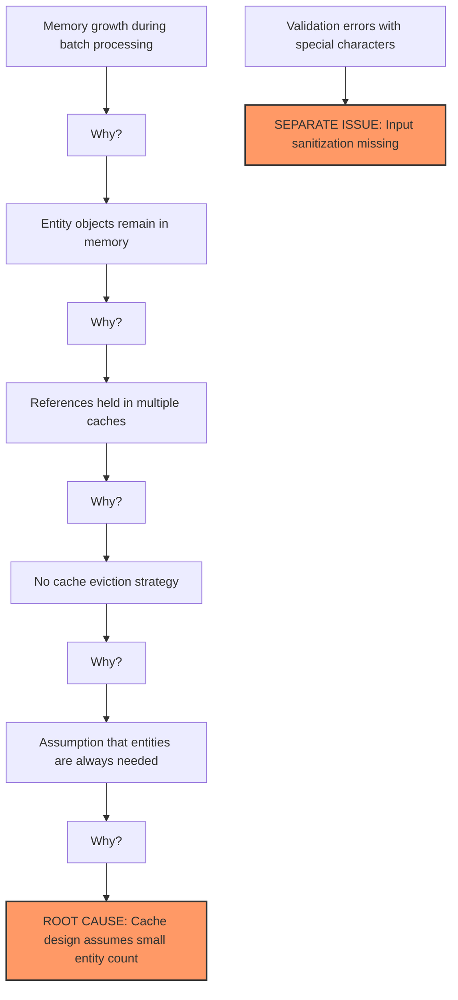
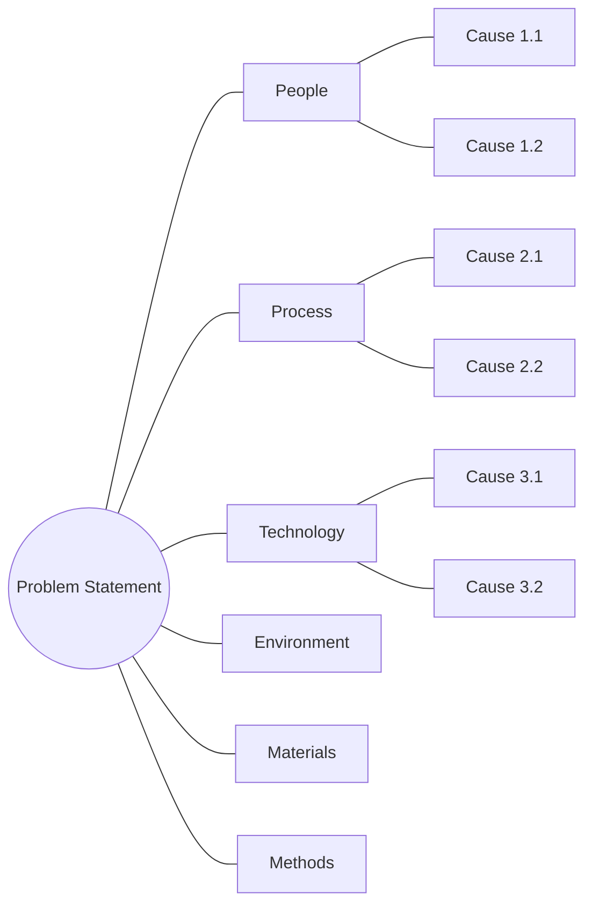
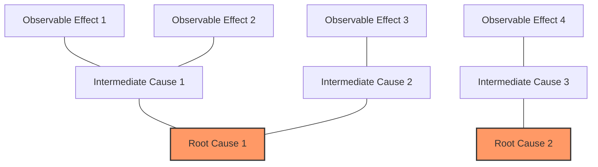
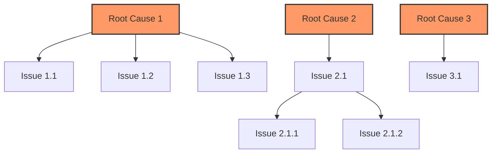
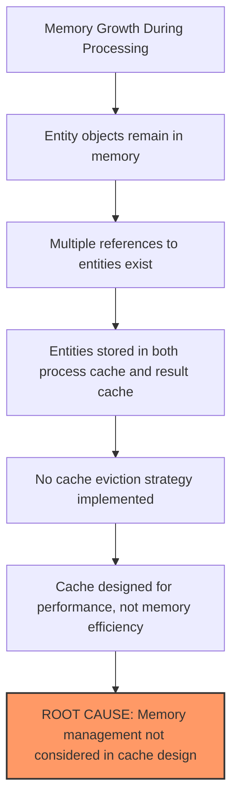
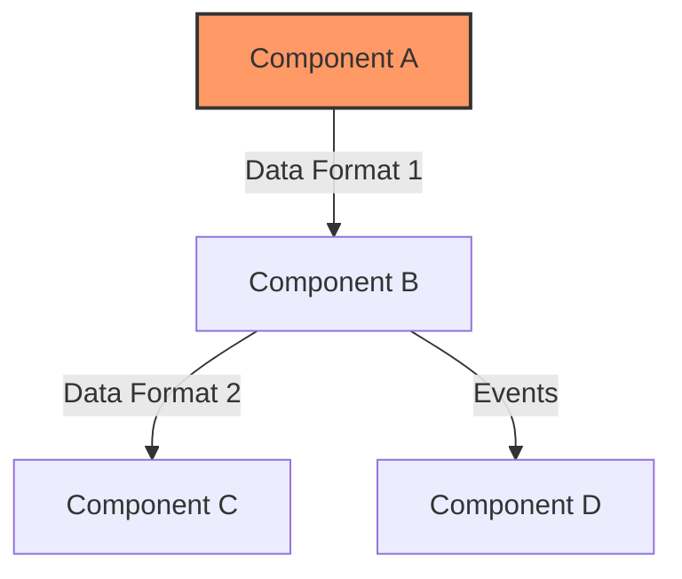
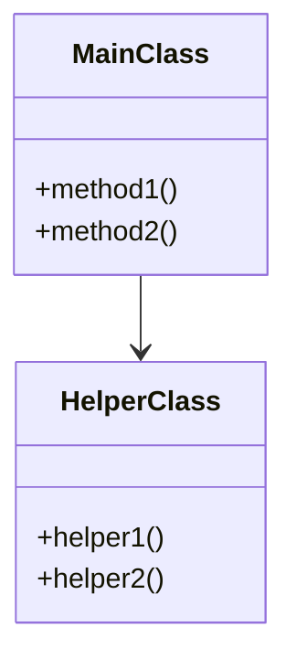
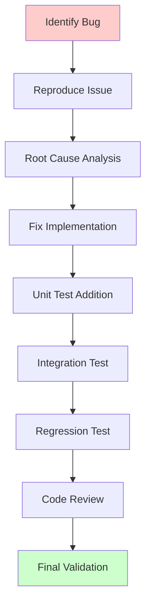

# Code Review Analysis Instructions

## Critical Requirements

### Single File Focus
- REQUIRED: All review documentation MUST be maintained in a single comprehensive file
- PROHIBITED: Creating multiple parallel review files
- REQUIRED: Use progressive documentation in the single file
- REQUIRED: Complete each section fully before moving to next

### Documentation Standards
- Every claim requires evidence citation
- Every metric requires measurement data
- Every issue requires reproduction steps
- Every recommendation requires justification

### Review Process
1. Create single review file using template
2. Complete each section progressively
3. Include all evidence and metrics
4. Update single file as analysis deepens
5. Maintain complete audit trail

## Six Thinking Hats Analysis

The Six Thinking Hats method provides different perspectives for evaluating code:

| Hat | Focus | Key Questions |
|-----|-------|--------------|
| 🤍 **White** | Facts | What does the code actually do? What metrics can we measure? |
| ❤️ **Red** | Feelings | How maintainable is this code? What's the developer experience? |
| 🖤 **Black** | Caution | What could go wrong? What are the risks and vulnerabilities? |
| 💛 **Yellow** | Benefits | What works well? What patterns should we keep? |
| 💚 **Green** | Creativity | How could we improve this? What alternatives exist? |
| 💙 **Blue** | Process | How does this fit into the architecture? How is the workflow? |

### White Hat Analysis Examples

**Effective Example:**
```
The EntityProcessor class contains 15 methods with an average cyclomatic complexity of 12.
The class uses dependency injection for database access but creates file system dependencies directly.
Test coverage for this component is 67% with integration tests missing for batch processing scenarios.
The processor uses approximately 2MB of memory per 1000 entities processed.
```

**Ineffective Example:**
```
This code is complicated and seems to have a lot of methods.
It might have memory issues.
```

### Red Hat Analysis Examples

**Effective Example:**
```
The validation error messages lack context, making debugging difficult for developers.
The complex nesting of conditional statements in ProcessEntity() creates cognitive load.
The inconsistent naming conventions between EntityProcessor and DataProcessor create confusion.
The lack of comments in the complex algorithm sections frustrates new team members.
```

**Ineffective Example:**
```
This code feels messy and hard to understand.
I don't like how it's organized.
```

### Black Hat Analysis Examples

**Effective Example:**
```
The EntityValidator lacks input sanitization for external API data, creating potential XSS vulnerabilities.
The error handling pattern swallows exceptions in ProcessAsync(), hiding upstream errors from callers.
The database connection isn't disposed in error cases, leading to potential connection leaks.
Performance degrades exponentially with batch sizes over 500 entities due to O(n²) complexity in the merging algorithm.
```

**Ineffective Example:**
```
This code has bugs and security problems.
It probably won't work in production.
```

### Yellow Hat Analysis Examples

**Effective Example:**
```
The separation of validation and processing logic improves maintainability.
The use of async/await throughout the pipeline enables efficient I/O handling.
The comprehensive logging provides excellent operational visibility.
The strategy pattern in the EntityProcessor allows for flexible processing rules.
```

**Ineffective Example:**
```
Some parts of the code are good.
It works most of the time.
```

### Green Hat Analysis Examples

**Effective Example:**
```
Replacing the custom caching implementation with a standard CacheManager would reduce maintenance.
Implementing the Unit of Work pattern would simplify transaction management across repositories.
Converting the large EntityProcessor class into smaller, focused classes would improve testability.
Adding a circuit breaker for the external API calls would improve resilience.
```

**Ineffective Example:**
```
We should rewrite this in a different language.
Maybe add more comments.
```

### Blue Hat Analysis Examples

**Effective Example:**
```
The EntityProcessor sits between the API layer and data access layer, orchestrating the validation and transformation workflow.
The component follows a sequential processing pipeline but lacks clear error recovery paths.
The architecture mixes business logic and data access in several methods, violating separation of concerns.
The system uses a mix of synchronous and asynchronous patterns, creating potential deadlock scenarios.
```

**Ineffective Example:**
```
The architecture isn't great.
We should reorganize things.
```

## Component Analysis Framework

### Component Assessment Checklist

1. **Interface Analysis**
   - Input/output contracts
   - Error handling patterns
   - Dependency management
   - Resource ownership
   - Threading model

2. **Resource Management**
   - Memory lifecycle
   - Connection pooling
   - File handle management
   - Cache strategies
   - Resource cleanup

3. **Performance Characteristics**
   - Processing throughput
   - Memory utilization
   - I/O patterns
   - Cache efficiency
   - Resource contention

4. **Error Management**
   - Error categorization
   - Recovery strategies
   - Error propagation
   - Logging patterns
   - Circuit breakers

### Component Health Assessment

Use these indicators to evaluate component health:

| Category | Green | Yellow | Red |
|----------|--------|---------|-----|
| Memory Growth | <5%/hour | 5-10%/hour | >10%/hour |
| Error Rate | <1% | 1-5% | >5% |
| Response Time | <100ms | 100-500ms | >500ms |
| Cache Hit Rate | >80% | 60-80% | <60% |
| Code Coverage | >80% | 60-80% | <60% |

## Root Cause Analysis Framework

### Root Cause Detection Process

To move beyond identifying symptoms to uncovering true root causes:

1. **Identify Observable Issues**: Document the directly observable issues or symptoms.
2. **Question the "Why"**: For each issue, ask "Why does this occur?" at least five times.
3. **Trace Dependencies**: Identify dependencies between components that might propagate issues.
4. **Verify Causality**: Test assumptions about causes by verifying with evidence.
5. **Map Issue Hierarchy**: Create a hierarchical map showing the relationship between root causes and symptoms.

### Root Cause vs. Symptom Identification

**Examples of Symptoms**:
- High memory usage during specific operations
- Slow response times under certain loads
- Occasional data inconsistencies
- Validation failures with specific input types

**Examples of Root Causes**:
- Resource management pattern that retains references unnecessarily
- Inefficient algorithm with O(n²) complexity for core operations
- Architectural design that creates circular dependencies
- Inconsistent validation strategy across components

#### Symptom to Root Cause Example



### Root Cause Analysis Techniques

#### 1. Fishbone (Ishikawa) Diagram

Use this to identify potential causes across several categories:



#### 2. Current Reality Tree

Map relationships between effects and causes to find fundamental issues:



#### 3. The Five Whys

For each identified issue, ask "Why?" at least five times to drive to the root cause:

1. **Problem**: Entity processing slows down over time
    - **Why?** Memory usage grows with each batch
        - **Why?** Entity objects remain in memory after processing
            - **Why?** References are held in the entity cache
                - **Why?** No eviction policy is implemented for the cache
                    - **Why?** The cache was designed assuming a small number of entities (ROOT CAUSE)

#### 4. Change Analysis

Compare code behavior before and after changes to identify what introduced an issue:

1. Identify when the issue first appeared
2. Examine code changes around that time
3. Analyze the impact of those changes on the system
4. Test hypothesis by reverting or modifying the suspected change

### Evidence Collection Guidelines

When gathering evidence for root cause analysis:

1. **Code Evidence**:
   - File paths and line numbers
   - Specific code patterns
   - Function/method signatures
   - Variable usages and state changes

2. **Runtime Evidence**:
   - Memory profiles
   - CPU utilization
   - Stack traces
   - Log patterns

3. **Test Evidence**:
   - Test cases that reproduce the issue
   - Test results showing the failure pattern
   - Coverage of affected code areas

### Root Cause Documentation Template

```markdown
### [ROOT-XX] [Root Cause Title]

**Description**: 
[Comprehensive description of the root cause]

**Evidence**: 
- [Code evidence with specific locations]
- [Runtime behavior observations]
- [Test results]

**Impacted Areas**: 
- [Component/module 1]
- [Component/module 2]

**Symptoms**: 
1. **[SYM-XX-01]**: [Description of symptom 1]
2. **[SYM-XX-02]**: [Description of symptom 2]
3. **[SYM-XX-03]**: [Description of symptom 3]

**Verification Method**: 
[How to verify this is indeed the root cause]
```

## Issue Relationship Mapping

### Issue Dependency Analysis

For complex systems, issues often have dependencies on each other. Document these relationships:

| Issue | Dependencies | Blocking | Blocked By |
|-------|--------------|----------|------------|
| Issue 1 | None | Issue 3, Issue 4 | None |
| Issue 2 | Issue 1 | Issue 5 | Issue 1 |
| Issue 3 | Issue 1 | None | Issue 1 |

### Issue Hierarchy Visualization



## Configuration Analysis Framework

### Configuration Coverage Assessment

1. **Configuration vs Code Ratio**
   - Identify business rules in code that should be in configuration
   - Measure percentage of rules in configuration vs hardcoded
   - Track configuration reuse patterns
   - Evaluate configuration flexibility

2. **Schema Validation Analysis**
   - Verify all configuration files have schemas
   - Check schema coverage of configuration
   - Validate required constraints
   - Review default values

3. **Configuration Reuse Patterns**
   ```yaml
   # Good: Reusable validation rule
   validations:
     amount_validation:
       type: number
       min: 0
       max: 1000000
       precision: 2
   
   # Anti-pattern: Duplicated rules
   field1_validation:
     type: number
     min: 0
     max: 1000000
   field2_validation:
     type: number
     min: 0
     max: 1000000
   ```

4. **Configuration Dependencies**
   - Map configuration interdependencies
   - Identify circular references
   - Document override patterns
   - Track inheritance chains

### Configuration Root Cause Analysis

Look for these common configuration-related issues:

| Issue Pattern | Root Cause Indicators | Investigation Areas |
|---------------|----------------------|-------------------|
| Duplicate Rules | Missing reusable definitions | Configuration organization |
| Inconsistent Validation | Rules split between code/config | Validation framework |
| Hard to Change Rules | Over-specific configurations | Configuration hierarchy |
| Maintenance Issues | Poor configuration structure | Schema design |

## USASpending-Specific Analysis Patterns

### Entity Processing Analysis

When analyzing entity processing components, identify potential root causes for performance and reliability issues:

| Symptom | Potential Root Causes |
|---------|----------------------|
| Memory growth | • Entity retention in multiple caches<br>• Lack of reference cleanup<br>• Circular references<br>• Large batch sizes without memory-aware processing |
| Slow processing | • O(n²) algorithms in relationship processing<br>• Excessive validation on unchanged data<br>• Inefficient entity key generation<br>• Synchronous I/O during processing |
| Data integrity issues | • Transaction boundary inconsistencies<br>• Incomplete error recovery<br>• Race conditions in concurrent processing<br>• Partial updates during failures |

#### Entity Processing Root Cause Example

**Symptom**: Memory usage grows unbounded during batch processing

**Root Cause Analysis**:


**Code Evidence**:
```python
# Entities added to cache but never removed
def add_entity(self, entity_data):
    key = self.build_key(entity_data)
    self.primary_cache[key] = entity_data
    self.secondary_cache[entity_data['id']] = entity_data  # Duplicate reference
    self.result_cache.append(entity_data)  # Third reference
    return key

# No method to clear or evict from caches
```

### Data Transformation Analysis

For data transformation code, identify root causes of inefficiencies and errors:

| Symptom | Potential Root Causes |
|---------|----------------------|
| Inconsistent output format | • Missing data type standardization<br>• Inconsistent transform functions<br>• Culture/locale-specific assumptions<br>• Multiple transformation paths for same data type |
| Data loss during transformation | • Type conversion errors<br>• Missing null handling<br>• Truncation without validation<br>• Character encoding issues |
| Slow transformations | • String parsing inefficiencies<br>• Repeated transformations of same data<br>• Regular expression complexity<br>• Lack of bulk transformation capabilities |

**Common Issue Example:**
```csharp
// Anti-pattern: Culture-insensitive parsing
public decimal ParseAmount(string input)
{
    return decimal.Parse(input); // Will fail with different culture settings
}

// Recommended pattern:
public decimal ParseAmount(string input)
{
    return decimal.Parse(input, CultureInfo.InvariantCulture);
}
```

### Configuration Management Analysis

For configuration systems, identify root causes of flexibility and reliability issues:

| Symptom | Potential Root Causes |
|---------|----------------------|
| Configuration inconsistencies | • Multiple configuration sources without priority rules<br>• Missing schema validation<br>• Environment-specific config handling<br>• Partial updates to configuration |
| Runtime configuration failures | • Late validation of configuration<br>• Type coercion issues<br>• Missing defaults for optional values<br>• Configuration dependency cycles |
| Security vulnerabilities | • Embedded secrets in configuration<br>• Insecure storage of sensitive values<br>• Lack of access controls<br>• Plain-text credentials |

**Common Issue Example:**
```csharp
// Anti-pattern: Hardcoded configuration
public class ApiClient
{
    private readonly string _apiKey = "1234567890abcdef";
    
    public void CallApi() { /* ... */ }
}

// Recommended pattern:
public class ApiClient
{
    private readonly string _apiKey;
    
    public ApiClient(IConfiguration config)
    {
        _apiKey = config["ApiKey"] ?? throw new ArgumentException("ApiKey not configured");
    }
    
    public void CallApi() { /* ... */ }
}
```

### API Integration Patterns

When reviewing API integration code, evaluate:

| Pattern | Best Practice | Warning Sign |
|---------|--------------|------------|
| Authentication | Secure credential management | Hardcoded API keys |
| Resilience | Retry policies with exponential backoff | No retry handling |
| Error Handling | Response validation with specific errors | Generic exception handling |
| Caching | Appropriate cache policies | Excessive calls or no caching |
| Rate Limiting | Client-side throttling | No rate limit awareness |

**Common Issue Example:**
```csharp
// Anti-pattern: No resilience
public async Task<ApiResponse> GetDataAsync()
{
    var client = new HttpClient();
    var response = await client.GetAsync("https://api.example.com/data");
    response.EnsureSuccessStatusCode();
    return JsonSerializer.Deserialize<ApiResponse>(await response.Content.ReadAsStringAsync());
}

// Recommended pattern:
public async Task<ApiResponse> GetDataAsync()
{
    using var client = _httpClientFactory.CreateClient("ApiClient");
    
    // Retry with exponential backoff
    return await _retryPolicy.ExecuteAsync(async () => {
        var response = await client.GetAsync("https://api.example.com/data");
        response.EnsureSuccessStatusCode();
        return JsonSerializer.Deserialize<ApiResponse>(
            await response.Content.ReadAsStringAsync());
    });
}
```

## Performance-Specific Root Cause Analysis

When analyzing performance issues, focus on these categories of root causes:

### 1. Algorithmic Efficiency Issues

Look for:
- Inappropriate algorithm complexity (O(n²) where O(n log n) would work)
- Nested loops over large datasets
- Repeated computation of the same values
- String manipulation inefficiencies

**Example Analysis**:
```python
# O(n²) implementation
def find_related_entities(entities, target_type):
    related = []
    for entity in entities:  # O(n)
        for relationship in entity.relationships:  # O(m)
            if relationship.target_type == target_type:
                related.append(relationship.target)
    return related

# Could be O(n) with proper indexing
def find_related_entities_optimized(entities, target_type):
    # Assume we maintain an index of relationships by target_type
    related = []
    for entity in entities:  # O(n)
        if target_type in entity.relationship_index:
            related.extend(entity.relationship_index[target_type])
    return related
```

### 2. Resource Management Issues

Look for:
- Memory leaks or unbounded growth
- Connection pooling issues
- File handle leaks
- Thread management inefficiencies

**Example Analysis**:
```python
# Resource leak
def process_files(file_paths):
    for path in file_paths:
        f = open(path, 'r')  # File opened
        data = f.read()
        process_data(data)
        # f.close() missing - file handle leaked

# Proper resource management
def process_files_fixed(file_paths):
    for path in file_paths:
        with open(path, 'r') as f:  # Context manager ensures closure
            data = f.read()
            process_data(data)
```

### 3. Caching and Memoization Issues

Look for:
- Missing caching for expensive computations
- Cache invalidation problems
- Cache size issues (too small or unbounded)
- Cache thrashing

### 4. I/O Efficiency Issues

Look for:
- Synchronous I/O in critical paths
- Small, frequent I/O operations
- Missing batching of database operations
- Inefficient query patterns

## Component Metric Collection Guide

### Resource Metric Collection Guide

1. **Memory Usage Tracking**
   ```python
   # Example memory tracking points
   def process_entities(entities):
       initial_memory = get_memory_usage()
       process_result = do_processing(entities)
       final_memory = get_memory_usage()
       entities_processed = len(entities)
       memory_per_entity = (final_memory - initial_memory) / entities_processed
       log_metric("memory_per_entity", memory_per_entity)
   ```

2. **CPU Utilization Analysis**
   ```python
   # Example CPU profiling points
   def process_batch():
       with CPUTimer() as timer:
           result = do_batch_processing()
       log_metric("cpu_time_per_batch", timer.elapsed)
   ```

3. **Cache Efficiency Monitoring**
   ```python
   # Example cache monitoring
   class MonitoredCache:
       def get(self, key):
           hit = key in self._cache
           self._record_cache_access(hit)
           return self._cache.get(key)
   ```

### Component Health Indicators

| Indicator | Warning | Critical | Action Required |
|-----------|---------|----------|-----------------|
| CPU Spikes | >70% | >90% | Implement throttling |
| Memory Growth | Linear | Exponential | Add eviction |
| Error Rate | 0.1-1% | >1% | Review error paths |
| Cache Misses | 20-40% | >40% | Tune cache size |

### Resource Pattern Analysis

Document these resource patterns for each component:

1. Memory Usage Pattern
   - Growth rate over time
   - Peak utilization triggers
   - Cleanup effectiveness
   - Fragmentation trends

2. Thread Pool Pattern
   - Pool utilization rates
   - Task queue depths
   - Thread starvation events
   - Pool scaling behavior

3. Connection Pattern
   - Pool saturation points
   - Connection lifetimes
   - Cleanup reliability
   - Error recovery paths

4. Cache Pattern
   - Hit/miss distributions
   - Eviction effectiveness
   - Memory pressure points
   - Cache coherence

## Component Interaction Analysis

Document interaction patterns between components:

1. **Data Flow Analysis**


2. **Resource Sharing Patterns**
   - Shared memory regions
   - Shared file handles
   - Database connections
   - Cache utilization
   - Queue access patterns

3. **Error Propagation Paths**
   - Error handling chains
   - Recovery mechanisms
   - Fallback patterns
   - Retry strategies
   - Circuit breakers

### Component Health Indicators

Track these health indicators for each component:

| Indicator | Warning Threshold | Critical Threshold | Measurement Method |
|-----------|------------------|-------------------|-------------------|
| Memory Growth | >5%/hour | >10%/hour | Runtime monitoring |
| Error Rate | >1% | >5% | Log analysis |
| Response Time | >100ms | >500ms | Timing metrics |
| Cache Hit Rate | <80% | <60% | Cache statistics |
| Thread Pool Usage | >70% | >90% | Pool metrics |

## Security-Specific Root Cause Analysis

When analyzing security issues, focus on these categories of root causes:

### 1. Input Validation Issues

Look for:
- Missing or inconsistent validation
- Type coercion without validation
- Reliance on client-side validation only
- Validation bypass opportunities

### 2. Authentication & Authorization Issues

Look for:
- Improper session management
- Missing authorization checks
- Hardcoded credentials
- Insecure credential storage

### 3. Data Protection Issues

Look for:
- Unencrypted sensitive data
- Improper key management
- Data exposure in logs or error messages
- Insecure data transmission

## Balancing Technical and Business Perspectives

When integrating findings from different analysis types:

1. **Link Technical Issues to Business Impact**

   | Technical Finding | Business Impact |
   |------------------|----------------|
   | Memory leak in EntityProcessor | System crashes during month-end processing |
   | Inefficient data transformation | Slow response times for users |
   | Missing input validation | Potential security breach risk |

2. **Prioritize Based on Combined Assessment**

   | Issue | Technical Severity | Business Impact | Combined Priority |
   |-------|-------------------|----------------|------------------|
   | Issue A | Medium | High | HIGH |
   | Issue B | High | Low | MEDIUM |
   | Issue C | Low | Low | LOW |

3. **Group Related Issues**
   - Group issues affecting the same component or function
   - Identify issues with shared root causes
   - Combine issues that should be fixed together

4. **Consider Implementation Strategy**
   - Quick wins (high impact, low effort)
   - Strategic improvements (high impact, high effort)
   - Maintenance items (low impact, low effort)
   - Questionable efforts (low impact, high effort)

## Recommendation Development Process

After identifying root causes, follow this process to develop effective recommendations:

1. **Link Recommendations to Root Causes**: Each recommendation should address a specific root cause, not just symptoms.

2. **Develop Multi-Level Solutions**:
   - **Immediate fix**: Address the symptom for quick relief
   - **Root cause resolution**: Address the underlying issue
   - **Prevention measure**: Ensure similar issues don't recur elsewhere

3. **Prioritize Based on Impact**:
   - Critical: Issues that could lead to system failure or security breaches
   - Important: Issues that significantly impact performance or reliability
   - Moderate: Issues that affect maintainability or future development
   - Minor: Issues that should be addressed but don't immediately impact users

4. **Consider Implementation Complexity**:
   - Low: Simple code changes with minimal risk
   - Medium: Moderate changes affecting single components
   - High: Complex changes affecting multiple components
   - Very High: Architectural changes with system-wide impact

5. **Create Implementation Roadmap**:
   - Phase 1: Critical fixes (High impact, Lower complexity)
   - Phase 2: Important improvements (High impact, Higher complexity)
   - Phase 3: Technical debt reduction (Moderate impact, Varying complexity)
   - Phase 4: Minor enhancements (Lower impact, Lower complexity)

## Recommendation Documentation Template

```markdown
### [REC-XX] [Recommendation Title]

**Addresses Root Cause**: [Reference to root cause e.g., ROOT-01]

**Resolves Issues**: [References to issues e.g., CRIT-01, IMP-01]

**Description**: 
[Detailed description of the recommendation]

**Implementation Approach**:
```python
# Example implementation
def improved_function():
    # Implementation details
    pass
```

**Expected Benefits**: 
- [Benefit 1]
- [Benefit 2]

**Effort Estimate**: [Low/Medium/High]

**Risk Assessment**: 
- [Risk 1]: [Mitigation strategy]
- [Risk 2]: [Mitigation strategy]
```

## Verification and Validation Planning

For each identified issue and recommendation, develop a verification plan:

### Verification Plan Template

```markdown
| Recommendation | Verification Method | Success Criteria | Required Tests |
|----------------|---------------------|------------------|----------------|
| REC-01 | Unit testing | All tests pass, Coverage >95% | Test cases for edge conditions |
| REC-02 | Performance testing | Response time <100ms | Load test with 1000 concurrent users |
| REC-03 | Security scan | No high/critical findings | OWASP ZAP scan |
```

### Validation Strategies

1. **Code Review Validation**:
   - Peer review of implemented changes
   - Static analysis with tools like pylint, mypy, etc.
   - Review against coding standards

2. **Functional Validation**:
   - Unit tests for specific functions
   - Integration tests for component interactions
   - System tests for end-to-end behavior

3. **Performance Validation**:
   - Benchmarking before and after changes
   - Load testing under various conditions
   - Memory and CPU profiling

4. **Security Validation**:
   - Security code review
   - SAST (Static Application Security Testing)
   - DAST (Dynamic Application Security Testing)

## Standard Validation Checklists

### Entity Processing Validation Checklist

- [ ] Input validation for all external data
- [ ] Proper resource disposal (IDisposable implementation)
- [ ] Transaction management for multi-entity operations
- [ ] Error handling with appropriate context
- [ ] Batch processing with chunking
- [ ] Proper logging at key points
- [ ] Performance considerations for large datasets
- [ ] Security validation for sensitive data
- [ ] Audit trail for entity changes
- [ ] Idempotent operations where appropriate

### API Security Validation Checklist

- [ ] Authentication for all endpoints
- [ ] Authorization checks for protected resources
- [ ] Input validation for all parameters
- [ ] Output encoding to prevent injection
- [ ] Rate limiting for public endpoints
- [ ] Appropriate error responses (no sensitive data)
- [ ] HTTPS enforcement
- [ ] API versioning strategy
- [ ] Sensitive data handling
- [ ] Logging of security events

### Performance Validation Checklist

- [ ] Database query optimization
- [ ] Appropriate indexing strategy
- [ ] Caching for frequent operations
- [ ] Pagination for large data sets
- [ ] Asynchronous operations for I/O
- [ ] Resource pooling (connections, threads)
- [ ] Memory usage monitoring
- [ ] Batch processing capabilities
- [ ] Response time monitoring
- [ ] Scaling considerations

## Documentation and Reporting

### Component Analysis Documentation

For all system components, provide structured analysis:

```markdown
### [Component Name] Analysis



**Key Metrics**:
- Method count: [number]
- Average method complexity: [number]
- Test coverage: [percentage]
- Lines of code: [number]

**Responsibilities**:
1. [Responsibility 1]
2. [Responsibility 2]
3. [Responsibility 3]

**Root Causes Located in Component**:
1. [Reference to root cause]
2. [Reference to root cause]

**Optimization Opportunities**:
1. [Opportunity 1]
2. [Opportunity 2]
```

### Review Report Organization

Organize the final review report in this sequence:

1. **Executive Summary**: Overall assessment and key findings
2. **Situation Analysis**: System context and current state
3. **Problem Analysis**: Detailed examination of code and architecture
4. **Root Cause Analysis**: Identification of fundamental issues
5. **Critical and Important Issues**: Prioritized list of problems
6. **Technical Debt**: Longer-term issues affecting maintainability
7. **Component Analysis**: Detailed component evaluation and metrics
8. **Recommendations**: Solutions addressing root causes
9. **Implementation Plan**: Structured approach to implementing changes
10. **Verification Plan**: How to validate the changes
11. **Appendices**: Detailed technical information and supporting analysis

## Best Practices Summary

1. **Focus on finding root causes, not just symptoms**
2. **Trace issues through multiple levels of "why" questions**
3. **Map relationships between issues to identify patterns**
4. **Collect concrete evidence for each identified issue**
5. **Link recommendations directly to root causes**
6. **Provide verification methods for each recommendation**
7. **Consider both technical and business impact**
8. **Prioritize based on impact and implementation complexity**
9. **Document thoroughly with specific examples**
10. **Include visual representations of complex relationships**
11. **Use metrics where possible (complexity, coverage, performance)**
12. **Link technical issues to business impact**
13. **Include code examples for both problems and solutions**
14. **Use visual diagrams for complex relationships**
15. **Group related issues to simplify implementation**
16. **Validate recommendations with examples**
17. **Document both problems and strengths**

## Functional Correctness Analysis Framework

### Core Functionality Assessment

1. **Import and Dependency Analysis**
   - Package import correctness
   - Version compatibility
   - Dependency cycles
   - Missing dependencies
   - Redundant imports

2. **Type System Verification**
   - Type consistency
   - Type conversion safety
   - Generic type constraints
   - Interface compliance
   - Type inference reliability

3. **Data Flow Validation**
   - Input processing paths 
   - Data transformation steps
   - Output generation
   - Error propagation
   - State management

4. **Logic Flow Analysis**
   - Business rule implementation
   - Conditional branching
   - Loop termination
   - Recursion safety
   - Exception handling paths

### Functional Testing Categories

| Category | Focus | Success Criteria | Validation Method |
|----------|-------|------------------|------------------|
| Unit | Single component behavior | Predictable output | Unit tests |
| Integration | Component interaction | Correct data flow | Integration tests |
| Contract | Interface compliance | API specification met | Contract tests |
| Edge Cases | Boundary conditions | Graceful handling | Specific test cases |

### Bug Pattern Recognition

Common patterns that indicate potential functional issues:

1. **Data Handling Issues**
   - Null reference assumptions
   - Undefined state access
   - Type conversion errors
   - Missing validation
   - Buffer overflows

2. **Control Flow Problems**
   - Unreachable code
   - Infinite loops
   - Race conditions
   - Deadlocks
   - Resource leaks

3. **Interface Misuse**
   - Wrong parameter order
   - Missing parameter validation
   - Incorrect return types
   - Broken contracts
   - Incomplete implementation

4. **State Management Bugs**
   - State corruption
   - Invalid state transitions
   - Shared state issues
   - Persistence problems
   - Cache inconsistency

### Functional Correctness Checklist

#### Import and Package Management
- [ ] All imports are used
- [ ] No circular dependencies
- [ ] Versions are compatible
- [ ] Dependencies are secure
- [ ] Import organization is clean

#### Type System Compliance
- [ ] Type annotations complete
- [ ] Generics properly bounded
- [ ] Type conversions safe
- [ ] Null safety enforced
- [ ] Interface contracts met

#### Data Flow Integrity
- [ ] Input validation complete
- [ ] Data transformations safe
- [ ] Output formatting correct
- [ ] Error handling complete
- [ ] State transitions valid

#### Logic Implementation
- [ ] Business rules correct
- [ ] Edge cases handled
- [ ] Error paths complete
- [ ] Resources managed
- [ ] Concurrency safe

### Bug Fix Validation Process



1. **Bug Reproduction**
   - Document steps to reproduce
   - Identify environment factors
   - Note data dependencies
   - Record system state
   - Create test case

2. **Fix Validation**
   - Unit test coverage
   - Integration testing
   - Regression checks
   - Performance impact
   - Side effect analysis

### Functional Metrics Collection

Track these metrics for functional correctness:

| Metric | Warning | Critical | Action |
|--------|---------|----------|---------|
| Test Coverage | <80% | <60% | Add tests |
| Bug Recurrence | >10% | >20% | Root cause analysis |
| Failed Assertions | >5% | >10% | Fix validation |
| Regression Rate | >1% | >5% | Improve testing |

## Automated Analysis Tools Usage

### Required Tool Execution
Before beginning any review, you MUST run these automated analysis tools:

1. **Functional Coverage Analysis**
   - Purpose: Understand test coverage at function level
   - Tool: `tools/functional_coverage_analyzer.py` 
   - Output: `functional_coverage_report.json`
   - Required Data:
     - Total function count
     - Tested function count
     - Coverage percentage
     - High/Medium priority gaps

2. **Test Gap Analysis**
   - Purpose: Identify untested critical components
   - Tool: `tools/test_gap_analyzer.py`
   - Output: `test_gap_report.json`
   - Required Data:  
     - Total gap count
     - Critical components untested
     - Priority distribution

3. **Test Quality Analysis**
   - Purpose: Evaluate test implementation quality
   - Tool: `tools/test_quality_analyzer.py` 
   - Output: `test_quality_report.json`
   - Required Data:
     - Overall quality score
     - Improvement areas
     - Pattern issues
     - Documentation gaps

### Evidence Integration Requirements

All review documentation MUST:
1. Reference relevant tool output files
2. Include timestamps of analysis runs
3. Compare metrics against established thresholds
4. Track changes in metrics over time
5. Link findings to specific source data

### Required Analysis Templates

When documenting automated analysis results:

```markdown
### Automated Analysis Evidence
Last Run: [timestamp]
Tool Status: [Complete/Partial]

| Analysis | Source | Key Metrics | Status |
|----------|--------|-------------|--------|
| Coverage | functional_coverage_report.json | • Total: [X]
• Tested: [Y]
• Coverage: [Z%] | Complete/Pending |
| Gaps | test_gap_report.json | • Total: [X]
• Critical: [Y]
• High Priority: [Z] | Complete/Pending |
| Quality | test_quality_report.json | • Score: [X]/100
• Issues: [Y] | Complete/Pending |
```

### Metrics Integration Guide

1. **Coverage Metrics**
   - Link gaps to specific components
   - Prioritize based on risk and complexity
   - Track historical coverage trends
   - Document justifications for gaps

2. **Quality Metrics**
   - Map quality issues to patterns
   - Link to specific test files
   - Track improvement progress
   - Document refactoring needs

3. **Tool Integration**
   - Run tools before major reviews
   - Include in CI/CD pipelines
   - Track metrics in dashboards
   - Alert on significant changes