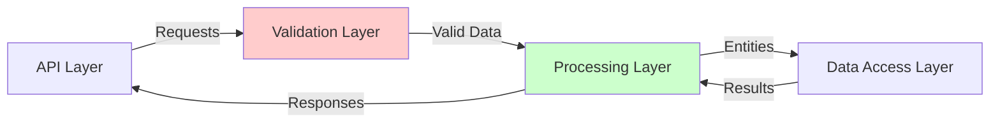

# Code Review Analysis Instructions

This document provides structured approaches for analyzing code during reviews. Following these instructions will help ensure a comprehensive and balanced assessment.

## Six Thinking Hats Analysis

The Six Thinking Hats method provides different perspectives for evaluating code:

| Hat | Focus | Key Questions |
|-----|-------|--------------|
| 🤍 **White** | Facts | What does the code actually do? What metrics can we measure? |
| ❤️ **Red** | Feelings | How maintainable is this code? What's the developer experience? |
| 🖤 **Black** | Caution | What could go wrong? What are the risks and vulnerabilities? |
| 💛 **Yellow** | Benefits | What works well? What patterns should we keep? |
| 💚 **Green** | Creativity | How could we improve this? What alternatives exist? |
| 💙 **Blue** | Process | How does this fit into the architecture? How is the workflow? |

### White Hat Analysis Examples

**Effective Example:**
```
The EntityProcessor class contains 15 methods with an average cyclomatic complexity of 12.
The class uses dependency injection for database access but creates file system dependencies directly.
Test coverage for this component is 67% with integration tests missing for batch processing scenarios.
The processor uses approximately 2MB of memory per 1000 entities processed.
```

**Ineffective Example:**
```
This code is complicated and seems to have a lot of methods.
It might have memory issues.
```

### Red Hat Analysis Examples

**Effective Example:**
```
The validation error messages lack context, making debugging difficult for developers.
The complex nesting of conditional statements in ProcessEntity() creates cognitive load.
The inconsistent naming conventions between EntityProcessor and DataProcessor create confusion.
The lack of comments in the complex algorithm sections frustrates new team members.
```

**Ineffective Example:**
```
This code feels messy and hard to understand.
I don't like how it's organized.
```

### Black Hat Analysis Examples

**Effective Example:**
```
The EntityValidator lacks input sanitization for external API data, creating potential XSS vulnerabilities.
The error handling pattern swallows exceptions in ProcessAsync(), hiding upstream errors from callers.
The database connection isn't disposed in error cases, leading to potential connection leaks.
Performance degrades exponentially with batch sizes over 500 entities due to O(n²) complexity in the merging algorithm.
```

**Ineffective Example:**
```
This code has bugs and security problems.
It probably won't work in production.
```

### Yellow Hat Analysis Examples

**Effective Example:**
```
The separation of validation and processing logic improves maintainability.
The use of async/await throughout the pipeline enables efficient I/O handling.
The comprehensive logging provides excellent operational visibility.
The strategy pattern in the EntityProcessor allows for flexible processing rules.
```

**Ineffective Example:**
```
Some parts of the code are good.
It works most of the time.
```

### Green Hat Analysis Examples

**Effective Example:**
```
Replacing the custom caching implementation with a standard CacheManager would reduce maintenance.
Implementing the Unit of Work pattern would simplify transaction management across repositories.
Converting the large EntityProcessor class into smaller, focused classes would improve testability.
Adding a circuit breaker for the external API calls would improve resilience.
```

**Ineffective Example:**
```
We should rewrite this in a different language.
Maybe add more comments.
```

### Blue Hat Analysis Examples

**Effective Example:**
```
The EntityProcessor sits between the API layer and data access layer, orchestrating the validation and transformation workflow.
The component follows a sequential processing pipeline but lacks clear error recovery paths.
The architecture mixes business logic and data access in several methods, violating separation of concerns.
The system uses a mix of synchronous and asynchronous patterns, creating potential deadlock scenarios.
```

**Ineffective Example:**
```
The architecture isn't great.
We should reorganize things.
```

## USASpending-Specific Analysis Patterns

### Entity Processing Patterns

When analyzing entity processing components, look for:

| Pattern | Good Example | Anti-Pattern |
|---------|-------------|--------------|
| Validation | Early validation with clear error messages | Nested validation with generic errors |
| Entity Lifecycle | Clear state transitions with audit trail | Implicit state management |
| Batch Processing | Chunked processing with progress tracking | All-or-nothing processing |
| Error Handling | Contextual errors with recovery options | Generic exceptions or swallowed errors |
| Resource Management | Explicit disposal in using blocks | Unmanaged resource creation |

**Common Issue Example:**
```csharp
// Anti-pattern: Resource leak in batch processing
public void ProcessEntities(List<Entity> entities)
{
    var connection = new DatabaseConnection();
    foreach (var entity in entities)
    {
        // Process entity using connection
        if (HasErrors(entity))
        {
            // Early return without disposing connection
            return;
        }
    }
    connection.Close(); // Only called in success path
}

// Recommended pattern:
public void ProcessEntities(List<Entity> entities)
{
    using (var connection = new DatabaseConnection())
    {
        foreach (var entity in entities)
        {
            // Process entity using connection
            if (HasErrors(entity))
            {
                // Log error and continue
                LogError(entity);
                continue;
            }
        }
    } // Connection automatically disposed
}
```

### Data Transformation Patterns

For data transformation code, evaluate:

| Aspect | Best Practice | Warning Sign |
|--------|--------------|------------|
| Mapping | Type-safe mapping with validation | String-based or dynamic mapping |
| Transformation | Pure functions with clear inputs/outputs | Side-effect heavy transformations |
| Formatting | Culture-aware formatting | Hardcoded formatting assumptions |
| Serialization | Explicit serialization control | Default serialization of domain objects |
| Performance | Streaming large datasets | Loading entire dataset into memory |

**Common Issue Example:**
```csharp
// Anti-pattern: Culture-insensitive parsing
public decimal ParseAmount(string input)
{
    return decimal.Parse(input); // Will fail with different culture settings
}

// Recommended pattern:
public decimal ParseAmount(string input)
{
    return decimal.Parse(input, CultureInfo.InvariantCulture);
}
```

### Configuration Management Patterns

For configuration systems, check:

| Pattern | Recommended Approach | Problem Pattern |
|---------|---------------------|----------------|
| Storage | Environment-specific encrypted storage | Hardcoded or embedded credentials |
| Access | Strongly-typed configuration with DI | Global static configuration access |
| Validation | Startup validation with meaningful errors | Runtime validation or no validation |
| Secrets | Secure secret provider integration | Plaintext secrets in configuration files |
| Defaults | Explicit reasonable defaults | Missing defaults causing NullReferenceException |

**Common Issue Example:**
```csharp
// Anti-pattern: Hardcoded configuration
public class ApiClient
{
    private readonly string _apiKey = "1234567890abcdef";
    
    public void CallApi() { /* ... */ }
}

// Recommended pattern:
public class ApiClient
{
    private readonly string _apiKey;
    
    public ApiClient(IConfiguration config)
    {
        _apiKey = config["ApiKey"] ?? throw new ArgumentException("ApiKey not configured");
    }
    
    public void CallApi() { /* ... */ }
}
```

### API Integration Patterns

When reviewing API integration code, evaluate:

| Pattern | Best Practice | Warning Sign |
|---------|--------------|------------|
| Authentication | Secure credential management | Hardcoded API keys |
| Resilience | Retry policies with exponential backoff | No retry handling |
| Error Handling | Response validation with specific errors | Generic exception handling |
| Caching | Appropriate cache policies | Excessive calls or no caching |
| Rate Limiting | Client-side throttling | No rate limit awareness |

**Common Issue Example:**
```csharp
// Anti-pattern: No resilience
public async Task<ApiResponse> GetDataAsync()
{
    var client = new HttpClient();
    var response = await client.GetAsync("https://api.example.com/data");
    response.EnsureSuccessStatusCode();
    return JsonSerializer.Deserialize<ApiResponse>(await response.Content.ReadAsStringAsync());
}

// Recommended pattern:
public async Task<ApiResponse> GetDataAsync()
{
    using var client = _httpClientFactory.CreateClient("ApiClient");
    
    // Retry with exponential backoff
    return await _retryPolicy.ExecuteAsync(async () => {
        var response = await client.GetAsync("https://api.example.com/data");
        response.EnsureSuccessStatusCode();
        return JsonSerializer.Deserialize<ApiResponse>(
            await response.Content.ReadAsStringAsync());
    });
}
```

## Integration of Analysis Perspectives

Effective code reviews combine multiple perspectives:

| Perspective | Questions to Ask |
|------------|------------------|
| Developer | Is the code clear, maintainable, and testable? |
| Operations | Is the code deployable, monitorable, and supportable? |
| Security | Is the code secure against known vulnerabilities? |
| Business | Does the code meet business requirements efficiently? |
| User | How does the code impact end-user experience? |
| Compliance | Does the code meet regulatory requirements? |

### Cross-Component Analysis

For issues that span multiple components:

1. **Trace the Flow**: Document how data or control flows between components
2. **Identify Boundaries**: Note where responsibilities transfer between components
3. **Check Consistency**: Ensure consistent patterns are used across boundaries
4. **Verify Contracts**: Confirm interfaces are well-defined and respected
5. **Test Integration**: Verify components work together as expected

### Integration Mapping Example



## Balancing Technical and Business Perspectives

When integrating findings from different analysis types:

1. **Link Technical Issues to Business Impact**

   | Technical Finding | Business Impact |
   |------------------|----------------|
   | Memory leak in EntityProcessor | System crashes during month-end processing |
   | Inefficient data transformation | Slow response times for users |
   | Missing input validation | Potential security breach risk |

2. **Prioritize Based on Combined Assessment**

   | Issue | Technical Severity | Business Impact | Combined Priority |
   |-------|-------------------|----------------|------------------|
   | Issue A | Medium | High | HIGH |
   | Issue B | High | Low | MEDIUM |
   | Issue C | Low | Low | LOW |

3. **Group Related Issues**
   - Group issues affecting the same component or function
   - Identify issues with shared root causes
   - Combine issues that should be fixed together

4. **Consider Implementation Strategy**
   - Quick wins (high impact, low effort)
   - Strategic improvements (high impact, high effort)
   - Maintenance items (low impact, low effort)
   - Questionable efforts (low impact, high effort)

## Analysis Documentation Examples

### Component Analysis

```
## Entity Processing Component

### Overview
The EntityProcessor handles validation, transformation, and storage of Award entities.

### Key Characteristics
- 15 classes, 2500 lines of code
- Average cyclomatic complexity: 12.3
- Test coverage: 67%
- Dependencies: DatabaseService, ValidationEngine, AuditLogger

### Critical Issues
1. **Memory Leak**: DatabaseConnection not disposed in batch processing
2. **Security Vulnerability**: Input validation bypass in ImportFromExternal()
3. **Performance Bottleneck**: O(n²) complexity in entity merging algorithm

### Strengths
1. Clear separation of concerns between validation and processing
2. Comprehensive audit logging
3. Effective use of async patterns for I/O operations

### Improvement Opportunities
1. Implement connection pooling to reduce resource usage
2. Add input sanitization for external data
3. Optimize merging algorithm to O(n log n) complexity
```

## Standard Validation Checklists

### Entity Processing Validation Checklist

- [ ] Input validation for all external data
- [ ] Proper resource disposal (IDisposable implementation)
- [ ] Transaction management for multi-entity operations
- [ ] Error handling with appropriate context
- [ ] Batch processing with chunking
- [ ] Proper logging at key points
- [ ] Performance considerations for large datasets
- [ ] Security validation for sensitive data
- [ ] Audit trail for entity changes
- [ ] Idempotent operations where appropriate

### API Security Validation Checklist

- [ ] Authentication for all endpoints
- [ ] Authorization checks for protected resources
- [ ] Input validation for all parameters
- [ ] Output encoding to prevent injection
- [ ] Rate limiting for public endpoints
- [ ] Appropriate error responses (no sensitive data)
- [ ] HTTPS enforcement
- [ ] API versioning strategy
- [ ] Sensitive data handling
- [ ] Logging of security events

### Performance Validation Checklist

- [ ] Database query optimization
- [ ] Appropriate indexing strategy
- [ ] Caching for frequent operations
- [ ] Pagination for large data sets
- [ ] Asynchronous operations for I/O
- [ ] Resource pooling (connections, threads)
- [ ] Memory usage monitoring
- [ ] Batch processing capabilities
- [ ] Response time monitoring
- [ ] Scaling considerations

## Review Output Structure

The review output should follow this structure:

1. **Executive Summary**
   - Overall assessment
   - Key findings
   - Recommendations summary

2. **Detailed Analysis**
   - Component-by-component review
   - Issue categories (Critical, Important, Minor)
   - Code examples with line numbers

3. **Recommendations**
   - Prioritized list of changes
   - Implementation suggestions
   - Expected benefits

4. **Metrics and Benchmarks**
   - Current performance metrics
   - Quality metrics
   - Targets for improvement

5. **Appendices**
   - Code samples
   - Technical diagrams
   - Reference materials

## Best Practices Summary

1. Use concrete examples with specific file paths and line numbers
2. Provide metrics where possible (complexity, coverage, performance)
3. Link technical issues to business impact
4. Include code examples for both problems and solutions
5. Use visual diagrams for complex relationships
6. Prioritize issues based on risk and impact
7. Group related issues to simplify implementation
8. Validate recommendations with examples
9. Consider implementation complexity in recommendations
10. Document both problems and strengths