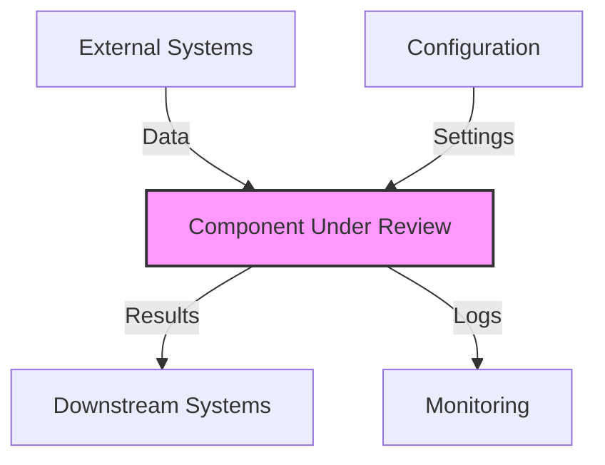
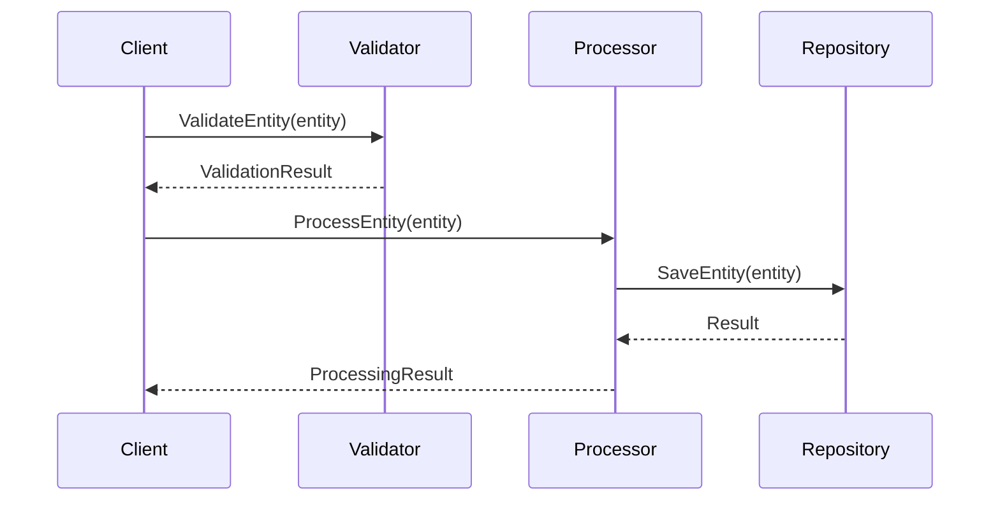
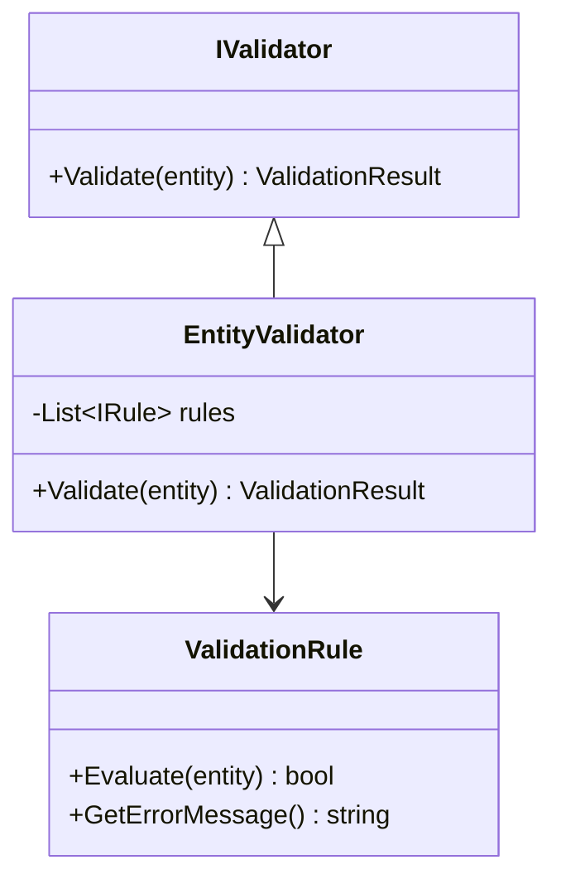
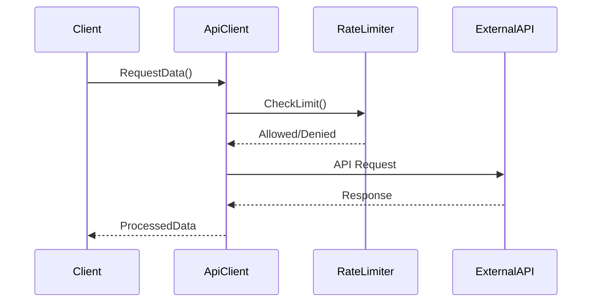
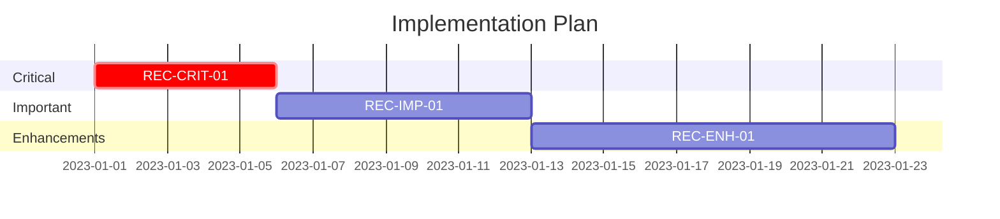

# USASpending Code Review Template

## Executive Summary

**Review Date**: YYYY-MM-DD  
**Reviewed By**: [Reviewer Name/ID]  
**Version Reviewed**: [Version/Commit]  
**Focus Areas**: [Performance/Security/Architecture/Compliance]

### Summary Assessment

[Provide a 2-3 sentence overall assessment of the code quality]

### Key Metrics

| Metric | Current Value | Target | Status |
|--------|--------------|--------|--------|
| Test Coverage | % | % | ✅/⚠️/❌ |
| Cyclomatic Complexity | # | # | ✅/⚠️/❌ |
| Critical Issues | # | # | ✅/⚠️/❌ |
| [Specific Metric] | # | # | ✅/⚠️/❌ |

### Recommendation Summary

[Brief overview of key recommendations - 3-5 bullets]

## Define Phase

### Review Scope

**Component(s) Reviewed**: [Component names]

**Files Examined**:
- `src/path/to/file1.cs`
- `src/path/to/file2.cs`
- `src/path/to/file3.cs`

**Review Objectives**:
1. [Objective 1]
2. [Objective 2]
3. [Objective 3]

### System Context



### Component Responsibilities

| Component | Primary Responsibility | Secondary Responsibilities |
|-----------|------------------------|----------------------------|
| [Component 1] | [Main purpose] | [Other functions] |
| [Component 2] | [Main purpose] | [Other functions] |
| [Component 3] | [Main purpose] | [Other functions] |

## Measure Phase

### Code Metrics

| Metric | Value | Analysis |
|--------|-------|----------|
| Lines of Code | # | [Brief assessment] |
| Cyclomatic Complexity | # | [Brief assessment] |
| Maintainability Index | # | [Brief assessment] |
| Test Coverage | % | [Brief assessment] |
| [Custom Metric] | # | [Brief assessment] |

### Performance Metrics

| Operation | Average Time | P95 Time | Memory Usage |
|-----------|--------------|----------|--------------|
| [Operation 1] | #ms | #ms | #MB |
| [Operation 2] | #ms | #ms | #MB |
| [Operation 3] | #ms | #ms | #MB |

### Code Smells

| Smell | Occurrences | Examples |
|-------|-------------|----------|
| [Smell 1] | # | `File.cs:Line` |
| [Smell 2] | # | `File.cs:Line` |
| [Smell 3] | # | `File.cs:Line` |

## Analyze Phase

### Critical Issues

#### [CRIT-01] [Issue Title]

**Location**: `src/path/to/file.cs:lineNumber`

**Analysis**: [Detailed description of the issue, including code snippets]

```csharp
// Example problematic code
public void Method() {
    // Issue details
}
```

**Impact**: [Description of the business/technical impact]

**Root Cause**: [Analysis of why this issue exists]

### Important Issues

#### [IMP-01] [Issue Title]

**Location**: `src/path/to/file.cs:lineNumber`

**Analysis**: [Detailed description of the issue, including code snippets]

**Impact**: [Description of the business/technical impact]

**Root Cause**: [Analysis of why this issue exists]

### Minor Issues

#### [MIN-01] [Issue Title]

**Location**: `src/path/to/file.cs:lineNumber`

**Analysis**: [Brief description of the issue]

**Impact**: [Brief impact description]

## Standard Component Analysis Templates

### Entity Processing Component Analysis

```
## Entity Processing Component

### Flow Diagram


### Key Processing Methods
- **Validation**: [Assessment of validation approach]
- **Transformation**: [Assessment of transformation logic]
- **Persistence**: [Assessment of storage mechanisms]
- **Error Handling**: [Assessment of error management]

### Metrics
- **Average Processing Time**: #ms per entity
- **Memory Usage**: #MB per 1000 entities
- **Error Rate**: #%

### Critical Areas
1. [Critical area 1]
2. [Critical area 2]
3. [Critical area 3]
```

### Data Validation Component Analysis

```
## Data Validation Component

### Validation Architecture


### Validation Strategy
- **Rule Organization**: [Assessment of rule structure]
- **Validation Flow**: [Assessment of validation process]
- **Error Reporting**: [Assessment of error handling]
- **Extensibility**: [Assessment of adding new rules]

### Metrics
- **Rule Count**: # validation rules
- **Validation Time**: #ms per entity
- **Failure Rate**: #% of entities fail validation

### Critical Areas
1. [Critical area 1]
2. [Critical area 2]
3. [Critical area 3]
```

### API Integration Component Analysis

```
## API Integration Component

### Integration Architecture


### Integration Patterns
- **Authentication**: [Assessment of auth mechanisms]
- **Resilience**: [Assessment of retry/circuit breakers]
- **Caching**: [Assessment of cache strategy]
- **Error Handling**: [Assessment of API errors]

### Metrics
- **Average Response Time**: #ms 
- **Error Rate**: #%
- **Cache Hit Rate**: #%

### Critical Areas
1. [Critical area 1]
2. [Critical area 2]
3. [Critical area 3]
```

## Improve Phase

### Recommendations

#### Critical Recommendations

1. **[REC-CRIT-01] [Recommendation Title]**
   - **Issue References**: CRIT-01, IMP-02
   - **Description**: [Detailed description]
   - **Implementation Approach**:
     ```csharp
     // Example implementation
     public void ImprovedMethod() {
         // Implementation details
     }
     ```
   - **Expected Benefits**: [List of benefits]
   - **Effort Estimate**: [Low/Medium/High] - [X days]

#### Important Recommendations

1. **[REC-IMP-01] [Recommendation Title]**
   - **Issue References**: IMP-01
   - **Description**: [Detailed description]
   - **Implementation Approach**: [General approach]
   - **Expected Benefits**: [List of benefits]
   - **Effort Estimate**: [Low/Medium/High] - [X days]

#### Enhancement Opportunities

1. **[REC-ENH-01] [Enhancement Title]**
   - **Description**: [Enhancement description]
   - **Benefits**: [List of benefits]
   - **Effort Estimate**: [Low/Medium/High] - [X days]

### Implementation Plan



## Control Phase

### Verification Plan

| Recommendation | Verification Method | Success Criteria | Owner |
|----------------|---------------------|------------------|-------|
| REC-CRIT-01 | [Test/Review method] | [Measurable outcome] | [Owner] |
| REC-IMP-01 | [Test/Review method] | [Measurable outcome] | [Owner] |
| REC-ENH-01 | [Test/Review method] | [Measurable outcome] | [Owner] |

### Regression Prevention

[Description of how to prevent similar issues in the future]

## Compliance Assessment Matrices

### ISO/IEC 20000 Compliance Matrix

| Control ID | Control Description | Current Status | Gap Analysis | Remediation |
|------------|---------------------|----------------|-------------|------------|
| 8.1 | Incident Management | ✅/⚠️/❌ | [Description] | [Actions] |
| 8.2 | Problem Management | ✅/⚠️/❌ | [Description] | [Actions] |
| 9.1 | Change Management | ✅/⚠️/❌ | [Description] | [Actions] |
| 9.2 | Release Management | ✅/⚠️/❌ | [Description] | [Actions] |

### ISO/IEC 27001 Compliance Matrix

| Control ID | Control Description | Current Status | Gap Analysis | Remediation |
|------------|---------------------|----------------|-------------|------------|
| A.9 | Access Control | ✅/⚠️/❌ | [Description] | [Actions] |
| A.10 | Cryptography | ✅/⚠️/❌ | [Description] | [Actions] |
| A.12 | Operations Security | ✅/⚠️/❌ | [Description] | [Actions] |
| A.14 | System Acquisition and Development | ✅/⚠️/❌ | [Description] | [Actions] |

## Appendices

### Appendix A: Code Examples

[Additional code examples or extended analysis]

### Appendix B: Technical Diagrams

[Additional diagrams explaining complex components or interactions]

### Appendix C: Reference Materials

[Links to relevant documentation, standards, or best practices]

## Changelog

| Version | Date | Author | Description |
|---------|------|--------|-------------|
| 1.0 | YYYY-MM-DD | [Author] | Initial review |
| 1.1 | YYYY-MM-DD | [Author] | Updated recommendations |