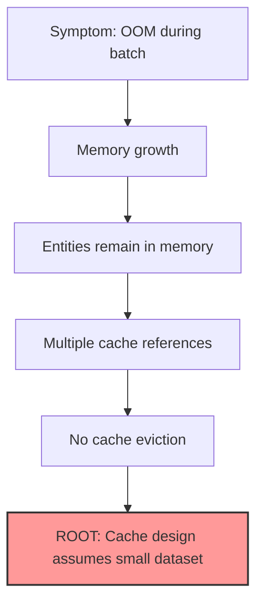
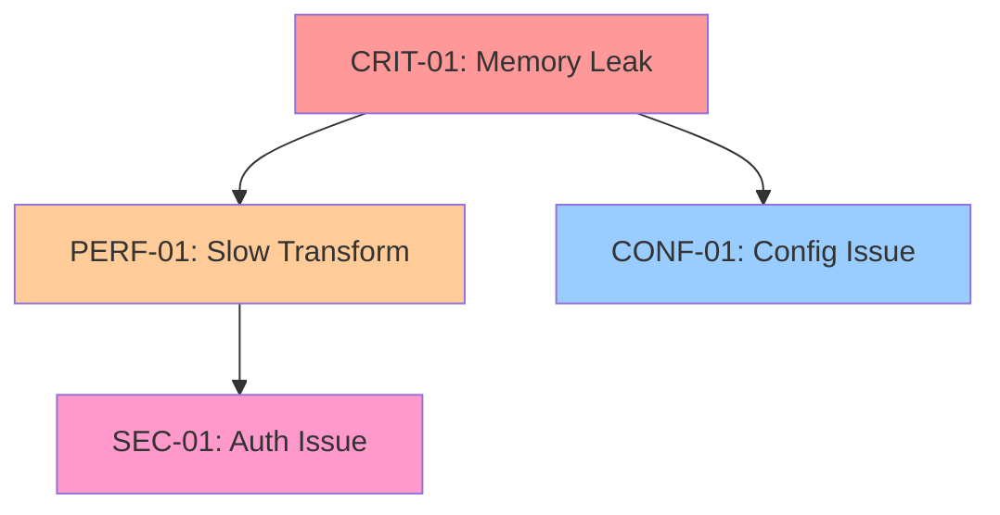
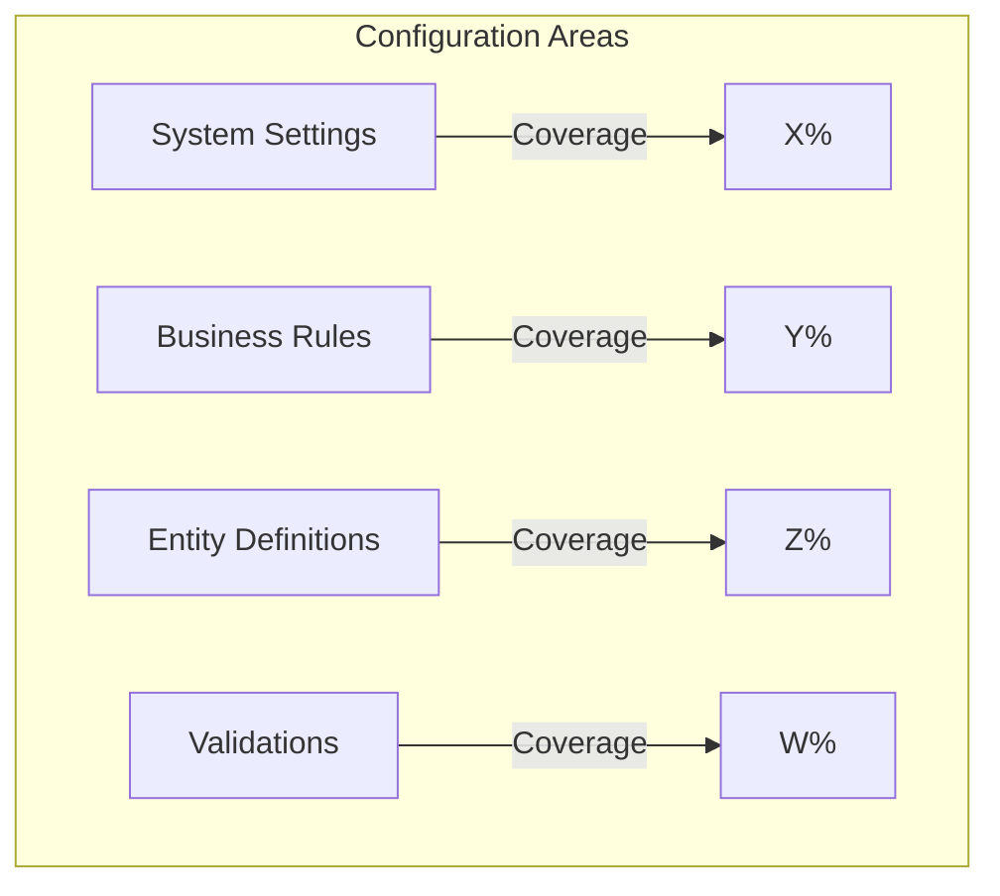
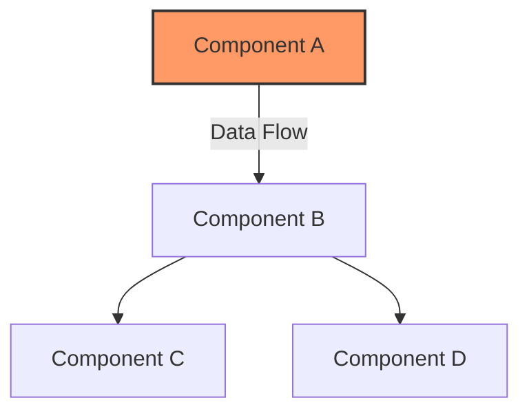
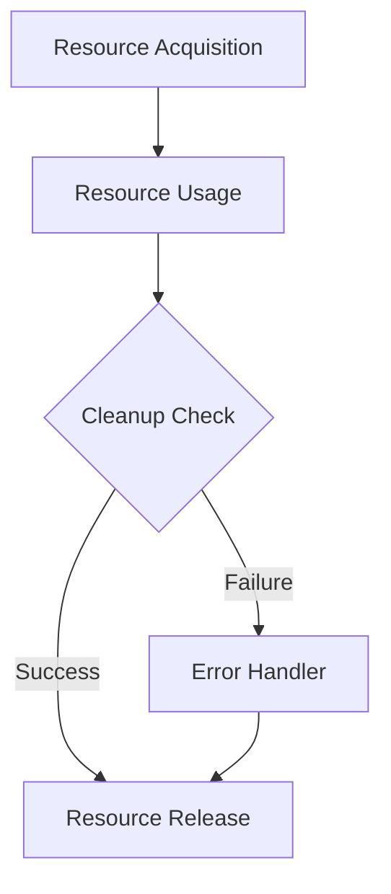
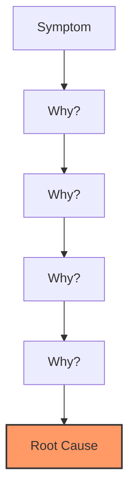
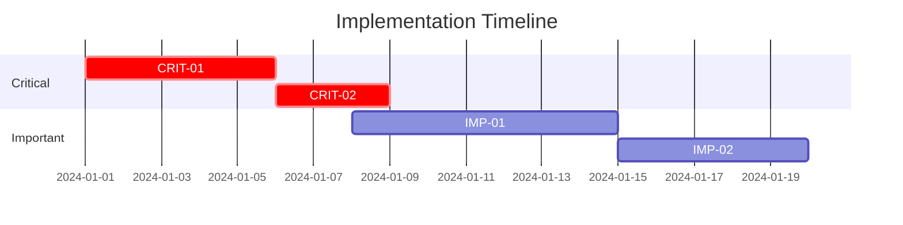
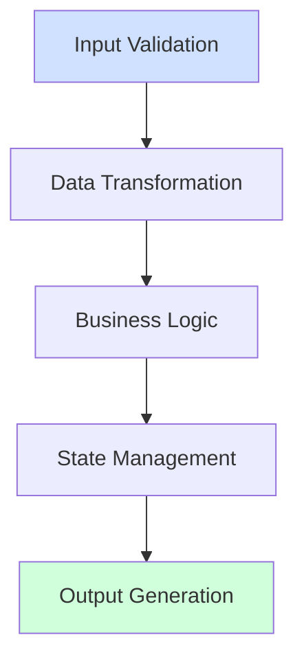

# Code Review Report

## Executive Summary

**Review Date**: [YYYY-MM-DD]  
**Reviewer**: [Name/ID]  
**Review Type**: [Performance/Security/Architecture/Full System]  
**Components**: [List of primary components reviewed]  
**Review Score**: [1-5 scale with 5 being best]

### Key Findings Summary

| Category | Critical | Important | Moderate | Minor |
|----------|----------|-----------|----------|-------|
| Functional | # | # | # | # |
| Configuration | # | # | # | # |
| Performance | # | # | # | # |
| Security | # | # | # | # |
| Reliability | # | # | # | # |

### Primary Recommendations

1. [Critical recommendation 1]
2. [Critical recommendation 2]
3. [Important recommendation 1]

### Impact Assessment

| Area | Current State | Risk Level | Business Impact |
|------|--------------|------------|-----------------|
| Configuration | [Metric] | High/Medium/Low | [Impact] |
| Performance | [Status] | High/Medium/Low | [Impact] |
| Security | [Status] | High/Medium/Low | [Impact] |
| Reliability | [Metric] | High/Medium/Low | [Impact] |

## Identified Issues and Analysis

### Issue Summary Matrix

| ID | Category | Severity | Component | Status | Priority |
|----|----------|----------|-----------|---------|----------|
| CRIT-01 | Functional | Critical | EntityProcessor | Open | P0 |
| PERF-01 | Performance | High | DataTransform | In Progress | P1 |
| SEC-01 | Security | Critical | Authentication | Open | P0 |
| CONF-01 | Configuration | Medium | ValidationRules | Open | P2 |

### Detailed Issue Analysis

#### [CRIT-01] Memory Leak in Entity Processing

**Description**: Memory usage grows unbounded during batch processing of entities.

**Root Cause Chain**:


**Evidence**:
- Memory profile shows 2MB growth per 1000 entities
- No memory release between batches
- Three separate references to each entity in different caches
- No cache size limits or eviction policies

**Impact**:
- System crashes during large batch jobs
- Processing limited to small batches
- Increased operational overhead
- Poor resource utilization

**Solution**:
1. Implement LRU cache with size limits
2. Add explicit cache eviction
3. Consolidate entity references
4. Add memory monitoring

**Verification**:
- Memory usage stable during batch processing
- No OOM errors under load
- Performance within targets
- Resource cleanup verified

#### [PERF-01] Inefficient Data Transformation

**Description**: Data transformation performance degrades exponentially with dataset size.

### Cross-Issue Impact Analysis



### Issue Dependencies and Resolution Order

| Issue ID | Blocks | Blocked By | Required First |
|----------|--------|------------|----------------|
| CRIT-01 | PERF-01, CONF-01 | None | Yes |
| PERF-01 | None | CRIT-01 | No |
| SEC-01 | None | None | Yes |
| CONF-01 | None | CRIT-01 | No |

### Resolution Impact Analysis

| Issue | Technical Impact | Business Impact | Resource Impact |
|-------|-----------------|-----------------|-----------------|
| CRIT-01 | High: System stability | High: System availability | Medium: Memory usage |
| PERF-01 | Medium: Response time | High: User experience | Low: CPU usage |
| SEC-01 | High: Security risk | Critical: Data protection | Low: All resources |
| CONF-01 | Low: Maintainability | Low: Development speed | Low: All resources |

### Risk Assessment

| Issue | Risk if Unresolved | Risk if Fixed | Mitigation Strategy |
|-------|-------------------|---------------|-------------------|
| CRIT-01 | System failure | Service interruption | Rolling update |
| PERF-01 | User dissatisfaction | Minor downtime | Off-hours deploy |
| SEC-01 | Security breach | API changes | Staged rollout |
| CONF-01 | Technical debt | None | Regular update |

### Solution Implementation Complexity

| Issue | Time Estimate | Resource Needs | Dependencies | Complexity |
|-------|--------------|----------------|--------------|------------|
| CRIT-01 | 3 days | 2 developers | Cache service | High |
| PERF-01 | 2 days | 1 developer | CRIT-01 | Medium |
| SEC-01 | 1 day | 1 developer | None | Low |
| CONF-01 | 4 hours | 1 developer | CRIT-01 | Low |

## Configuration Analysis

### Configuration Coverage



### Configuration vs Code Ratio

| Area | In Config | In Code | Target Ratio | Status |
|------|-----------|---------|--------------|--------|
| Business Rules | [X%] | [Y%] | >90% in config | ✅/⚠️/❌ |
| Validations | [X%] | [Y%] | >95% in config | ✅/⚠️/❌ |
| Transformations | [X%] | [Y%] | >90% in config | ✅/⚠️/❌ |
| Entity Definitions | [X%] | [Y%] | >95% in config | ✅/⚠️/❌ |

### Schema Validation Status

| Schema Type | Coverage | Validation Rate | Issues |
|-------------|----------|----------------|---------|
| System Config | [X%] | [Y%] | [Count] |
| Business Rules | [X%] | [Y%] | [Count] |
| Entity Schemas | [X%] | [Y%] | [Count] |
| Validations | [X%] | [Y%] | [Count] |

### Configuration Issues

#### Critical Configuration Issues

| Issue ID | Area | Description | Impact |
|----------|------|-------------|---------|
| [CFG-01] | [Area] | [Description] | [Impact] |

#### Important Configuration Issues

| Issue ID | Area | Description | Impact |
|----------|------|-------------|---------|
| [CFG-02] | [Area] | [Description] | [Impact] |

## System Context

### Component Architecture



### Key Metrics

| Metric | Current | Target | Status |
|--------|---------|--------|--------|
| Transaction Rate | X/sec | Y/sec | ✅/⚠️/❌ |
| Response Time | Xms | Yms | ✅/⚠️/❌ |
| Error Rate | X% | Y% | ✅/⚠️/❌ |
| Resource Usage | X% | Y% | ✅/⚠️/❌ |

## Component Analysis

### [Component Name] Analysis

#### Interface Contracts

```typescript
interface IComponentInterface {
    method1(param: Type): ReturnType;
    method2(param: Type): Promise<ReturnType>;
}
```

#### Performance Characteristics

| Metric | Value | Target | Status |
|--------|-------|--------|--------|
| Throughput | X/sec | Y/sec | ✅/⚠️/❌ |
| Latency | Xms | Yms | ✅/⚠️/❌ |
| Memory/Op | XMB | YMB | ✅/⚠️/❌ |
| Error Rate | X% | Y% | ✅/⚠️/❌ |

#### Resource Management



#### Code Quality Metrics

| Metric | Value | Target | Status |
|--------|-------|--------|--------|
| Cyclomatic Complexity | X | Y | ✅/⚠️/❌ |
| Maintainability Index | X | Y | ✅/⚠️/❌ |
| Test Coverage | X% | Y% | ✅/⚠️/❌ |
| Documentation Coverage | X% | Y% | ✅/⚠️/❌ |

## Issue Analysis

### Critical Issues

#### [CRIT-01] [Issue Title]

**Root Cause Analysis**:


**Evidence**:
```python
# Problematic code example
def problem_function():
    # Issue demonstration
    pass
```

**Impact**:
- Business Impact: [Description]
- Technical Impact: [Description]
- Security Impact: [Description]

**Recommendation**:
```python
# Recommended solution
def improved_function():
    # Solution demonstration
    pass
```

### Important Issues

#### [IMP-01] [Issue Title]

**Root Cause Analysis**:
- Primary Cause: [Description]
- Contributing Factors: [List]
- Verification Method: [Description]

**Evidence**:
- Code Location: [File path and line numbers]
- Runtime Behavior: [Description]
- Performance Impact: [Metrics]

**Recommendation**:
- Implementation Approach: [Description]
- Verification Steps: [List]
- Success Criteria: [Metrics]

## Performance Analysis

### Resource Utilization

| Resource | Current Usage | Peak Usage | Limit | Status |
|----------|---------------|------------|-------|--------|
| CPU | X% | Y% | Z% | ✅/⚠️/❌ |
| Memory | X% | Y% | Z% | ✅/⚠️/❌ |
| Disk I/O | X% | Y% | Z% | ✅/⚠️/❌ |
| Network | X% | Y% | Z% | ✅/⚠️/❌ |

### Performance Bottlenecks

| Component | Issue | Impact | Priority |
|-----------|-------|--------|----------|
| [Component] | [Description] | [Impact] | High/Medium/Low |

## Security Analysis

### Threat Assessment

| Threat | Likelihood | Impact | Risk Level |
|--------|------------|--------|------------|
| Threat 1 | High/Medium/Low | High/Medium/Low | High/Medium/Low |

### Security Controls

| Control | Status | Effectiveness |
|---------|--------|---------------|
| Input Validation | ✅/⚠️/❌ | High/Medium/Low |
| Authentication | ✅/⚠️/❌ | High/Medium/Low |
| Authorization | ✅/⚠️/❌ | High/Medium/Low |
| Data Protection | ✅/⚠️/❌ | High/Medium/Low |

### Vulnerability Analysis

| Vulnerability | CVSS Score | Status | Mitigation |
|--------------|------------|--------|------------|
| [VUL-01] | X.Y | Open/Fixed | [Description] |

## Compliance Analysis

### Standard Compliance

| Standard | Requirement | Status | Evidence |
|----------|------------|--------|----------|
| ISO 27001 | X.Y.Z | ✅/⚠️/❌ | [Reference] |
| GDPR | Article X | ✅/⚠️/❌ | [Reference] |
| SOC 2 | CC X.Y | ✅/⚠️/❌ | [Reference] |

### Code Standards

| Standard | Compliance % | Issues | Priority |
|----------|-------------|---------|----------|
| Style Guide | X% | # | High/Medium/Low |
| Best Practices | X% | # | High/Medium/Low |
| Documentation | X% | # | High/Medium/Low |

## Technical Debt Analysis

### Debt by Category

| Category | Impact | Effort | Priority |
|----------|--------|--------|----------|
| [Category] | High/Medium/Low | High/Medium/Low | High/Medium/Low |

### Maintenance Issues

| Issue | Impact | Fix Time | Priority |
|-------|--------|----------|----------|
| [Issue] | [Impact] | [Estimate] | High/Medium/Low |

## Recommendations

### Implementation Plan



### Prioritized Actions

| Action | Priority | Effort | Impact | Timeline |
|--------|----------|--------|---------|----------|
| Action 1 | P1 | High/Medium/Low | High/Medium/Low | Q1 2024 |
| Action 2 | P2 | High/Medium/Low | High/Medium/Low | Q2 2024 |
| Action 3 | P3 | High/Medium/Low | High/Medium/Low | Q3 2024 |

### Success Criteria

| Recommendation | Success Metric | Target | Measurement Method |
|----------------|----------------|--------|-------------------|
| REC-01 | [Metric] | [Target] | [Method] |
| REC-02 | [Metric] | [Target] | [Method] |
| REC-03 | [Metric] | [Target] | [Method] |

## Appendices

### A. Testing Results

| Test Suite | Pass Rate | Coverage | Issues |
|------------|-----------|----------|---------|
| Unit Tests | X% | Y% | # |
| Integration Tests | X% | Y% | # |
| Performance Tests | X% | N/A | # |

### B. Tool Analysis Results

| Tool | Version | Findings | Status |
|------|---------|----------|--------|
| Static Analysis | X.Y.Z | # | ✅/⚠️/❌ |
| Security Scan | X.Y.Z | # | ✅/⚠️/❌ |
| Performance Profile | X.Y.Z | # | ✅/⚠️/❌ |

### C. Detailed Metrics

| Metric | Min | Max | Average | P95 |
|--------|-----|-----|---------|-----|
| Metric 1 | X | Y | Z | W |
| Metric 2 | X | Y | Z | W |
| Metric 3 | X | Y | Z | W |

## Functional Analysis

### Import and Dependency Assessment

| Category | Status | Issues | Risk Level |
|----------|--------|--------|------------|
| Package Imports | ✅/⚠️/❌ | [Count] | High/Medium/Low |
| Version Compatibility | ✅/⚠️/❌ | [Count] | High/Medium/Low |
| Circular Dependencies | ✅/⚠️/❌ | [Count] | High/Medium/Low |
| Missing Dependencies | ✅/⚠️/❌ | [Count] | High/Medium/Low |

### Data Flow Analysis



| Flow Stage | Validation Status | Issues Found | Priority |
|------------|------------------|--------------|----------|
| Input Processing | ✅/⚠️/❌ | [Count] | High/Medium/Low |
| Transformation | ✅/⚠️/❌ | [Count] | High/Medium/Low |
| Business Logic | ✅/⚠️/❌ | [Count] | High/Medium/Low |
| State Management | ✅/⚠️/❌ | [Count] | High/Medium/Low |
| Output Generation | ✅/⚠️/❌ | [Count] | High/Medium/Low |

### Type System Analysis

| Category | Coverage | Issues | Status |
|----------|----------|--------|--------|
| Type Annotations | [X%] | [Count] | ✅/⚠️/❌ |
| Type Conversions | [X%] | [Count] | ✅/⚠️/❌ |
| Null Safety | [X%] | [Count] | ✅/⚠️/❌ |
| Generic Constraints | [X%] | [Count] | ✅/⚠️/❌ |

### Logic Implementation Assessment

| Component | Test Coverage | Bug Rate | Status |
|-----------|--------------|----------|--------|
| Business Rules | [X%] | [Y%] | ✅/⚠️/❌ |
| Error Handling | [X%] | [Y%] | ✅/⚠️/❌ |
| State Transitions | [X%] | [Y%] | ✅/⚠️/❌ |
| Resource Management | [X%] | [Y%] | ✅/⚠️/❌ |