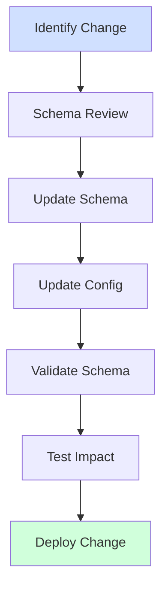
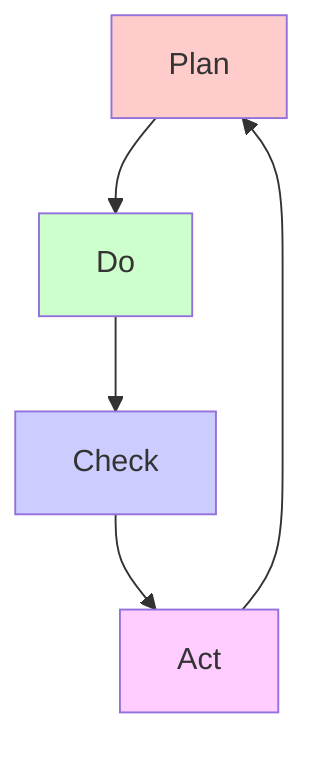
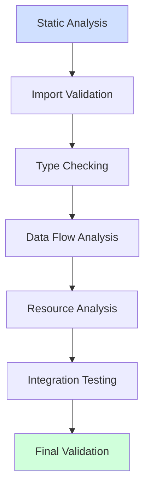

# Update Implementation Instructions

## Configuration Update Framework

### Configuration Change Workflow



### Configuration Update Process

1. **Schema Review**
   - Check existing schema coverage
   - Identify schema changes needed
   - Plan schema migration
   - Update validation rules

2. **Schema Update**
   - Update schema definitions
   - Add new validations
   - Update documentation
   - Version schema changes

3. **Configuration Update**
   - Apply schema changes
   - Update configuration
   - Validate against schema
   - Test changes

### Configuration Validation

| Validation Type | Method | Success Criteria |
|----------------|--------|------------------|
| Schema | Schema validator | No validation errors |
| Integration | Config loader | All configs load |
| Runtime | System tests | No runtime errors |
| Performance | Load tests | Meet performance targets |

## Implementation Framework

### PDCA Cycle Overview



### Plan Phase Requirements

1. **Baseline Collection**
   - Current performance metrics
   - Resource utilization patterns
   - Error rates and types
   - Integration points
   - Test coverage status

2. **Implementation Strategy**
   - Component update sequence
   - Resource management plans
   - Error handling improvements
   - Performance targets
   - Test strategy

3. **Success Criteria Definition**
   - Performance thresholds
   - Resource limits
   - Error rate targets
   - Test coverage goals

### Do Phase Requirements

1. **Code Changes**
   - Follow coding standards
   - Apply best practices
   - Update documentation
   - Add logging points
   - Update tests

2. **Testing Strategy**
   - Unit test updates
   - Integration test coverage
   - Performance test cases
   - Security validation

### Check Phase Requirements

1. **Validation Process**
   - Metric verification
   - Performance validation
   - Security checks
   - Compliance review

2. **Documentation Review**
   - Implementation details
   - Test results
   - Performance metrics
   - Issue resolution

### Act Phase Requirements

1. **Process Improvement**
   - Update standards
   - Enhance templates
   - Share learnings
   - Plan next cycle

2. **Knowledge Transfer**
   - Document patterns
   - Update guidelines
   - Share best practices
   - Train team members

## Success Criteria Framework

### Performance Success Metrics

| Component Type | Metric | Minimum | Target | Exceptional |
|---------------|--------|---------|--------|-------------|
| Entity Processor | Throughput | 1000/sec | 2000/sec | 5000/sec |
| API Service | Response Time | 500ms | 200ms | 50ms |
| Data Validator | Validation Rate | 500/sec | 1000/sec | 2000/sec |
| Cache Service | Hit Rate | 70% | 80% | 95% |

### Resource Utilization Targets

| Resource | Warning Level | Critical Level | Target Range |
|----------|--------------|----------------|--------------|
| Memory/Entity | >2KB | >5KB | 0.5-1KB |
| CPU/Operation | >50ms | >100ms | 10-30ms |
| DB Connections | >80% pool | >90% pool | 40-60% pool |
| File Handles | >1000 open | >2000 open | <500 open |

### Error Rate Standards

| Error Type | Acceptable | Warning | Critical |
|------------|------------|---------|----------|
| Validation | <0.1% | 0.1-1% | >1% |
| Processing | <0.01% | 0.01-0.1% | >0.1% |
| API | <0.01% | 0.01-0.1% | >0.1% |
| Data Loss | 0% | >0% | >0% |

## Validation Process

### Step 1: Baseline Measurement

#### Metric Collection
```python
def collect_baseline_metrics():
    return {
        'performance': collect_performance_metrics(),
        'resource': collect_resource_metrics(),
        'errors': collect_error_metrics(),
        'cache': collect_cache_metrics()
    }
```

#### Test Environment Setup
```python
def setup_test_environment():
    env = TestEnvironment()
    env.configure_data_volume(size='1M_entities')
    env.set_concurrency(level='production')
    env.enable_monitoring()
    return env
```

### Step 2: Implementation Testing

#### Unit Test Requirements
- All tests must pass
- Coverage >= 90%
- Include edge cases
- Test error paths

#### Integration Test Requirements
- Cross-component flows
- Resource cleanup
- Error propagation
- State consistency

### Step 3: Performance Validation

#### Load Test Requirements
```python
def validate_performance():
    assert throughput >= 2000, "Throughput below target"
    assert p95_latency <= 200, "Latency above target"
    assert error_rate <= 0.001, "Error rate above target"
    assert memory_growth <= 0.05, "Memory growth above target"
```

#### Stress Test Requirements
```python
def validate_stress_handling():
    assert peak_throughput >= 5000, "Peak throughput below target"
    assert recovery_time <= 1000, "Recovery too slow"
    assert no_memory_leaks(), "Memory leak detected"
    assert no_connection_leaks(), "Connection leak detected"
```

### Step 4: Security Validation

#### Code Security
- Static analysis passing
- No critical vulnerabilities
- Dependency checks clean
- Secure coding patterns

#### Runtime Security
- Authentication working
- Authorization enforced
- Data protection verified
- Audit logging complete

## Component Pattern Validation

### Resource Management Patterns

#### Memory Management
```python
class ResourceManager:
    def __init__(self):
        self.resources = []
    
    def acquire(self, resource):
        # Validation logic
        pass
    
    def release(self, resource):
        # Cleanup logic
        pass
    
    def __enter__(self):
        return self
    
    def __exit__(self, exc_type, exc_val, exc_tb):
        self.cleanup()
```

#### Connection Management
```python
class ConnectionPool:
    def __init__(self, min_size=5, max_size=20):
        self.pool = []
        self.min_size = min_size
        self.max_size = max_size
    
    def get_connection(self):
        # Connection handling logic
        pass
    
    def return_connection(self, conn):
        # Return logic with validation
        pass
```

### Error Handling Patterns

#### Retry Pattern
```python
def with_retry(max_attempts=3, backoff_factor=2):
    def decorator(func):
        def wrapper(*args, **kwargs):
            attempt = 0
            while attempt < max_attempts:
                try:
                    return func(*args, **kwargs)
                except RetryableError:
                    attempt += 1
                    if attempt < max_attempts:
                        time.sleep(backoff_factor ** attempt)
            raise MaxRetryError()
        return wrapper
    return decorator
```

#### Circuit Breaker Pattern
```python
class CircuitBreaker:
    def __init__(self, failure_threshold=5, reset_timeout=60):
        self.failures = 0
        self.threshold = failure_threshold
        self.timeout = reset_timeout
        self.last_failure = None
        self.state = 'CLOSED'
    
    def can_execute(self):
        if self.state == 'OPEN':
            if time.time() - self.last_failure > self.timeout:
                self.state = 'HALF_OPEN'
                return True
            return False
        return True
```

## Validation Checklists

### Component Update Checklist

- [ ] Baseline metrics collected
- [ ] Implementation completed
- [ ] Unit tests passing
- [ ] Integration tests passing
- [ ] Performance validated
- [ ] Security verified
- [ ] Documentation updated
- [ ] Code reviewed
- [ ] Deployment tested
- [ ] Monitoring configured

### Security Update Checklist

- [ ] Static analysis clean
- [ ] Dependencies secure
- [ ] Auth/Auth working
- [ ] Data protected
- [ ] Logging complete
- [ ] Audit trail valid
- [ ] Access controls tested
- [ ] Injection prevented
- [ ] XSS mitigated
- [ ] CSRF protected

### Performance Update Checklist

- [ ] Throughput meets targets
- [ ] Latency within limits
- [ ] Resource usage optimized
- [ ] Cache effective
- [ ] Memory stable
- [ ] CPU efficient
- [ ] I/O optimized
- [ ] Network efficient
- [ ] Database tuned
- [ ] Scaling verified

## Sign-off Requirements

### Technical Requirements
- [ ] All tests passing
- [ ] Performance targets met
- [ ] Resource usage within limits
- [ ] Error rates acceptable
- [ ] Security scan clean

### Documentation Requirements
- [ ] Implementation details complete
- [ ] Test results included
- [ ] Metrics documented
- [ ] Changes explained
- [ ] Impact assessed

### Process Requirements
- [ ] Code review completed
- [ ] Static analysis passed
- [ ] Security review done
- [ ] Performance verified
- [ ] Standards met

## Implementation Examples

### Resource Management Example

```python
# Before: Resource leak potential
def process_data(data):
    conn = get_connection()
    try:
        result = conn.execute(data)
        return result
    except Exception as e:
        log_error(e)
        raise
    # Connection not properly closed

# After: Proper resource management
def process_data(data):
    with ConnectionManager() as conn:
        try:
            result = conn.execute(data)
            return result
        except Exception as e:
            log_error(e)
            raise
```

### Error Handling Example

```python
# Before: Generic error handling
def validate_entity(entity):
    try:
        process_entity(entity)
    except Exception as e:
        log_error(e)
        return False

# After: Specific error handling with recovery
def validate_entity(entity):
    try:
        process_entity(entity)
    except ValidationError as e:
        log_validation_error(e)
        return Result.INVALID
    except ResourceError as e:
        log_resource_error(e)
        retry_with_backoff(lambda: process_entity(entity))
    except Exception as e:
        log_unexpected_error(e)
        raise SystemError(f"Unexpected error: {e}")
```

### Performance Optimization Example

```python
# Before: O(n²) complexity
def find_related(entities, target_type):
    related = []
    for entity in entities:
        for relation in entity.relations:
            if relation.type == target_type:
                related.append(relation)
    return related

# After: O(n) with indexing
def find_related(entities, target_type):
    relation_index = defaultdict(list)
    for entity in entities:
        relation_index[entity.type].extend(entity.relations)
    return relation_index.get(target_type, [])
```

## Metrics Collection Framework

### Performance Metrics

```python
class PerformanceMonitor:
    def __init__(self):
        self.metrics = defaultdict(list)
    
    @contextmanager
    def measure(self, operation):
        start = time.perf_counter()
        try:
            yield
        finally:
            duration = time.perf_counter() - start
            self.metrics[operation].append(duration)
    
    def get_stats(self, operation):
        durations = self.metrics[operation]
        return {
            'count': len(durations),
            'avg': statistics.mean(durations),
            'p95': statistics.quantiles(durations, n=20)[18],
            'max': max(durations)
        }
```

### Resource Metrics

```python
class ResourceMonitor:
    def __init__(self):
        self.snapshots = []
    
    def take_snapshot(self):
        snapshot = {
            'memory': psutil.Process().memory_info().rss,
            'cpu': psutil.Process().cpu_percent(),
            'threads': threading.active_count(),
            'handles': psutil.Process().num_handles()
        }
        self.snapshots.append((time.time(), snapshot))
    
    def analyze_growth(self):
        if len(self.snapshots) < 2:
            return None
        
        first = self.snapshots[0][1]
        last = self.snapshots[-1][1]
        duration = self.snapshots[-1][0] - self.snapshots[0][0]
        
        return {
            'memory_growth': (last['memory'] - first['memory']) / duration,
            'cpu_average': statistics.mean(s[1]['cpu'] for s in the snapshots),
            'thread_peak': max(s[1]['threads'] for s in the snapshots),
            'handle_leak': last['handles'] - first['handles']
        }
```

## Common Patterns and Anti-patterns

### Memory Management

✅ **Pattern**: Use context managers for resource cleanup
```python
with resource_manager.get_resource() as resource:
    process_data(resource)
# Resource automatically cleaned up
```

❌ **Anti-pattern**: Manual resource management
```python
resource = resource_manager.get_resource()
process_data(resource)
# Resource might not be cleaned up
```

### Error Handling

✅ **Pattern**: Specific exception handling with recovery
```python
try:
    process_entity(entity)
except ValidationError:
    handle_validation_error()
except ResourceError:
    retry_with_backoff()
```

❌ **Anti-pattern**: Catch-all exception handling
```python
try:
    process_entity(entity)
except Exception as e:
    log_error(e)
```

### Performance

✅ **Pattern**: Efficient data structures
```python
# O(1) lookup
entity_map = {entity.id: entity for entity in entities}
result = entity_map.get(target_id)
```

❌ **Anti-pattern**: Inefficient searches
```python
# O(n) lookup
result = next((e for e in entities if e.id == target_id), None)
```

## Documentation Requirements

### Implementation Documentation

```markdown
### [Component] Update Documentation

#### Changes Implemented
- [List specific changes with rationale]

#### Performance Impact
- Before: [metrics]
- After: [metrics]
- Improvement: [percentage/absolute]

#### Resource Usage
- Memory: [before/after]
- CPU: [before/after]
- I/O: [before/after]

#### Test Results
- Unit Tests: [results]
- Integration Tests: [results]
- Performance Tests: [results]

#### Known Limitations
- [List any known issues or constraints]
```

### Validation Documentation

```markdown
### Validation Results

#### Performance Validation
- [ ] Throughput >= 2000/sec
- [ ] P95 latency <= 200ms
- [ ] Error rate <= 0.1%

#### Resource Validation
- [ ] Memory growth <= 5%/hour
- [ ] CPU usage <= 70%
- [ ] Connection pool <= 60%

#### Security Validation
- [ ] Static analysis passed
- [ ] Penetration test passed
- [ ] Compliance verified
```

## Configuration Success Metrics

### Configuration Coverage

| Area | Current | Target | Method |
|------|---------|--------|---------|
| Business Rules | [X%] | >90% | Rule analysis |
| Validations | [X%] | >95% | Schema coverage |
| Transformations | [X%] | >90% | Config review |
| Entity Models | [X%] | >95% | Model analysis |

### Configuration Quality

| Metric | Target | Warning | Critical |
|--------|--------|---------|----------|
| Schema Coverage | >95% | 90-95% | <90% |
| Reuse Rate | >80% | 60-80% | <60% |
| Validation Rate | >98% | 95-98% | <95% |
| Load Time | <100ms | 100-500ms | >500ms |

## Functional Correctness Validation

### Pre-Implementation Validation

1. **Import Analysis**
```python
def validate_imports(module_path: str) -> Dict[str, List[str]]:
    """Validate all imports and dependencies."""
    return {
        'missing': find_missing_imports(module_path),
        'unused': find_unused_imports(module_path),
        'circular': find_circular_dependencies(module_path),
        'version_conflicts': check_version_compatibility(module_path)
    }
```

2. **Data Flow Validation**
```python
def validate_data_flow(component: Any) -> Dict[str, bool]:
    """Verify data flow correctness."""
    return {
        'input_validation': validate_input_handling(component),
        'transformations': validate_transformations(component),
        'state_management': validate_state_transitions(component),
        'output_generation': validate_output_formatting(component)
    }
```

### Implementation Requirements

#### 1. Import Management
- [ ] All imports are required and used
- [ ] No circular dependencies exist
- [ ] Version requirements are compatible
- [ ] Import organization is clean and logical

#### 2. Type System Requirements
- [ ] All parameters have type annotations
- [ ] Return types are specified
- [ ] Generic types are properly bounded
- [ ] Type conversions are safe and validated

#### 3. Data Flow Requirements
- [ ] Input validation is complete
- [ ] Data transformations are verified
- [ ] State changes are tracked
- [ ] Output is properly formatted

#### 4. Resource Management
- [ ] Resources are properly acquired
- [ ] Cleanup is guaranteed
- [ ] Error paths handle resources
- [ ] Memory usage is optimized

### Validation Process



### Validation Examples

#### Import Validation
```python
# Before: Problematic imports
import *  # Anti-pattern: wildcard import
from module import unused_function  # Unused import
import circular_dependency  # Creates cycle

# After: Clean imports
from module import (
    used_function_1,
    used_function_2
)
from typing import Dict, List, Optional
```

#### Type System Validation
```python
# Before: Missing types
def process_data(data):
    result = transform(data)
    return result

# After: Complete type annotations
def process_data(
    data: Dict[str, Any]
) -> Optional[List[Dict[str, str]]]:
    """Process data with full type safety."""
    result = transform(data)
    return result
```

#### Data Flow Validation
```python
# Before: Implicit data flow
def transform_entity(entity):
    entity['processed'] = True
    update_entity(entity)

# After: Explicit data flow
def transform_entity(
    entity: Dict[str, Any]
) -> TransformResult:
    """Transform entity with validation."""
    if not validate_entity(entity):
        raise ValidationError("Invalid entity")
    
    transformed = {**entity, 'processed': True}
    result = update_entity(transformed)
    
    if not validate_result(result):
        raise TransformError("Invalid result")
    
    return result
```

#### Resource Management
```python
# Before: Resource leak potential
def process_files(paths: List[str]) -> None:
    for path in paths:
        f = open(path)  # Resource leak
        process_file(f)

# After: Guaranteed cleanup
def process_files(paths: List[str]) -> None:
    """Process files with proper resource management."""
    for path in paths:
        with open(path) as f:  # Guaranteed cleanup
            process_file(f)
```

### Issue-Specific Validation

For each issue being fixed, create a specific validation plan:

```markdown
### [ISSUE-ID] Validation Plan

#### Functional Requirements
- [ ] Issue reproduction verified
- [ ] Root cause addressed
- [ ] Solution implemented
- [ ] Tests added

#### Validation Steps
1. Verify imports
2. Check type safety
3. Validate data flow
4. Test resource management
5. Run integration tests

#### Success Criteria
- All tests passing
- No type errors
- Clean resource usage
- No regressions
```
