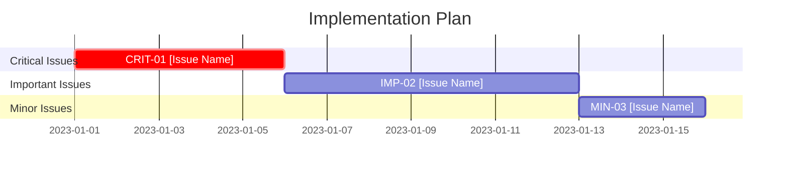

# USASpending Code Update Template

## Update Summary

**Update Date**: YYYY-MM-DD  
**Updated By**: [Name/ID]  
**Source Review**: [Link to original review]  
**Focus Areas**: [Performance/Security/Architecture/Compliance]

### Implementation Scope

**Issues Addressed**:
- [CRIT-01] [Issue Title]
- [IMP-02] [Issue Title]
- [MIN-03] [Issue Title]

### Impact Summary

| Area | Before | After | Improvement |
|------|--------|-------|-------------|
| Memory Usage | #MB | #MB | #% |
| Response Time | #ms | #ms | #% |
| Error Rate | #% | #% | #% |
| [Custom Metric] | # | # | #% |

### Key Changes

[Brief overview of key changes - 3-5 bullets]

## Plan Phase

### Issue Analysis

| Issue ID | Priority | Complexity | Dependencies | Impact |
|----------|----------|------------|--------------|--------|
| CRIT-01 | P1 | Complex | None | High |
| IMP-02 | P2 | Moderate | CRIT-01 | Medium |
| MIN-03 | P3 | Simple | None | Low |

### Implementation Strategy



### Success Criteria

| Issue ID | Success Criteria | Verification Method |
|----------|------------------|---------------------|
| CRIT-01 | [Measurable outcome] | [Test/Review method] |
| IMP-02 | [Measurable outcome] | [Test/Review method] |
| MIN-03 | [Measurable outcome] | [Test/Review method] |

## Do Phase

### Critical Issue Implementations

#### [CRIT-01] [Issue Title]

**Original Issue**: [Brief description from the review]

**Root Cause**: [Analysis of why the issue existed]

**Implementation**:

```csharp
// BEFORE: Original problematic code
public void ProcessEntities(List<Entity> entities)
{
    var connection = new DatabaseConnection();
    foreach (var entity in entities)
    {
        // Process entity using connection
    }
    // Connection never disposed
}

// AFTER: Improved implementation
public void ProcessEntities(List<Entity> entities)
{
    using (var connection = new DatabaseConnection())
    {
        foreach (var entity in entities)
        {
            // Process entity using connection
        }
    } // Connection automatically disposed
}
```

**Implementation Notes**:
- Added `using` statement to ensure proper database connection disposal
- Added validation to prevent processing invalid entities
- Improved error handling to ensure resources are cleaned up
- Updated unit tests to verify proper disposal

### Important Issue Implementations

#### [IMP-02] [Issue Title]

**Original Issue**: [Brief description from the review]

**Root Cause**: [Analysis of why the issue existed]

**Implementation**:

```csharp
// BEFORE: Inefficient data transformation
public IEnumerable<OutputDto> TransformData(IEnumerable<InputData> data)
{
    var results = new List<OutputDto>();
    foreach (var item in data)
    {
        var output = new OutputDto();
        // ... transformation logic
        results.Add(output);
    }
    return results;
}

// AFTER: Optimized transformation using LINQ
public IEnumerable<OutputDto> TransformData(IEnumerable<InputData> data)
{
    return data.Select(item => new OutputDto
    {
        // ... transformation logic
    });
}
```

**Implementation Notes**:
- Replaced inefficient foreach loop with LINQ
- Eliminated unnecessary intermediate list creation
- Reduced memory allocations by using deferred execution
- Added performance tests to verify improvement

### Minor Issue Implementations

#### [MIN-03] [Issue Title]

**Original Issue**: [Brief description from the review]

**Implementation**:

```csharp
// BEFORE: Inconsistent naming
public void Process_data(string Data)
{
    // Implementation
}

// AFTER: Consistent naming following standards
public void ProcessData(string data)
{
    // Implementation
}
```

**Implementation Notes**:
- Standardized method and parameter naming
- Applied consistent casing conventions
- Updated calling code for new method signatures
- Ran style checker to verify compliance

## Standard Implementation Patterns

### Memory Management Pattern

```csharp
// Anti-pattern: Manual resource management
var resource = new ExpensiveResource();
try
{
    // Use resource
}
finally
{
    resource.Dispose();
}

// Recommended pattern: Using statement
using (var resource = new ExpensiveResource())
{
    // Use resource
} // Automatically disposed
```

### Async/Await Pattern

```csharp
// Anti-pattern: Blocking async calls
public void ProcessData()
{
    var result = GetDataAsync().Result; // Blocks thread, potential deadlock
    // Process result
}

// Recommended pattern: Async all the way
public async Task ProcessDataAsync()
{
    var result = await GetDataAsync(); // Non-blocking
    // Process result
}
```

### Validation Pattern

```csharp
// Anti-pattern: Nested validation
public void ProcessEntity(Entity entity)
{
    if (entity != null)
    {
        if (entity.Id > 0)
        {
            if (!string.IsNullOrEmpty(entity.Name))
            {
                // Process valid entity
            }
        }
    }
}

// Recommended pattern: Early validation
public void ProcessEntity(Entity entity)
{
    // Validate all preconditions upfront
    if (entity == null)
        throw new ArgumentNullException(nameof(entity));
        
    if (entity.Id <= 0)
        throw new ArgumentException("Invalid ID", nameof(entity));
        
    if (string.IsNullOrEmpty(entity.Name))
        throw new ArgumentException("Name is required", nameof(entity));
    
    // Process valid entity
}
```

## Check Phase

### Verification Results

| Issue ID | Success Criteria | Result | Status |
|----------|------------------|--------|--------|
| CRIT-01 | [Criteria from Plan] | [Actual result] | ✅/⚠️/❌ |
| IMP-02 | [Criteria from Plan] | [Actual result] | ✅/⚠️/❌ |
| MIN-03 | [Criteria from Plan] | [Actual result] | ✅/⚠️/❌ |

### Performance Metrics

#### Memory Usage

```
Before: 145MB peak memory usage during batch processing
After:   87MB peak memory usage during batch processing
Improvement: 40% reduction in memory consumption
```

```mermaid
bar
    title Memory Usage Comparison (MB)
    "Before" : 145
    "After"  : 87
```

#### Response Time

```
Before: 450ms average response time for entity processing
After:   380ms average response time for entity processing
Improvement: 15.5% faster processing
```

```mermaid
bar
    title Response Time Comparison (ms)
    "Before" : 450
    "After"  : 380
```

### Test Results

| Test Type | Pass | Fail | Skipped | Coverage |
|-----------|------|------|---------|----------|
| Unit Tests | # | # | # | #% |
| Integration Tests | # | # | # | #% |
| Performance Tests | # | # | # | N/A |

### Code Quality Metrics

| Metric | Before | After | Change |
|--------|--------|-------|--------|
| Cyclomatic Complexity | # | # | #% |
| Maintainability Index | # | # | #% |
| Lines of Code | # | # | #% |
| Technical Debt (hours) | # | # | #% |

## Act Phase

### Standardization

**Changes to Coding Standards**:
- [Any standards updated as a result]
- [New patterns established]
- [Anti-patterns documented]

**Documentation Updates**:
- [List of documentation updated]
- [New examples added]
- [Guidelines revised]

### Knowledge Sharing

**Key Learnings**:
- [Important insight 1]
- [Important insight 2]
- [Important insight 3]

**Best Practices Identified**:
- [Best practice 1]
- [Best practice 2]
- [Best practice 3]

### Follow-up Actions

| Action Item | Owner | Due Date | Priority |
|-------------|-------|----------|----------|
| [Action 1] | [Owner] | YYYY-MM-DD | High/Medium/Low |
| [Action 2] | [Owner] | YYYY-MM-DD | High/Medium/Low |
| [Action 3] | [Owner] | YYYY-MM-DD | High/Medium/Low |

## Compliance Verification Checklists

### ISO/IEC 20000 Verification

| Control | Requirement | Implementation | Status |
|---------|------------|----------------|--------|
| 8.1 | Incident Management Process | [How changes support this] | ✅/⚠️/❌ |
| 8.2 | Problem Management Process | [How changes support this] | ✅/⚠️/❌ |
| 9.1 | Change Management Process | [How changes support this] | ✅/⚠️/❌ |
| 9.2 | Release Management Process | [How changes support this] | ✅/⚠️/❌ |

### ISO/IEC 27001 Verification

| Control | Requirement | Implementation | Status |
|---------|------------|----------------|--------|
| A.9 | Access Control | [How changes support this] | ✅/⚠️/❌ |
| A.10 | Cryptography | [How changes support this] | ✅/⚠️/❌ |
| A.12 | Operations Security | [How changes support this] | ✅/⚠️/❌ |
| A.14 | System Development | [How changes support this] | ✅/⚠️/❌ |

## Appendices

### Appendix A: Detailed Performance Analysis

[Detailed performance metrics, graphs, and analysis]

### Appendix B: Code Change Details

[Additional code examples and technical details]

### Appendix C: Testing Artifacts

[Test scripts, results, and validation evidence]