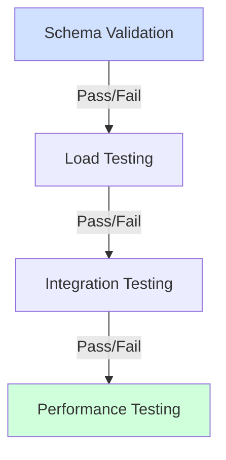
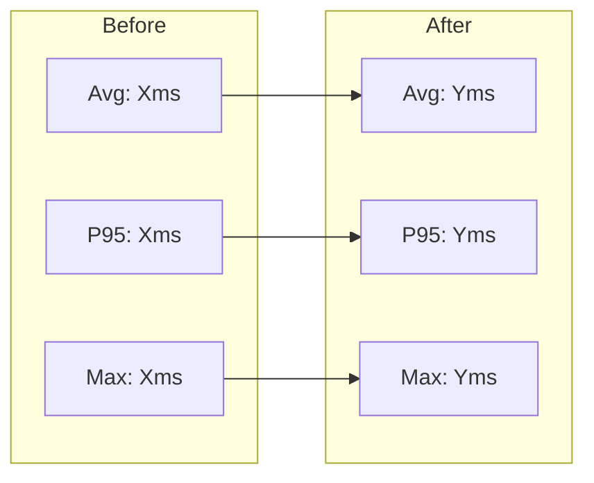

# Implementation Update Report

## Update Overview

**Update Date**: [YYYY-MM-DD]
**Implementer**: [Name/Team]
**Update Type**: [Configuration/Code/Both]
**Components**: [List affected components]
**Review Reference**: [Link to original review]

## Configuration Changes

### Schema Updates

| Schema | Change Type | Breaking? | Migration Required |
|--------|------------|-----------|-------------------|
| [Name] | Added/Modified/Removed | Yes/No | Yes/No |

#### Schema Migration Plan
```yaml
# Example schema migration
old_schema:
  field: string
  
new_schema:
  field:
    type: string
    format: email
    required: true
```

### Business Rule Updates

| Rule Area | Change | Impact | Validation Status |
|-----------|--------|--------|-------------------|
| [Area] | [Description] | [Impact] | ✅/⚠️/❌ |

### Entity Model Changes

| Entity | Change | Migration | Status |
|--------|--------|-----------|--------|
| [Name] | [Description] | Required/Optional | ✅/⚠️/❌ |

### Configuration Metrics

| Metric | Before | After | Target | Status |
|--------|--------|-------|--------|--------|
| Schema Coverage | [X%] | [Y%] | >95% | ✅/⚠️/❌ |
| Rule Coverage | [X%] | [Y%] | >90% | ✅/⚠️/❌ |
| Validation Rate | [X%] | [Y%] | >98% | ✅/⚠️/❌ |
| Config Load Time | [Xms] | [Yms] | <100ms | ✅/⚠️/❌ |

## Code Changes

### Critical Changes

| Change ID | Description | Files Changed | Status |
|-----------|-------------|---------------|--------|
| [CHG-01] | [Description] | [Files] | Complete/In Progress |

### Important Changes

| Change ID | Description | Files Changed | Status |
|-----------|-------------|---------------|--------|
| [CHG-02] | [Description] | [Files] | Complete/In Progress |

### Code Metrics

| Metric | Before | After | Target | Status |
|--------|--------|-------|--------|--------|
| Test Coverage | [X%] | [Y%] | >90% | ✅/⚠️/❌ |
| Complexity | [X] | [Y] | <10 | ✅/⚠️/❌ |
| Dependencies | [X] | [Y] | <5 | ✅/⚠️/❌ |
| Error Handlers | [X%] | [Y%] | 100% | ✅/⚠️/❌ |

## Validation Results

### Configuration Validation



| Test Type | Result | Issues Found | Status |
|-----------|--------|--------------|--------|
| Schema | [Result] | [Count] | ✅/⚠️/❌ |
| Load | [Result] | [Count] | ✅/⚠️/❌ |
| Integration | [Result] | [Count] | ✅/⚠️/❌ |
| Performance | [Result] | [Count] | ✅/⚠️/❌ |

### Code Validation

| Test Suite | Pass Rate | Coverage | Issues |
|------------|-----------|----------|---------|
| Unit | [X%] | [Y%] | [Count] |
| Integration | [X%] | [Y%] | [Count] |
| Performance | [X%] | N/A | [Count] |

## Performance Impact

### Response Time Changes



### Resource Utilization

| Resource | Before | After | Target | Status |
|----------|--------|-------|--------|--------|
| Memory | [X] | [Y] | [Target] | ✅/⚠️/❌ |
| CPU | [X%] | [Y%] | [Target] | ✅/⚠️/❌ |
| Disk I/O | [X] | [Y] | [Target] | ✅/⚠️/❌ |
| Network | [X] | [Y] | [Target] | ✅/⚠️/❌ |

## Issues and Risks

### Implementation Issues

| Issue | Impact | Resolution | Status |
|-------|--------|------------|--------|
| [ISS-01] | [Impact] | [Resolution] | Open/Resolved |

### Identified Risks

| Risk | Likelihood | Impact | Mitigation |
|------|------------|--------|------------|
| [RISK-01] | High/Medium/Low | [Impact] | [Strategy] |

## Next Steps

### Remaining Work

| Task | Priority | Effort | Timeline |
|------|----------|--------|----------|
| [Task-01] | High/Medium/Low | [Est.] | [Date] |

### Follow-up Actions

| Action | Owner | Due Date | Status |
|--------|-------|----------|--------|
| [Action-01] | [Name] | [Date] | Not Started |

## Sign-off

### Quality Gates

- [ ] All schema validations passing
- [ ] Configuration load tests successful
- [ ] Integration tests passing
- [ ] Performance targets met
- [ ] Security requirements satisfied

### Approvals

| Role | Name | Status | Date |
|------|------|--------|------|
| Technical Lead | [Name] | ✅/⚠️/❌ | [Date] |
| Security Review | [Name] | ✅/⚠️/❌ | [Date] |
| QA Validation | [Name] | ✅/⚠️/❌ | [Date] |

## Appendices

### A. Configuration Changes
[Detailed configuration changes with before/after comparisons]

### B. Test Results
[Comprehensive test results and analysis]

### C. Performance Data
[Detailed performance metrics and comparisons]

### D. Migration Scripts
[Any required configuration or data migration scripts]