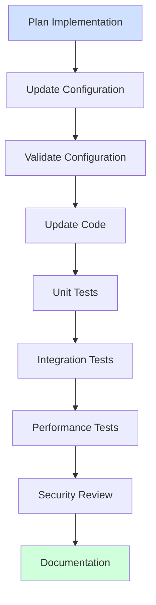
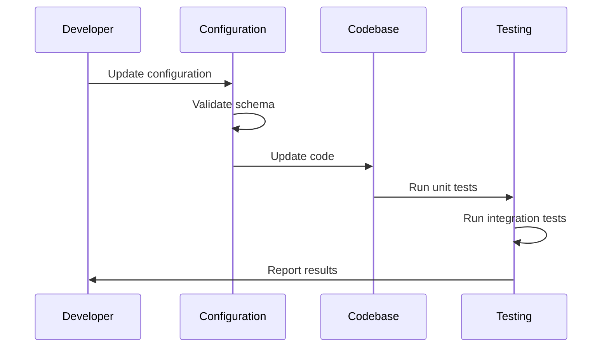

# Implementation Instructions

## Overview

This document provides structured guidance for implementing changes identified during code reviews, with emphasis on configuration-driven development and systematic validation.

## Implementation Process



## Configuration Implementation

### 1. Configuration Changes

Before modifying any code, implement all possible changes through configuration:

1. **Schema Updates**
   - Review schema requirements
   - Update schema definitions
   - Validate schema changes
   - Create migration path

2. **Business Rules**
   - Implement rules in YAML
   - Define validation logic
   - Set transformation rules
   - Configure workflows

3. **Entity Configuration**
   - Update entity definitions
   - Define relationships
   - Set validation rules
   - Configure transformations

### 2. Configuration Validation

| Category | Validation Method | Success Criteria |
|----------|------------------|------------------|
| Schema | Schema validation | No validation errors |
| Rules | Rule execution | Expected outcomes |
| Integration | Config loading | All configs load |
| Performance | Load testing | Meet performance targets |

### 3. Migration Strategy

```yaml
# Example migration configuration
migration:
  version: '2.0'
  steps:
    - name: 'Update entity schema'
      type: 'schema_update'
      targetEntities: ['entity_a', 'entity_b']
    - name: 'Data transformation'
      type: 'data_migration'
      script: 'migration_v2.py'
```

## Code Implementation

### 1. Code Architecture

Maintain clear separation between configuration and implementation:

```python
class ConfigurableComponent:
    def __init__(self, config: Dict):
        self.config = config
        self.validate_config()
    
    def validate_config(self):
        # Validate configuration
        pass
    
    def process(self, data: Any) -> Any:
        # Use configuration to drive processing
        rules = self.config['rules']
        return self.apply_rules(data, rules)
```

### 2. Implementation Patterns

#### Configuration Loading
```python
# Good: Configuration-driven behavior
class Validator:
    def __init__(self, config_path: str):
        self.config = load_yaml_config(config_path)
        self.rules = self.config['validation_rules']
    
    def validate(self, data: Dict) -> bool:
        return all(self.apply_rule(data, rule) 
                  for rule in self.rules)

# Avoid: Hardcoded behavior
class HardcodedValidator:
    def validate(self, data: Dict) -> bool:
        # Hardcoded rules - Anti-pattern
        if data['field'] < 0:
            return False
        return True
```

#### Error Handling
```python
class ConfigError(Exception):
    """Configuration-related errors"""
    pass

class ValidationError(Exception):
    """Validation-related errors"""
    pass

def load_config(path: str) -> Dict:
    try:
        return load_yaml_config(path)
    except YAMLError as e:
        raise ConfigError(f"Invalid config: {e}")
```

### 3. Testing Strategy

#### Unit Tests
```python
def test_config_loading():
    config = load_config('test_config.yaml')
    assert 'validation_rules' in config
    assert len(config['validation_rules']) > 0

def test_rule_application():
    validator = Validator('rules.yaml')
    result = validator.validate(test_data)
    assert result.is_valid
```

#### Integration Tests
```python
def test_end_to_end():
    # Load config
    config = load_config('prod_config.yaml')
    
    # Initialize components
    processor = Processor(config)
    validator = Validator(config)
    
    # Process and validate
    result = processor.process(test_data)
    assert validator.validate(result)
```

## Validation Framework

### 1. Configuration Validation

```python
def validate_configuration(config: Dict) -> List[str]:
    errors = []
    
    # Schema validation
    schema_errors = validate_schema(config)
    errors.extend(schema_errors)
    
    # Rule validation
    rule_errors = validate_rules(config)
    errors.extend(rule_errors)
    
    # Integration validation
    integration_errors = validate_integration(config)
    errors.extend(integration_errors)
    
    return errors
```

### 2. Runtime Validation

| Test Type | Focus | Success Criteria |
|-----------|-------|-----------------|
| Unit | Component behavior | All tests pass |
| Integration | System flow | End-to-end success |
| Performance | System metrics | Meet targets |
| Security | Risk mitigation | No vulnerabilities |

## Functional Implementation Framework

### Core Implementation Steps

1. **Import and Dependency Management**
   - Verify all imports before changes
   - Update dependency versions
   - Remove unused imports
   - Resolve circular dependencies
   - Check import organization

2. **Type System Implementation**
   - Complete type annotations
   - Verify type conversions
   - Add generic constraints
   - Ensure null safety
   - Validate interfaces

3. **Data Flow Implementation**
   - Input validation
   - Data transformation
   - State management
   - Error propagation
   - Output formatting

### Functional Validation Process

#### Pre-Implementation Validation
```python
# Example validation decorator
def validate_inputs(func):
    @wraps(func)
    def wrapper(*args, **kwargs):
        # Validate inputs
        validate_arguments(args, kwargs)
        # Process function
        result = func(*args, **kwargs)
        # Validate output
        validate_result(result)
        return result
    return wrapper
```

#### Implementation Validation
```python
# Example type-safe implementation
from typing import Optional, List, Dict

class DataProcessor:
    def process_data(self, data: Dict[str, Any]) -> Optional[List[Dict]]:
        try:
            # Validate input
            self._validate_input(data)
            # Transform data
            result = self._transform_data(data)
            # Validate output
            self._validate_output(result)
            return result
        except ValidationError as e:
            self._handle_validation_error(e)
        except TransformError as e:
            self._handle_transform_error(e)
        return None
```

### Validation Checklist

#### Import Validation
- [ ] All imports resolved
- [ ] No unused imports
- [ ] Versions compatible
- [ ] Circular dependencies resolved
- [ ] Import organization clean

#### Type System Validation
- [ ] All type hints added
- [ ] Generic bounds correct
- [ ] Null handling complete
- [ ] Interface contracts met
- [ ] Type conversions safe

#### Data Flow Validation
- [ ] Input validation complete
- [ ] Transformations verified
- [ ] State changes tracked
- [ ] Error handling tested
- [ ] Output validated

## Implementation Checklist

### Configuration Phase
- [ ] Schema updates complete
- [ ] Business rules defined
- [ ] Entity configurations updated
- [ ] Migration plan documented
- [ ] Schema validation passing

### Code Phase
- [ ] Configuration loading implemented
- [ ] Rule processors updated
- [ ] Error handling complete
- [ ] Unit tests passing
- [ ] Integration tests passing

### Validation Phase
- [ ] Performance tests passing
- [ ] Security review complete
- [ ] Configuration validated
- [ ] Migration tested
- [ ] Documentation updated

## Security Considerations

### 1. Configuration Security
- Validate all configuration inputs
- Secure sensitive configuration data
- Implement access controls
- Audit configuration changes

### 2. Implementation Security
- Follow secure coding guidelines
- Implement input validation
- Use secure dependencies
- Apply security patterns

## Documentation Requirements

### 1. Configuration Documentation
```markdown
### Configuration Changes
- Schema updates:
  - [List changes]
- Business rules:
  - [List changes]
- Migration steps:
  - [List steps]
```

### 2. Implementation Documentation
```markdown
### Code Changes
- Components updated:
  - [List components]
- New functionality:
  - [List features]
- Migration scripts:
  - [List scripts]
```

## Best Practices

### Configuration Management
1. Use schema validation
2. Maintain version control
3. Document all changes
4. Test migrations thoroughly

### Code Implementation
1. Follow SOLID principles
2. Write comprehensive tests
3. Handle errors gracefully
4. Document complex logic

### Validation Process
1. Start with configuration
2. Validate incrementally 
3. Test thoroughly
4. Document results

## Post-Implementation

### 1. Verification
- Run all test suites
- Validate configurations
- Check performance metrics
- Review security

### 2. Documentation
- Update technical docs
- Document changes
- Record metrics
- Note limitations

### 3. Monitoring
- Configure alerts
- Set up logging
- Monitor performance
- Track errors

## Example Workflow



## Issue Resolution Framework

### 1. Issue Analysis and Planning

Before implementing fixes:

1. **Root Cause Verification**
   - Validate issue reproduction
   - Confirm root cause chain
   - Identify related components
   - Check dependencies

2. **Implementation Scope**
   - Define change boundaries
   - List affected files
   - Identify test requirements
   - Plan validation steps

3. **Change Impact Analysis**
   - Assess dependency impact
   - Check interface changes
   - Review data flow effects
   - Consider performance impact

### 2. Implementation Process

For each identified issue:

1. **Pre-Implementation**
   ```python
   def prepare_implementation(issue_id: str) -> Dict[str, Any]:
       """Prepare for implementing a fix."""
       return {
           'affected_files': find_affected_files(issue_id),
           'dependencies': analyze_dependencies(issue_id),
           'test_requirements': get_test_requirements(issue_id),
           'validation_plan': create_validation_plan(issue_id)
       }
   ```

2. **Implementation Steps**
   ```python
   def implement_fix(issue_id: str, plan: Dict[str, Any]) -> bool:
       """Implement fix with validation."""
       try:
           # Apply changes
           apply_code_changes(plan['affected_files'])
           # Update tests
           update_test_suite(plan['test_requirements'])
           # Run validation
           validate_changes(plan['validation_plan'])
           return True
       except ImplementationError as e:
           log_implementation_failure(e)
           return False
   ```

3. **Post-Implementation**
   ```python
   def verify_implementation(issue_id: str) -> ValidationResult:
       """Verify implementation success."""
       return {
           'tests': run_test_suite(),
           'static_analysis': run_static_checks(),
           'integration': verify_integration(),
           'performance': measure_performance()
       }
   ```

### 3. Validation Requirements

For each implementation:

```markdown
#### Functional Validation
- [ ] Issue reproduction test passes
- [ ] Root cause fix verified
- [ ] All tests passing
- [ ] No new issues introduced

#### Technical Validation
- [ ] Code style consistent
- [ ] Documentation complete
- [ ] Performance acceptable
- [ ] Resource usage optimized

#### Integration Validation
- [ ] Components working together
- [ ] No interface breaks
- [ ] Error handling correct
- [ ] State management valid
```

### 4. Issue Closure Requirements

Before closing an issue:

1. **Implementation Verification**
   - All tests passing
   - Code review completed
   - Performance verified
   - Documentation updated

2. **Integration Verification**
   - Component interaction tested
   - System tests passing
   - No regressions found
   - Metrics collected

3. **Documentation Updates**
   - Implementation details
   - Test coverage
   - Performance impact
   - Known limitations

### Example Implementation Process

#### Step 1: Issue Analysis
```python
# Anti-pattern (before)
def process_entity(data: Dict) -> None:
    # Direct modification without validation
    data['status'] = 'processed'
    save_entity(data)

# Pattern (after)
def process_entity(data: Dict[str, Any]) -> ProcessResult:
    """Process entity with validation and error handling."""
    try:
        # Validate input
        if not is_valid_entity(data):
            raise ValidationError("Invalid entity data")
        
        # Create new state instead of modifying
        processed = {**data, 'status': 'processed'}
        
        # Validate result
        if not is_valid_state(processed):
            raise StateError("Invalid processed state")
            
        # Save with validation
        result = save_entity(processed)
        
        # Verify save
        if not verify_save(result):
            raise PersistenceError("Save verification failed")
            
        return ProcessResult(
            success=True,
            entity_id=result.id,
            state=processed
        )
    except (ValidationError, StateError, PersistenceError) as e:
        log_processing_error(e)
        return ProcessResult(
            success=False,
            error=str(e)
        )
```

#### Step 2: Implementation Validation
```python
def test_process_entity():
    """Validate entity processing implementation."""
    # Test valid case
    data = create_test_entity()
    result = process_entity(data)
    assert result.success
    assert result.entity_id is not None
    assert result.state['status'] == 'processed'
    
    # Test invalid input
    invalid_data = create_invalid_entity()
    result = process_entity(invalid_data)
    assert not result.success
    assert 'Invalid entity data' in result.error
    
    # Test state validation
    bad_state_data = create_bad_state_entity()
    result = process_entity(bad_state_data)
    assert not result.success
    assert 'Invalid processed state' in result.error
```

#### Step 3: Integration Validation
```python
def validate_implementation():
    """Full validation of implementation."""
    # Setup test data
    entities = create_test_dataset()
    
    # Process all entities
    results = [process_entity(e) for e in entities]
    
    # Validate results
    success_rate = len([r for r in results if r.success]) / len(results)
    assert success_rate >= 0.99, "Success rate below 99%"
    
    # Verify persistence
    saved_entities = load_processed_entities()
    assert len(saved_entities) == len([r for r in results if r.success])
    
    # Check state consistency
    for entity in saved_entities:
        assert is_valid_state(entity)
```