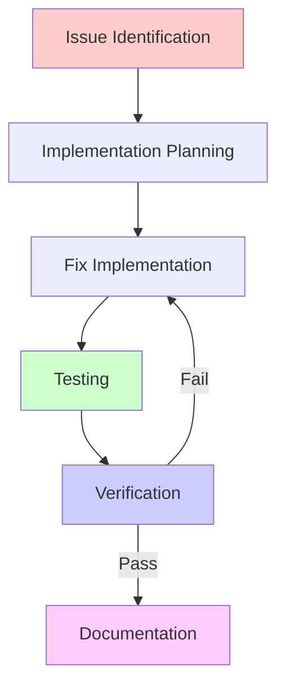

# Update Implementation Instructions

## Implementation Workflow

The complete workflow for addressing issues identified in code reviews follows this sequence:



### Required Sequence

1. **Issue Identification**: From code review report
2. **Implementation Planning**: Create detailed fix plans
3. **Fix Implementation**: Write the actual code changes
4. **Testing**: Execute test cases and validation
5. **Verification**: Confirm all test cases pass
6. **Documentation**: ONLY document verified fixes

> [!WARNING]
> Never document fixes in the final report until they have been fully implemented and verified through testing. The report should reflect actual completed work, not planned changes.

### Baseline Framework File

Before implementing fixes, create a baseline framework file that includes:

1. **Issue Tracking Table**
   ```
   | Issue ID | Priority | Description | Implementation Plan | Test Cases | Status |
   |----------|----------|-------------|---------------------|------------|--------|
   | CRIT-01  | P1       | [From review]| [Approach]         | [Tests]    | Not Started |
   ```

2. **Implementation Schedule**
   ```
   | Issue ID | Start Date | Target Completion | Dependencies | Owner |
   |----------|------------|-------------------|--------------|-------|
   | CRIT-01  | YYYY-MM-DD | YYYY-MM-DD        | None         | [Name]|
   ```

3. **Test Plan**
   ```
   | Issue ID | Test Case ID | Description | Expected Result | Actual Result | Status |
   |----------|--------------|-------------|----------------|--------------|--------|
   | CRIT-01  | TC-01        | [Test case] | [Expected]     | [Actual]     | Pass/Fail |
   ```

4. **Verification Checklist**
   ```
   | Issue ID | Code Review | Unit Tests | Integration Tests | Performance Tests | Security Tests | Status |
   |----------|-------------|------------|------------------|-------------------|---------------|--------|
   | CRIT-01  | ✅/❌       | ✅/❌      | ✅/❌            | ✅/❌             | ✅/❌         | Complete/Incomplete |
   ```

## PDCA Cycle Implementation

### Plan
1. Review Identification
   - Use most recent review by default
   - Verify review contents
   - Enable historical review override
   - Ensure clear scope

2. Review original findings
   - Prioritize issues
   - Define success criteria
   - Identify dependencies
   - Plan verification methods

3. Design Solutions
   - Document proposed changes
   - Create test plans BEFORE implementation
   - Define verification criteria
   - Consider side effects
   - Plan rollback options

### Do
1. Implementation Tracking
   - Work from baseline framework
   - Document actual changes
   - Record deviations from plan
   - Note unexpected issues
   - Track time/effort
   - Keep changes isolated in feature branches

2. Testing Process
   - Execute test cases defined in Plan phase
   - Document test results in framework file
   - Record metrics and measurements
   - Note observations
   - Validate against success criteria
   - Collect evidence of successful testing

### Check
1. Validation Process
   - Compare against success criteria
   - Verify ALL test results pass
   - Measure performance impact
   - Check for regressions
   - Ensure compliance requirements are met
   - Verify code meets all standards

2. Impact Analysis
   - Document actual vs expected results
   - Analyze any deviations
   - Assess side effects
   - Evaluate effectiveness
   - Confirm all requirements are satisfied

### Act
1. Documentation
   - Record final implementation ONLY after verification
   - Document ACTUAL implemented solutions (not planned)
   - Include real test results and measurements
   - Update relevant docs
   - Note lessons learned
   - Plan follow-up actions

2. Process Improvement
   - Identify process gaps
   - Document lessons learned
   - Update templates if needed
   - Share knowledge with team

## Update Documentation Requirements

### Implementation Verification Checklist

Complete this checklist before documenting fixes:

- [ ] All code changes are implemented
- [ ] Unit tests are written and passing
- [ ] Integration tests are passing
- [ ] Performance metrics are collected
- [ ] Security tests are passing (if applicable)
- [ ] Code review is completed
- [ ] Test results are documented
- [ ] All success criteria are met
- [ ] Compliance requirements are verified

### Issue Updates
- Only document issues that have COMPLETED all verification steps
- Include before/after code that matches ACTUAL implementation
- Include real test results and measurements
- Document any deviations from original plan with justification

### Final Report Validation

Before submitting the final report, verify:

- [ ] All documented fixes match actual implemented code
- [ ] All test results are accurate and current
- [ ] Performance measurements reflect actual improvements
- [ ] Compliance status is accurately reported
- [ ] All diagrams reflect the current state of the system
- [ ] No planned but unimplemented changes are included