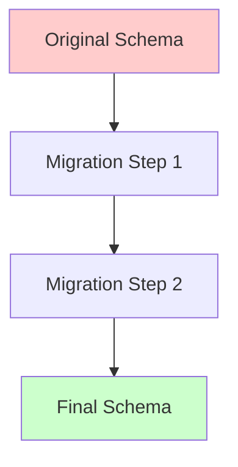
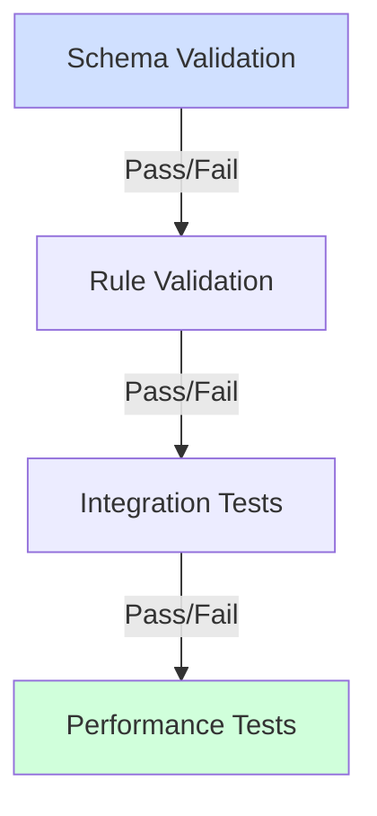
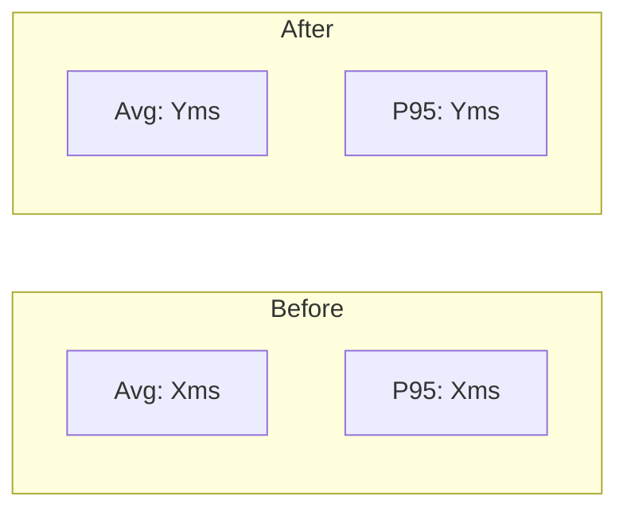
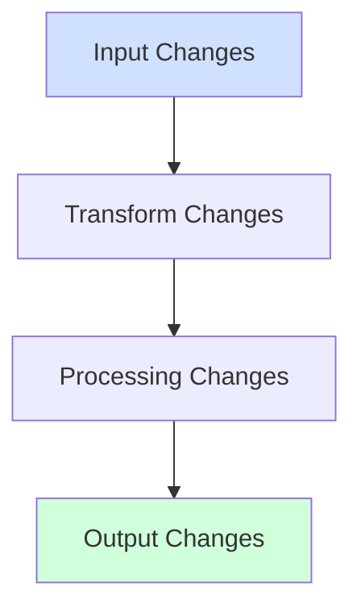
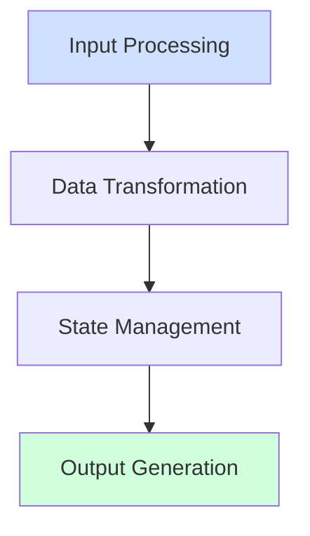
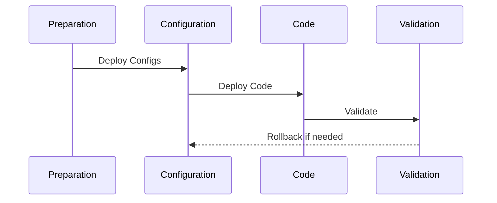

# Implementation Report

## Implementation Overview

**Implementation Date**: [YYYY-MM-DD]  
**Implementer**: [Name/Team]  
**Change Type**: [Configuration/Code/Both]  
**Review Reference**: [Link to review document]  
**Update Reference**: [Link to update document]

### Change Summary

| Category | Changes | Status |
|----------|---------|--------|
| Configuration | [Count] | Complete/In Progress |
| Code | [Count] | Complete/In Progress |
| Tests | [Count] | Complete/In Progress |
| Documentation | [Count] | Complete/In Progress |

## Configuration Implementation

### 1. Schema Changes



| Schema | Migration Steps | Validation Status | Issues |
|--------|----------------|-------------------|---------|
| [Name] | [Steps] | ✅/⚠️/❌ | [Count] |

### 2. Business Rule Implementation

| Rule ID | Configuration | Tests | Status |
|---------|--------------|-------|--------|
| [RUL-01] | [Location] | [Test IDs] | ✅/⚠️/❌ |

### 3. Entity Configuration

| Entity | Changes | Migration | Status |
|--------|---------|-----------|--------|
| [Name] | [List] | Required/None | ✅/⚠️/❌ |

## Code Implementation

### 1. Component Changes

| Component | Files Changed | Test Coverage | Status |
|-----------|--------------|---------------|---------|
| [Name] | [Count] | [X%] | ✅/⚠️/❌ |

### 2. Dependency Updates

| Package | Old Version | New Version | Impact |
|---------|------------|-------------|---------|
| [Name] | [X.Y.Z] | [X.Y.Z] | None/Breaking |

### 3. Interface Changes

```typescript
// Old Interface
interface IOldComponent {
    // ...old methods...
}

// New Interface
interface INewComponent {
    // ...new methods...
}
```

## Migration Process

### 1. Configuration Migration

```yaml
# Migration Steps
steps:
  - step: "Update schema"
    status: "Complete"
    validation: "Passed"
    rollback: "restore_schema_v1.yaml"
  
  - step: "Transform data"
    status: "Complete"
    validation: "Passed"
    rollback: "restore_data_v1.py"
```

### 2. Code Migration

| Phase | Changes | Rollback | Status |
|-------|---------|----------|--------|
| [Phase] | [List] | [Method] | ✅/⚠️/❌ |

### 3. Data Migration

| Data Type | Records | Success Rate | Issues |
|-----------|---------|--------------|---------|
| [Type] | [Count] | [X%] | [Count] |

## Validation Results

### 1. Configuration Validation



| Test Type | Pass Rate | Issues Found | Resolution |
|-----------|-----------|--------------|------------|
| Schema | [X%] | [Count] | [Status] |
| Rules | [X%] | [Count] | [Status] |
| Integration | [X%] | [Count] | [Status] |

### 2. Code Validation

| Test Suite | Coverage | Pass Rate | Issues |
|------------|----------|-----------|---------|
| Unit | [X%] | [Y%] | [Count] |
| Integration | [X%] | [Y%] | [Count] |
| End-to-End | [X%] | [Y%] | [Count] |

### 3. Performance Validation

#### Response Time Impact



| Metric | Before | After | Change | Status |
|--------|---------|-------|--------|--------|
| Throughput | [X/s] | [Y/s] | [Δ%] | ✅/⚠️/❌ |
| Latency | [Xms] | [Yms] | [Δ%] | ✅/⚠️/❌ |
| Memory | [XMB] | [YMB] | [Δ%] | ✅/⚠️/❌ |
| CPU | [X%] | [Y%] | [Δ%] | ✅/⚠️/❌ |

## Functional Correctness Report

### Import and Dependency Changes

| Change Type | Before | After | Status |
|------------|---------|-------|--------|
| Import Count | [X] | [Y] | ✅/⚠️/❌ |
| Circular Dependencies | [X] | [Y] | ✅/⚠️/❌ |
| Version Conflicts | [X] | [Y] | ✅/⚠️/❌ |
| Unused Imports | [X] | [Y] | ✅/⚠️/❌ |

### Type System Updates

| Component | Type Coverage | Contract Status | Validation |
|-----------|--------------|-----------------|------------|
| [Component] | [X%] -> [Y%] | Complete/Partial | ✅/⚠️/❌ |

### Data Flow Modifications



| Flow Stage | Changes Made | Validation | Issues |
|------------|-------------|------------|---------|
| Input | [Description] | ✅/⚠️/❌ | [Count] |
| Transform | [Description] | ✅/⚠️/❌ | [Count] |
| Processing | [Description] | ✅/⚠️/❌ | [Count] |
| Output | [Description] | ✅/⚠️/❌ | [Count] |

### Bug Fix Validation

| Bug ID | Fix Applied | Test Added | Status |
|--------|------------|------------|---------|
| [BUG-01] | [Description] | [Test ID] | Fixed/Pending |

## Issue Resolution Documentation

### Issue Implementation Matrix

| Issue ID | Root Cause | Resolution | Validation Status | Regression Tests |
|----------|------------|------------|------------------|------------------|
| [CRIT-01] | [Description] | [Fix Details] | ✅/⚠️/❌ | All Passing |
| [PERF-01] | [Description] | [Fix Details] | ✅/⚠️/❌ | All Passing |

### Functional Correctness Validation

#### Import and Dependency Analysis

| Category | Before | After | Status |
|----------|--------|-------|--------|
| Total Imports | [Count] | [Count] | ✅/⚠️/❌ |
| Unused Imports | [Count] | [Count] | ✅/⚠️/❌ |
| Circular Dependencies | [Count] | [Count] | ✅/⚠️/❌ |
| Version Conflicts | [Count] | [Count] | ✅/⚠️/❌ |

#### Data Flow Verification



| Flow Stage | Validation Result | Issues Found | Resolution |
|------------|------------------|--------------|------------|
| Input Processing | ✅/⚠️/❌ | [Description] | [Fix] |
| Data Transformation | ✅/⚠️/❌ | [Description] | [Fix] |
| State Management | ✅/⚠️/❌ | [Description] | [Fix] |
| Output Generation | ✅/⚠️/❌ | [Description] | [Fix] |

#### Type System Analysis

| Component | Type Coverage | Contract Compliance | Null Safety |
|-----------|--------------|-------------------|-------------|
| [Component] | [X%] | ✅/⚠️/❌ | ✅/⚠️/❌ |

### Implementation Evidence

#### 1. Root Cause Resolution
```python
# Before: Issue demonstration
def problematic_code():
    # Code showing the issue
    pass

# After: Fixed implementation
def fixed_code():
    # Code showing the fix
    pass

# Validation test
def test_fix():
    # Test verifying the fix
    pass
```

#### 2. Regression Prevention
```python
def regression_test_suite():
    """Comprehensive regression tests for the fix."""
    # Implementation-specific tests
    test_core_functionality()
    test_edge_cases()
    test_error_handling()
    test_resource_management()
```

### Validation Results

#### Functional Testing Results

| Test Category | Pass Rate | Coverage | Issues Found |
|--------------|-----------|----------|--------------|
| Unit Tests | [X%] | [Y%] | [Count] |
| Integration | [X%] | [Y%] | [Count] |
| Edge Cases | [X%] | [Y%] | [Count] |

#### Performance Impact

| Metric | Before | After | Target | Status |
|--------|--------|-------|--------|--------|
| Response Time | [X ms] | [Y ms] | [Z ms] | ✅/⚠️/❌ |
| Memory Usage | [X MB] | [Y MB] | [Z MB] | ✅/⚠️/❌ |
| CPU Usage | [X%] | [Y%] | [Z%] | ✅/⚠️/❌ |

### Implementation Verification

#### 1. Functional Correctness
- [ ] All imports properly managed
- [ ] Type system fully compliant
- [ ] Data flow validated
- [ ] Resource management verified
- [ ] Error handling complete

#### 2. Issue Resolution
- [ ] Root cause addressed
- [ ] Tests verify fix
- [ ] No regressions
- [ ] Performance acceptable
- [ ] Documentation updated

#### 3. Integration Verification
- [ ] Components compatible
- [ ] Interfaces stable
- [ ] Data flow clean
- [ ] Error handling works
- [ ] Resource cleanup proper

## Issue Resolution

### 1. Implementation Issues

| Issue ID | Type | Resolution | Status |
|----------|------|------------|--------|
| [IMP-01] | Config/Code | [Description] | Resolved/Open |

### 2. Migration Issues

| Issue ID | Phase | Impact | Resolution |
|----------|-------|--------|------------|
| [MIG-01] | [Phase] | [Impact] | [Fix] |

### 3. Validation Issues

| Issue ID | Test | Resolution | Verified |
|----------|------|------------|----------|
| [VAL-01] | [Test] | [Fix] | Yes/No |

## Documentation Updates

### 1. Configuration Documentation

```markdown
### Updated Configurations
- Schema changes:
  - [List changes]
- Business rules:
  - [List changes]
- Migration history:
  - [List migrations]
```

### 2. API Documentation

| Endpoint | Changes | Breaking | Migration Guide |
|----------|---------|----------|-----------------|
| [Path] | [List] | Yes/No | [Link] |

### 3. User Documentation

| Document | Section | Updates | Review Status |
|----------|---------|---------|---------------|
| [Doc] | [Section] | [Changes] | ✅/⚠️/❌ |

## Quality Gates

### 1. Implementation Gates

- [ ] All configuration changes validated
- [ ] Schema migrations successful
- [ ] Business rules implemented
- [ ] Code changes complete
- [ ] Tests updated and passing

### 2. Testing Gates

- [ ] Unit test coverage ≥90%
- [ ] Integration tests passing
- [ ] Performance targets met
- [ ] Security review complete
- [ ] Migration tests successful

### 3. Documentation Gates

- [ ] Configuration changes documented
- [ ] API changes documented
- [ ] Migration guide complete
- [ ] Release notes prepared
- [ ] User documentation updated

## Sign-off

### Technical Sign-off

| Role | Name | Status | Date |
|------|------|--------|------|
| Tech Lead | [Name] | ✅/⚠️/❌ | [Date] |
| Security | [Name] | ✅/⚠️/❌ | [Date] |
| QA | [Name] | ✅/⚠️/❌ | [Date] |

### Business Sign-off

| Role | Name | Status | Date |
|------|------|--------|------|
| Product Owner | [Name] | ✅/⚠️/❌ | [Date] |
| Stakeholder | [Name] | ✅/⚠️/❌ | [Date] |

## Release Plan

### 1. Deployment Steps



### 2. Rollback Plan

| Component | Rollback Method | Verification | Owner |
|-----------|----------------|--------------|-------|
| Config | [Method] | [Tests] | [Name] |
| Code | [Method] | [Tests] | [Name] |
| Data | [Method] | [Tests] | [Name] |

### 3. Monitoring Plan

| Metric | Alert Threshold | Response Plan | Owner |
|--------|----------------|---------------|-------|
| [Metric] | [Threshold] | [Plan] | [Name] |

## Appendices

### A. Performance Test Results
[Detailed metrics and analysis]

### B. Security Review Results
[Security validation details]

### C. Migration Scripts
[Configuration and data migration scripts]

### D. Test Reports
[Comprehensive test results]