# Project State Analysis: [Project Name]

## Document Control
**Version**: [version]  
**Date**: [date]  
**Analysis Status**: [In Progress/Complete]  
**Evidence Collection Status**: [percentage]

## YAML Configuration Analysis

### YAML File Overview
**MUST** list and analyze all YAML configuration files in the project.

| File Path | Primary Purpose | Version | Last Updated | Source Reference |
|-----------|----------------|---------|--------------|-----------------|
| | | | | [File] |

### Configuration Structure Analysis

#### 1. System Configuration
**MUST** analyze global system configuration parameters.

| Parameter Category | Implementation | Usage | Override Mechanism | Source Reference |
|-------------------|----------------|-------|-------------------|-----------------|
| Processing Settings | | | | [File:Line] |
| I/O Configuration | | | | [File:Line] |
| Error Handling | | | | [File:Line] |

#### 2. Validation Groups
**MUST** document reusable validation configurations.

| Group Name | Purpose | Rules | Usage Locations | Source Reference |
|------------|---------|-------|----------------|-----------------|
| | | | | [File:Line] |

#### 3. Data Dictionary Mapping
**MUST** analyze external data dictionary integration.

| Dictionary Source | Mapping Type | Field Coverage | Validation | Source Reference |
|------------------|--------------|----------------|------------|-----------------|
| | | | | [File:Line] |

#### 4. Field Properties
**MUST** document field-level validation and transformation rules.

| Field Type | Properties | Validation Rules | Transformations | Source Reference |
|------------|------------|-----------------|----------------|-----------------|
| | | | | [File:Line] |

#### 5. Entity Relationships
**MUST** analyze all defined entity relationships.

```mermaid
erDiagram
    %% Generated from YAML relationship definitions
```

| Relationship | Type | Cardinality | Key Mapping | Source Reference |
|--------------|------|-------------|-------------|-----------------|
| | | | | [File:Line] |

#### 6. Entity Definitions
**MUST** document complete entity specifications.

| Entity | Key Fields | Field Mappings | Relationships | Source Reference |
|--------|------------|----------------|--------------|-----------------|
| | | | | [File:Line] |

### Configuration Implementation Analysis
**MUST** analyze how YAML configurations are implemented in code.

#### 1. Configuration Loading
| Component | Configuration Usage | Validation | Source Reference |
|-----------|-------------------|------------|-----------------|
| | | | [File:Line] |

#### 2. Validation Implementation
| YAML Rule | Code Implementation | Coverage | Source Reference |
|-----------|-------------------|----------|-----------------|
| | | | [File:Line] |

#### 3. Transformation Implementation
| YAML Transform | Code Implementation | Coverage | Source Reference |
|----------------|-------------------|----------|-----------------|
| | | | [File:Line] |

#### 4. Relationship Implementation
| YAML Relationship | Code Implementation | Coverage | Source Reference |
|-------------------|-------------------|----------|-----------------|
| | | | [File:Line] |

### Configuration vs Code Analysis
**MUST** analyze alignment between YAML configuration and code implementation.

#### 1. Entity Structure Compliance
| Entity | YAML Definition | Code Implementation | Compliance | Source Reference |
|--------|----------------|-------------------|------------|-----------------|
| | | | ✅/⚠️/❌ | [File:Line] |

#### 2. Validation Rule Compliance
| Rule Category | YAML Definition | Code Implementation | Compliance | Source Reference |
|--------------|----------------|-------------------|------------|-----------------|
| | | | ✅/⚠️/❌ | [File:Line] |

#### 3. Transformation Rule Compliance
| Transform Type | YAML Definition | Code Implementation | Compliance | Source Reference |
|---------------|----------------|-------------------|------------|-----------------|
| | | | ✅/⚠️/❌ | [File:Line] |

#### 4. Relationship Compliance
| Relationship | YAML Definition | Code Implementation | Compliance | Source Reference |
|--------------|----------------|-------------------|------------|-----------------|
| | | | ✅/⚠️/❌ | [File:Line] |

### Configuration Coverage Analysis
**MUST** analyze the coverage and effectiveness of YAML configurations.

#### 1. Configuration Coverage Metrics
| Category | Configuration Coverage | Code Coverage | Gap Analysis | Source Reference |
|----------|----------------------|--------------|--------------|-----------------|
| Entities | | | | [File:Line] |
| Validations | | | | [File:Line] |
| Transformations | | | | [File:Line] |
| Relationships | | | | [File:Line] |

#### 2. Configuration Effectiveness
| Category | Success Rate | Error Rate | Performance Impact | Source Reference |
|----------|-------------|------------|-------------------|-----------------|
| Validation Rules | | | | [File:Line] |
| Transformations | | | | [File:Line] |
| Relationships | | | | [File:Line] |

## Analysis Progress Checklist
- [ ] Project Overview Complete
- [ ] File Analysis Complete
- [ ] Component Analysis Complete
- [ ] Interface Analysis Complete
- [ ] Data Flow Analysis Complete
- [ ] Configuration Analysis Complete
- [ ] Dependency Analysis Complete
- [ ] Code Quality Analysis Complete

## 1. Project Overview

### 1.1 Project Description
**MUST** provide a concise description of the project's purpose, goals, and scope.

```
[Provide a brief overview of what the project does, its main features, and its intended use cases]
```

### 1.2 Project Structure
**MUST** include a hierarchical view of the project's primary folders and key files.

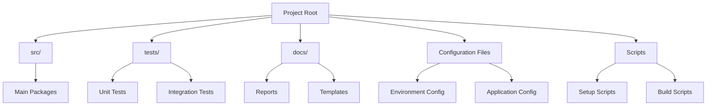

### 1.3 Key Technologies
**MUST** list all major technologies, languages, frameworks, and libraries used in the project.

| Category | Technologies | Purpose | Version | Source Reference |
|----------|-------------|---------|---------|-----------------|
| Languages | | | | [File:Line] |
| Frameworks | | | | [File:Line] |
| Libraries | | | | [File:Line] |
| Infrastructure | | | | [File:Line] |
| Tools | | | | [File:Line] |

### 1.4 Environment Setup
**MUST** detail the environment setup requirements for the project.

```
[Describe the required environment setup, including dependencies, configuration files, and setup scripts]
```

### 1.5 Key Metrics Summary
**MUST** provide a high-level summary of key project metrics.

| Metric Category | Status | Details | Source Reference |
|----------------|--------|---------|-----------------|
| Code Size | | Lines of code, file count | [File/Tool] |
| Test Coverage | | Overall percentage | [File/Tool] |
| Dependencies | | External/Internal count | [File/Tool] |
| Complexity | | Average cyclomatic complexity | [File/Tool] |
| Documentation | | Documentation coverage | [File/Tool] |

## 2. File Analysis

### 2.1 Entry Points
**MUST** identify and describe the main entry points to the application.

| File Path | Purpose | Inputs | Outputs | Source Reference |
|-----------|---------|--------|---------|-----------------|
| | | | | [File:Line] |
| | | | | [File:Line] |

### 2.2 Key Files Analysis

**MUST** analyze each key file in the project. This section should be completed iteratively as files are examined.

#### 2.2.1 [File Path]

**SHOULD** include the following details for each file:
- **Purpose**: [Brief description of the file's purpose]
- **Dependencies**: [List of modules/packages this file depends on]
- **Key Functions/Classes**: [Important functions/classes defined in this file]
- **Exposed Interfaces**: [Interfaces or functions exposed by this file]
- **Code Quality Metrics**:
  - Lines of Code: [count]
  - Cyclomatic Complexity: [measure]
  - Maintainability Index: [index]
- **Source Reference**: [Reference to where this information was found]

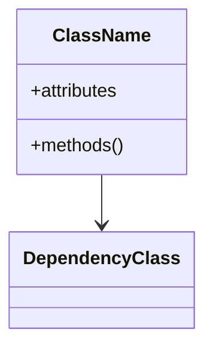

#### 2.2.2 [File Path]

**SHOULD** include the same structure of details for each additional key file.
[Repeat this section for each key file in the project]

## 3. Component Analysis

### 3.1 Component Overview
**MUST** identify all major components/modules in the system and their primary responsibilities.

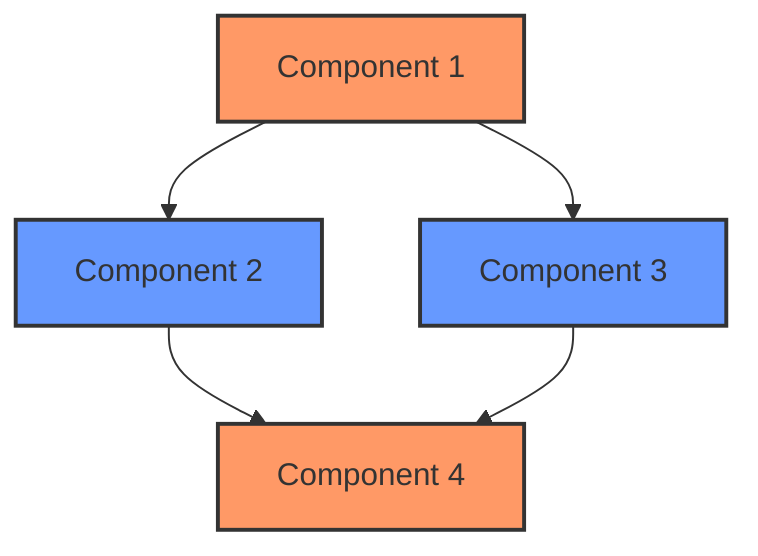

### 3.2 Component Details

**MUST** provide detailed analysis of each component identified in the overview.

#### 3.2.1 [Component Name]

- **Files**: [List of files that make up this component]
- **Purpose**: [Brief description of the component's purpose]
- **Dependencies**: [Components that this component depends on]
- **Dependents**: [Components that depend on this component]
- **Key Interfaces**: [Interfaces exposed by this component]
- **Resource Management**:
  - Resource Types: [Types of resources managed]
  - Acquisition Pattern: [How resources are acquired]
  - Release Pattern: [How resources are released]
  - Potential Issues: [Any resource management concerns]
- **Error Handling**:
  - Error Types: [Types of errors handled]
  - Recovery Mechanisms: [How errors are recovered from]
  - Propagation Pattern: [How errors are propagated]
- **Code Quality Metrics**:
  - Overall Complexity: [Low/Medium/High]
  - Test Coverage: [percentage]
  - Documentation Quality: [Poor/Fair/Good/Excellent]
- **Source Reference**: [Reference to where this information was found]

**SHOULD** include component-specific architecture diagram:

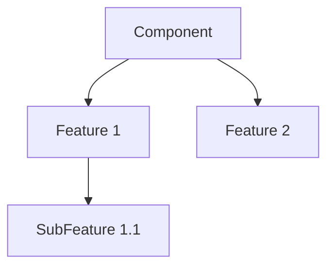

#### 3.2.2 [Component Name]

[Repeat this section for each component in the system]

## 4. Interface Analysis

### 4.1 Interface Overview
**MUST** identify all key interfaces in the system and their implementations.

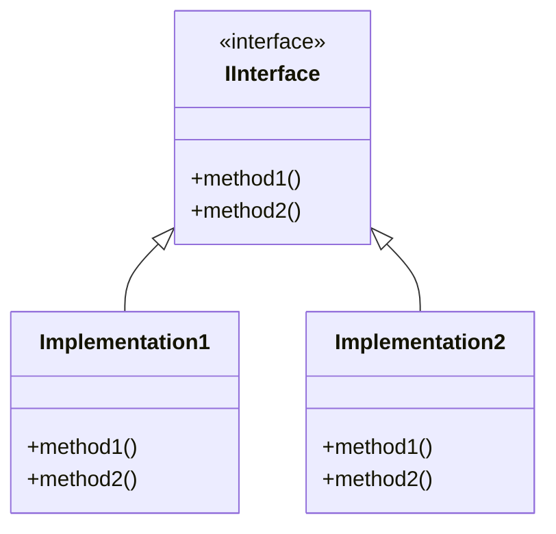

### 4.2 Interface Details

**SHOULD** provide details for each key interface in the system.

#### 4.2.1 [Interface Name]

- **Definition**: [Source file and line number where interface is defined]
- **Purpose**: [Brief description of the interface's purpose]
- **Methods**: [List of methods with signatures]
- **Implementations**: [List of classes implementing this interface]
- **Contract Validation**: [How interface contracts are validated]
- **Usage Patterns**: [Common patterns for using this interface]
- **Source Reference**: [Reference to where this information was found]

**Contract Definition**:
```python
# Replace this with the actual interface definition
class IExample:
    """Interface docstring"""
    def method1(self, param1: str) -> bool:
        """Method docstring"""
        pass
        
    def method2(self) -> List[Any]:
        """Method docstring"""
        pass
```

#### 4.2.2 [Interface Name]

[Repeat this section for each interface in the system]

## 5. Data Flow Analysis

### 5.1 Core Data Flow
**MUST** document the high-level data flow through the system.

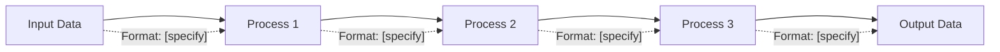

### 5.2 Data Transformation Details
**SHOULD** detail key data transformations in the system.

| Source | Transformation | Destination | Data Format | Validation | Source Reference |
|--------|---------------|-------------|-------------|------------|-----------------|
| | | | | | [File:Line] |
| | | | | | [File:Line] |

### 5.3 Data Validation Framework
**SHOULD** document the data validation framework used in the system.

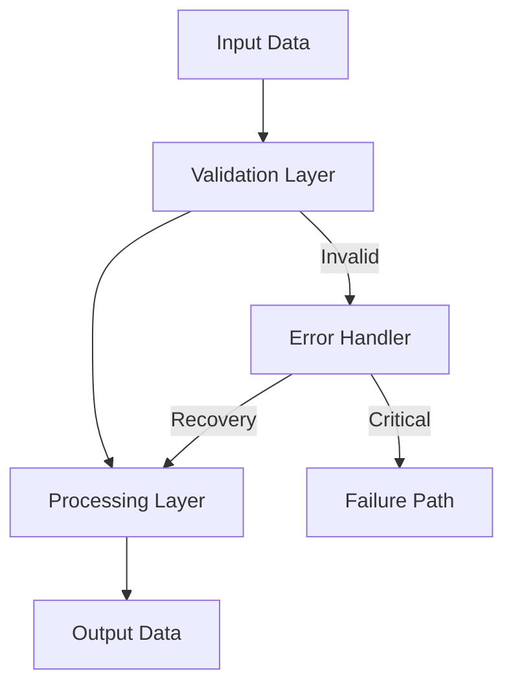

| Validation Type | Implementation | Coverage | Effectiveness | Source Reference |
|----------------|----------------|---------|---------------|-----------------|
| Schema Validation | | | | [File:Line] |
| Type Checking | | | | [File:Line] |
| Business Rules | | | | [File:Line] |
| Cross-Field | | | | [File:Line] |

## 6. Configuration Management

### 6.1 Configuration Overview
**MUST** document the configuration system used by the project.

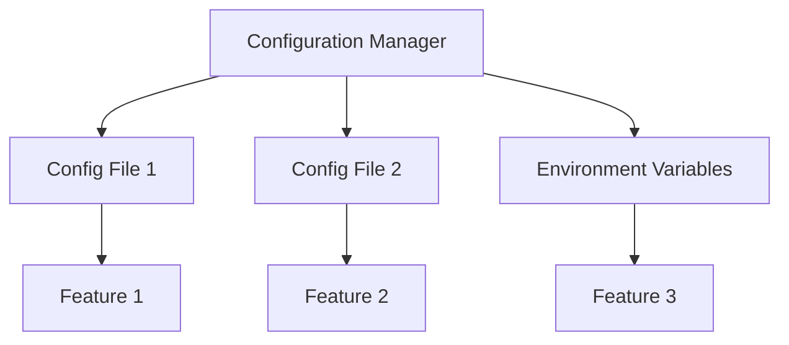

### 6.2 Configuration Files
**SHOULD** list and describe all configuration files in the project.

| File Path | Format | Purpose | Key Settings | Source Reference |
|-----------|--------|---------|--------------|-----------------|
| | | | | [File:Line] |
| | | | | [File:Line] |

### 6.3 Configuration Schemas
**SHOULD** document the schema of key configuration files (if applicable).

```yaml
# Example configuration schema - replace with actual schema
config:
  setting1: string  # Description of setting1
  setting2: number  # Description of setting2
  nested:
    setting3: boolean  # Description of setting3
```

### 6.4 Configuration vs. Code Analysis
**SHOULD** analyze what is controlled via configuration versus hardcoded in the codebase.

| Feature Area | Config-Driven (%) | Code-Driven (%) | Ideal Ratio | Source Reference |
|--------------|-------------------|----------------|-------------|-----------------|
| Business Rules | | | | [File:Line] |
| Validations | | | | [File:Line] |
| Workflows | | | | [File:Line] |
| UI Elements | | | | [File:Line] |

## 7. Error Handling and Logging

### 7.1 Logging Architecture
**MUST** document the logging architecture used in the project.

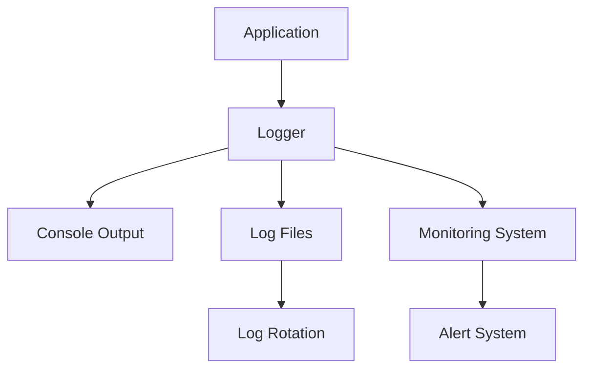

### 7.2 Error Handling Patterns
**SHOULD** document the common error handling patterns used in the project.

| Pattern | Usage | Example | Source Reference |
|---------|-------|---------|-----------------|
| | | | [File:Line] |
| | | | [File:Line] |

### 7.3 Error Management Framework
**SHOULD** document how errors are managed, categorized, and processed in the system.

| Error Category | Handling Approach | Recovery Strategy | Business Impact | Source Reference |
|----------------|------------------|------------------|-----------------|-----------------|
| Validation Errors | | | | [File:Line] |
| System Errors | | | | [File:Line] |
| External Service Errors | | | | [File:Line] |
| Security Errors | | | | [File:Line] |

## 8. Dependency Analysis

### 8.1 External Dependencies
**MUST** list all external dependencies of the project.

| Package | Version | Purpose | Usage Locations | Risk Level | Source Reference |
|---------|---------|---------|----------------|------------|-----------------|
| | | | | High/Medium/Low | [File:Line] |
| | | | | High/Medium/Low | [File:Line] |

### 8.2 Internal Dependencies
**SHOULD** visualize the internal dependency relationships between modules.

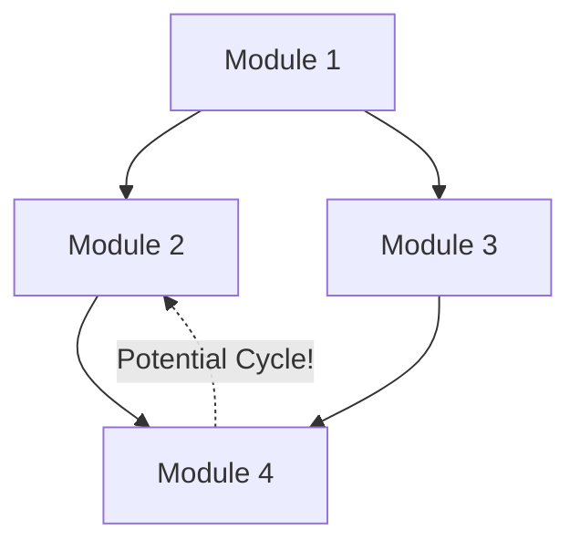

### 8.3 Dependency Metrics
**SHOULD** provide metrics about the dependency structure.

| Metric | Value | Ideal | Status | Source Reference |
|--------|-------|-------|--------|-----------------|
| Avg. Dependencies per Module | | | ✅/⚠️/❌ | [File:Line] |
| Max Dependencies per Module | | | ✅/⚠️/❌ | [File:Line] |
| Circular Dependencies | | | ✅/⚠️/❌ | [File:Line] |
| External Dependency Count | | | ✅/⚠️/❌ | [File:Line] |

### 8.4 Import Analysis
**SHOULD** analyze import patterns and potential issues.

| Import Pattern | Occurrence | Status | Potential Issues | Source Reference |
|----------------|------------|--------|-----------------|------------------|
| Direct imports | | ✅/⚠️/❌ | | [File:Line] |
| Wildcard imports | | ✅/⚠️/❌ | | [File:Line] |
| Conditional imports | | ✅/⚠️/❌ | | [File:Line] |
| Circular imports | | ✅/⚠️/❌ | | [File:Line] |

## 9. Data Storage

### 9.1 Storage Architecture
**SHOULD** document the data storage architecture used by the project.

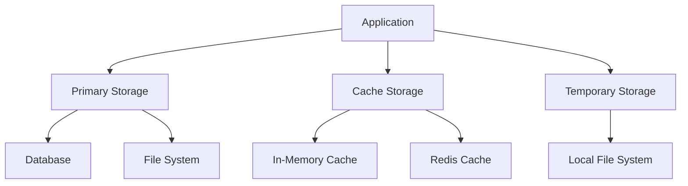

### 9.2 Storage Details
**SHOULD** provide details for each storage mechanism used.

| Storage Type | Implementation | Data Stored | Access Patterns | Performance | Source Reference |
|--------------|----------------|------------|----------------|-------------|-----------------|
| | | | | | [File:Line] |
| | | | | | [File:Line] |

### 9.3 Data Persistence Strategy
**SHOULD** document how data persistence is managed in the system.

| Data Category | Storage Location | Persistence Strategy | Backup Strategy | Source Reference |
|---------------|-----------------|---------------------|----------------|-----------------|
| | | | | [File:Line] |
| | | | | [File:Line] |

## 10. Testing Architecture

### 10.1 Test Overview
**SHOULD** document the testing architecture used in the project.

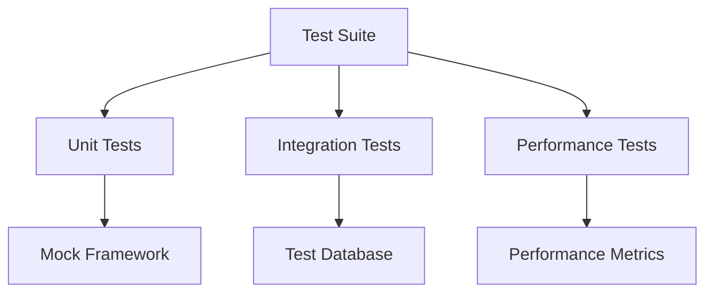

### 10.2 Test Coverage
**SHOULD** document the current test coverage of the project.

| Component | Unit Tests | Integration Tests | Test Coverage | Source Reference |
|-----------|------------|------------------|---------------|-----------------|
| | | | | [File:Line] |
| | | | | [File:Line] |

### 10.3 Test Implementation
**SHOULD** analyze how tests are implemented and organized.

| Test Category | Framework | Methodology | Effectiveness | Source Reference |
|--------------|-----------|-------------|---------------|-----------------|
| Unit Tests | | | High/Medium/Low | [File:Line] |
| Integration Tests | | | High/Medium/Low | [File:Line] |
| Performance Tests | | | High/Medium/Low | [File:Line] |
| Security Tests | | | High/Medium/Low | [File:Line] |

## 11. Deployment Architecture

### 11.1 Deployment Overview
**SHOULD** document the deployment architecture of the project.

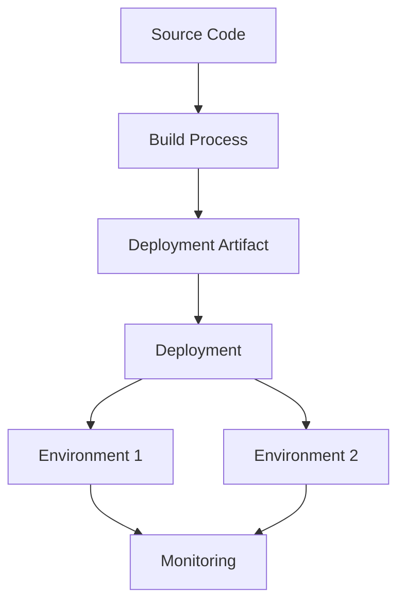

### 11.2 Deployment Process
**COULD** detail the steps involved in deploying the project.

| Step | Tools | Description | Source Reference |
|------|-------|-------------|-----------------|
| | | | [File:Line] |
| | | | [File:Line] |

### 11.3 Environment Configuration
**SHOULD** document the configuration for different environments.

| Environment | Purpose | Configuration | Restrictions | Source Reference |
|-------------|---------|--------------|-------------|-----------------|
| Development | | | | [File:Line] |
| Testing | | | | [File:Line] |
| Staging | | | | [File:Line] |
| Production | | | | [File:Line] |

## 12. Performance Characteristics

### 12.1 Performance Metrics
**COULD** document the key performance metrics of the project.

| Metric | Target Value | Current Value | Source Reference |
|--------|-------------|---------------|-----------------|
| | | | [File:Line] |
| | | | [File:Line] |

### 12.2 Performance Bottlenecks
**COULD** identify known performance bottlenecks in the system.

| Component | Bottleneck | Impact | Source Reference |
|-----------|------------|--------|-----------------|
| | | | [File:Line] |
| | | | [File:Line] |

### 12.3 Resource Utilization
**SHOULD** document the resource utilization patterns of the system.

| Resource | Normal Usage | Peak Usage | Capacity | Source Reference |
|----------|--------------|------------|----------|-----------------|
| CPU | | | | [File:Line] |
| Memory | | | | [File:Line] |
| Disk I/O | | | | [File:Line] |
| Network | | | | [File:Line] |

## 13. Security Architecture

### 13.1 Security Overview
**COULD** document the security architecture of the project.

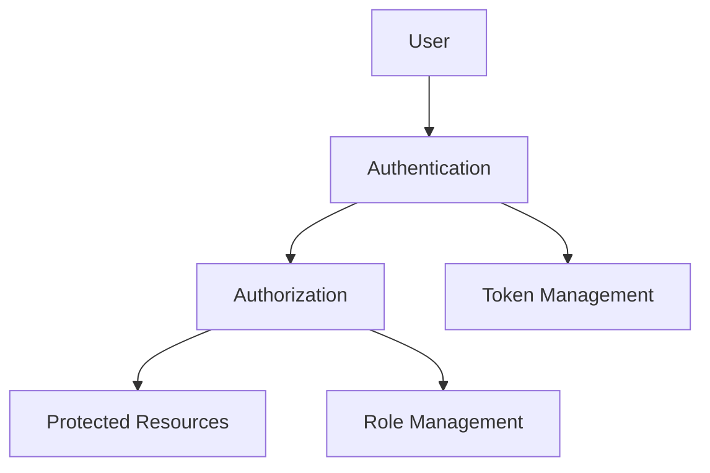

### 13.2 Security Controls
**COULD** list the security controls implemented in the project.

| Control | Implementation | Purpose | Source Reference |
|---------|----------------|---------|-----------------|
| | | | [File:Line] |
| | | | [File:Line] |

## 14. Component Interaction Analysis

### 14.1 Component Interactions
**MUST** document the key interactions between components.

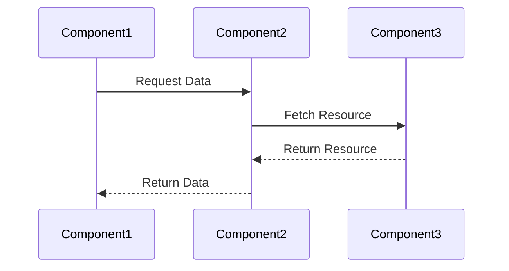

### 14.2 Interaction Details
**SHOULD** provide details for key interactions between components.

| Interaction | Components Involved | Data Exchanged | Purpose | Source Reference |
|-------------|---------------------|---------------|---------|-----------------|
| | | | | [File:Line] |
| | | | | [File:Line] |

### 14.3 Communication Patterns
**SHOULD** document the communication patterns used between components.

| Pattern | Implementation | Usage | Effectiveness | Source Reference |
|---------|----------------|-------|---------------|-----------------|
| Request-Response | | | High/Medium/Low | [File:Line] |
| Event-Driven | | | High/Medium/Low | [File:Line] |
| Publish-Subscribe | | | High/Medium/Low | [File:Line] |
| Pipeline | | | High/Medium/Low | [File:Line] |

## 15. Entity Model Analysis

### 15.1 Entity Overview
**SHOULD** document the key entities in the system and their relationships.

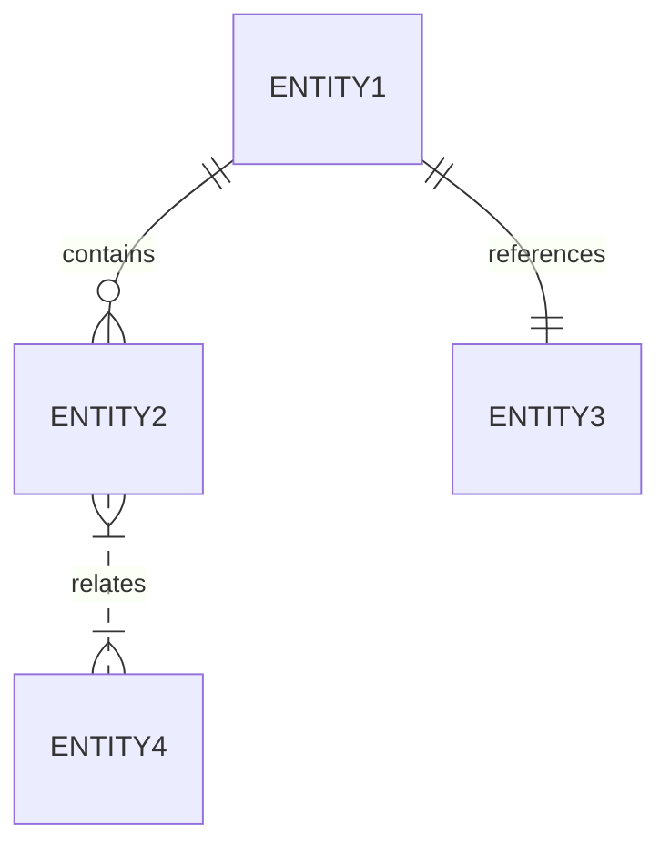

### 15.2 Entity Details
**SHOULD** provide details for each key entity in the system.

| Entity | Attributes | Relationships | Storage | Source Reference |
|--------|------------|--------------|---------|-----------------|
| | | | | [File:Line] |
| | | | | [File:Line] |

### 15.3 Data Integrity
**SHOULD** document how data integrity is maintained across entities.

| Entity Relationship | Integrity Constraints | Implementation | Effectiveness | Source Reference |
|--------------------|----------------------|----------------|---------------|-----------------|
| | | | High/Medium/Low | [File:Line] |
| | | | High/Medium/Low | [File:Line] |

## 16. Code Quality Analysis

### 16.1 Code Quality Metrics
**MUST** document the code quality metrics for the project.

#### Automated Analysis Results
**MUST** include results from automated analysis tools with timestamp of last run.

| Tool | Last Run | Key Metrics | Source |
|------|----------|-------------|--------|
| Functional Coverage Analyzer | {timestamp} | - Total Functions: {total} 
- Tested: {tested}
- Coverage: {coverage}% | functional_coverage_report.json |
| Test Gap Analyzer | {timestamp} | - Gaps Found: {count}
- Priority High: {high}
- Priority Medium: {med} | test_gap_report.json |
| Test Quality Analyzer | {timestamp} | - Quality Score: {score}/100
- Files Needing Improvement: {count} | test_quality_report.json |

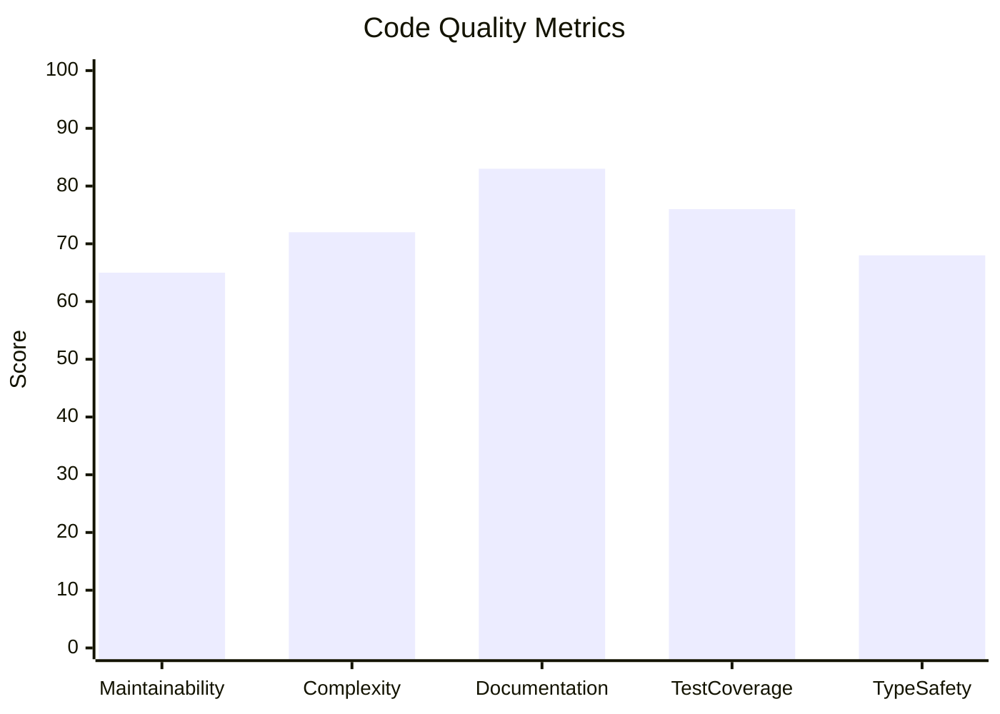

| Metric | Value | Target | Status | Source Reference |
|--------|-------|--------|--------|-----------------|
| Cyclomatic Complexity | | | ✅/⚠️/❌ | [Tool/File] |
| Maintainability Index | | | ✅/⚠️/❌ | [Tool/File] |
| Documentation Coverage | | | ✅/⚠️/❌ | [Tool/File] |
| Comment Ratio | | | ✅/⚠️/❌ | [Tool/File] |
| Code Duplication | | | ✅/⚠️/❌ | [Tool/File] |
| Type Safety | | | ✅/⚠️/❌ | [Tool/File] |

### 16.2 Code Style Consistency
**SHOULD** analyze the consistency of code style across the project.

| Style Element | Consistency | Standard Used | Source Reference |
|--------------|------------|---------------|-----------------|
| Naming Conventions | High/Medium/Low | | [File:Line] |
| Formatting | High/Medium/Low | | [File:Line] |
| Documentation Style | High/Medium/Low | | [File:Line] |
| Error Handling Style | High/Medium/Low | | [File:Line] |
| Pattern Usage | High/Medium/Low | | [File:Line] |

### 16.3 Static Analysis Results
**SHOULD** summarize the results of static analysis tools.

| Tool | Version | Findings Category | Count | Severity | Source Reference |
|------|---------|-------------------|-------|----------|------------------|
| | | | | High/Medium/Low | [Tool Output] |
| | | | | High/Medium/Low | [Tool Output] |

## 17. References

### 17.1 Documentation References
**SHOULD** list references to related documentation.

| Document | Location | Purpose | Source Reference |
|----------|----------|---------|-----------------|
| | | | [File:Line] |
| | | | [File:Line] |

### 17.2 External References
**COULD** list external references relevant to the project.

| Reference | URL/Location | Purpose | Source Reference |
|-----------|--------------|---------|-----------------|
| | | | [File:Line] |
| | | | [File:Line] |

## Appendix A: Glossary

**SHOULD** provide a glossary of terms used throughout the project.

| Term | Definition | Source Reference |
|------|------------|-----------------|
| | | [File:Line] |
| | | [File:Line] |

## Appendix B: Component Reference Table

**SHOULD** provide a quick reference table of all components in the system.

| Component | Purpose | Key Files | Source Reference |
|-----------|---------|-----------|-----------------|
| | | | [File:Line] |
| | | | [File:Line] |

## Appendix C: Metrics Summary

**COULD** provide a summary of key metrics for the project.

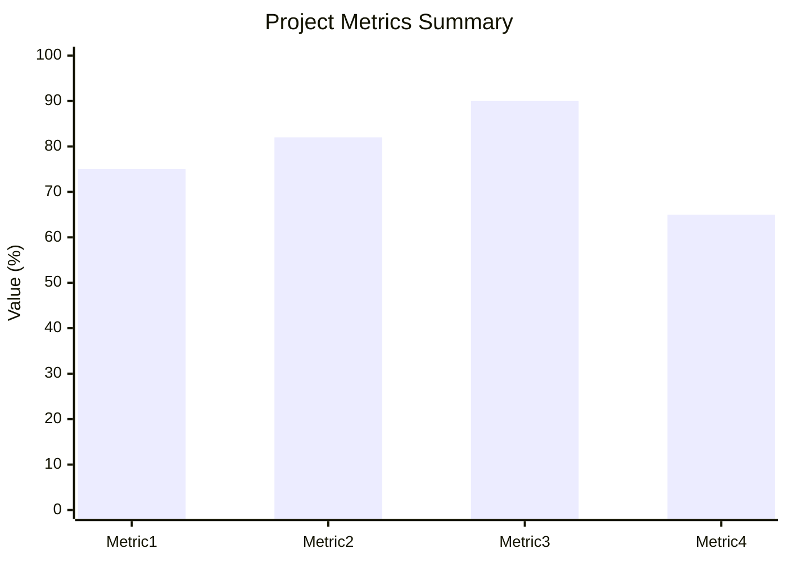

## Appendix D: Evidence Collection Methodology

**SHOULD** document the methodology used for collecting evidence during the analysis.

| Evidence Type | Collection Method | Validation Approach | Tools Used |
|---------------|------------------|-------------------|-----------|
| Code Analysis | | | |
| Configuration Analysis | | | |
| Runtime Analysis | | | |
| Test Analysis | | | |

## Appendix E: Document Completion Checklist

**MUST** verify that the analysis document is complete.

- [ ] All sections of the template have been addressed
- [ ] Every claim is supported by evidence with a source reference
- [ ] All metrics include measurement data and sources
- [ ] All diagrams accurately reflect the current state of the system
- [ ] No sections contain placeholder text or "TBD" markers
- [ ] All source references are valid and specific
- [ ] Analysis is based on the current state, not aspirational improvements