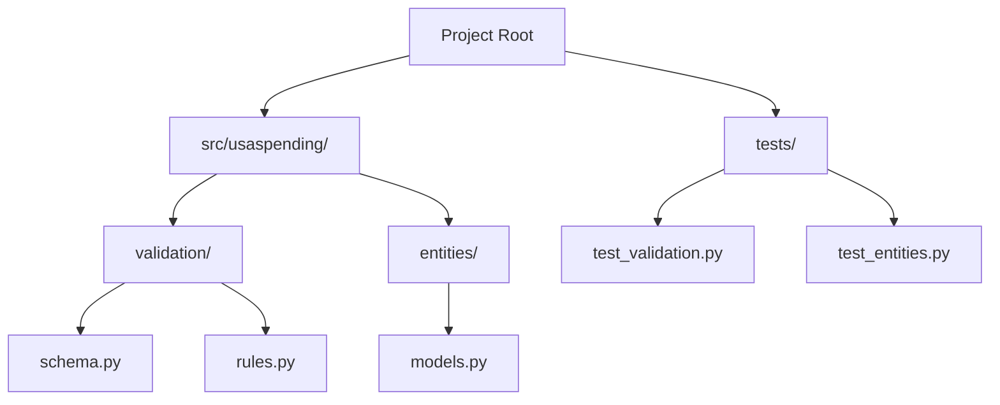
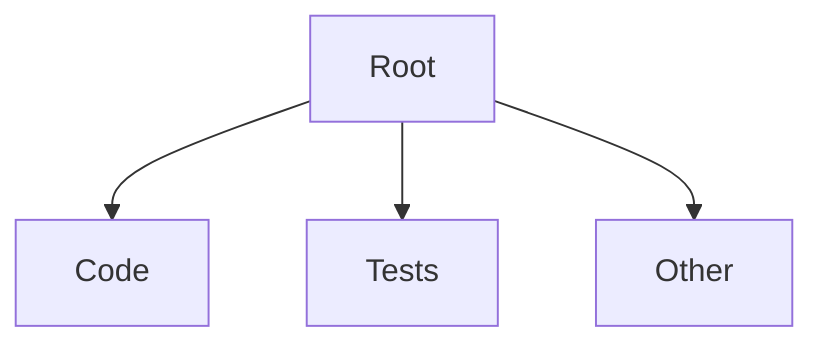
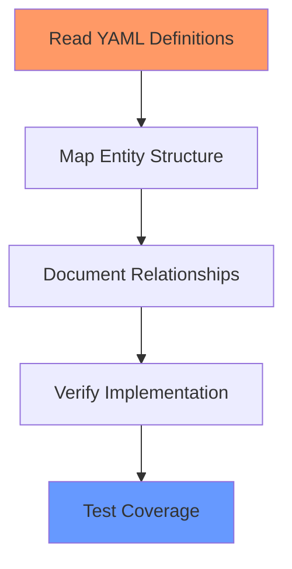

# Project State Analysis Instructions

## Overview

This document provides instructions for completing a comprehensive project state analysis using the XX_project_state_analysis.md template. The analysis focuses on documenting the current state of the project without addressing issues or suggesting improvements.

## Critical Requirements

### Single Document Focus
- **REQUIRED**: All analysis MUST be maintained in a single comprehensive document
- **PROHIBITED**: Creating multiple parallel analysis files
- **REQUIRED**: Use progressive documentation approach in the single file
- **REQUIRED**: Complete each section fully before moving to next

### Documentation Standards
1. Every claim requires evidence citation in the format [File:Line] or [Tool Output]
2. Every metric requires specific measurement data with source
3. Every relationship claim requires code evidence
4. Every architecture diagram must reflect current state only

### Analysis Process
1. Create single analysis file using template
2. Complete each section progressively
3. Include all evidence and metrics
4. Update single file as analysis deepens
5. Maintain complete evidence trail

## Evidence Documentation Requirements

### Code Evidence Format
```
[CLAIM]: Description of what exists in the code
[EVIDENCE]: 
- Location: {file:line} reference
- Code: Relevant code snippet
- Context: How this code supports the claim
[VERIFICATION]: How this was validated
```

**Effective Example**:
```
[CLAIM]: The system uses a layered validation approach with schema and business rule validation
[EVIDENCE]:
- Location: src/validation/validation_service.py:45-89
- Code: 
  ```python
  def validate(self, data: Dict):
      schema_result = self.schema_validator.validate(data)
      if schema_result.is_valid:
          return self.business_validator.validate(data)
  ```
- Context: Shows two-stage validation implementation
[VERIFICATION]: Validated through code review and test execution
```

**Ineffective Example**:
```
[CLAIM]: The system has validation
[EVIDENCE]: It's in the validation code
[VERIFICATION]: I looked at it
```

### Metric Evidence Format
```
[METRIC]: Name and value of the metric
[MEASUREMENT]:
- Tool: Tool used to measure
- Command: Command/process used
- Raw Data: Raw measurement data
[VALIDATION]: How accuracy was verified
```

**Effective Example**:
```
[METRIC]: Test Coverage: 87.3%
[MEASUREMENT]:
- Tool: pytest-cov v4.1.0
- Command: pytest --cov=src tests/
- Raw Data: Coverage report showing line-by-line coverage
[VALIDATION]: Verified through CI/CD pipeline reports
```

**Ineffective Example**:
```
[METRIC]: Good test coverage
[MEASUREMENT]: Ran tests
[VALIDATION]: Looks good
```

## Section-Specific Instructions

### 1. Project Overview

#### Project Description
**DO**:
- Begin with a clear statement of project purpose
- List concrete features and capabilities
- Define scope boundaries
- Reference documentation evidence

**DON'T**:
- Include planned features
- Make assumptions about usage
- Include subjective assessments
- List known issues

**Effective Example**:
```
The USASpending project provides data transformation and validation capabilities for federal spending data. It processes raw CSV data files from the USASpending API, validates them against defined schemas, and outputs standardized JSON entities. The project currently handles contract data transformation with support for agency, recipient, and award entities as evidenced in src/usaspending/entities/.
```

**Ineffective Example**:
```
This is a data processing project that could be used for various purposes. It might be useful for handling different types of data and should be able to scale well.
```

#### Project Structure
**DO**:
- Use mermaid diagrams to show actual structure
- Include all major directories
- Show key file relationships
- Cite evidence for relationships

**DON'T**:
- Include planned directories
- Show aspirational relationships
- Include temporary files
- Mix current and future state

**Effective Example**:


**Ineffective Example**:


### 2. File Analysis

#### Entry Points Analysis
**DO**:
- List all executable files
- Document command-line arguments
- Show input/output relationships
- Provide evidence for usage

**DON'T**:
- Include internal modules
- List helper files
- Include test files
- Show debug scripts

**Effective Example**:
| File Path | Purpose | Inputs | Outputs | Source Reference |
|-----------|---------|--------|---------|-----------------|
| process_transactions.py | Main data processing entry point | CSV files (configurable) | JSON entity files | [process_transactions.py:15-20] |
| run_validation.py | Standalone validation tool | CSV/JSON files | Validation reports | [run_validation.py:10-25] |

**Ineffective Example**:
| File | Purpose | Inputs | Outputs |
|------|---------|--------|---------|
| main.py | Main file | Some files | Some output |
| util.py | Utils | Various | Various |

### 3. Component Analysis

#### Component Documentation
**DO**:
- Document actual implemented components
- Show concrete relationships
- Include resource management
- Provide error handling details

**DON'T**:
- Include planned components
- Show theoretical relationships
- Skip error handling
- Omit evidence citations

**Effective Example**:
```
Component: EntityProcessor
Files: 
- src/usaspending/entity_processor.py
- src/usaspending/entity_cache.py

Purpose: Processes raw data into validated entities
[Evidence: entity_processor.py:10-15]

Dependencies:
- ValidationService (for data validation)
- EntityCache (for entity storage)
[Evidence: entity_processor.py:20-25]

Resource Management:
- Uses connection pooling for database access
- Implements context managers for file handling
[Evidence: entity_processor.py:45-60]
```

**Ineffective Example**:
```
Component: Processor
Files: Some processor files
Purpose: Processes things
Dependencies: Various other components
```

### 4. Interface Analysis

#### Interface Documentation
**DO**:
- Document actual interfaces with code
- Show all method signatures
- Include implementation examples
- Provide usage evidence

**DON'T**:
- Document planned interfaces
- Show partial implementations
- Skip complex methods
- Omit validation details

**Effective Example**:
```python
# [Evidence: src/usaspending/interfaces.py:25-40]
class IValidator:
    """Validates data against defined rules"""
    
    def validate(self, data: Dict) -> ValidationResult:
        """Validates input data"""
        pass
        
    def add_rule(self, rule: ValidationRule) -> None:
        """Adds a validation rule"""
        pass

Implementations:
1. SchemaValidator [src/usaspending/validation/schema.py:15-45]
2. BusinessValidator [src/usaspending/validation/business.py:20-50]
```

**Ineffective Example**:
```python
class IValidator:
    # Validates stuff
    def validate():
        pass
```

## Analysis Frameworks

### 1. Component Analysis Framework

Use this framework for analyzing each component:

1. **Interface Analysis**
   ```
   1. Document public interfaces
   2. List dependencies
   3. Show resource ownership
   4. Document threading model
   ```

2. **Resource Management**
   ```
   1. Memory lifecycle
   2. File handle management
   3. Connection management
   4. Cache strategies
   ```

3. **Error Handling**
   ```
   1. Error categories
   2. Recovery strategies
   3. Logging patterns
   4. Error propagation
   ```

### 2. Data Flow Analysis Framework

Follow these steps for data flow analysis:

1. **Input Processing**
   ```mermaid
   flowchart LR
       Input[Input Data] --> Validate[Validation]
       Validate --> Transform[Transform]
       Transform --> Store[Storage]
   ```

2. **Data Transformation**
   ```
   1. Document format changes
   2. Show validation steps
   3. List transformations
   4. Show output format
   ```

3. **Storage Flow**
   ```
   1. Document write patterns
   2. Show read patterns
   3. List caching strategies
   4. Show cleanup processes
   ```

### 3. Documentation Evidence Framework

Use this framework for evidence collection:

1. **Code Evidence**
   ```
   1. File and line references
   2. Relevant code snippets
   3. Context explanation
   4. Validation method
   ```

2. **Metric Evidence**
   ```
   1. Tool used
   2. Command executed
   3. Raw results
   4. Verification method
   ```

3. **Relationship Evidence**
   ```
   1. Import statements
   2. Function calls
   3. Data flow
   4. Resource sharing
   ```

## Validation Checklists

### Documentation Completeness
- [ ] All sections addressed
- [ ] No placeholder text
- [ ] All diagrams reflect current state
- [ ] All claims have evidence
- [ ] All metrics have sources
- [ ] All relationships documented
- [ ] All interfaces fully described

### Evidence Quality
- [ ] Code evidence has file:line citations
- [ ] Metrics include measurement method
- [ ] Relationships show concrete evidence
- [ ] Diagrams match code structure
- [ ] Interface documentation complete
- [ ] Resource patterns documented
- [ ] Error handling detailed

### Technical Accuracy
- [ ] Component relationships verified
- [ ] Interface implementations checked
- [ ] Resource management validated
- [ ] Error handling confirmed
- [ ] Data flow traced
- [ ] Storage patterns verified
- [ ] Security controls documented

## Common Mistakes to Avoid

### 1. Missing Evidence
❌ **Wrong**:
```
The system uses a robust validation framework.
```

✅ **Right**:
```
The system implements a two-stage validation framework with schema and business rule validation, as evidenced in src/validation/validation_service.py:45-89.
```

### 2. Future State Inclusion
❌ **Wrong**:
```
The caching system will be optimized for better performance.
```

✅ **Right**:
```
The current caching system uses an LRU cache with a maximum size of 1000 entries [src/cache/lru_cache.py:25-30].
```

### 3. Subjective Assessment
❌ **Wrong**:
```
The code quality is good with nice organization.
```

✅ **Right**:
```
The codebase has a measured cyclomatic complexity of 2.3 (tool: radon) and maintains 92% test coverage (tool: pytest-cov).
```

### 4. Incomplete Interface Documentation
❌ **Wrong**:
```
IDataProcessor handles data processing.
```

✅ **Right**:
```python
class IDataProcessor:
    """Processes data entities according to defined rules"""
    [Evidence: src/interfaces.py:45-60]
    
    def process(self, data: Dict) -> ProcessingResult:
        """
        Processes input data into standardized format
        Args:
            data: Input dictionary containing raw data
        Returns:
            ProcessingResult containing processed data or errors
        """
        pass
```

## Success Criteria

### 1. Evidence Quality
- Every claim has specific code citation
- Every metric has measurement data
- Every relationship has concrete evidence
- Every diagram reflects actual code

### 2. Completeness
- All template sections filled
- No placeholder text
- No TBD markers
- No future state references

### 3. Technical Accuracy
- Component relationships match code
- Interfaces fully documented
- Resource patterns verified
- Error handling detailed

### 4. Documentation Quality
- Clear and concise language
- Proper formatting
- Complete diagrams
- Accurate citations

## Appendix A: Example Analysis Sections

### Component Analysis Example
```markdown
## ValidationService Component

Purpose: Provides data validation capabilities
[Evidence: src/validation/service.py:10-15]

Dependencies:
- SchemaValidator (schema validation)
- BusinessValidator (business rule validation)
- ValidationCache (result caching)
[Evidence: src/validation/service.py:20-25]

Resource Management:
- Cache Size: 1000 entries
- Cache Strategy: LRU
- Cleanup: Automatic expiration after 1 hour
[Evidence: src/validation/cache.py:30-45]

Error Handling:
- ValidationError: Schema violations
- BusinessError: Rule violations
- SystemError: Resource failures
[Evidence: src/validation/errors.py:15-40]
```

### Interface Analysis Example
```markdown
## IValidator Interface

Purpose: Defines validation contract
[Evidence: src/validation/interfaces.py:20-25]

Methods:
```python
def validate(self, data: Dict) -> ValidationResult:
    """
    Validates input data against defined rules
    Args:
        data: Dictionary containing data to validate
    Returns:
        ValidationResult with success/failure and errors
    """
    pass

def add_rule(self, rule: ValidationRule) -> None:
    """
    Adds a validation rule
    Args:
        rule: ValidationRule to add
    """
    pass
```

Implementations:
1. SchemaValidator [src/validation/schema.py:15-45]
2. BusinessValidator [src/validation/business.py:20-50]

Usage Pattern:
```python
validator = SchemaValidator()
validator.add_rule(NotNullRule("id"))
result = validator.validate({"id": "123"})
```
[Evidence: src/validation/examples.py:10-20]
```

## Appendix B: Diagram Guidelines

### Component Diagrams
- Use clear, descriptive names
- Show actual relationships
- Include cardinality
- Mark optional relationships
- Cite evidence for relationships

### Data Flow Diagrams
- Show actual data formats
- Include validation steps
- Mark transformation points
- Show error paths
- Document async patterns

### Interface Diagrams
- Show all methods
- Include relationships
- Mark implementation status
- Show inheritance
- Document contracts

## Appendix C: Evidence Collection Methods

### Code Evidence
1. Use grep or semantic search for relationships
2. Trace function calls for dependencies
3. Review import statements
4. Check resource usage patterns

### Metric Evidence
1. Run static analysis tools
2. Execute test coverage
3. Measure performance
4. Count dependencies

### Validation Evidence
1. Run test suites
2. Check error handling
3. Verify resource cleanup
4. Test threading behavior

## Progressive Analysis Framework

### Phase 1: Project Context Collection
1. **Repository Overview**
   ```
   1. Clone/access the repository
   2. Document overall structure
   3. Identify key configuration files
   4. List entry points
   ```

2. **Technology Stack Analysis**
   ```
   1. Review package manifests
   2. Document dependencies
   3. Identify framework usage
   4. Note development tools
   ```

3. **Initial Metrics Collection**
   ```
   1. Count files/directories
   2. Run static analysis
   3. Calculate test coverage
   4. Measure documentation coverage
   ```

### Phase 2: Core Analysis Execution
1. **Entry Point Analysis**
   - Start with main execution files
   - Trace primary workflows
   - Document input/output patterns
   - Map initial dependencies

2. **Component Discovery**
   - Follow dependency chains
   - Document component boundaries
   - Map resource ownership
   - Note interaction patterns

3. **Interface Identification**
   - List public interfaces
   - Document contracts
   - Map implementations
   - Verify usage patterns

### Phase 3: Relationship Analysis
1. **Dependency Mapping**
   - Direct dependencies
   - Indirect dependencies
   - Circular references
   - External dependencies

2. **Data Flow Tracing**
   - Input sources
   - Transformation steps
   - Validation points
   - Storage patterns

3. **Resource Management**
   - Memory patterns
   - File operations
   - Network usage
   - Cache strategies

## Tool Usage Guidelines

### Static Analysis Tools
1. **Code Quality Tools**
   ```bash
   # Example commands with explanations
   pylint src/ --output-format=json  # Style and error checking
   radon cc src/ -a  # Complexity metrics
   mypy src/  # Type checking
   ```

2. **Documentation Tools**
   ```bash
   # Example commands with explanations
   pdoc --html src/  # API documentation generation
   docstr-coverage src/  # Documentation coverage
   ```

3. **Dependency Tools**
   ```bash
   # Example commands with explanations
   pipdeptree  # Dependency tree visualization
   pip-audit  # Security check of dependencies
   ```

### Runtime Analysis Tools
1. **Performance Profiling**
   ```bash
   # Example commands with explanations
   python -m cProfile -o output.prof script.py  # CPU profiling
   memory_profiler script.py  # Memory profiling
   ```

2. **Coverage Analysis**
   ```bash
   # Example commands with explanations
   pytest --cov=src tests/  # Test coverage
   coverage report -m  # Line-by-line coverage
   ```

### Documentation Tools
1. **Code Search Tools**
   ```
   1. Use grep for exact matches
   2. Use semantic search for concepts
   3. Use find for file patterns
   4. Use git grep for version history
   ```

2. **Visualization Tools**
   ```
   1. Mermaid for diagrams
   2. Graphviz for complex graphs
   3. PlantUML for sequence diagrams
   ```

## Evidence Collection Strategy

### 1. Systematic Code Review
```
Step 1: Entry Points
- Identify main execution files
- Document CLI arguments
- Map initial call chains

Step 2: Component Analysis
- Follow import statements
- Document class hierarchies
- Map resource usage
- Note error handling

Step 3: Interface Review
- List public interfaces
- Document implementations
- Verify contracts
- Map usage patterns
```

### 2. Runtime Analysis
```
Step 1: Execution Flow
- Run with sample data
- Monitor resource usage
- Track call patterns
- Note performance

Step 2: Error Conditions
- Test edge cases
- Monitor error handling
- Verify recovery
- Document patterns

Step 3: Resource Usage
- Monitor memory
- Track file operations
- Check connection handling
- Verify cleanup
```

### 3. Documentation Review
```
Step 1: Internal Docs
- Review docstrings
- Check README files
- Examine comments
- Verify examples

Step 2: External Docs
- Check API docs
- Review guides
- Examine tutorials
- Verify references
```

## Analysis Results Documentation

### Code Findings Format
```markdown
## [Component/Feature Name]

### Implementation Details
[Evidence: file:line]
```python
# Key implementation code
```

### Usage Pattern
[Evidence: file:line]
```python
# Usage example
```

### Resource Management
- Pattern: [pattern name]
- Implementation: [details]
[Evidence: file:line]
```

### Metric Results Format
```markdown
## [Metric Category]

### Raw Data
```
[Tool output]
```

### Analysis
- Metric: [value]
- Target: [target]
- Status: [status]
[Evidence: Command/Tool used]
```

## Results Validation Framework

### 1. Evidence Validation
```
For each piece of evidence:
1. Verify source exists
2. Check context accuracy
3. Validate relationships
4. Confirm current state
```

### 2. Metric Validation
```
For each metric:
1. Reproduce measurement
2. Verify tool version
3. Check calculation
4. Document method
```

### 3. Relationship Validation
```
For each relationship:
1. Verify imports
2. Check call patterns
3. Validate data flow
4. Confirm resources
```

## Completion Verification

### Documentation Checklist
- [ ] All sections completed
- [ ] Evidence cited for claims
- [ ] Metrics properly documented
- [ ] Diagrams accurately reflect code
- [ ] Relationships validated
- [ ] Resource patterns documented
- [ ] Error handling detailed
- [ ] Interfaces fully specified

### Quality Checklist
- [ ] No subjective statements
- [ ] No future state references
- [ ] All claims supported
- [ ] All metrics verified
- [ ] All relationships checked
- [ ] All patterns validated
- [ ] All evidence current
- [ ] All citations accurate

## AI-Specific Implementation Guide

### AI Analysis Progression
1. **Initial Context Building**
   ```
   1. Use semantic search to understand project scope
   2. Use file_search to identify key files
   3. Use read_file to examine core components
   4. Build progressive understanding
   ```

2. **Evidence Collection**
   ```
   1. Always call tools to verify claims
   2. Maintain tool output as evidence
   3. Link findings to specific files/lines
   4. Use grep_search for pattern verification
   ```

3. **Quality Control**
   ```
   1. Validate changes with get_errors
   2. Check diffs with get_changed_files
   3. Verify file contents after edits
   4. Confirm tool success responses
   ```

### AI Output Standards

#### 1. Evidence Citation
**DO**:
```markdown
The system implements file chunking at 1000 records per chunk
[Evidence: src/usaspending/chunked_writer.py:25-30]
```

**DON'T**:
```markdown
The system seems to do chunking somewhere in the code
```

#### 2. Tool Usage
**DO**:
```markdown
Performance metrics collected using run_in_terminal with pytest-benchmark
[Evidence: Terminal Output ID: benchmark-001]
```

**DON'T**:
```markdown
Running some tests shows good performance
```

#### 3. Relationship Documentation
**DO**:
```markdown
EntityProcessor depends on ValidationService as shown in:
- Import: [src/usaspending/entity_processor.py:10]
- Usage: [src/usaspending/entity_processor.py:45-50]
- Test: [tests/test_processor.py:15-20]
```

**DON'T**:
```markdown
EntityProcessor works with ValidationService
```

### AI Tool Selection Guide

#### 1. Code Understanding
- Use semantic_search for concept/feature location
- Use grep_search for exact pattern matching
- Use file_search for specific file types
- Use read_file for detailed code examination

#### 2. Evidence Collection
- Use run_in_terminal for metrics gathering
- Use get_errors for validation
- Use get_changed_files for state verification
- Use list_dir for structure analysis

#### 3. Results Validation
- Verify tool outputs before citation
- Cross-reference multiple sources
- Confirm current state accuracy
- Validate relationship claims

### AI Response Pattern Guide

#### 1. Making Claims
**DO**:
```markdown
Memory usage scales linearly with input size:
- Tool: memory_profiler
- Evidence: [Terminal Output ID: profile-001]
- Verification: Confirmed through multiple test runs
```

**DON'T**:
```markdown
Memory usage looks efficient based on the code
```

#### 2. Documenting Components
**DO**:
```markdown
Component: ValidationService
Location: [src/usaspending/validation/service.py]
Purpose: Verified through:
- Interface definition [service.py:10-15]
- Implementation examples [service.py:20-45]
- Test cases [test_validation.py:25-60]
```

**DON'T**:
```markdown
ValidationService handles validation according to the code
```

#### 3. Reporting Metrics
**DO**:
```markdown
Test Coverage Analysis:
Command: pytest --cov=src tests/
Result: 87.3% coverage
Evidence: [Terminal Output ID: coverage-001]
Verification: Cross-referenced with HTML coverage report
```

**DON'T**:
```markdown
The project has good test coverage
```

### AI Analysis Completeness Checklist

#### 1. Context Gathering
- [ ] Project structure mapped with file_search
- [ ] Core components identified with semantic_search
- [ ] Key files analyzed with read_file
- [ ] Dependencies verified with grep_search

#### 2. Evidence Collection
- [ ] All claims supported by tool outputs
- [ ] Metrics gathered through run_in_terminal
- [ ] Error states verified with get_errors
- [ ] File states checked with get_changed_files

#### 3. Validation Steps
- [ ] Tool outputs preserved as evidence
- [ ] File:line citations verified
- [ ] Relationships cross-referenced
- [ ] Current state confirmed

#### 4. Documentation Quality
- [ ] No subjective assessments
- [ ] No future state references
- [ ] All claims tool-verified
- [ ] All metrics evidence-backed

## YAML Configuration Analysis Guide

### 1. Configuration File Discovery
**DO**:
- Search project root and config directories for all .yaml/.yml files
- Check deployment and test directories for environment-specific configs
- Document version control history of config files
- Note any template or example config files

**DON'T**:
- Skip test configuration files
- Ignore commented-out configurations
- Miss environment-specific variations
- Overlook schema definition files

### 2. Configuration Layer Analysis

#### System Configuration Analysis
```
Step 1: Document Global Settings
- Process settings
- I/O configurations
- Error handling strategies
- Performance tuning parameters

Step 2: Environment Overrides
- Default values
- Override mechanisms
- Validation rules
- Configuration precedence
```

#### Validation Group Analysis
```
Step 1: Identify Validation Groups
- Common validation patterns
- Reusable rule sets
- Cross-field validations
- Type-specific validations

Step 2: Map Usage
- Where each group is used
- Override patterns
- Extension points
- Custom validators
```

#### Field Property Analysis
```
Step 1: Document Properties
- Required vs optional
- Data types and constraints
- Transform rules
- Validation requirements

Step 2: Analyze Implementation
- Default handlers
- Custom processors
- Error scenarios
- Performance implications
```

### 3. Entity Relationship Analysis

#### Relationship Documentation
**DO**:
```yaml
# Document relationships in this format:
relationship:
  source_entity: EntityA
  target_entity: EntityB
  type: hierarchical
  cardinality: one_to_many
  key_mapping:
    source_key: id
    target_key: parent_id
```

**DON'T**:
```yaml
# Avoid vague documentation:
relationship:
  entities: [A, B]
  type: related
```

#### Entity Definition Analysis
**DO**:
- Document complete entity structure
- Map all field transformations
- Show relationship implementations
- Include validation rules

**DON'T**:
- Skip optional fields
- Ignore field dependencies
- Miss composite keys
- Omit validation groups

### 4. Configuration Coverage Analysis

#### Configuration vs Code Matrix
```markdown
| Category | Config-Driven | Code-Driven | Expected |
|----------|--------------|-------------|-----------|
| Entity Structure | % | % | % |
| Validation Rules | % | % | % |
| Transformations | % | % | % |
| Relationships | % | % | % |
```

#### Evidence Collection Requirements
1. **Configuration Evidence**
   ```
   [CONFIG]: YAML configuration element
   [LOCATION]: File:line
   [IMPLEMENTATION]: Corresponding code location
   [COVERAGE]: How completely implemented
   ```

2. **Code Evidence**
   ```
   [CODE]: Implementation class/function
   [CONFIG]: Related YAML configuration
   [VALIDATION]: How config is validated
   [COMPLIANCE]: Matches config requirements?
   ```

### 5. Analysis Methods

#### Configuration Analysis Process
```
1. Load Configuration
   - Parse all YAML files
   - Validate against schemas
   - Check cross-references
   - Verify required sections

2. Map Implementation
   - Locate config consumers
   - Track config usage
   - Verify validation
   - Document overrides

3. Verify Coverage
   - Check all config used
   - Validate implementation
   - Test error handling
   - Measure effectiveness
```

#### Relationship Mapping Process


### 6. Common YAML Analysis Issues

#### 1. Missing Configuration Coverage
❌ **Wrong**:
```markdown
The system uses YAML for configuration.
```

✅ **Right**:
```markdown
System configuration is defined in conversion_config.yaml:
- Entity Definitions: 15 entities [lines 100-500]
- Validation Rules: 25 rule groups [lines 50-99]
- Relationships: 12 relationships [lines 501-600]
Coverage validated through config_validation_test.py
```

#### 2. Incomplete Implementation Analysis
❌ **Wrong**:
```markdown
Entities are created based on YAML.
```

✅ **Right**:
```markdown
Entity creation follows YAML definitions:
1. Config: [conversion_config.yaml:100-120]
2. Parser: [entity_mapper.py:50-75]
3. Validator: [config_validator.py:30-45]
4. Tests: [test_entity_mapping.py:100-150]
```

#### 3. Relationship Documentation
❌ **Wrong**:
```markdown
Entities have relationships defined in YAML.
```

✅ **Right**:
```markdown
Entity relationships from conversion_config.yaml [lines 501-600]:
1. agency → sub_agency: hierarchical, one_to_many
   - Implementation: [entity_processor.py:200-225]
   - Validation: [test_relationships.py:50-75]
2. sub_agency → office: hierarchical, one_to_many
   - Implementation: [entity_processor.py:250-275]
   - Validation: [test_relationships.py:100-125]
```

### 7. Validation Checklist

#### Configuration Completeness
- [ ] All YAML files identified and analyzed
- [ ] All sections documented with line references
- [ ] All relationships mapped and verified
- [ ] All validation rules documented
- [ ] All transformations specified
- [ ] All fields have type definitions
- [ ] All required configurations present

#### Implementation Verification
- [ ] All configurations have corresponding code
- [ ] All relationships properly implemented
- [ ] All validations enforced
- [ ] All transformations applied
- [ ] All error cases handled
- [ ] All tests validate configuration
- [ ] All overrides documented

#### Documentation Quality
- [ ] Complete configuration coverage
- [ ] Clear relationship documentation
- [ ] Specific line references
- [ ] Implementation evidence
- [ ] Test coverage evidence
- [ ] Error handling documentation
- [ ] Override mechanism documentation

### 8. Configuration-Specific Evidence Collection

#### 1. YAML Structure Evidence
```markdown
[CONFIG_SECTION]: Entity Definitions
[LOCATION]: conversion_config.yaml:100-200
[STRUCTURE]: 
```yaml
entities:
  agency:
    fields:
      id: {type: string, required: true}
```
[VALIDATION]: config_validator.py:50-75
```

#### 2. Implementation Evidence
```markdown
[CLASS]: EntityMapper
[CONFIG_USAGE]: Loads entity definitions from YAML
[LOCATION]: entity_mapper.py:100-150
[VALIDATION]: test_entity_mapper.py:200-250
```

#### 3. Relationship Evidence
```markdown
[RELATIONSHIP]: Agency → SubAgency
[CONFIG]: conversion_config.yaml:500-525
[IMPLEMENTATION]: entity_processor.py:300-350
[VALIDATION]: test_relationships.py:100-150
```

### 9. Success Criteria

#### Configuration Analysis
- Complete YAML file inventory
- All sections documented
- All relationships mapped
- All implementations verified
- All validations confirmed

#### Documentation Quality
- Specific file:line references
- Clear implementation mapping
- Complete coverage analysis
- Validated relationships
- Verified error handling

#### Evidence Quality
- Configuration citations
- Implementation proof
- Test coverage
- Error handling
- Override documentation